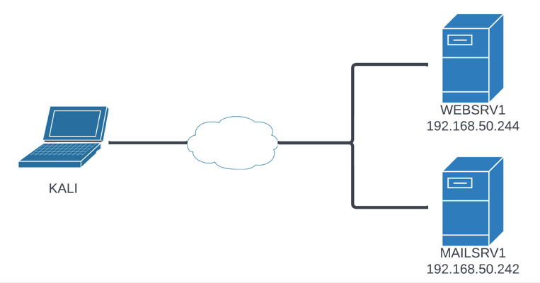

---
layout:
  title:
    visible: true
  description:
    visible: false
  tableOfContents:
    visible: true
  outline:
    visible: true
  pagination:
    visible: true
---

# Introduction

The purpose of this section is to put everything covered above together. This will be done through the lens of an example penetration test. This example will provide a basic methodology to follow.

The fictitious client (_Beyond Inc._) has provided information on two publicly-accessible machines to act as a starting point. The machines are:

* `WEBSRV1` (`192.168.X.244`)
* `MAILSRV1` (`192.168.X.242`)

These will serve as the starting point for enumeration and attacking:

<figure><figcaption>
Initial network diagram
</figcaption></figure>

No credentials were provided for the machine creating an external attacker scenario.
