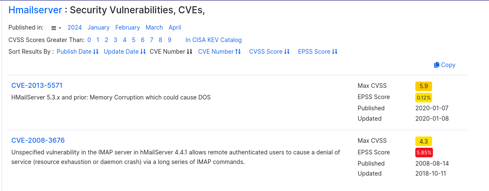
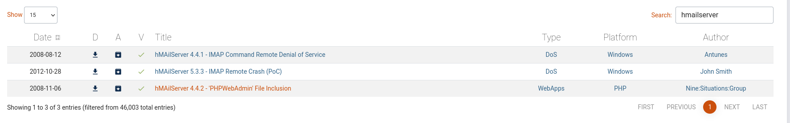
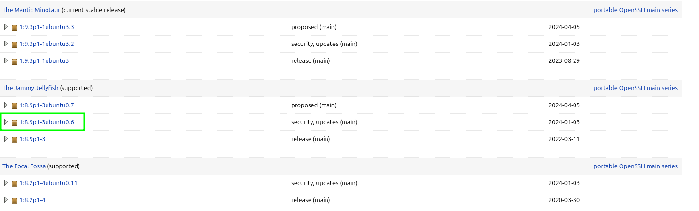
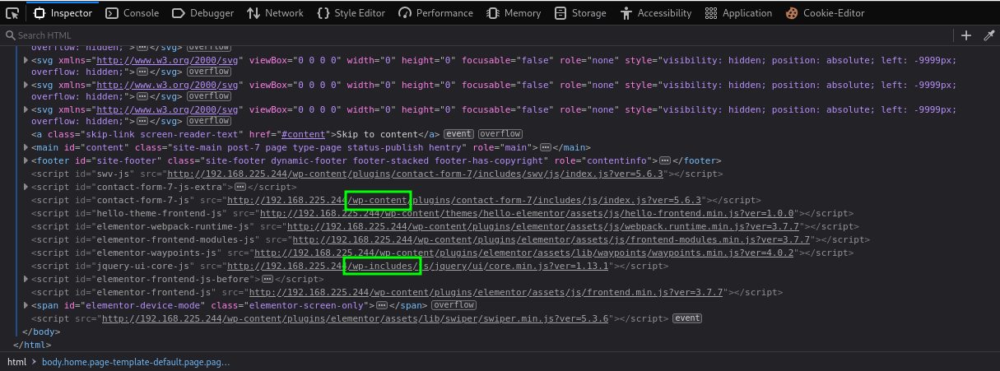

---
layout:
  title:
    visible: true
  description:
    visible: false
  tableOfContents:
    visible: true
  outline:
    visible: true
  pagination:
    visible: true
---

# Public Network Enumeration

The first step is to enumerate the publicly accessible machines. In order to keep everything straight start with an organizational structure. The rough hierarchy is:

```
client/
    creds.txt
    machine01/
        machine01.nmap
        ...
    machine02/
    ...
```

To begin this the attacker will create a `beyond/` directory under which `mailsrv1` and `websrv1` sub-directories will be created:

```shell-session
kali@kali:~$ mkdir -p beyond/mailsrv1

kali@kali:~$ cd beyond

kali@kali:~/beyond$ mkdir websrv1

kali@kali:~/beyond$ touch creds.txt
```

Some find [Obsidian](https://obsidian.md/) to be a helpful tool for organizing thoughts and taking notes.

## Enumerating the Network

Start with a wide [`nmap`](../networking-tools/nmap/) sweep. The command used will be:

```bash
sudo nmap -A -oN machine.nmap 192.168.X.X
```

* `-A` performs a script scan, OS detection, and trace-route
* `-oN` specifies an output file

To perform the enumeration on the machines looks like:

```shell-session
kali@kali:~/beyond$ sudo nmap -A -oN mailsrv1/mailsrv.nmap 192.168.222.242 
Starting Nmap 7.94SVN ( https://nmap.org ) at 2024-04-10 18:17 MDT
...

kali@kali:~/beyond$ sudo nmap -A -oN websrv1/websrv1.nmap 192.168.222.244 
Starting Nmap 7.94SVN ( https://nmap.org ) at 2024-04-10 18:19 MDT
...
```

The attacker will now work their way through the output of the scans to look for openings.

## `MAILSRV1`

### Nmap Results

The Nmap output is copied below:


```
Nmap scan report for 192.168.222.242
Host is up (0.054s latency).
Not shown: 992 closed tcp ports (reset)
PORT    STATE SERVICE       VERSION
25/tcp  open  smtp          hMailServer smtpd
| smtp-commands: MAILSRV1, SIZE 20480000, AUTH LOGIN, HELP
|_ 211 DATA HELO EHLO MAIL NOOP QUIT RCPT RSET SAML TURN VRFY
80/tcp  open  http          Microsoft IIS httpd 10.0
|_http-title: IIS Windows Server
| http-methods: 
|_  Potentially risky methods: TRACE
|_http-server-header: Microsoft-IIS/10.0
110/tcp open  pop3          hMailServer pop3d
|_pop3-capabilities: TOP USER UIDL
135/tcp open  msrpc         Microsoft Windows RPC
139/tcp open  netbios-ssn   Microsoft Windows netbios-ssn
143/tcp open  imap          hMailServer imapd
|_imap-capabilities: SORT RIGHTS=texkA0001 CHILDREN OK NAMESPACE IMAP4rev1 ACL IMAP4 IDLE completed QUOTA CAPABILITY
445/tcp open  microsoft-ds?
587/tcp open  smtp          hMailServer smtpd
| smtp-commands: MAILSRV1, SIZE 20480000, AUTH LOGIN, HELP
|_ 211 DATA HELO EHLO MAIL NOOP QUIT RCPT RSET SAML TURN VRFY

No exact OS matches for host (If you know what OS is running on it, see https://nmap.org/submit/ ).
TCP/IP fingerprint:
OS:SCAN(V=7.94SVN%E=4%D=4/10%OT=25%CT=1%CU=31507%PV=Y%DS=4%DC=T%G=Y%TM=6617
...

Network Distance: 4 hops
Service Info: Host: MAILSRV1; OS: Windows; CPE: cpe:/o:microsoft:windows

Host script results:
| smb2-security-mode: 
|   3:1:1: 
|_    Message signing enabled but not required
| smb2-time: 
|   date: 2024-04-11T00:17:40
|_  start_date: N/A
```


Several interesting things jump out:

1. System is running an instance of [IIS Web Server](https://learn.microsoft.com/en-us/iis/get-started/introduction-to-iis/iis-web-server-overview)
2. &#x20;System is running an instance of [hMailServer](https://www.hmailserver.com/)

### hMailServer

Some cursory research of hMailServer reveals that it is a free, open source e-mail server for Microsoft Windows. Looking into known vulnerabilities does not provide a lot of assistance.

[CVEdetails](https://www.cvedetails.com/vulnerability-list/vendor\_id-8442/Hmailserver.html) only shows a couple of old CVEs:

<figure><figcaption><p>CVEdetails results for hMailServer</p></figcaption></figure>

And [Exploit-DB](https://www.exploit-db.com/) has nothing that looks particularly helpful:

<figure><figcaption><p>Exploit-DB results for hMailServer</p></figcaption></figure>

For now this does not seem like the most promising avenue.

### IIS Web Server

It's worth starting by just navigating to the web page. It just has the default landing page:

<figure><figcaption><p>IIS landing page on MAILSRV1</p></figcaption></figure>

#### Directory Enumeration

It is worth checking if there is anything exposed on the web server. To do this [`gobuster`](../web-application-attacks/assessment-tools/gobuster.md) will be used with the `dir` command. The command structure is:


```bash
gobuster dir -u http://192.168.222.242 -w /usr/share/wordlists/dirb/common.txt -o mailsrv1/gobuster -x txt,pdf,config,html,php,asp,aspx
```


* `-x` specifies file types of txt, PDF, config, HTML, PHP, ASP, ASPX
* `-w` specifies the word list to try

Unfortunately this does not really turn anything up either:

```shell-session
kali@kali:~/beyond$ gobuster dir -u http://192.168.222.242 -w /usr/share/wordlists/dirb/common.txt -o mailsrv1/gobuster -x txt,pdf,config,html,php,asp,aspx
===============================================================
Gobuster v3.6
by OJ Reeves (@TheColonial) & Christian Mehlmauer (@firefart)
===============================================================
[+] Url:                     http://192.168.222.242
[+] Method:                  GET
[+] Threads:                 10
[+] Wordlist:                /usr/share/wordlists/dirb/common.txt
[+] Negative Status codes:   404
[+] User Agent:              gobuster/3.6
[+] Extensions:              aspx,txt,pdf,config,html,php,asp
[+] Timeout:                 10s
===============================================================
Starting gobuster in directory enumeration mode
===============================================================
Progress: 36912 / 36920 (99.98%)
===============================================================
Finished
===============================================================
```

For now the machine `MAILSRV1` seems to be unusable to the attacker. Perhaps later it could serve as a pivot or something if valid credentials are found but unless we are sitting on some hMailServer or IIS Web Server zero day this is not particularly promising.

## `WEBSRV1`

### Nmap Results

The output of the Nmap scan:


```
Nmap scan report for 192.168.222.244
Host is up (0.054s latency).
Not shown: 998 closed tcp ports (reset)
PORT   STATE SERVICE VERSION
22/tcp open  ssh     OpenSSH 8.9p1 Ubuntu 3 (Ubuntu Linux; protocol 2.0)
| ssh-hostkey: 
|   256 4f:c8:5e:cd:62:a0:78:b4:6e:d8:dd:0e:0b:8b:3a:4c (ECDSA)
|_  256 8d:6d:ff:a4:98:57:82:95:32:82:64:53:b2:d7:be:44 (ED25519)
80/tcp open  http    Apache httpd 2.4.52 ((Ubuntu))
|_http-server-header: Apache/2.4.52 (Ubuntu)
|_http-generator: WordPress 6.0.2
| http-title: BEYOND Finances &#8211; We provide financial freedom
|_Requested resource was http://192.168.222.244/main/
No exact OS matches for host (If you know what OS is running on it, see https://nmap.org/submit/ ).
TCP/IP fingerprint:
OS:SCAN(V=7.94SVN%E=4%D=4/10%OT=22%CT=1%CU=44481%PV=Y%DS=4%DC=T%G=Y%TM=6617
...

Network Distance: 4 hops
Service Info: OS: Linux; CPE: cpe:/o:linux:linux_kernel
```


There are really only 2 things here but both are interesting:

1. The machine is running SSH
2. The machine is running an instance of [Apache](https://httpd.apache.org/)

### Looking for Software Vulnerabilities

The obvious starting point for obtaining a foothold is to find publicly known vulnerabilities for a product. This search generally leads to Exploit-DB and CVEdetails as seen above. Unfortunately nothing promising is turned up for either `OpenSSH v8.9` or `Apache v2.4.52`.

While this machine seems like it might be a dead end some extra research turns up something promising. The Nmap results contained the OpenSSH version header:

```
OpenSSH 8.9p1 Ubuntu 3
```

Just typing that into Google turns up a [page](https://launchpad.net/ubuntu/+source/openssh) that shows which versions of SSH were bundled with which versions of Linux:

<figure><figcaption><p>OpenSSH 8.9p1 bundled with Linux</p></figcaption></figure>

It seems this particular version was bundled with _Jammin Jellyfish_ which is [Ubuntu 22.04 LTS](https://releases.ubuntu.com/jammy/).

This provides a bit more information but nothing immediately actionable. It seems that for now the only thing that could be done via port 22 is a password attack. This has a low probability of success and therefore it's probably worth continuing to look.

### Examining the Web Application

Given that none of the software seems to be immediately vulnerable to remote exploitation it is worth looking at the web application itself for vulnerabilities.

For ease of use the IP of WEBSRV1 can be added to the attacker's `/etc/hosts` file:


```
127.0.0.1       localhost
...

# OSCP Beyond Items
192.168.225.244 websrv1
```


&#x20;Then in the browser the attacker can simply navigate to `http://websrv1` and will land on the home page:

<figure><figcaption><p>WEBSRV1's landing page</p></figcaption></figure>

Navigating around is rather challenging as the attacker quickly notes there are no buttons and no menu bar. Popping open the source code the attacker can find a lot of links at the bottom to things like `wp-content` and `wp-includes`:

<figure><figcaption><p>Possible WordPress links</p></figcaption></figure>

Perhaps this is a WordPress site. The attacker can use either [Wappalyzer](../web-application-attacks/enumeration.md#wappalyzer) or [`whatweb`](../web-application-attacks/enumeration.md#whatweb) to check this assumption:

<figure><figcaption></figcaption></figure>


```shell-session
kali@kali:~/beyond$ whatweb http://websrv1                                                               
http://websrv1 [200 OK] Apache[2.4.52], Country[RESERVED][ZZ], HTML5, HTTPServer[Ubuntu Linux][Apache/2.4.52 (Ubuntu)], IP[192.168.225.244], JQuery[3.6.0], MetaGenerator[WordPress 6.0.2], Script, Title[BEYOND Finances &#8211; We provide financial freedom], UncommonHeaders[link], WordPress[6.0.2]
```


Both tools confirm that it is a WordPress site and version 6.0.2 is running.

#### WordPress Examination

The attacker will use WPScan to enumerate the target. The command used will be:


```bash
wpscan --url http://websrv1 --enumerate p --plugins-detection aggressive -o websrv1/wpscan
```


After the scan completes the output is examined:


```
...
[+] Headers
 | Interesting Entry: Server: Apache/2.4.52 (Ubuntu)
 | Found By: Headers (Passive Detection)
 | Confidence: 100%
...

[i] Plugin(s) Identified:

[+] akismet
 | Location: http://websrv1/wp-content/plugins/akismet/
 | Latest Version: 5.3.2
 | Last Updated: 2024-03-21T00:55:00.000Z
 | ...
 |
 | The version could not be determined.

[+] classic-editor
 | Location: http://websrv1/wp-content/plugins/classic-editor/
 | Last Updated: 2024-04-06T00:44:00.000Z
 | Readme: http://websrv1/wp-content/plugins/classic-editor/readme.txt
 | [!] The version is out of date, the latest version is 1.6.3
 | ...
 |
 | Version: 1.6.2 (80% confidence)
 | ...

[+] contact-form-7
 | Location: http://websrv1/wp-content/plugins/contact-form-7/
 | Last Updated: 2024-03-21T06:56:00.000Z
 | Readme: http://websrv1/wp-content/plugins/contact-form-7/readme.txt
 | [!] The version is out of date, the latest version is 5.9.3
 | ...
 |
 | Version: 5.6.3 (80% confidence)
 | ...

[+] duplicator
 | Location: http://websrv1/wp-content/plugins/duplicator/
 | Last Updated: 2024-02-06T17:24:00.000Z
 | Readme: http://websrv1/wp-content/plugins/duplicator/readme.txt
 | [!] The version is out of date, the latest version is 1.5.8.1
 | ...
 |
 | Version: 1.3.26 (80% confidence)
 | ...

[+] elementor
 | Location: http://websrv1/wp-content/plugins/elementor/
 | Last Updated: 2024-04-10T14:19:00.000Z
 | Readme: http://websrv1/wp-content/plugins/elementor/readme.txt
 | [!] The version is out of date, the latest version is 3.20.4
 | ...
 |
 | Version: 3.7.7 (100% confidence)
 | ...

[+] wordpress-seo
 | Location: http://websrv1/wp-content/plugins/wordpress-seo/
 | Last Updated: 2024-04-03T08:01:00.000Z
 | Readme: http://websrv1/wp-content/plugins/wordpress-seo/readme.txt
 | [!] The version is out of date, the latest version is 22.4
 | ...
 |
 | Version: 19.7.1 (100% confidence)
 | ...

[!] No WPScan API Token given, as a result vulnerability data has not been output.
...
```


Some interesting things stand out. The scan discovered six active plugins:

1. [`akismet`](https://wordpress.org/plugins/akismet/)
2. [`classic-editor`](https://wordpress.org/plugins/classic-editor/)
3. [`contact-form-7`](https://wordpress.org/plugins/contact-form-7/)
4. [`duplicator`](https://wordpress.org/plugins/duplicator/)
5. [`elementor`](https://wordpress.org/plugins/elementor/)
6. [`wordpress-seo`](https://wordpress.org/plugins/wordpress-seo/)

The output also states that several of the plugins, including the Duplicator plugin, are using outdated versions.

#### Locating a Plugin Exploit

Instead of using WPScan the attacker switches over to Exploit-DB. Using the `searchsploit` command they can look for anything related to Duplicator:

```shell-session
kali@kali:~/beyond$ searchsploit --id duplicator
----------------------------------------------------------------------------------------- ---------------------------------
 Exploit Title                                                                           |  EDB-ID
----------------------------------------------------------------------------------------- ---------------------------------
...
Wordpress Plugin Duplicator 1.3.26 - Unauthenticated Arbitrary File Read                 | 50420
Wordpress Plugin Duplicator 1.3.26 - Unauthenticated Arbitrary File Read (Metasploit)    | 49288
...
----------------------------------------------------------------------------------------- ---------------------------------
```

The output shows that there are two exploits matching the version of the Duplicator plugin (`1.3.26`) on `WEBSRV1`. One is tagged with `Metasploit`, indicating that this exploit was developed for the Metasploit Framework.

### Summary

At this point the attacker has learned the following about WEBSRV01:

* It is running Ubuntu 22.04 LTS
* It has ports `22` and `80` open to the internet
* None of the software (OpenSSH, Apache, OS) versions were found to be vulnerable to publicly-known RCE exploits&#x20;
* A WordPress instance is being run on port `80`
* The WordPress instance has several outdated plugins
