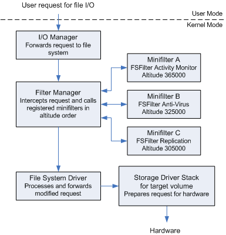
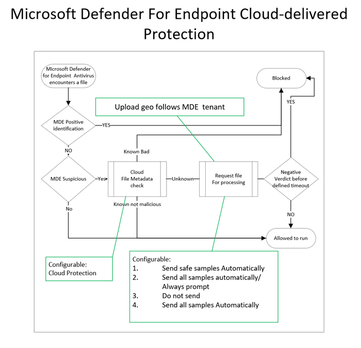

# Antivirus Software Components

[Antivirus software](https://en.wikipedia.org/wiki/Antivirus\_software) is used to prevent, detect, and remove malware. The term covers a broad range of products. These programs were originally used just to remove malware. However the shifting attack landscape has made it so these programs have expanded to include product offerings such as [IDS/IPS](https://en.wikipedia.org/wiki/Intrusion\_detection\_system), application-level firewalls, website scanners, etc.

## AV Engines and Components

At its core, a modern AV is fueled by signature updates fetched from the vendor's signature database that resides on the internet. Those signature definitions are stored in the local AV signature database, which in turn feeds the more specific engines. This approach is usually coupled with behavior or heuristic-based approaches to build a full AV engine.

A modern antivirus is typically designed around the following components:

* **File Engine:** responsible for both scheduled and real-time file scans.&#x20;
* **Memory Engine:** inspects each process's memory space at runtime for well-known binary signatures or suspicious API calls that might result in memory injection attacks
* **Network Engine:** inspects the incoming and outgoing network traffic on the local network interface. Once a signature is matched, a network engine might attempt to block the malware from communicating with its C2 server
* **Disassembler:** disassembles binaries back to assembly
* **Emulator/Sandbox:** used to launch files in a safe space and observe their behavior
* **Browser Plugin:** used to allow modern AVs better visibility and detection of malicious content that might be executed inside the browser
* **Machine Learning Engine:** enables detection of unknown threats by relying on cloud-enhanced computing resources and algorithms

Some of these components are described in more detail below.

### File Engine

As stated above the file engine is responsible for file scans, both scheduled and real-time. When the engine performs a scheduled scan, it simply parses the entire file system and sends each file's metadata or data to the signature engine.

On the contrary, real-time scans involve detecting and possibly reacting to any new file action, such as downloading new malware from a website. In order to detect such operations, the real-time scanners need to identify events at the kernel level via a specially crafted [mini-filter driver](https://learn.microsoft.com/en-us/windows-hardware/drivers/ifs/filter-manager-concepts). This driver leverages the filter manager (`FltMgr.sys`) to intercept the writing of potentially malicious files. A simplified chart of `FltMgr`'s operation is shown here:

<figure><figcaption>
Shows a simplified I/O stack with the filter manager and three mini-filter drivers
</figcaption></figure>

### Binary Inspection

Modern AV systems attempt to do more than just signature-based detections or even simple code inspection. Malware often employs encryption and decryption through custom routines in order to conceal its true nature. AVs counterattack this strategy by disassembling the malware packers or ciphers and loading the malware into a sandbox, or emulator.

The examination of a binary covers several of the components listed above. The **disassembler** engine is responsible for translating machine code into assembly language, reconstructing the original program code section, and identifying any encoding/decoding routine. A **sandbox** is a special isolated environment in the AV software where malware can be safely loaded and executed without causing potential havoc to the system. Once the malware is unpacked/decoded and running in the **emulator**, it can be thoroughly analyzed against any known signature or for suspicious-looking behaviors.

### Endpoint Detection and Response

[EDR](https://en.wikipedia.org/wiki/Endpoint\_detection\_and\_response) technology continually monitors an endpoint's behavior looking for malicious activity. These engines are often paired with some machine learning algorithms to help classify behavior as malicious or benign. Usually the AV software has the ability to step in and kill any processes that it suspects as being malicious.&#x20;

EDR software is responsible for generating security-event telemetry and forwarding it to a [Security Information and Event Management](https://en.wikipedia.org/wiki/Security\_information\_and\_event\_management) (SIEM) system, which collects data from every company host. These events are then rendered by the SIEM so that the security analyst team can gain a full overview of any past or ongoing attack affecting the organization.

Even though some EDR solutions include AV components, AVs and EDRs are not mutually exclusive as they complement each other with enhanced visibility and detection. Many modern AV solutions, including [Windows Defender](https://learn.microsoft.com/en-us/microsoft-365/security/defender-endpoint/microsoft-defender-antivirus-windows?view=o365-worldwide), include an EDR component.

## Detection Methods

### Signature-Based Detection

Original antivirus programs worked solely on [signature-based detection](https://corelight.com/resources/glossary/signature-based-detection). This approach relies on maintaining a database of known malicious files and querying any new files (hash of the file) against the database.

This approach is quick, easy, and can be done without executing the potentially malicious file. The downside is it relies on a database and known bad files. This means that a newly-released malware variant has a while before its signature is recognized as a bad file. In practice, signature-based engines will often point out if a file is unknown but that does not necessarily equate to bad.

Code-signing makes this practice somewhat more effective as malicious actors usually do not have access to trusted code-signing certificates, but bad things do happen.

In today's world this approach is incomplete. It is often used as a first-pass check by many modern AV providers, but if it is the only check being run a large percentage of attacks will be missed.

### Heuristic-Based Detection

Heuristic analysis is a detection method that relies on various rules and algorithms to determine whether or not an action is considered malicious.

This is achieved by stepping through the instruction set of a binary file (without actually executing it) or by attempting to **disassemble the machine code** and ultimately **decompile and analyze the source code** to obtain a more comprehensive map of the program. The idea is to search for various patterns and program calls (as opposed to simple byte sequences) that are considered malicious.

### Behavioral Detection

[Behavioral detection](http://tristan.aubrey-jones.com/papers/info3005\_jan2008\_behaviour\_based\_malware\_detection.pdf) is almost exactly as it sounds, run the program in a safe space and monitor what it does. As noted by the author of the linked paper, "no matter the disguise, a piece of malware will behave badly, that is its purpose."

Most antivirus programs that utilize behavioral analysis perform this function by executing the program or script within a specialized virtual machine (**sandbox/emulator**), thereby allowing the anti-virus program to internally simulate what would happen if the suspicious file were to be executed while keeping the suspicious code isolated from the real-world machine. It then analyzes the commands as they are performed, monitoring for common viral activities such as replication, file overwrites, and attempts to hide the existence of the suspicious file.

### Machine-Learning Detection

Machine-learning detection attempts to add ML models to antivirus engines to aid in all detection types. Heuristic or behavioral detection methods both rely on some set of behaviors being classified as "malicious" and others "benign." Ultimately those rules determine the success of either method. Those rules are often written by developers at the antivirus vendor. ML detection attempts to leverage ML algorithms to help update those rules on the fly.&#x20;

For instance, Microsoft Windows Defender has [two ML components](https://learn.microsoft.com/en-us/microsoft-365/security/defender-endpoint/cloud-protection-microsoft-antivirus-sample-submission?view=o365-worldwide): the **client ML engine**, which is responsible for creating ML models and heuristics, and the **cloud ML engine**, which is capable of analyzing the submitted sample against a metadata-based model comprised of all the submitted samples. Whenever the client ML engine is unable to determine whether a program is benign or not, it will query the cloud ML counterpart for a final response. The working together of these components is shown in this diagram:

<figure><figcaption>
Flow of a suspicious file through the ML client and cloud engines
</figcaption></figure>
