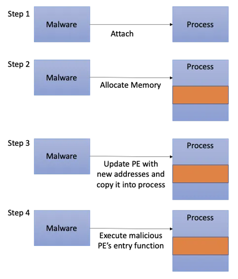
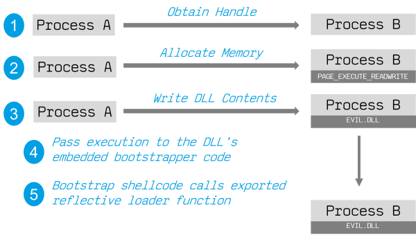
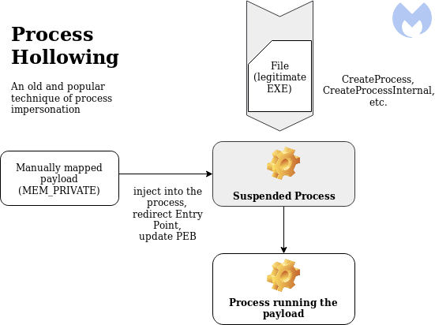
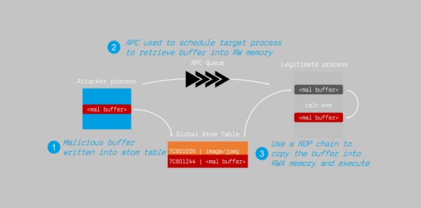
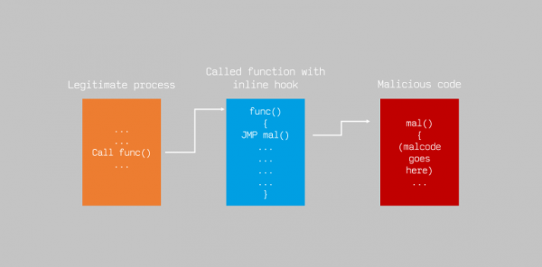

---
layout:
  title:
    visible: true
  description:
    visible: false
  tableOfContents:
    visible: true
  outline:
    visible: true
  pagination:
    visible: true
---

# Bypassing Detection

Generally speaking, antivirus evasion falls into two broad categories: **on-disk** and **in-memory**. On-disk evasion focuses on modifying malicious files physically stored on disk in an attempt to evade AV file engine detections. However, given the maturity of modern AV file scanning engines, modern malware often attempts in-memory operation, which avoids the disk entirely and therefore, reduces the possibility of being detected.

## On-Disk Evasion

Three basic techniques are explained below.

### Packing

One of the earliest ways of avoiding detection involved the use of [executable compression](https://en.wikipedia.org/wiki/Executable\_compression). Given the high cost of disk space and slow network speeds during the early days of the internet, **packers** were originally designed to reduce the size of an executable. The idea was to compress the executable, and bundle the compressed data with the decompression code into a single smaller executable. Unlike modern "zip" compression techniques, packers generate an executable that is not only smaller, but is also functionally equivalent with a completely new binary structure. The file produced has a new hash signature and as a result, can effectively bypass older and more simplistic AV scanners.

Even though some modern malware uses a variation of this technique, the use of [UPX](https://upx.github.io/) and other popular packers alone is not sufficient to evade modern AV scanners.

### Obfuscation

**Obfuscators** reorganize and mutate code in a way that makes it more difficult to reverse-engineer. This includes replacing instructions with semantically equivalent ones, inserting irrelevant instructions or [dead code](https://en.wikipedia.org/wiki/Dead\_code), splitting or reordering functions, and so on. Although primarily used by software developers to protect their intellectual property, this technique is also marginally effective against signature-based AV detection. Modern obfuscators also have runtime in-memory capabilities, which aims to hinder AV detection even further.

### Encryption

**Crypter** software cryptographically alters executable code, adding a decryption stub that restores the original code upon execution. This decryption happens in-memory, leaving only the encrypted code on-disk. Encryption has become foundational in modern malware as one of the most effective AV evasion techniques.

### Advanced Techniques

Highly effective antivirus evasion requires a combination of all of the previous techniques in addition to other advanced ones, including _anti-reversing_, _anti-debugging_, _virtual machine emulation detection_, and so on. In most cases, _software protectors_ were designed for legitimate purposes, like _anti-copy_, but can also be used to bypass AV detection.

* [Anti-Reversing](https://infosecwriteups.com/anti-reversing-techniques-part-1-3200db42f1e3) techniques are used to make executables harder to reverse engineer
  * Includes [anti-debugging](https://www.appsealing.com/anti-debugging/) techniques to ensure the executable is not running inside a debugger thus making analysis more complicated
* [Virtual machine emulation detection](https://seclab.nu/static/publications/isc2007emulators.pdf) and other techniques are used to check whether an executable is running in a virtual environment and altering its behavior if so
  * AV software often has a sandbox or emulator component that relies on a virtual machine to execute suspicious code in a "safe" environment
  * When a malicious executable detects it is running in a virtual environment it can either exit quietly or pose as something innocuous

Because of the complexity of this problem, there are currently few actively-maintained free tools that provide acceptable antivirus evasion. Among commercially available tools, [The Enigma Protector](https://www.enigmaprotector.com/en/home.html) in particular can be used to successfully bypass antivirus products.

## In-Memory Evasion

In-Memory Injection, also known as [PE Injection](https://www.elastic.co/blog/ten-process-injection-techniques-technical-survey-common-and-trending-process) (number 2 on linked list), is a popular technique used to bypass antivirus products on Windows machines. Rather than obfuscating a malicious binary, creating new sections, or changing existing permissions, this technique instead focuses on the manipulation of volatile memory. One of the main benefits of this technique is that it does not write any files to disk, which is a commonly focused area for most antivirus products.

### Remote Process Memory Injection

Remote Process Memory Injection attempts to inject the payload into another valid PE that is not malicious.&#x20;

PE injection is commonly  performed by copying code (perhaps without a file on disk) into the virtual address space of the target process before invoking it via a new thread. The write can be performed with native Windows API calls such as [`VirtualAllocEx`](https://learn.microsoft.com/en-us/windows/win32/api/memoryapi/nf-memoryapi-virtualallocex) and [`WriteProcessMemory`](https://learn.microsoft.com/en-us/windows/win32/api/memoryapi/nf-memoryapi-writeprocessmemory), then invoked with [`CreateRemoteThread`](https://learn.microsoft.com/en-us/windows/win32/api/processthreadsapi/nf-processthreadsapi-createremotethread) or additional code (shellcode).

One advantage of PE injection over traditional DLL Injection (via a [`LoadLibrary`](https://learn.microsoft.com/en-us/windows/win32/api/libloaderapi/nf-libloaderapi-loadlibrarya) call) is because the malware allocates memory in a host process, it does not have to drop a malicious DLL on the disk.

#### PE Injection Overview

A simple chart showing PE injection is below:

<figure><figcaption>
Malware utilizing PE Injection
</figcaption></figure>

**Step 1:** The malware gets the victim process’ base address and size. This could be done using [`OpenProcess`](https://learn.microsoft.com/en-us/windows/win32/api/processthreadsapi/nf-processthreadsapi-openprocess) to obtain a valid [HANDLE](https://en.wikipedia.org/wiki/Handle\_\(computing\)) to a target process that the malware has permission to access.

**Step 2:** The malware allocates enough memory in the victim process to insert its malicious PE image using `VirtualAllocEx`.

**Step 3:** As the inserted image will have a different base address once it is injected into the affected process, the malware will need to find the victim process’s relocation table offset first. With this offset, the malware will modify the image so that any absolute addresses in the image will point to the right functions. Once the malicious PE image has been updated, the malware copies it into the process. `WriteProcessMemory` can be used to perform the actual updating of the PE image.

**Step 4:** The malware looks for the entry function to be executed and runs it using `CreateRemoteThread`.

This technique is perhaps stealthier than traditional DLL injection but it is noisier than something like Reflective DLL injection which does not require the use of any additional `CreateRemoteThread` calls.

### Reflective DLL Injection

The [Reflective DLL Injection](https://andreafortuna.org/2017/12/08/what-is-reflective-dll-injection-and-how-can-be-detected/) technique attempts to load a DLL stored by the attacker in the process memory. This technique employs the concept of [reflective programming](https://en.wikipedia.org/wiki/Reflective\_programming) is to perform the loading of a library from memory into a host process.

Normally, loading a DLL in Windows calls the function `LoadLibrary`. It takes the path of the file and executes its functions without requiring too much from the user. It requires the DLL to be on disk and will enumerate the DLL with the process.

However, there is a stealthier method called reflective DLL injection, in which the contents of a DLL can be loaded in memory. This requires the usage of a custom loader, as `LoadLibrary` cannot be used. So, when the contents of the DLL is loaded into memory, the execution will pass to the embedded code (bootstrapper code), which will emulate the tasks carried out by `LoadLibrary` (such as mapping the variable memory) and execute the reflectively loaded functions, as seen below.

<figure><figcaption>
Reflective DLL Injection
</figcaption></figure>

DoublePulsar [leveraged a Reflective DLL Injection](https://blog.f-secure.com/doublepulsar-usermode-analysis-generic-reflective-dll-loader/) in its attacks.

#### Process

The process of reflective DLL injection is as follows:

1. Open target process with read-write-execute permissions and allocate memory large enough for the DLL.
2. Copy the DLL into the allocated memory space.
3. Calculate the memory offset within the DLL to the export used for doing reflective loading.
4. Call `CreateRemoteThread` (or an equivalent undocumented API function like `RtlCreateUserThread`) to start execution in the remote process, using the offset address of the reflective loader function as the entry point.
5. The reflective loader function finds the Process Environment Block of the target process using the appropriate CPU register, and uses that to find the address in memory of `kernel32.dll` and any other required libraries.
6. Parse the exports directory of kernel32 to find the memory addresses of required API functions such as `LoadLibraryA`, `GetProcAddress`, and `VirtualAlloc`.
7. Use these functions to then properly load the DLL (itself) into memory and call its entry point, DllMain.

#### Challenges

The main challenge of implementing this technique is that `LoadLibrary` does not support loading a DLL from memory. Furthermore, the Windows operating system does not expose any APIs that can handle this either. Attackers who choose to use this technique must write their own version of the API that does not rely on a disk-based DLL.

### Process Hollowing

When using [process hollowing](https://www.ired.team/offensive-security/code-injection-process-injection/process-hollowing-and-pe-image-relocations) to bypass antivirus software, attackers first launch a non-malicious process in a suspended state. Once launched, the image of the process is unmapped from memory (hollowed out) and replaced with a malicious executable image. Finally, the process is then resumed and malicious code is executed instead of the legitimate process.

<figure><figcaption>
Steps for process hollowing
</figcaption></figure>

### Other Memory-Injection Techniques

[This blog post](https://blog.f-secure.com/memory-injection-like-a-boss/) from F-Secure details several memory injection techniques:

* **Shell code injection:** a small piece of code that, when used as a payload, injects malicious code into a running application
* **AtomBombing**
* **Inline Hooking**

#### AtomBombing

A technique in which attackers write malicious code into Windows’ [atom tables](https://learn.microsoft.com/en-us/windows/win32/dataxchg/about-atom-tables), then force a legitimate program to retrieve the code from the table.&#x20;

In Windows, an **atom table** is a system-defined table that stores strings and corresponding identifiers. An application places a string in an atom table and receives a 16-bit integer, called an **atom**, that can be used to access the string.

This technique was used by the Dridex malware family. Dridex would write a malicious buffer into an atom table; then [asynchronous procedure call](https://learn.microsoft.com/en-us/windows/win32/sync/asynchronous-procedure-calls) (APC) was used to schedule the target process to retrieve the buffer and place it into read-write memory; a return-oriented programming (ROP) chain copied the buffer into RWX memory, where it then executed.

<figure><figcaption>
AtomBombing technique used by Dridex
</figcaption></figure>

#### Inline Hooking

This technique involves modifying memory "inline" to "hook" functions and redirect execution. It often involves modifying the first few instructions to move execution flow to the malicious code, which will then re-route to the legitimate call.

The Zeus malware infects via phishing and then hooks functions related to HTTP communications and uses man-in-the-browser keystroke logging to steal passwords and get access to accounts.

<figure><figcaption>
Inline hooking
</figcaption></figure>

Hooking is a technique often employed by rootkits. Rootkits aim to provide the malware author dedicated and persistent access to the target system through modification of system components in user space, kernel, or even at lower OS [protection rings](https://en.wikipedia.org/wiki/Protection\_ring) such as _boot_ or _hypervisor_. Since rootkits need administrative privileges to implant its hooks, they are often installed from an elevated shell or by exploiting a privilege-escalation vulnerability.
