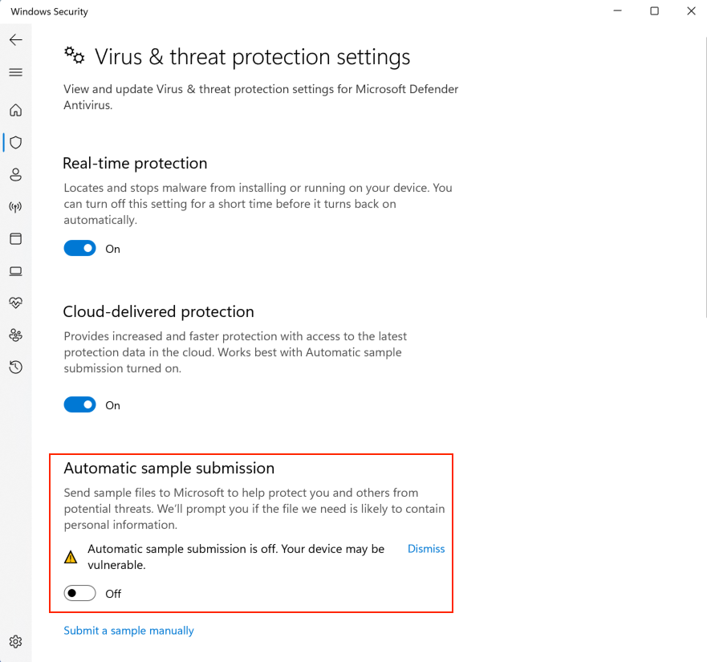

---
layout:
  title:
    visible: true
  description:
    visible: false
  tableOfContents:
    visible: true
  outline:
    visible: true
  pagination:
    visible: true
---

# In Practice

## Testing AV Evasion

### VirusTotal

[VirusTotal](https://www.virustotal.com) gives malware creators a quick glance at how stealthy a piece of malware could be. Keep in mind that VirusTotal maintains a database of all newly submitted samples. If the sample is submitted from an IP tied to a real-world identity and then used in an attack that can be leveraged during investigation.

Additionally, the platform sends our sample to every antivirus vendor that has an active membership. This means that shortly after submitted a sample, most of the AV vendors will be able run it inside their custom sandbox and machine learning engines to build specific detection signatures, thus rendering the offensive tooling unusable.

### AntiScan.Me

[AntiScan.Me](https://antiscan.me/) is an alternative to VirusTotal. This service scans a sample against 30 different AV engines and claims to not divulge any submitted sample to third-parties. The service offers up to four scans a day and additional ones at a small fee after the daily limit has been reached.

### Copy Target Setup

The tools above are great but really only help when an attacker is unsure what they will encounter inside a victim's network. If the attacker knows what AV vendor/configuration is being used by the target, it would be better to set up a dedicated VM with that same AV solution installed and just test any malware against that actual engine.

Additionally, finding a universal solution to bypass all antivirus products is difficult and time consuming, if not impossible. Considering time limitations during a typical penetration test, it is far more efficient to target the specific antivirus product deployed in the target network.

#### Disable Sample Submission

If using this technique it is important to **turn off sample submission in the AV** on the test VM. If this is not done any malware samples tested will be sent back to the AV vendor allowing them to create signatures for it.

In Windows Defender this can be done inside the `Virus & threat protection` menu (`Windows Security > Virus & threat protection > Manage Settings`):

<figure><figcaption>
Setting to prevent sample submission in Defender
</figcaption></figure>

Keep in mind automatic sample submission allows Windows Defender to get a sample analyzed by its machine learning cloud engines, thus attackers should only enable it (for final testing) once they are confident their bypasses will be effective and only if the target has sample submission enabled.

If the target has multiple AV solutions (E.g. Defender and another solution) remember to turn off this setting in all AV solutions.

### Custom Code

Another rule of thumb one should follow when developing AV bypasses is to always prefer custom code. AV signatures are extrapolated from the malware sample and thus, the more novel and diversified code is, the fewer chances it has to incur any existing detection.
