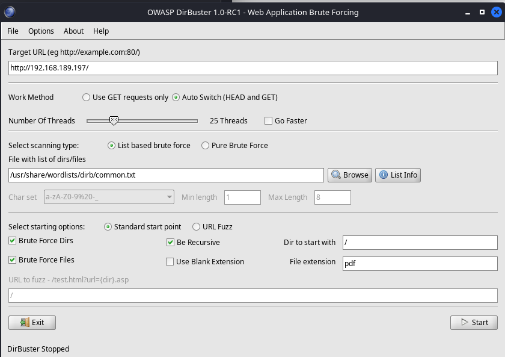
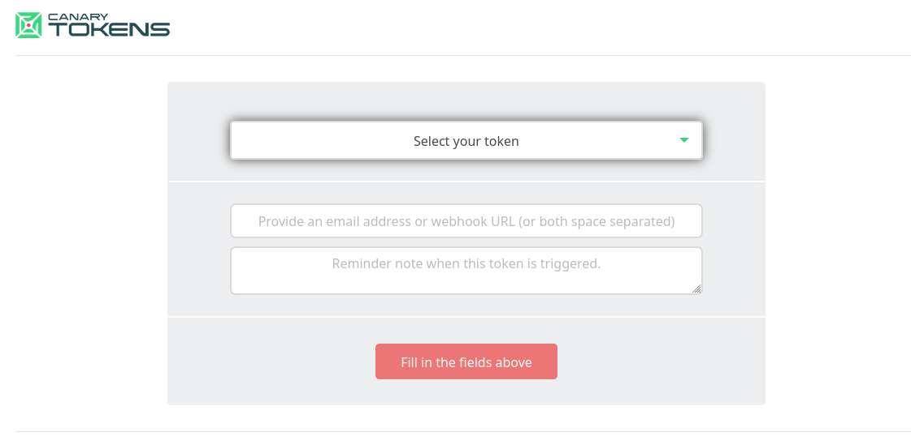
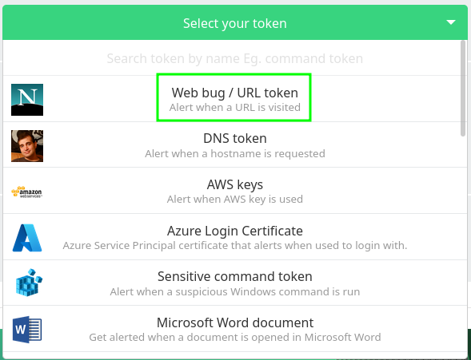
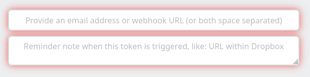
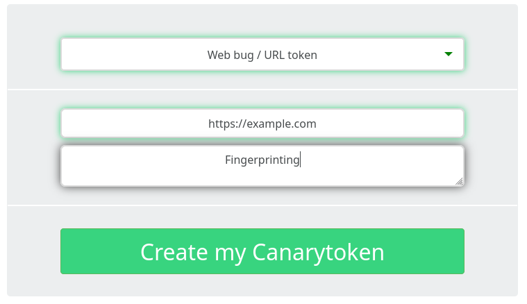
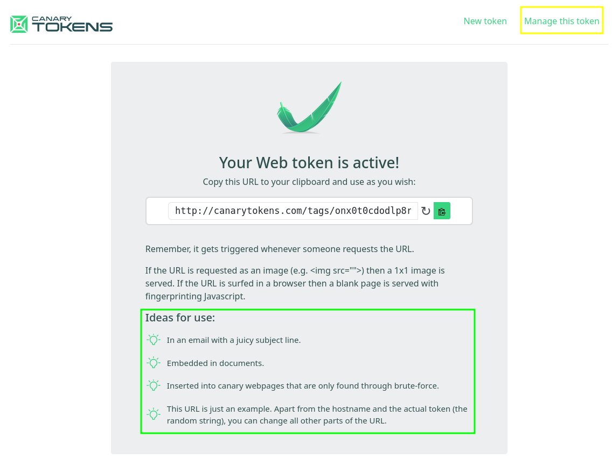
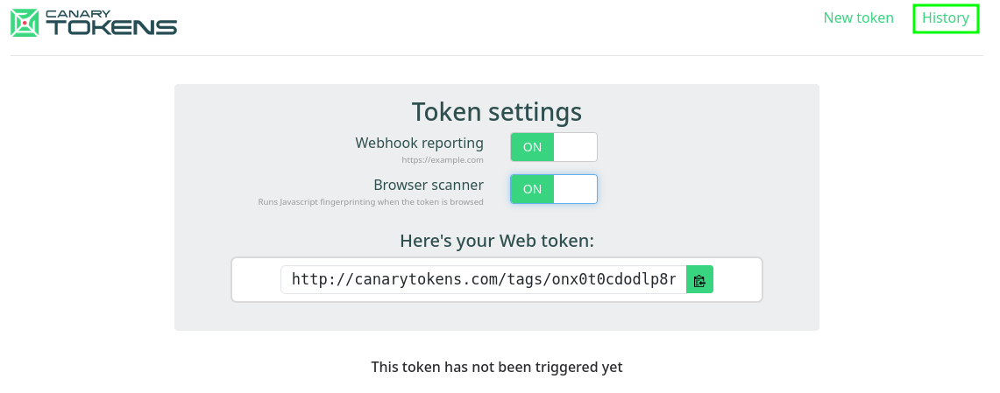
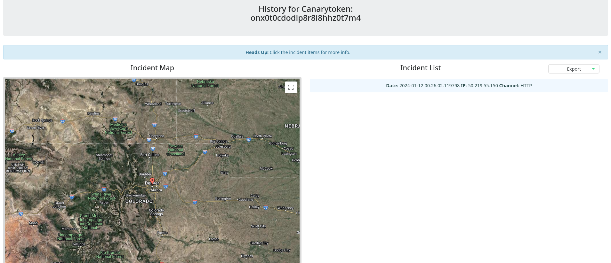
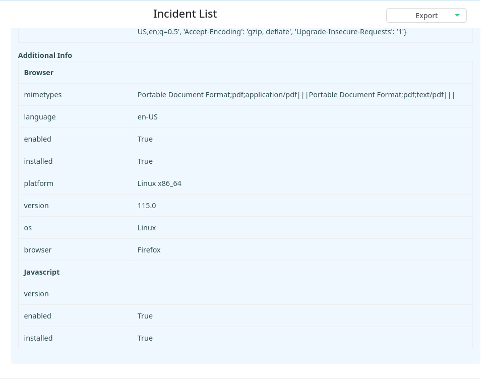

---
layout:
  title:
    visible: true
  description:
    visible: false
  tableOfContents:
    visible: true
  outline:
    visible: true
  pagination:
    visible: true
---

# Target Reconnaissance

Before executing a client-side attack, it's crucial that attackers identify potential users to target and gather as much detailed information as possible about their operating system and installed application software. This helps improve the chances of a successful attack. One can identify these users by browsing the company website and search for points of contact or use passive information gathering techniques to find employees on social media.

Unlike traditional network reconnaissance performed against a target system, attackers do not often have a direct connection to the target of a client-side attack. Instead, they must use a more tailored and creative approach.

## Information Gathering

This section will discuss various methods of enumerating a target's installed software without interacting with the target machine. These techniques are best-suited for situations in which one has no way to interact with the target. The upside is since they are not interacting with the target, they will not alert monitoring systems or leave forensic traces of their inquiry.

### Metadata Tags

One approach is to inspect the [metadata tags](https://exiftool.org/TagNames/) of publicly-available documents associated with the target organization. Although this data can be manually sanitized, it often is not. These tags (categorized by [_tag groups_](https://exiftool.org/#groups)) can include a variety of information about a document including author, creation date, the name and version of the software used to create the document, operating system of the client, and much more.

In some cases, this information is stored explicitly in the metadata, and in some cases it is inferred, but either way the information can be quite revealing, helping to build an accurate profile of software installed on clients in a target organization. Bear in mind that findings may be outdated if inspecting older documents. In addition, different branches of the organization may use slightly different software.

Although this is a "hands-off" approach to data gathering, the trade-off is that the information gathered may not be the most accurate. Still, this approach is viable and effective.

#### Locating Documents

There are a few techniques to locate documents for review.

For starters, one could use the `site:example.com filetype:pdf` Google dork to find PDF files on a target's web page. If attempting to target a specific branch or location, one can add that information via keywords to narrow the results.

If willing and able to interact with the client's website one could use&#x20;

[dirbuster](https://www.kali.org/tools/dirbuster/) to search for specific file extension. For example, in order to brute force through a web server at `http://192.168.189.197/` looking for PDFs, the setup would be as follows:

<figure><figcaption><p>Searching for PDFs with dirbuster</p></figcaption></figure>

Alternative tools include:

* [gobuster](https://www.kali.org/tools/gobuster/)
* [dirb](https://www.kali.org/tools/dirb/)

#### Reading Metadata

The preferred tool for reading (and writing) metadata is [exiftool](https://exiftool.org/). It is installed by default on Kali systems. In order to read all of the metadata on a file the command used is:

```bash
exiftool -a -u -g1 $FILE
```

* `-a` allow duplicate tags to be extracted
* `-u` extract unknown tags
* `-g1` groups the tags by tag group

Running this against a sample file, the output looks like:

```bash
kali@kali:~$ exiftool -a -u -g1 old.pdf 
---- ExifTool ----
ExifTool Version Number         : 12.67
---- System ----
File Name                       : old.pdf
Directory                       : .
File Size                       : 463 kB
File Modification Date/Time     : 2024:01:10 22:20:25-07:00
File Access Date/Time           : 2024:01:10 22:20:25-07:00
File Inode Change Date/Time     : 2024:01:10 22:20:25-07:00
File Permissions                : -rw-r--r--
---- File ----
File Type                       : PDF
File Type Extension             : pdf
MIME Type                       : application/pdf
---- PDF ----
PDF Version                     : 1.3
Linearized                      : No
Page Count                      : 4
PDF Version                     : 1.4
Producer                        : macOS Version 12.3.1 (Build 21E258) Quartz PDFContext
Create Date                     : 2018:01:17 05:52:23+00:00
Modify Date                     : 2018:01:17 05:52:23+00:00
Author                          : offsec
---- ICC-header ----
Profile CMM Type                : Linotronic
Profile Version                 : 2.1.0
Profile Class                   : Display Device Profile
...
---- ICC_Profile ----
Profile Copyright               : Copyright (c) 1998 Hewlett-Packard Company
Profile Description             : sRGB IEC61966-2.1
...
---- ICC-view ----
Viewing Cond Illuminant         : 19.6445 20.3718 16.8089
Viewing Cond Surround           : 3.92889 4.07439 3.36179
Viewing Cond Illuminant Type    : D50
---- ICC-meas ----
Measurement Observer            : CIE 1931
Measurement Backing             : 0 0 0
Measurement Geometry            : Unknown
Measurement Flare               : 0.999%
Measurement Illuminant          : D65
---- XMP-x ----
XMP Toolkit                     : Image::ExifTool 11.88
---- XMP-pdf ----
Author                          : offsec
---- XMP-xmp ----
Create Date                     : 2018:01:17 05:52:23+00:00
Modify Date                     : 2018:01:17 05:52:23+00:00
```

As shown in the example above, the output sometimes includes things like the OS on which the file was created/edited. This can provide useful insight when performing reconnaissance for a client-side attack.

## Client Fingerprinting

**Client Fingerprinting**, also known as **Device Fingerprinting**, is used to obtain operating system and browser information from a target in a non-routable internal network.

For the purpose of this example, assume a target email address has already been extracted using a tool like [theHarvester](https://github.com/laramies/theHarvester). For a client-side attack, one could use an [HTML Application](https://learn.microsoft.com/en-us/previous-versions/ms536496\(v=vs.85\)?redirectedfrom=MSDN) (HTA) attached to an email to execute code in the context of Internet Explorer and to some extent, Microsoft Edge. This is a very popular attack vector to get an initial foothold in a target's network and is used by many threat actors and ransomware groups.

Before attempting this, the attacker will need to confirm that the target is running Windows and that either Internet Explorer or Microsoft Edge are enabled.

### Pretext

A [pretext](https://www.imperva.com/learn/application-security/pretexting/) frames a situation in a specific way. In a majority of situations, the attacker can't just ask the target (a stranger) to click a link in an arbitrary email. Therefore, they should try to create context, perhaps by leveraging the target's job role. It is worth discussing the pretexts that can be used in a situation such as this.

For example, assume the target is working in a finance department. In this case, the attacker could say could say they received an invoice, but it contains a financial error. They can then offer a link that supposedly opens a screenshot of the invoice with the error highlighted but is in reality a phishing link.

### Tools

Several tools for client fingerprinting are listed below (one of them will be used in an example below):

* Canarytokens
* [Grabify](https://grabify.link/)
* JavaScript fingerprinting libraries such as [fingerprintjs](https://github.com/fingerprintjs/fingerprintjs)

### Canarytokens

[Canarytokens](https://canarytokens.com/generate) is a free web service, operated by Thinkst, that generates a link with an embedded token. The link can be sent to a target and if opened in a browser it will provide information about their browser, IP address, and operating system. This information can be used to select an appropriate client-side attack. The target will always receive a blank page when they click the link.

#### Creating a Link

When opening the Canarytokens link above lands on the generation page

<figure><figcaption><p>Canarytokens Token Generation Page </p></figcaption></figure>

There are many different types of tokens that can be used, for this example `Web bug / URL token` will be selected from the drop-down menu:

<figure><figcaption><p>Token Selection</p></figcaption></figure>

Several fields need to be filled in:

<figure><figcaption><p>Required token fields</p></figcaption></figure>

Once the fields are filled in `Create` can be clicked:

<figure><figcaption><p>Creating a Token</p></figcaption></figure>

At this point the link is generated and the site even recommends some helpful tips on getting the target to click on it (highlighted in green):

<figure><figcaption><p>Link Created Screen</p></figcaption></figure>

Also shown in the screenshot above (in yellow) is the link to the Manage Token screen. On this screen the attacker can manage the token's settings and it also contains a link to the `History` page for the token (highlighted in green):

<figure><figcaption><p>Manage Token Page</p></figcaption></figure>

Clicking on the `History` button shows all the times the link has been queried. At first it shows no uses but once a victim clicks on the link they will show up in the `Incident List`:

<figure><figcaption><p>Incident History of a Canarytoken</p></figcaption></figure>

Clicking on a specific instance will show the attacker a good deal more information. Scrolling down the list browser and OS information can be found:

<figure><figcaption><p>Device fingerprint from Canarytokens link</p></figcaption></figure>

#### Other Methods

The example above highlighted one type of token that can be leveraged. The dropdown menu provides options to embed a Canarytoken in a Word document or PDF file, which would provide us information when a victim opens the file. Furthermore, one could also embed it into an image, which would inform the creator when it is viewed.
