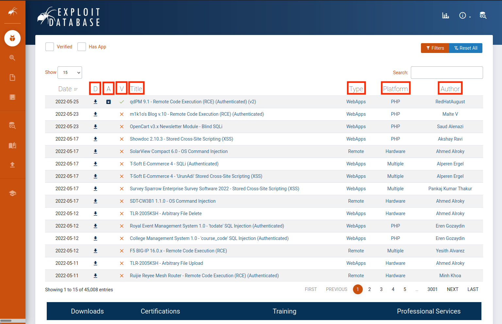

---
layout:
  title:
    visible: true
  description:
    visible: false
  tableOfContents:
    visible: true
  outline:
    visible: true
  pagination:
    visible: true
---

# Finding Public Exploits

## Online Resources

### Exploit-DB

The [Exploit Database](https://www.exploit-db.com/) (commonly known as Exploit-DB or EDB) is a project maintained by OffSec. It is a free archive of public exploits that are gathered through submissions, mailing lists, and public resources.

Each exploit has a unique ID (a numeric value), known as the **EDB-ID**, which is also placed at the end of the URL of the respective exploit's page. The associated Common Vulnerabilities and Exposures (**CVE**) that the exploit impacts is also listed.

It is generally recommended **to read the exploit code before running it** to ensure it does what is advertised. This is expecially important with unverified exploits.

OffSec also maintains a [GitLab repository](https://gitlab.com/exploit-database/exploitdb-bin-sploits) called `exploitdb-bin-sploits` which contains pre-compiled binaries of Exploit-DB exploits for easy use.

#### Web Interface

The EDB web interface is generally straightforward but is broken down in detail below.

<figure><figcaption><p>EDB Homepage</p></figcaption></figure>

<table><thead><tr><th width="119">Field</th><th>Description</th></tr></thead><tbody><tr><td><strong>D</strong></td><td>Quick way we can download the exploit file.</td></tr><tr><td><strong>A</strong></td><td>Lists the vulnerable application files of respective exploits which can be downloaded for research and testing (if available).</td></tr><tr><td><strong>V</strong></td><td>Marks whether the exploit has been verified. Exploits with the verified check-mark have been reviewed, executed, and concluded to be a functioning exploit. These are reviewed by trusted members and add further assurance that the exploit is safe and functional.</td></tr><tr><td><strong>Title</strong></td><td>Usually gives the vulnerable application name along with its respective vulnerable version and the function of the exploit.</td></tr><tr><td><strong>Type</strong></td><td><p>Designates the type of exploit</p><p></p><p>Can be one of the following: <code>dos</code>, <code>local</code>, <code>remote</code>, or <code>webapp</code>.</p></td></tr><tr><td><strong>Platform</strong></td><td><p>Designates which kind of system(s) are affected by the exploit.</p><p></p><p>This can be operating systems, hardware, or even code language services such as PHP.</p></td></tr><tr><td><strong>Author</strong></td><td>Self-explanatory</td></tr></tbody></table>

### Packet Storm

[Packet Storm](https://packetstormsecurity.com/) is an information security website that provides up-to-date information on security news, exploits, and tools (published tools by security vendors) for educational and testing purposes. It is more of a news site but can often contain tools and exploits.

### GitHub

[GitHub](https://github.com) is kind of the obvious repository for exploits and PoC code. Most developers in the world have a GitHub account and security researchers often publish their exploits there.

Often researcher's blog posts detailing an exploit or vulnerability will contain links to their GitHub with PoC code.

### Google

Google is often an effective tool for finding exploits. Often the easiest way to start is just be searching the application name and version plus the word "exploit" and seeing what comes up. Results can be further refined with the search operators found in the [Google Hacking](../../passive-recon/google-hacking/) section.

## Offline Resources

### Exploit Frameworks

An _exploit framework_ is a software package that contains reliable exploits for easy execution against a target. These frameworks have a standardized format for configuring an exploit and allow both online and offline access to the exploits. This section will cover some popular exploit frameworks.

#### Metasploit

The most well-known exploit framework is [Metasploit](https://www.metasploit.com/) which is owned and maintained by Rapid7. Metasploit contains many powerful exploits that can be turned against targets. The user-interface can be accessed via the `msfconsole` command.

Metasploit uses modules which are each an individual exploit (or scanner). The modules are constantly updated and pushed to users each time Metasploit is updated. A complete list of available modules can be [found here](https://docs.metasploit.com/docs/modules.html).

More details on the usage of the tool can be found in the [Metasploit section](broken-reference).

### SearchSploit

The Exploit Database provides a downloadable archived copy of all the hosted exploit code. This archive is included by default in Kali in the `exploitdb` package. It can be searched via the `searchsploit` command. Prior to any searching, ensure the database of exploits is up-to-date via the command:

```bash
sudo apt update && sudo apt install exploitdb
```

* If the package `exploitdb` is already installed when this is run, the package will just be upgraded

Once updated, the offline database can be searched with the `searchsploit` command (below is a snipped of the help page for the command):

```bash
kali@kali:~$ searchsploit                                   
  Usage: searchsploit [options] term1 [term2] ... [termN]

==========
 Examples 
==========
  searchsploit afd windows local
  searchsploit -t oracle windows
  searchsploit -p 39446
  searchsploit linux kernel 3.2 --exclude="(PoC)|/dos/"
  searchsploit -s Apache Struts 2.0.0
  searchsploit linux reverse password
  searchsploit -j 55555 | jq
  searchsploit --cve 2021-44228

  For more examples, see the manual: https://www.exploit-db.com/searchsploit
...
```

#### Filtering Search Results

Various options exist to allow the filtering of results:

```
=========
 Options 
=========
## Search Terms
   -c, --case     [term]      Perform a case-sensitive search (Default is inSEnsITiVe)
   -e, --exact    [term]      Perform an EXACT & order match on exploit title (Default is an AND match on each term) [Implies "-t"]
                                e.g. "WordPress 4.1" would not be detect "WordPress Core 4.1")
   -s, --strict               Perform a strict search, so input values must exist, disabling fuzzy search for version range
                                e.g. "1.1" would not be detected in "1.0 < 1.3")
   -t, --title    [term]      Search JUST the exploit title (Default is title AND the file's path)
       --exclude="term"       Remove values from results. By using "|" to separate, you can chain multiple values
                                e.g. --exclude="term1|term2|term3"
       --cve      [CVE]       Search for Common Vulnerabilities and Exposures (CVE) value

## Output
   -j, --json     [term]      Show result in JSON format
   -o, --overflow [term]      Exploit titles are allowed to overflow their columns
   -p, --path     [EDB-ID]    Show the full path to an exploit (and also copies the path to the clipboard if possible)
   -v, --verbose              Display more information in output
   -w, --www      [term]      Show URLs to Exploit-DB.com rather than the local path
       --id                   Display the EDB-ID value rather than local path
       --disable-colour       Disable colour highlighting in search results

## Non-Searching
   -m, --mirror   [EDB-ID]    Mirror (aka copies) an exploit to the current working directory
   -x, --examine  [EDB-ID]    Examine (aka opens) the exploit using $PAGER

## Non-Searching
   -h, --help                 Show this help screen
   -u, --update               Check for and install any exploitdb package updates (brew, deb & git)

## Automation
       --nmap     [file.xml]  Checks all results in Nmap's XML output with service version
                                e.g.: nmap [host] -sV -oX file.xml
```

Some helpful notes are also given:

```
=======
 Notes 
=======
 * You can use any number of search terms
 * By default, search terms are not case-sensitive, ordering is irrelevant, and will search between version ranges
   * Use '-c' if you wish to reduce results by case-sensitive searching
   * And/Or '-e' if you wish to filter results by using an exact match
   * And/Or '-s' if you wish to look for an exact version match
 * Use '-t' to exclude the file's path to filter the search results
   * Remove false positives (especially when searching using numbers - i.e. versions)
 * When using '--nmap', adding '-v' (verbose), it will search for even more combinations
 * When updating or displaying help, search terms will be ignored
```

#### Performing Searches

For example, in order to search for all Windows remote SMB exploits the command below would be used:

```bash
searchsploit remote smb microsoft windows
```

This would return multiple results:

```
kali@kali:~$ searchsploit remote smb microsoft windows
----------------------------------------------------------------------------------------------------------------------------------------------------------------------------------------------------------- ---------------------------------
 Exploit Title                                                                                                                                                                                             |  Path
----------------------------------------------------------------------------------------------------------------------------------------------------------------------------------------------------------- ---------------------------------
Microsoft DNS RPC Service - 'extractQuotedChar()' Remote Overflow 'SMB' (MS07-029) (Metasploit)                                                                                                            | windows/remote/16366.rb
Microsoft Windows - 'EternalRomance'/'EternalSynergy'/'EternalChampion' SMB Remote Code Execution (Metasploit) (MS17-010)                                                                                  | windows/remote/43970.rb
Microsoft Windows - 'SMBGhost' Remote Code Execution                                                                                                                                                       | windows/remote/48537.py
Microsoft Windows - 'srv2.sys' SMB Code Execution (Python) (MS09-050)                                                                                                                                      | windows/remote/40280.py
Microsoft Windows - 'srv2.sys' SMB Negotiate ProcessID Function Table Dereference (MS09-050)                                                                                                               | windows/remote/14674.txt
Microsoft Windows - 'srv2.sys' SMB Negotiate ProcessID Function Table Dereference (MS09-050) (Metasploit)                                                                                                  | windows/remote/16363.rb
Microsoft Windows - SMB Relay Code Execution (MS08-068) (Metasploit)                                                                                                                                       | windows/remote/16360.rb
Microsoft Windows - SMB Remote Code Execution Scanner (MS17-010) (Metasploit)                                                                                                                              | windows/dos/41891.rb
Microsoft Windows - SmbRelay3 NTLM Replay (MS08-068)                                                                                                                                                       | windows/remote/7125.txt
Microsoft Windows 2000/XP - SMB Authentication Remote Overflow                                                                                                                                             | windows/remote/20.txt
Microsoft Windows 2003 SP2 - 'ERRATICGOPHER' SMB Remote Code Execution                                                                                                                                     | windows/remote/41929.py
Microsoft Windows 2003 SP2 - 'RRAS' SMB Remote Code Execution                                                                                                                                              | windows/remote/44616.py
Microsoft Windows 7/2008 R2 - 'EternalBlue' SMB Remote Code Execution (MS17-010)                                                                                                                           | windows/remote/42031.py
Microsoft Windows 7/8.1/2008 R2/2012 R2/2016 R2 - 'EternalBlue' SMB Remote Code Execution (MS17-010)                                                                                                       | windows/remote/42315.py
Microsoft Windows 8/8.1/2012 R2 (x64) - 'EternalBlue' SMB Remote Code Execution (MS17-010)                                                                                                                 | windows_x86-64/remote/42030.py
Microsoft Windows 95/Windows for Workgroups - 'smbclient' Directory Traversal                                                                                                                              | windows/remote/20371.txt
Microsoft Windows NT 4.0 SP5 / Terminal Server 4.0 - 'Pass the Hash' with Modified SMB Client                                                                                                              | windows/remote/19197.txt
Microsoft Windows Server 2008 R2 (x64) - 'SrvOs2FeaToNt' SMB Remote Code Execution (MS17-010)                                                                                                              | windows_x86-64/remote/41987.py
Microsoft Windows Vista/7 - SMB2.0 Negotiate Protocol Request Remote Blue Screen of Death (MS07-063)                                                                                                       | windows/dos/9594.txt
----------------------------------------------------------------------------------------------------------------------------------------------------------------------------------------------------------- ---------------------------------
Shellcodes: No Results

```

* At the right of the output is the path to the local copy of the exploit code
* The command can also be run with the `--id` flag to print only the EDB-ID and not the full path to the exploit

#### Copying Exploits

Once an exploit is found it can be copied to the current directory with the `-m` flag:

```bash
searchsploit -m $EDBID
```

* `$EDBID` may either be a shell session variable or typed in manually (as seen below)

For example, to copy the EternalBlue Python exploit (EDB-ID 42031) the user would run:

```bash
kali@kali:~$ searchsploit -m 42031                     
  Exploit: Microsoft Windows 7/2008 R2 - 'EternalBlue' SMB Remote Code Execution (MS17-010)
      URL: https://www.exploit-db.com/exploits/42031
     Path: /usr/share/exploitdb/exploits/windows/remote/42031.py
    Codes: CVE-2017-0144
 Verified: True
File Type: Python script, ASCII text executable
Copied to: /home/kali/42031.py
```

The copy of the file (`~/42031.py`) can then be modified as needed and then used.

### Nmap NSE Scripts

The Nmap Scripting Engine (NSE) is covered in the [Nmap section](../../networking-tools/nmap/nmap-scripting-engine-nse.md). The exploit-related NSE scripts can easily be searched with the command:

```bash
grep Exploits /usr/share/nmap/scripts/*.nse
```

As Nmap is generally not considered an exploit tool, there are not a ton of exploit NSE scripts but once in a while the could come in handy.
