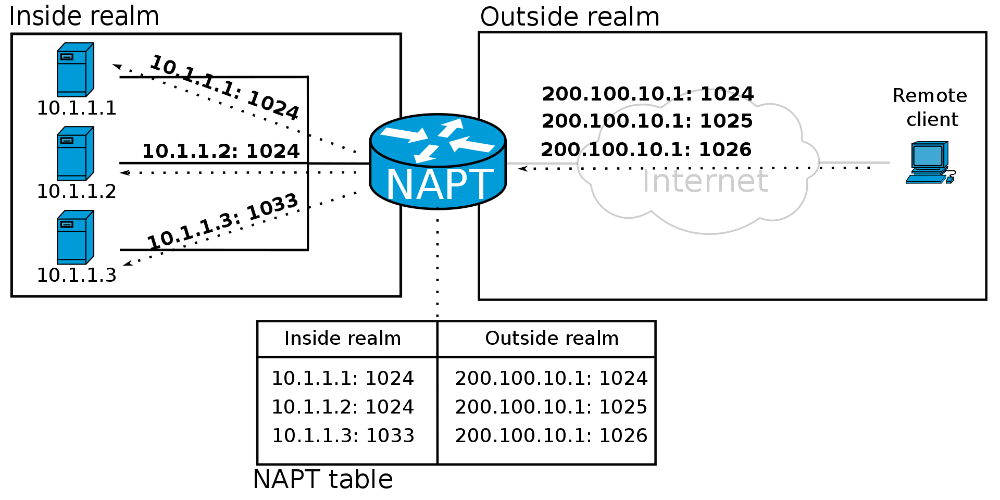
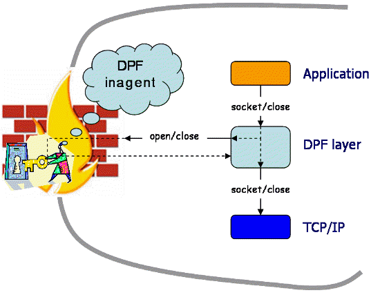
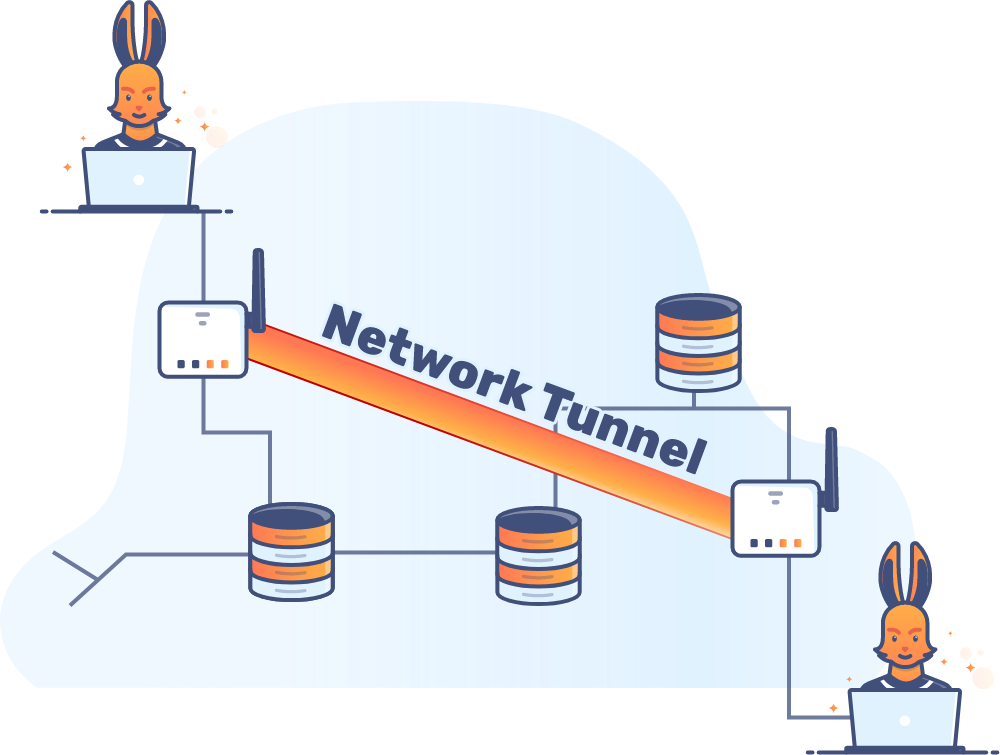

# Port Forwarding and Tunneling

## Network Segmentation

For the most part, networks encountered in the real world will not be [flat](https://en.wikipedia.org/wiki/Flat\_network). Typically networks are [segmented](https://en.wikipedia.org/wiki/Network\_segmentation) with the overall network broken into smaller [subnets](https://en.wikipedia.org/wiki/Subnet). Computers that belong to the same subnet are addressed with an identical group of its most-significant bits of their IP addresses.

### Advantages

There are many benefits of segmenting a network including:

* **Reduced congestion:** On a segmented network, there are fewer hosts per subnetwork and the traffic and thus congestion per segment is reduced
* **Improved security:** severely limits attackers, because compromising a single host no longer gives them free access to every other device on the network
  * Broadcasts will be contained to local network. Internal network structure will not be visible from outside.
  * There is a reduced attack surface available to pivot in if one of the hosts on the network segment is compromised.
  * Can be used to create an environment of least privilege by segmenting the network by logical function
* **Containing network problems:** Limiting the effect of local failures on other parts of network
* **Controlling visitor access:** Visitor access to the network can be controlled by implementing [VLANs](https://en.wikipedia.org/wiki/VLAN) to segregate the network

### Firewalls

As part of the network segmentation process, most network administrators will also implement controls that limit the flow of traffic into, out from, and across their networks. One of the most common technologies used for this are [firewalls](https://en.wikipedia.org/wiki/Firewall\_\(computing\)).

Firewalls can be implemented at multiple levels:

1. **Endpoint Software:** firewalls can be run as applications/services on a client machine
   * The Linux kernel has firewall capabilities that can be configured with the [`iptables`](https://en.wikipedia.org/wiki/Iptables) tool suite
   * Windows offers a built-in [Windows Defender Firewall](https://learn.microsoft.com/en-us/windows/security/operating-system-security/network-security/windows-firewall/)
2. **Features within a piece of physical network infrastructure:** many commercially available pieces of routing equipment have firewall capabilities
3. **Hardware firewall:** a physical network appliance whose only job is to be a firewall

Firewalls can drop unwanted inbound packets and prevent potentially-malicious traffic from traversing or leaving the network. Firewalls may prevent all but a few allowed hosts from communicating with a port on a particularly privileged server. They can also block some hosts or subnets from accessing the wider internet.

Most firewalls tend to allow or block traffic in line with a set of rules (usually whitelist or blacklist) based on IP addresses and port numbers. Some firewalls offer more control with [Deep Packet Inspection](https://en.wikipedia.org/wiki/Deep\_packet\_inspection). The firewall proxies all connections so it can look inside the packets and drop or allow traffic based on some rule set.

## Port Forwarding

[Port forwarding](https://en.wikipedia.org/wiki/Port\_forwarding) is an application of [network address translation](https://en.wikipedia.org/wiki/Network\_address\_translation) (NAT) that redirects a communication request from one address and port number combination to another while the packets are traversing a network gateway, such as a router or firewall. An illustration is below:

<figure><figcaption><p>How port forwarding works</p></figcaption></figure>

It is commonly used to make services on a host residing on a protected or [masqueraded](https://en.wikipedia.org/wiki/IP\_masquerading) (internal) network available to hosts on the opposite side of the gateway (external network), by remapping the destination IP address and port number of the communication to an internal host. Some examples of use cases include:

* Running a public HTTP server within a private LAN
* Permitting Secure Shell access to a host on the private LAN from the Internet
* Permitting FTP access to a host on a private LAN from the Internet
* Running a publicly available game server within a private LAN

Note that port forwarding involves opening an additional port to the internet, which represents a potential point of entry.

### Types of Forwarding

There are generally three categories of port forwarding: local, remote, and dynamic. Details about each are below.

#### Local Port Forwarding

This the most common type of port forwarding. It is used to _let a user connect from the local computer to another server_.&#x20;

It is used to forward data securely from another client application running on the same computer as a Secure Shell (SSH) client. By using local port forwarding, firewalls that block certain web pages, can be bypassed.

Connections from an SSH client are forwarded, via an SSH server, to the intended destination server. The SSH server is configured to redirect data from a specified port (which is local to the host that runs the SSH client) through a secure tunnel to some specified destination host and port. The server decrypts the data, and then redirects it to the destination host and port.

#### Remote Port Forwarding

Remote port forwarding _lets users connect from the server side of a tunnel to a remote network service located at the tunnel's client side_. The tunnel can be SSH or there are some proprietary tunneling schemes that use remote forwarding via other protocols.

Two examples of remote port forwarding use cases:

1. An employee of a company hosts an FTP server at their own home and wants to give access to the FTP service to employees using computers in the workplace. In order to do this, an employee can set up remote port forwarding through SSH on the company's internal computers by including their FTP server’s address and using the correct port numbers for FTP (standard FTP port is TCP/21)
2. Opening remote desktop sessions is a common use of remote port forwarding. Through SSH, this can be accomplished by opening the virtual network computing port (5900) and including the destination computer’s address.

#### Dynamic Port Forwarding

[Dynamic port forwarding](https://pages.cs.wisc.edu/\~sschang/firewall/dpf/mechanism.htm) (DPF) is an on-demand method of traversing a firewall or NAT through the use of firewall pinholes. The goal is _to enable clients to connect securely to a trusted server that acts as an intermediary for the purpose of sending/receiving data to one or many destination servers_.

DPF can be implemented by setting up a local application, such as SSH, as a SOCKS proxy server, which can be used to process data transmissions through the network or over the Internet.

Once the connection is established, DPF can be used to provide additional security for a user connected to an untrusted network. Since data must pass through the secure tunnel to another server before being forwarded to its original destination, the user is protected from packet sniffing that may occur on the LAN.

In a DPF connection setup and ongoing data communication, three entities are involved: a client, a server, a daemon called _DPF inagent_. The following picture shows the topology of DPF communication:

<figure><figcaption><p>DPF illustration</p></figcaption></figure>

To enable inbound connections, each private (firewalled) network must have a DPF inagent installed on the firewall/NAT. Server applications that want to accept connections from outside their private (firewalled) network must use DPF socket calls. This can be done by rewriting/relinking the applications or by using an interposition mechanism so that applications' regular socket calls are translated into DPF calls. On the other hand, client applications need not be changed at all.

### Tools for Port Forwarding

#### Linux Tools

* [Socat](../../networking-tools/socat/port-forwarding.md) can be used for port forwarding
* [`rinetd`](https://github.com/samhocevar/rinetd) is an option that runs as a daemon which makes it a better option for _long-term_ port forwarding (but slightly unwieldy for short-term operations)
  * It will need to be installed on the system (can be done with `apt install rinetd` with admin permissions)
  * Once installed, [these instructions](https://www.howtoforge.com/port-forwarding-with-rinetd-on-debian-etch) can be followed to set up port forwarding
* One can combine Netcat and a [`fifo`](https://man7.org/linux/man-pages/man7/fifo.7.html) pipe to create a port forward
* If an attacker has root privileges, they could use `iptables` to create port forwards
  * The specific iptables port forwarding setup for a given host will likely depend on the configuration already in place.
  * To be able to forward packets in Linux also requires enabling forwarding on the desired interface by writing "`1`" to `/proc/sys/net/ipv4/conf/[interface]/forwarding` (if it's not already configured to allow it).

A `.sh` script for doing the Netcat and `fifo` pipe method is shown here ([Source](https://gist.github.com/holly/6d52dd9addd3e58b2fd5)):


```bash
#!/usr/bin/env bash

set -e

if [ $# != 3 ]; then

        echo 'Usage: nc-tcp-forward.sh $FRONTPORT $BACKHOST $BACKPORT' >&2
        exit 1
fi

FRONTPORT=$1
BACKHOST=$2
BACKPORT=$3

FIFO=/tmp/backpipe

trap 'echo "trapped."; pkill nc; rm -f $FIFO; exit 1' 1 2 3 15

mkfifo $FIFO
while true; do
        nc -l $FRONTPORT <$FIFO | nc $BACKHOST $BACKPORT >$FIFO
done
rm -f $FIFO
```


## Tunneling

[Tunneling](https://en.wikipedia.org/wiki/Tunneling\_protocol) is a communication protocol which allows for the movement of data from one network to another. Tunneling means encapsulating one type of data stream within another. The [tunneling protocol](https://en.wikipedia.org/wiki/Tunneling\_protocol) works by using the _data portion of a packet to carry the packets that actually provide the service_. The tunnel is a virtual construct as the actual packets will still traverse the same physical route but because of the encapsulation used the data will effectively be in a "tunnel."

<figure><figcaption><p>Network tunneling illustration</p></figcaption></figure>

Tunneling uses a layered protocol model such as those of the OSI or TCP/IP protocol suite, but usually violates the layering when using the payload to carry a service not normally provided by the network. Typically, the delivery protocol operates at an equal or higher level in the layered model than the payload protocol.

For example tunneling could be used transport Hypertext Transfer Protocol (HTTP) traffic within a Secure Shell (SSH) connection so from an external perspective, only the SSH traffic will be visible.

Because tunneling involves repackaging the traffic data into a different form, perhaps with encryption as standard, it can hide the nature of the traffic that is run through a tunnel.

### Uses

#### Running Unsupported Protocols

Imagine a company wants to set up a wide area network (WAN) connecting Office A and Office B. The company uses the IPv6 protocol, but there is a network between Office A and Office B that only supports IPv4.

By encapsulating their IPv6 packets inside IPv4 packets, the company can continue to use IPv6 while still sending data directly between the offices.

#### VPN

This is perhaps the most common use of tunneling. Tunneling is the process by which VPN packets reach their intended destination, which is typically a private network.

Many VPNs use the IPsec protocol suite. This is a group of protocols that run directly on top of IP at the network layer. Network traffic in an IPsec tunnel is fully encrypted, but it is decrypted once it reaches either the network or the user device.

Another protocol in common use for VPNs is Transport Layer Security (TLS).
