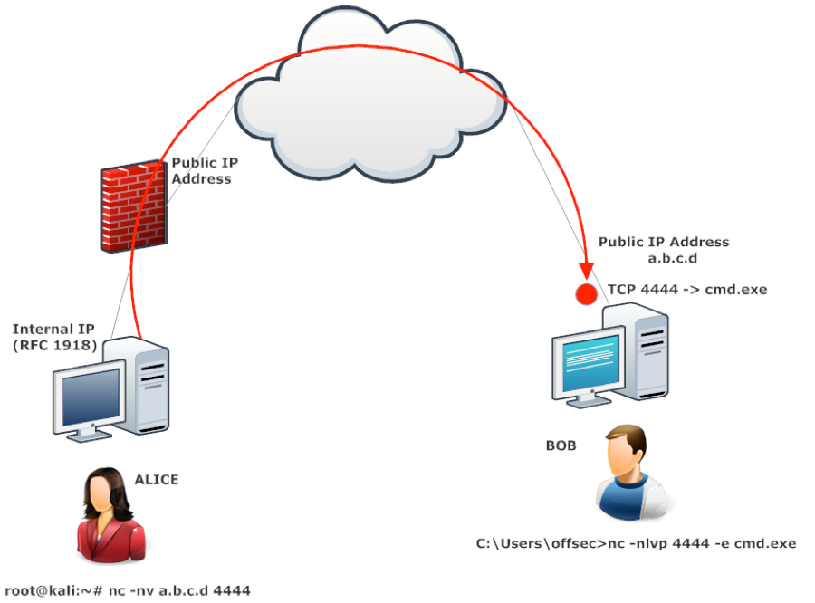

# Bind Shell

A bind shell involves the attacker reaching out to a target machine (via an open networking port) and _binding_ the shell to that port.

<figure><figcaption>
Netcat Bind Shell Example
</figcaption></figure>

## Socat

###
