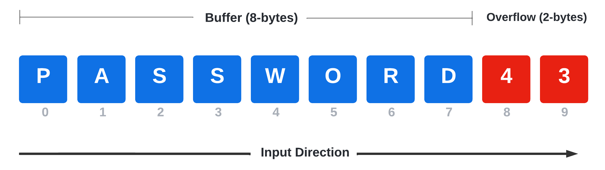

---
layout:
  title:
    visible: true
  description:
    visible: false
  tableOfContents:
    visible: true
  outline:
    visible: true
  pagination:
    visible: true
---

# Introduction

This section will cover the basics of what buffer overflows are and how they can be exploited.

In general, a **buffer** is a **memory area** intended to hold content that is often sent by the user for later processing. Some buffers have a dynamic size, while others have a fixed, preallocated size.

Buffer overflows are one of the earliest memory corruption vulnerabilities that have been undermining software since the late 1980s, and although many mitigations have been developed during the years, they are still relevant today.

From a bird's-eye view, a buffer overflow vulnerability occurs whenever the user's provided content goes beyond the stack limit and overruns into the adjacent memory area.

<figure><figcaption>
Diagram showing an overflowed buffer
</figcaption></figure>

In this diagram, a buffer has been designed to contain a password that can be a maximum of 8 bytes. If a user provides an input consisting of the characters "password" followed by the numbers "4" and "3", the last two digits are going to overflow the buffer by two bytes. If not handled correctly, this event might lead to unexpected behavior.

## Overflow Exploit Structure

The overall structure of a Buffer Overflow exploit is generally:

1. Create a large buffer to trigger the overflow.
2. Take control of `EIP` by overwriting a return address on the stack, padding the large buffer with an appropriate offset.
3. Include a chosen payload in the buffer prepended by an optional [NOP sled](https://en.wikipedia.org/wiki/NOP\_slide).
4. Choose a correct return address instruction such as `JMP ESP` (or a different register) to redirect the execution flow to the payload.
