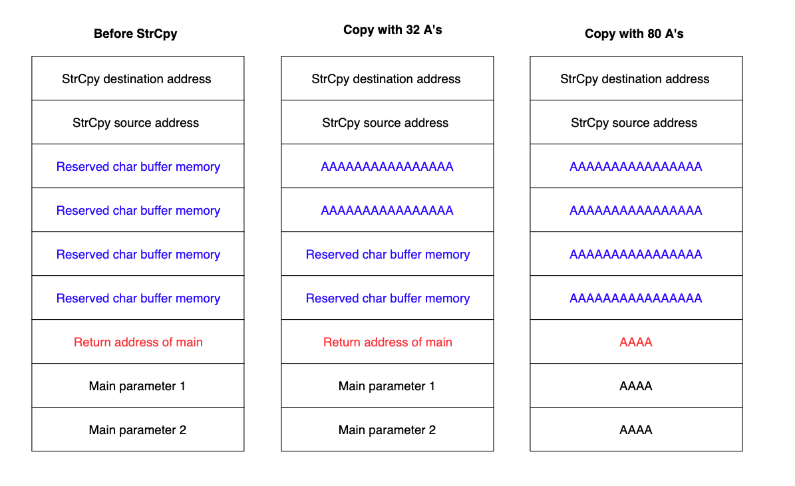
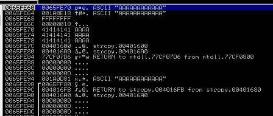
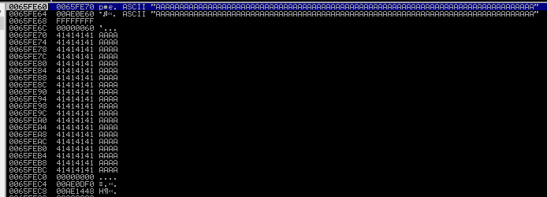

# Buffer Overflow Basics

## Sample Code

The below is a highly simplified version of an application that would be vulnerable to a buffer overflow.


```c
#include <stdio.h>
#include <string.h>

int main(int argc, char *argv[])
{
	char buffer[64];

	if (argc < 2)
	{
		printf("Error - You must supply at least one argument\n");
		
		return 1;
	}
	
	strcpy(buffer, argv[1]);
	
  return 0;
}
```


Note in line 6 where a buffer is declared of a fixed size. However when the input is passed to that buffer (line 15) no checks are performed on the size of the input meaning that the input provided could be larger than the allocated 64 bytes.

### Overflowing the Buffer

Examine what would happen if strings (of just "A" characters) of varying lengths were provided

<figure><figcaption><p>Stack used by sample code</p></figcaption></figure>

Provided that argument passed to the function is 64 characters or fewer there is no issue, however anything larger than 64 characters begins overwriting the stack.

This image shows the Immunity Debugger stack trace with a value of 12 A's provided:

<figure><figcaption><p>Stack of 12 A's</p></figcaption></figure>

If this same code is called with 80 A's (64 allocated characters + 4 rows on the stack) the return instruction will be overwritten:

<figure><figcaption><p>Overwritten return instruction</p></figcaption></figure>

When the code attempts to return from the function this will result in `41414141` being written into `$EIP`:

<figure><figcaption><p>Invalid $EIP</p></figcaption></figure>

Because `41414141` is not a valid memory address this crashes the application.

While A's were used to simply provide an invalid address and cause a crash, if an attacker could arrange to have a valid (and useful) address placed into `$EIP` this could lead to arbitrary code execution.
