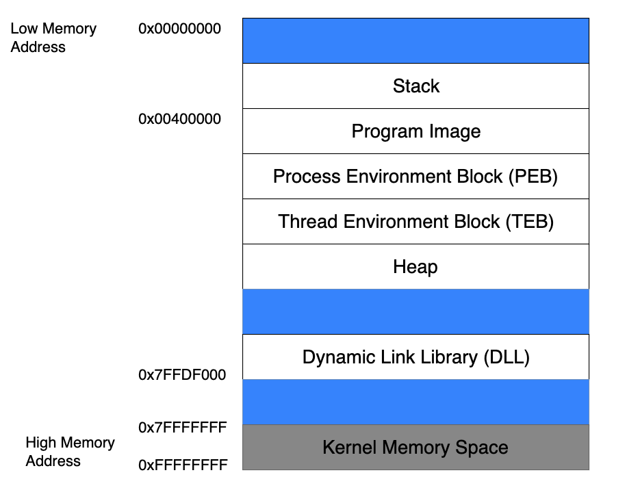
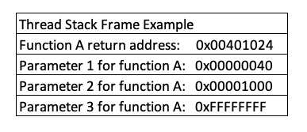
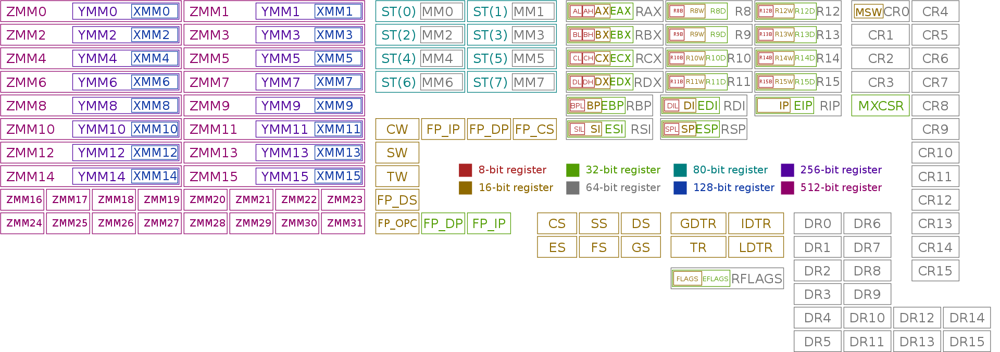

# x86 Architecture

In the context of buffer overflows, 2 main concepts of x86 are relevant:

1. Program Memory
2. CPU Registers

## Program Memory

When a binary application is executed, it allocates memory in a very specific way within the memory boundaries used by modern computers. Figure 1 shows how process memory is allocated in Windows between the lowest memory address (0x00000000) and the highest memory address (0x7FFFFFFF) used by applications:

<figure><figcaption>
Figure 1: Anatomy of program memory in Windows 
</figcaption></figure>

### Stack

When a thread is running, it executes code from within the Program Image or from various Dynamic Link Libraries (DLLs). The thread requires a short-term data area for functions, local variables, and program control information, which is known as the **stack**. To facilitate independent execution of multiple threads, _each thread in a running application has its own stack_.

Stack memory is "viewed" by the CPU as a **Last-In First-Out (LIFO) structure**. This essentially means that while accessing the stack, items put ("pushed") on the top of the stack are removed ("popped") first.&#x20;

The x86 architecture implements dedicated `PUSH` and `POP` assembly instructions in order to add or remove data to the stack respectively.

### Return Mechanisms

When code within a thread calls a function, it must know which address to return to once the function completes. This "return address" (along with the function's parameters and local variables) is stored on the stack . This collection of data is associated with one function call and is stored in a section of the stack memory known as a **stack frame**. An example of a stack frame is illustrated in Figure 2.

<figure><figcaption>
Figure 2: Stack frame
</figcaption></figure>

When a function ends, the return address is taken from the stack and used to restore the execution flow back to the main program or the calling function.

## CPU Registers

A processor register is a quickly accessible location available to a computer's processor. Registers usually consist of a small amount of fast storage, although some registers have specific hardware functions, and may be read-only or write-only.

<figure><figcaption>
x86 64-bit registers
</figcaption></figure>

### Important Registers

The register names were established for 16-bit architectures and were then extended with the advent of the 32-bit (_x86_) platform, hence the letter "E" in the register acronyms. They were then further extended for x86\_64 architectures with an "R" replacing the "E" of 32-bit iterations. Each register may contain a 64-bit value or may contain 32-bit value, 16-bit, or 8-bit values in the respective subregisters.

In the table below all registers are referenced with the 16-bit name ("E" or "R" can be prepended for 32 and 64 bit registers respectively).

<table><thead><tr><th width="120">Register</th><th width="151">Common Name</th><th>Description</th></tr></thead><tbody><tr><td>AX</td><td>Accumulator</td><td>Arithmetical and logical instructions</td></tr><tr><td>BX</td><td>Base</td><td>Base pointer for memory addresses</td></tr><tr><td>CX</td><td>Counter</td><td>Loop, shift, and rotation counter</td></tr><tr><td>DX</td><td>Data</td><td>I/O port addressing, multiplication, and division</td></tr><tr><td>SI</td><td>Source Index</td><td>Pointer addressing of data and source in string copy operations</td></tr><tr><td>DI</td><td>Destination Index</td><td>Pointer addressing of data and destination in string copy operations</td></tr><tr><td>SP</td><td>Stack Pointer</td><td>Keeps "track" of the most recently referenced location on the stack (top of the stack) by storing a pointer to it</td></tr><tr><td>BP</td><td>Base Pointer</td><td>Pointer to the top of the stack when a function is called  By accessing BP, a function can easily reference information from its own stack frame (via offsets) while executing</td></tr><tr><td>IP</td><td>Instruction Pointer</td><td>Points to the next code instruction to be executed  Since IP essentially directs the flow of a program, it is an attacker's primary target when exploiting any memory corruption vulnerability such as a buffer overflow</td></tr></tbody></table>

