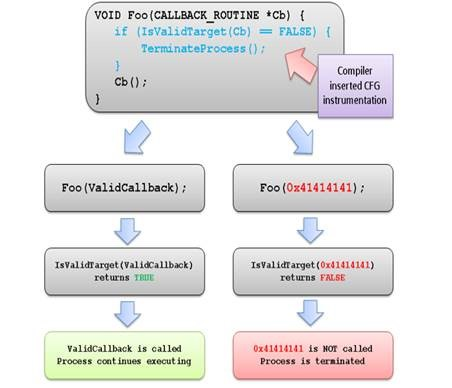

# Prevention Mechanisms

It is worth understanding the prevention mechanisms to understand what needs to be overcome in order to mount a real-world successful buffer overflow.

## Data Execution Prevention (DEP)

System-level memory protection feature that is built into the operating system starting with Windows XP and Windows Server 2003.

DEP enables the system to **mark one or more pages of memory as non-executable**. Marking memory regions as non-executable means that code cannot be run from that region of memory, which makes it harder for the exploitation of buffer overruns.

DEP prevents code from being run from data pages such as the default heap, stacks, and memory pools. **If an application attempts to run code from a data page that is protected, a memory access violation exception occurs**, and if the exception is not handled, the calling process is terminated.

Further details can be found at [Microsoft's website](https://learn.microsoft.com/en-us/windows/win32/memory/data-execution-prevention).

## Address Space Layout Randomization (ASLR)

ASLR randomizes the base addresses of loaded applications and DLLs every time the operating system is booted. It is a useful defense because it makes Windows systems look “different” to malware, making automated attacks harder

On older Windows operating systems like Windows XP where ASLR is not implemented, all DLLs are loaded at the same memory address every time, making exploitation much simpler.

## Control Flow Guard (CFG)

Software vulnerabilities are often exploited by providing unlikely, unusual, or extreme data to a running program. For example, an attacker can exploit a buffer overflow vulnerability by providing more input to a program than expected, thereby over-running the area reserved by the program to hold a response.

### How CFG Functions

Through a combination of compile and run-time support, CFG implements control flow integrity that tightly restricts where indirect call instructions can execute.

The **compiler** does the following:

1. Adds lightweight security checks to the compiled code.
2. Identifies the set of functions in the application that are valid targets for indirect calls.

The **runtime support**, provided by the Windows kernel:

1. Efficiently maintains state that identifies valid indirect call targets.
2. Implements the logic that verifies that an indirect call target is valid.

#### Illustration

<figure><figcaption>
Example CFG check
</figcaption></figure>

When a CFG check fails at runtime, Windows immediately terminates the program, thus breaking any exploit that attempts to indirectly call an invalid address.

Further details can be found via [Microsoft](https://learn.microsoft.com/en-us/windows/win32/secbp/control-flow-guard).

## /GS (Buffer Security Check)

/GS is a compiler option that detects some buffer overruns that overwrite a function's return address, exception handler address, or certain types of parameters. This is done by creating GS Buffer structures that are specially handled to ensure prevention of buffer overflows.

### GS Buffers

A GS buffer can be any of the following

* An array that is larger than 4 bytes, has more than two elements, and has an element type that is not a pointer type.
* A data structure whose size is more than 8 bytes and contains no pointers.
* A buffer allocated by using the `_alloca` function.
* Any class or structure that contains a GS buffer.

### How /GS Works

On functions that the compiler recognizes as subject to buffer overrun problems, the compiler allocates space on the stack before the return address. On function entry, the allocated space is loaded with a **security cookie** that is computed once at module load.&#x20;

On function exit, and during frame unwinding on 64-bit operating systems, a helper function is called to make sure that the value of the cookie is still the same. A different value indicates that an overwrite of the stack may have occurred. If a different value is detected, the process is terminated.

More information can be found via [Microsoft](https://learn.microsoft.com/en-us/cpp/build/reference/gs-buffer-security-check?view=msvc-170).
