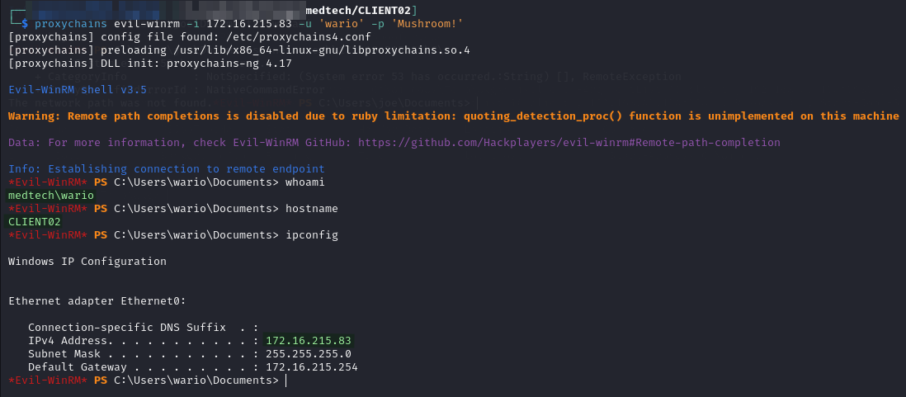

# CLIENT02

My initial access is provided via the `wario` user over WinRM:


```bash
proxychains evil-winrm -i 172.16.215.83 -u 'wario' -p 'Mushroom!'
```


<figure><figcaption><p>Initial access</p></figcaption></figure>

`wario` happened to be an admin so getting the root proof file was simple.
