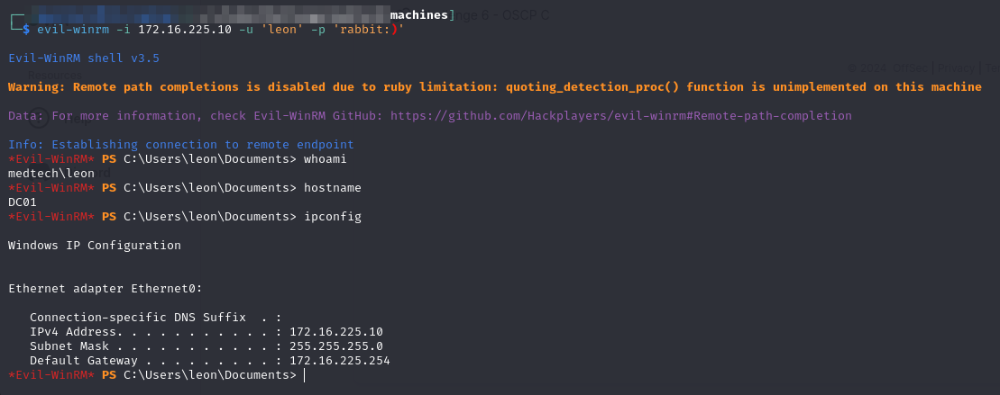
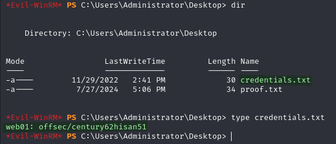

# DC01

Thanks to [running Mimikatz on `DEV04`](dev04.md#mimikatz) I have the leon user's password. This grants me access to all the Windows machines via WinRM including `DC01`:


```bash
evil-winrm -i 172.16.225.10 -u 'leon' -p 'rabbit:)'
```


<figure><figcaption><p>Initial access</p></figcaption></figure>

With these elevated rights I can do really anything I need to.

## Manual Enumeration

On the Administrator's Desktop I find a file called credentials.txt:

<figure><figcaption><p>Credentials</p></figcaption></figure>

This is perfect because I was wondering how I would access the Linux machines on the network. Was going to try leon's creds but this is hopefully just an admin.
