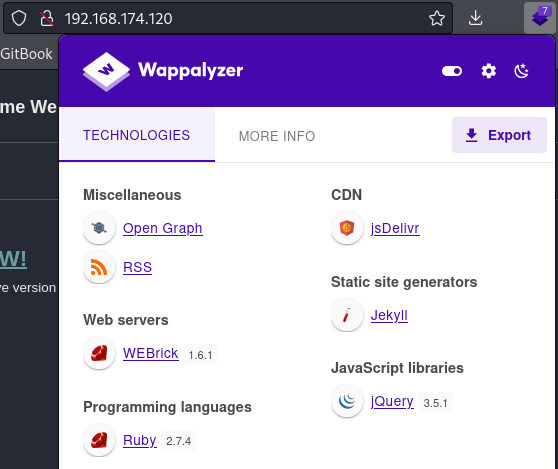
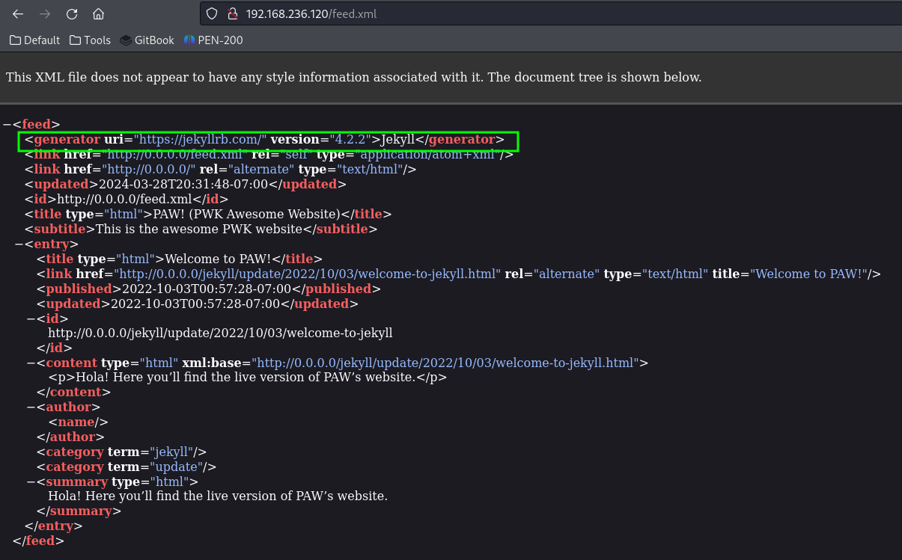
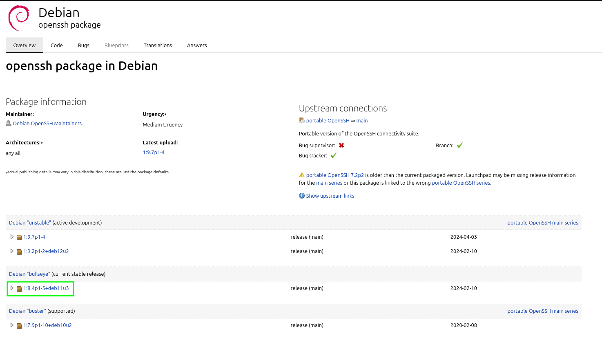

---
layout:
  title:
    visible: true
  description:
    visible: false
  tableOfContents:
    visible: true
  outline:
    visible: true
  pagination:
    visible: true
---

# External Enumeration

## Network Scan

From outside the network I can see 3 machines at IP addresses 192.168.X.120-122. Nmap enumeration will be the first step:


```bash
sudo nmap -A -o external.nmap 192.168.174.120-122
```


Selected output from the scan is seen below:


```
# Nmap 7.94SVN scan initiated Sat Apr 20 18:23:06 2024 as: nmap -A -o external.nmap 192.168.174.120-122
Nmap scan report for 192.168.174.120
Host is up (0.056s latency).
Not shown: 998 closed tcp ports (reset)
PORT   STATE SERVICE VERSION
22/tcp open  ssh     OpenSSH 8.4p1 Debian 5+deb11u1 (protocol 2.0)
| ssh-hostkey: 
|   3072 84:72:7e:4c:bb:ff:86:ae:b0:03:00:79:a1:c5:af:34 (RSA)
|   256 f1:31:e5:75:31:36:a2:59:f3:12:1b:58:b4:bb:dc:0f (ECDSA)
|_  256 5a:05:9c:fc:2f:7b:7e:0b:81:a6:20:48:5a:1d:82:7e (ED25519)
80/tcp open  http    WEBrick httpd 1.6.1 (Ruby 2.7.4 (2021-07-07))
|_http-title: PAW! (PWK Awesome Website)
|_http-server-header: WEBrick/1.6.1 (Ruby/2.7.4/2021-07-07)
    
    ...

Network Distance: 4 hops
Service Info: OS: Linux; CPE: cpe:/o:linux:linux_kernel

TRACEROUTE (using port 21/tcp)
HOP RTT      ADDRESS
1   55.47 ms 192.168.45.1
2   55.42 ms 192.168.45.254
3   56.76 ms 192.168.251.1
4   56.85 ms 192.168.174.120

...

Nmap scan report for 192.168.174.121
Host is up (0.056s latency).
Not shown: 996 closed tcp ports (reset)
PORT    STATE SERVICE       VERSION
80/tcp  open  http          Microsoft IIS httpd 10.0
|_http-title: MedTech
| http-methods: 
|_  Potentially risky methods: TRACE
|_http-server-header: Microsoft-IIS/10.0
135/tcp open  msrpc         Microsoft Windows RPC
139/tcp open  netbios-ssn   Microsoft Windows netbios-ssn
445/tcp open  microsoft-ds?

    ...

Network Distance: 4 hops
Service Info: OS: Windows; CPE: cpe:/o:microsoft:windows

Host script results:
| smb2-security-mode: 
|   3:1:1: 
|_    Message signing enabled but not required
| smb2-time: 
|   date: 2024-04-21T00:23:34
|_  start_date: N/A

...

map scan report for 192.168.174.122
Host is up (0.056s latency).
Not shown: 999 closed tcp ports (reset)
PORT   STATE SERVICE VERSION
22/tcp open  ssh     OpenSSH 8.9p1 Ubuntu 3 (Ubuntu Linux; protocol 2.0)
| ssh-hostkey: 
|   256 60:f9:e1:44:6a:40:bc:90:e0:3f:1d:d8:86:bc:a9:3d (ECDSA)
|_  256 24:97:84:f2:58:53:7b:a3:f7:40:e9:ad:3d:12:1e:c7 (ED25519)

    ...

Network Distance: 4 hops
Service Info: OS: Linux; CPE: cpe:/o:linux:linux_kernel
```


Because the machines have no identifiers for now I will just refer to them by the last octet of their IP. The machines at .120 and .121 both appear to have an externally facing web server which makes them the starting points.

## Machine 120

The machine hosted at 192.168.X.120 is hosting a web server as well an open SSH port. The SSH port is probably no use right now so I start by navigating to the website.

### Web Server

<figure><figcaption><p>Landing page</p></figcaption></figure>

I will start with a [`whatweb`](https://github.com/urbanadventurer/WhatWeb) scan:


```shell-session
kali@kali:~/medtech$ whatweb 192.168.174.120                                   
http://192.168.174.120 [200 OK] Country[RESERVED][ZZ], HTML5, HTTPServer[WEBrick/1.6.1 (Ruby/2.7.4/2021-07-07)], IP[192.168.174.120], Open-Graph-Protocol[website], Ruby[2.7.4,WEBrick/1.6.1], Script[application/ld+json], Title[PAW! (PWK Awesome Website)]
```


As well as examining the Wappalyzer output:

<figure><figcaption><p>Tech stack for exposed site</p></figcaption></figure>

Some further clicking a RSS Feed page is found. Opening that points to a more concrete Jekyll version:

<figure><figcaption><p>XML page reveals Jekyll version</p></figcaption></figure>

Further clicking around the site does not reveal too much. There is a `sitemap.xml` and a `robots.txt` file but neither of those indicate an area that is not readily visible.

#### Gobuster

Gobuster is used to perform a directory search and see if there are any interesting pages on the site:


```bash
gobuster dir -u http://192.168.236.120 -w /usr/share/wordlists/dirb/common.txt -o paw.gobuster -x txt,pdf,config,html,php,asp,aspx
```


Unfortunately the results do not reveal much:


```
/404                  (Status: 200) [Size: 4328]
/404.html             (Status: 200) [Size: 4328]
/about                (Status: 301) [Size: 44] [--> http://192.168.236.120/about/]
/assets               (Status: 301) [Size: 46] [--> http://192.168.236.120/assets/]
/index                (Status: 200) [Size: 4649]
/index.html           (Status: 200) [Size: 4649]
/index.html           (Status: 200) [Size: 4649]
/robots.txt           (Status: 200) [Size: 36]
/robots.txt           (Status: 200) [Size: 36]
/sitemap.xml          (Status: 200) [Size: 503]
/static               (Status: 301) [Size: 46] [--> http://192.168.236.120/static/]
```


The about page contains some links to the source code for Jekyll and Minima. The static page just appears as a directory.

### SSH

The main item of interest in the SSH result was the version header that was retrieved by Nmap:

```
OpenSSH 8.4p1 Debian 5+deb11u1
```

This seems pretty specific. Recall from an earlier example that the attacker was able to deduce the underlying Linux OS version based on this header. It seems this technique may work again. The previous example used launchpad.net as the source for which OpenSSH versions were bundled with which Ubuntu versions. The URL for that was:

```
https://launchpad.net/ubuntu/+source/openssh
```

Substituting `/debian` for `/ubuntu` finds the page the attacker needs:

<figure><figcaption><p>OpenSSH version bundled with Debian</p></figcaption></figure>

This version was bundled with "[Debian 'bullseye'](https://www.debian.org/releases/bullseye/)" which upon further research is also known as Debian 11. Debian 11 was originally released in August 2021 and its last update was from February 2024. It has now been superseded by Debian 12.

Nothing is jumping off the page as the clear route in. Next the machine at `192.168.X.121` will be examined for possible entry.

## Machine 121

Now that the machine at `192.168.X.120` has been enumerated it is time to move on to the one at `192.168.X.121`. The attacker noted that this machine was found to be running SMB, a web server, and SSH:

```
Nmap scan report for 192.168.174.121
Host is up (0.056s latency).
Not shown: 996 closed tcp ports (reset)
PORT    STATE SERVICE       VERSION
80/tcp  open  http          Microsoft IIS httpd 10.0
|_http-title: MedTech
| http-methods: 
|_  Potentially risky methods: TRACE
|_http-server-header: Microsoft-IIS/10.0
135/tcp open  msrpc         Microsoft Windows RPC
139/tcp open  netbios-ssn   Microsoft Windows netbios-ssn
445/tcp open  microsoft-ds?

    ...

Network Distance: 4 hops
Service Info: OS: Windows; CPE: cpe:/o:microsoft:windows

Host script results:
| smb2-security-mode: 
|   3:1:1: 
|_    Message signing enabled but not required
| smb2-time: 
|   date: 2024-04-21T00:23:34
|_  start_date: N/A
```

### Web Server

The web page on this server looks a lot more complete than the other:

<figure><figcaption><p>Landing page of .121's web server</p></figcaption></figure>

#### Tech Stack

First thing's first. Wappalyzer and whatweb are used to check the tech stack of the site:

<figure><figcaption></figcaption></figure>


```shell-session
kali@kali:~/medtech$ whatweb 192.168.250.121
http://192.168.250.121 [200 OK] ASP_NET[4.0.30319], Bootstrap, Country[RESERVED][ZZ], HTML5, HTTPServer[Microsoft-IIS/10.0], IP[192.168.250.121], JQuery[1.12.4], Meta-Author[Offensive Security], Microsoft-IIS[10.0], Modernizr[3.5.0.min], Script, Title[MedTech][Title element contains newline(s)!], X-Powered-By[ASP.NET], X-UA-Compatible[ie=edge]
```


#### Directory Enumeration

A Gobuster scan is run to see what is publicly accessible on the server:


```bash
gobuster dir -u http://192.168.250.121 -w /usr/share/wordlists/dirb/common.txt -o ws2.gobuster -x txt,pdf,config,html,php,asp,aspx
```


The scan output:


```
/about.aspx           (Status: 200) [Size: 22575]
/About.aspx           (Status: 200) [Size: 22575]
/assets               (Status: 301) [Size: 153] [--> http://192.168.250.121/assets/]
/blog.aspx            (Status: 200) [Size: 30752]
/Blog.aspx            (Status: 200) [Size: 30752]
/Contact.aspx         (Status: 200) [Size: 46706]
/contact.aspx         (Status: 200) [Size: 46706]
/css                  (Status: 301) [Size: 150] [--> http://192.168.250.121/css/]
/default.aspx         (Status: 200) [Size: 25997]
/Default.aspx         (Status: 200) [Size: 25997]
/error.aspx           (Status: 200) [Size: 962]
/fonts                (Status: 301) [Size: 152] [--> http://192.168.250.121/fonts/]
/js                   (Status: 301) [Size: 149] [--> http://192.168.250.121/js/]
/login.aspx           (Status: 200) [Size: 4083]
/Login.aspx           (Status: 200) [Size: 4083]
/master               (Status: 301) [Size: 153] [--> http://192.168.250.121/master/]
/services.aspx        (Status: 200) [Size: 19928]
/Services.aspx        (Status: 200) [Size: 19928]
```


#### Further Examination

The bottom of the home page has a piece that says it was made using [Colorlib](https://colorlib.com/). Colorlib is a WordPress theme so it seemed like the site might be built on WordPress. Because of this I opted to use WPScan but it turned up nothing:


```
         __          _______   _____
         \ \        / /  __ \ / ____|
          \ \  /\  / /| |__) | (___   ___  __ _ _ __ ®
           \ \/  \/ / |  ___/ \___ \ / __|/ _` | '_ \
            \  /\  /  | |     ____) | (__| (_| | | | |
             \/  \/   |_|    |_____/ \___|\__,_|_| |_|

         WordPress Security Scanner by the WPScan Team
                         Version 3.8.25
       Sponsored by Automattic - https://automattic.com/
       @_WPScan_, @ethicalhack3r, @erwan_lr, @firefart
_______________________________________________________________


Scan Aborted: The remote website is up, but does not seem to be running WordPress.
```


#### Login Page

The `/login.aspx` page seems as if it is vulnerable to SQLi. When a ' character is placed in an input field a SQL error appears on the page:

<figure><figcaption><p>SQL error</p></figcaption></figure>

This is currently the most promising attack vector.

There is a contact form on the `/contact.aspx` page but it does not seem to do anything as I looked at it for potential SQLi and when I clicked submit nothing happened.

### SMB

There is not a ton of information on the SMB service for .121. It seems the machine is running SMBv2 and message signing is not required:


```
...

Nmap scan report for 192.168.174.121
...

Host script results:
| smb2-security-mode: 
|   3:1:1: 
|_    Message signing enabled but not required
| smb2-time: 
|   date: 2024-04-21T00:23:34
|_  start_date: N/A

...
```


This is not terribly useful right now but should be kept in mind down the road.

## Machine 122

The machine at `192.168.X.122` only has an open SSH port:


```
...

Nmap scan report for 192.168.174.122
Host is up (0.056s latency).
Not shown: 999 closed tcp ports (reset)
PORT   STATE SERVICE VERSION
22/tcp open  ssh     OpenSSH 8.9p1 Ubuntu 3 (Ubuntu Linux; protocol 2.0)
| ssh-hostkey: 
|   256 60:f9:e1:44:6a:40:bc:90:e0:3f:1d:d8:86:bc:a9:3d (ECDSA)
|_  256 24:97:84:f2:58:53:7b:a3:f7:40:e9:ad:3d:12:1e:c7 (ED25519)

...
```


The header may again give clues as to the underlying OS version. The SSH version header is:

```
OpenSSH 8.9p1 Ubuntu 3
```

When examined via [Launchpad](https://launchpad.net/ubuntu/+source/openssh) it turns out that version was bundled with Ubuntu 22.04 (Jammy Jellyfish):

<figure><figcaption></figcaption></figure>

This provides some insight but not much more yet.

## Summary

Quite a bit of starting information was found in this section.

### Machine 120

* Running SSH (22) and HTTP (80)
* SSH is OpenSSH v8.4 which has no known RCE vulnerabilities
* HTTP is powered by Ruby via Jekyll
  * No readily available exploits
* Machine is likely running Debian 11 (based on OpenSSH version header)

### Machine 121

* Windows machine
* Running HTTP Server (80) and SMB (ports 138, 139, 445)
* Web server is IIS v10.0
  * Potential SQLi in `/login.aspx`
* SMBv2
  * Message signing _not required_

### Machine 122

* Running SSH (22)
* Likely Ubuntu 22.04 (based on SSH header)
