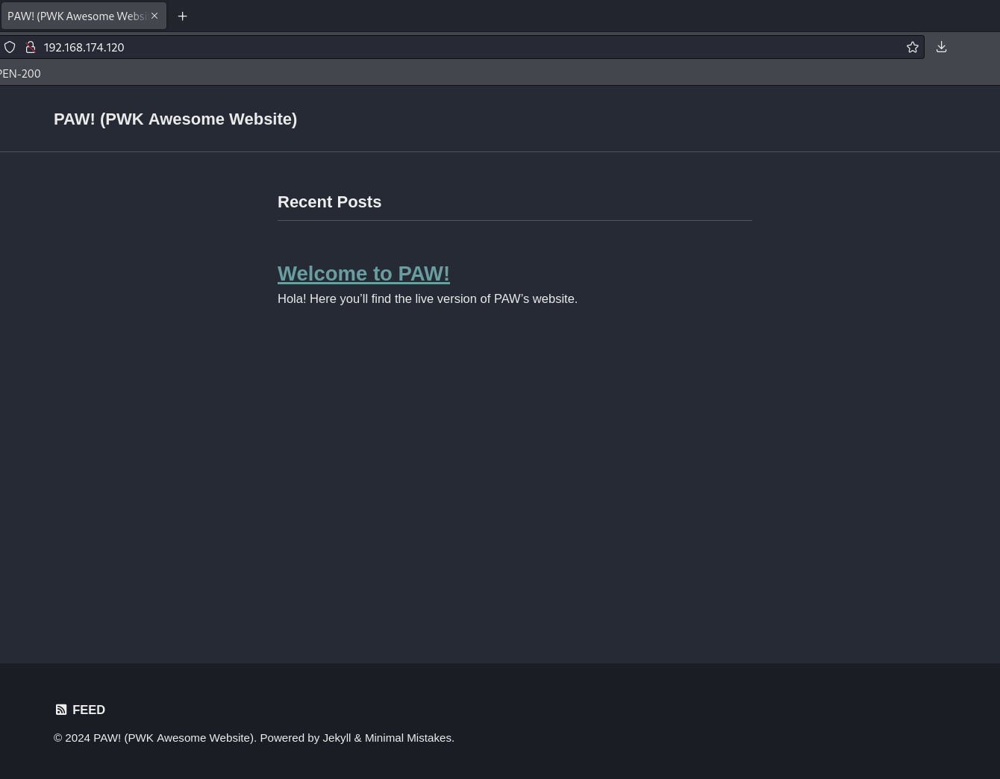
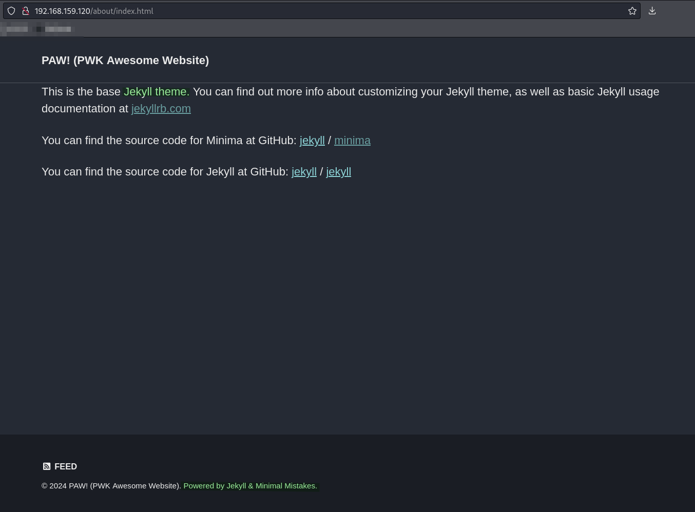
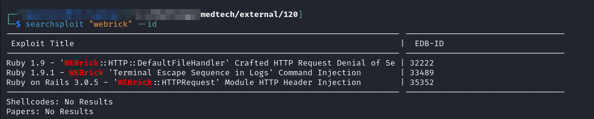
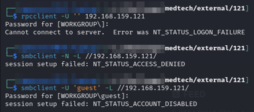
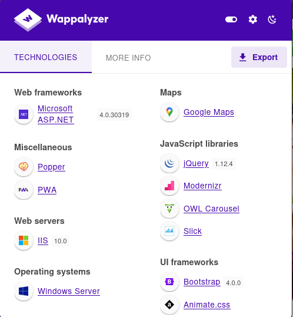
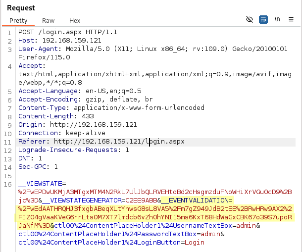
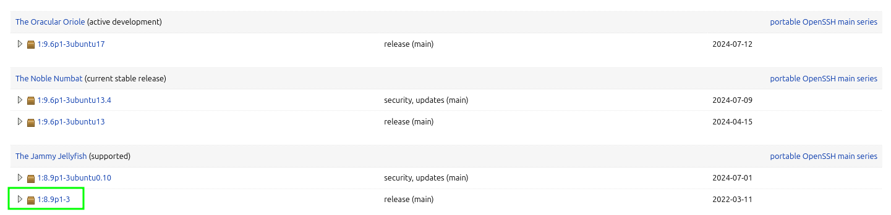

---
layout:
  title:
    visible: true
  description:
    visible: false
  tableOfContents:
    visible: true
  outline:
    visible: true
  pagination:
    visible: true
---

# External Enumeration

## Nmap

Started with just a scan of the entire network:


```bash
sudo nmap -sS -A -p- -o external_tcp_all.nmap 192.168.159.0/24
```



```
Nmap scan report for 192.168.159.120
Host is up (0.052s latency).
Not shown: 65533 closed tcp ports (reset)
PORT   STATE SERVICE VERSION
22/tcp open  ssh     OpenSSH 8.4p1 Debian 5+deb11u1 (protocol 2.0)
| ssh-hostkey: 
|   3072 84:72:7e:4c:bb:ff:86:ae:b0:03:00:79:a1:c5:af:34 (RSA)
|   256 f1:31:e5:75:31:36:a2:59:f3:12:1b:58:b4:bb:dc:0f (ECDSA)
|_  256 5a:05:9c:fc:2f:7b:7e:0b:81:a6:20:48:5a:1d:82:7e (ED25519)
80/tcp open  http    WEBrick httpd 1.6.1 (Ruby 2.7.4 (2021-07-07))
|_http-server-header: WEBrick/1.6.1 (Ruby/2.7.4/2021-07-07)
|_http-title: PAW! (PWK Awesome Website)
No exact OS matches for host (If you know what OS is running on it, see https://nmap.org/submit/ ).
TCP/IP fingerprint:
OS:SCAN(V=7.94SVN%E=4%D=7/22%OT=22%CT=1%CU=32205%PV=Y%DS=4%DC=T%G=Y%TM=669E
...
OS:=S)

Network Distance: 4 hops
Service Info: OS: Linux; CPE: cpe:/o:linux:linux_kernel

TRACEROUTE (using port 3306/tcp)
HOP RTT      ADDRESS
1   51.44 ms 192.168.45.1
2   51.37 ms 192.168.45.254
3   52.59 ms 192.168.251.1
4   52.67 ms 192.168.159.120

Nmap scan report for 192.168.159.121
Host is up (0.052s latency).
Not shown: 65521 closed tcp ports (reset)
PORT      STATE SERVICE       VERSION
80/tcp    open  http          Microsoft IIS httpd 10.0
| http-methods: 
|_  Potentially risky methods: TRACE
|_http-server-header: Microsoft-IIS/10.0
|_http-title: MedTech
135/tcp   open  msrpc         Microsoft Windows RPC
139/tcp   open  netbios-ssn   Microsoft Windows netbios-ssn
445/tcp   open  microsoft-ds?
5985/tcp  open  http          Microsoft HTTPAPI httpd 2.0 (SSDP/UPnP)
|_http-title: Not Found
|_http-server-header: Microsoft-HTTPAPI/2.0
47001/tcp open  http          Microsoft HTTPAPI httpd 2.0 (SSDP/UPnP)
|_http-title: Not Found
|_http-server-header: Microsoft-HTTPAPI/2.0
49664/tcp open  msrpc         Microsoft Windows RPC
49665/tcp open  msrpc         Microsoft Windows RPC
49666/tcp open  msrpc         Microsoft Windows RPC
49667/tcp open  msrpc         Microsoft Windows RPC
49668/tcp open  msrpc         Microsoft Windows RPC
49669/tcp open  msrpc         Microsoft Windows RPC
49670/tcp open  msrpc         Microsoft Windows RPC
49671/tcp open  msrpc         Microsoft Windows RPC
No exact OS matches for host (If you know what OS is running on it, see https://nmap.org/submit/ ).
TCP/IP fingerprint:
OS:SCAN(V=7.94SVN%E=4%D=7/22%OT=80%CT=1%CU=41024%PV=Y%DS=4%DC=T%G=Y%TM=669E
...
OS:%RUD=G)IE(R=N)

Network Distance: 4 hops
Service Info: OS: Windows; CPE: cpe:/o:microsoft:windows

Host script results:
| smb2-security-mode: 
|   3:1:1: 
|_    Message signing enabled but not required
| smb2-time: 
|   date: 2024-07-22T19:55:00
|_  start_date: N/A

TRACEROUTE (using port 3306/tcp)
HOP RTT      ADDRESS
-   Hops 1-3 are the same as for 192.168.159.120
4   52.65 ms 192.168.159.121

Nmap scan report for 192.168.159.122
Host is up (0.052s latency).
Not shown: 65533 closed tcp ports (reset)
PORT     STATE SERVICE  VERSION
22/tcp   open  ssh      OpenSSH 8.9p1 Ubuntu 3 (Ubuntu Linux; protocol 2.0)
| ssh-hostkey: 
|   256 60:f9:e1:44:6a:40:bc:90:e0:3f:1d:d8:86:bc:a9:3d (ECDSA)
|_  256 24:97:84:f2:58:53:7b:a3:f7:40:e9:ad:3d:12:1e:c7 (ED25519)
1194/tcp open  openvpn?
No exact OS matches for host (If you know what OS is running on it, see https://nmap.org/submit/ ).
TCP/IP fingerprint:
OS:SCAN(V=7.94SVN%E=4%D=7/22%OT=22%CT=1%CU=39155%PV=Y%DS=4%DC=T%G=Y%TM=669E
...
OS:=BFFC%RUD=G)IE(R=Y%DFI=N%T=40%CD=S)

Network Distance: 4 hops
Service Info: OS: Linux; CPE: cpe:/o:linux:linux_kernel

TRACEROUTE (using port 3306/tcp)
HOP RTT      ADDRESS
-   Hops 1-3 are the same as for 192.168.159.120
4   52.66 ms 192.168.159.122

Nmap scan report for 192.168.159.254
Host is up (0.052s latency).
Not shown: 65531 filtered tcp ports (no-response)
PORT    STATE  SERVICE VERSION
22/tcp  closed ssh
53/tcp  open   domain  Unbound
80/tcp  closed http
443/tcp closed https
Device type: general purpose
Running (JUST GUESSING): FreeBSD 11.X (85%)
OS CPE: cpe:/o:freebsd:freebsd:11.0
Aggressive OS guesses: FreeBSD 11.0-RELEASE (85%), FreeBSD 11.2-STABLE (85%)
No exact OS matches for host (test conditions non-ideal).
Network Distance: 3 hops

TRACEROUTE (using port 22/tcp)
HOP RTT      ADDRESS
-   Hops 1-2 are the same as for 192.168.159.120
3   51.68 ms 192.168.159.254
```


I think `192.168.X.254` is a router and can be safely ignored (it also does not show up in the display of machines which could be a misdirect but I don't think so). So effectively, there are 3 visible machines at:

1. `192.168.X.120`
2. `192.168.X.121`
3. `192.168.X.122`

I start examining each one a bit.

## Machine 120

The machine at  appears to be a Linux machine running a web server on port 80 as well as an OpenSSH instance.

According to launchpad the particular version was bundled with Debian bullseye. This is likely the version of Linux running on the machine:

<figure><figcaption><p>OpenSSH version for machine 120</p></figcaption></figure>

### Web Server (80)

Landing page on port 80:

<figure><figcaption><p>Landing page</p></figcaption></figure>

There are no obvious entry points here. Clicking on the Welcome to PAW button just goes to another blank page.

I use `generate-wordlist.sh` to leverage CeWL for creating a wordlist based on the server at that port. Recall that the script uses `Seclist's Web-Content/big.txt` and `Web-Content/directory-2.3-medium.txt` as bases for the wordlist (`web_enum.txt`) and directory list (`dir_enum.txt`) respectively. I then ran a `feroxbuster` directory scan:


```bash
feroxbuster -L 20 -k -C 404 -r --thorough -n -w dir_enum.txt -u http://192.168.159.120 -o p80_directory.feroxbuster
```


Not a ton turned up. I appended whatever did to web\_enum.txt and fired off a recursive search:


```bash
feroxbuster -L 20 -k -C 404 --thorough -r -x @/usr/share/wordlists/seclists/Discovery/Web-Content/web-extensions.txt -w ./web_enum.txt -u http://192.168.159.120 -o p80_recursive.feroxbuster
```


I run `whatweb` against the server:


```
http://192.168.159.120 [200 OK]
    Country[RESERVED][ZZ],
    HTML5,
    HTTPServer[WEBrick/1.6.1 (Ruby/2.7.4/2021-07-07)],
    IP[192.168.159.120],
    Open-Graph-Protocol[website],
    Ruby[2.7.4,WEBrick/1.6.1],
    Script[application/ld+json],
    Title[PAW! (PWK Awesome Website)]
```


#### Jekyll

The server makes multiple mentions of [Jekyll](https://jekyllrb.com/):

<figure><figcaption><p>Jekyll mentions</p></figcaption></figure>

Jekyll is a static site generator written in Ruby. Nothing turns up when I look around Exploit-DB for that software.&#x20;

#### WEBrick

[WEBrick](https://github.com/ruby/webrick) is an HTTP server also written in ruby. I check around for some exploits and find a few but unfortunately none match the version detected by Nmap (1.6.1):

<figure><figcaption><p>Exploits</p></figcaption></figure>

Nothing super promising here so I am going to look elsewhere.

## Machine 121

```
Nmap scan report for 192.168.159.121
Host is up (0.052s latency).
Not shown: 65521 closed tcp ports (reset)
PORT      STATE SERVICE       VERSION
80/tcp    open  http          Microsoft IIS httpd 10.0
| http-methods: 
|_  Potentially risky methods: TRACE
|_http-server-header: Microsoft-IIS/10.0
|_http-title: MedTech
135/tcp   open  msrpc         Microsoft Windows RPC
139/tcp   open  netbios-ssn   Microsoft Windows netbios-ssn
445/tcp   open  microsoft-ds?
5985/tcp  open  http          Microsoft HTTPAPI httpd 2.0 (SSDP/UPnP)
|_http-title: Not Found
|_http-server-header: Microsoft-HTTPAPI/2.0
47001/tcp open  http          Microsoft HTTPAPI httpd 2.0 (SSDP/UPnP)
|_http-title: Not Found
|_http-server-header: Microsoft-HTTPAPI/2.0
49664/tcp open  msrpc         Microsoft Windows RPC
49665/tcp open  msrpc         Microsoft Windows RPC
49666/tcp open  msrpc         Microsoft Windows RPC
49667/tcp open  msrpc         Microsoft Windows RPC
49668/tcp open  msrpc         Microsoft Windows RPC
49669/tcp open  msrpc         Microsoft Windows RPC
49670/tcp open  msrpc         Microsoft Windows RPC
49671/tcp open  msrpc         Microsoft Windows RPC
No exact OS matches for host (If you know what OS is running on it, see https://nmap.org/submit/ ).
TCP/IP fingerprint:
OS:SCAN(V=7.94SVN%E=4%D=7/22%OT=80%CT=1%CU=41024%PV=Y%DS=4%DC=T%G=Y%TM=669E
OS:B91C%P=x86_64-pc-linux-gnu)SEQ(SP=100%GCD=1%ISR=107%TI=I%TS=A)OPS(O1=M55
OS:1NW8ST11%O2=M551NW8ST11%O3=M551NW8NNT11%O4=M551NW8ST11%O5=M551NW8ST11%O6
OS:=M551ST11)WIN(W1=FFFF%W2=FFFF%W3=FFFF%W4=FFFF%W5=FFFF%W6=FFDC)ECN(R=Y%DF
OS:=Y%T=80%W=FFFF%O=M551NW8NNS%CC=Y%Q=)T1(R=Y%DF=Y%T=80%S=O%A=S+%F=AS%RD=0%
OS:Q=)T2(R=N)T3(R=N)T4(R=N)T5(R=Y%DF=Y%T=80%W=0%S=Z%A=S+%F=AR%O=%RD=0%Q=)T6
OS:(R=N)T7(R=N)U1(R=Y%DF=N%T=80%IPL=164%UN=0%RIPL=G%RID=G%RIPCK=G%RUCK=B8B0
OS:%RUD=G)IE(R=N)

Network Distance: 4 hops
Service Info: OS: Windows; CPE: cpe:/o:microsoft:windows

Host script results:
| smb2-security-mode: 
|   3:1:1: 
|_    Message signing enabled but not required
| smb2-time: 
|   date: 2024-07-22T19:55:00
|_  start_date: N/A

TRACEROUTE (using port 3306/tcp)
HOP RTT      ADDRESS
-   Hops 1-3 are the same as for 192.168.159.120
4   52.65 ms 192.168.159.121
```

### Anonymous Services

I try to anonymously connect to RPC and SMB but my attempts are rebuffed:


<figure><figcaption><p>No anonymous access</p></figcaption></figure>

### Web Server (80)

Landing page for the site

<figure><figcaption><p>Landing page</p></figcaption></figure>

I click around the site (capturing it all in BurpSuite). I run Wappalyzer against the site:

<figure><figcaption><p>Machine 121 Wappalyzer</p></figcaption></figure>

Nothing in there stands out as an obvious problem.

#### feroxbuster

I launch the usual `feroxbuster` scans:


```bash
feroxbuster -L 20 -k -C 404 -r --thorough -n -w dir_enum.txt -u http://192.168.159.121 -o p80_directory.feroxbuster
```


Once this completes I add any hits to web\_enum.txt and run:


```bash
feroxbuster -L 20 -k -C 404 --thorough -r -x @/usr/share/wordlists/seclists/Discovery/Web-Content/web-extensions.txt -w ./web_enum.txt -u http://192.168.159.121 -o p80_recursive.feroxbuster
```


#### Login

Clicking on the Make Appointment button takes me to a login screen (`/login.aspx`). I try some basic admin:admin-type passwords but no luck. Examining the request in BurpSuite it looks as if there are some \_\_EVENT\_VALIDATION fields to make automated password spraying more difficult:

<figure><figcaption><p>Event validation token</p></figcaption></figure>

While examining the page I try putting an apostrophe in the login fields and it generates a SQL error:

<figure><figcaption></figcaption></figure>

Perhaps this page can be SQL injected. More on that [here](obtaining-initial-access.md#sqli).

## Machine 122

There is not a ton here:

```
Nmap scan report for 192.168.159.122
Host is up (0.052s latency).
Not shown: 65533 closed tcp ports (reset)
PORT     STATE SERVICE  VERSION
22/tcp   open  ssh      OpenSSH 8.9p1 Ubuntu 3 (Ubuntu Linux; protocol 2.0)
| ssh-hostkey: 
|   256 60:f9:e1:44:6a:40:bc:90:e0:3f:1d:d8:86:bc:a9:3d (ECDSA)
|_  256 24:97:84:f2:58:53:7b:a3:f7:40:e9:ad:3d:12:1e:c7 (ED25519)
1194/tcp open  openvpn?
No exact OS matches for host (If you know what OS is running on it, see https://nmap.org/submit/ ).
TCP/IP fingerprint:
OS:SCAN(V=7.94SVN%E=4%D=7/22%OT=22%CT=1%CU=39155%PV=Y%DS=4%DC=T%G=Y%TM=669E
OS:B91C%P=x86_64-pc-linux-gnu)SEQ(SP=106%GCD=1%ISR=10A%TI=Z%II=I%TS=A)OPS(O
OS:1=M551ST11NW7%O2=M551ST11NW7%O3=M551NNT11NW7%O4=M551ST11NW7%O5=M551ST11N
OS:W7%O6=M551ST11)WIN(W1=FE88%W2=FE88%W3=FE88%W4=FE88%W5=FE88%W6=FE88)ECN(R
OS:=Y%DF=Y%T=40%W=FAF0%O=M551NNSNW7%CC=Y%Q=)T1(R=Y%DF=Y%T=40%S=O%A=S+%F=AS%
OS:RD=0%Q=)T2(R=N)T3(R=N)T4(R=N)T5(R=Y%DF=Y%T=40%W=0%S=Z%A=S+%F=AR%O=%RD=0%
OS:Q=)T6(R=N)T7(R=N)U1(R=Y%DF=N%T=40%IPL=164%UN=0%RIPL=G%RID=G%RIPCK=G%RUCK
OS:=BFFC%RUD=G)IE(R=Y%DFI=N%T=40%CD=S)
```

#### OpenSSH

The OpenSSH version was bundled with Jammy Jellyfish ([source](https://launchpad.net/ubuntu/+source/openssh)) so that is probably the Linux version:

<figure><figcaption><p>Version header</p></figcaption></figure>

#### Port 1194

This seems to be OpenVPN but there is not much information about pentesting that service so I just skip it for now.
