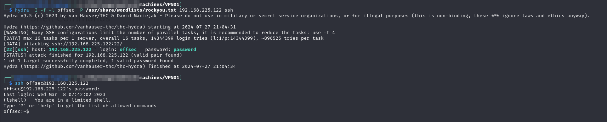
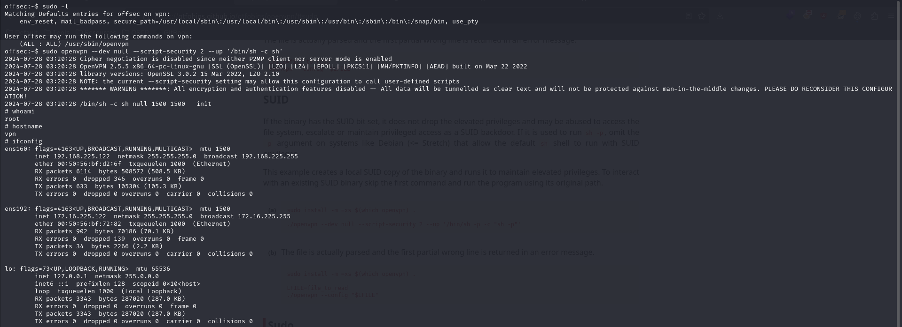

# VPN01

I try brute-forcing the SSH because I can think of nothing else. I use the offsec user because I have seen that username in every machine and it was the SSH username on `WEB01`:


```bash
```


<figure><figcaption><p>Initial access</p></figcaption></figure>

## Privilege Escalation

I check my sudo permissions (-l) and find I can run openvpn. Fortunately there is a [GTFOBins](https://gtfobins.github.io/gtfobins/openvpn/#sudo) for that and I soon have a `root` shell:

<figure><figcaption><p>Elevated shell</p></figcaption></figure>

At first I waste some time trying to crack the hash of the `mario` user found in `/etc/shadow` but that is going to take literal days (if it cracks).

Instead I decide to check for SSH keys and find one at `/home/mario/.ssh/id_rsa`. I copy it back to my machine and decide to see if it can get me to the last 2 machines.
