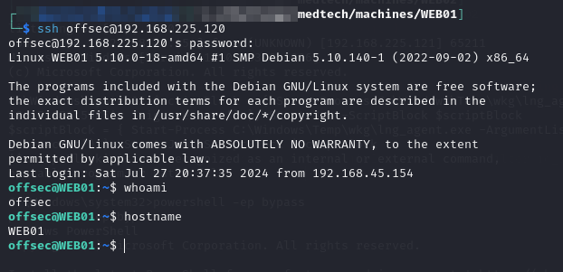

---
layout:
  title:
    visible: true
  description:
    visible: false
  tableOfContents:
    visible: true
  outline:
    visible: true
  pagination:
    visible: true
---

# WEB01

I was initially able to gain access using the credentials found on the Administrator's Desktop on `DC01`:

<figure><figcaption>
Initial access
</figcaption></figure>

`sudo -l` revealed I could run any command via `sudo` so privilege escalation was basically done.
