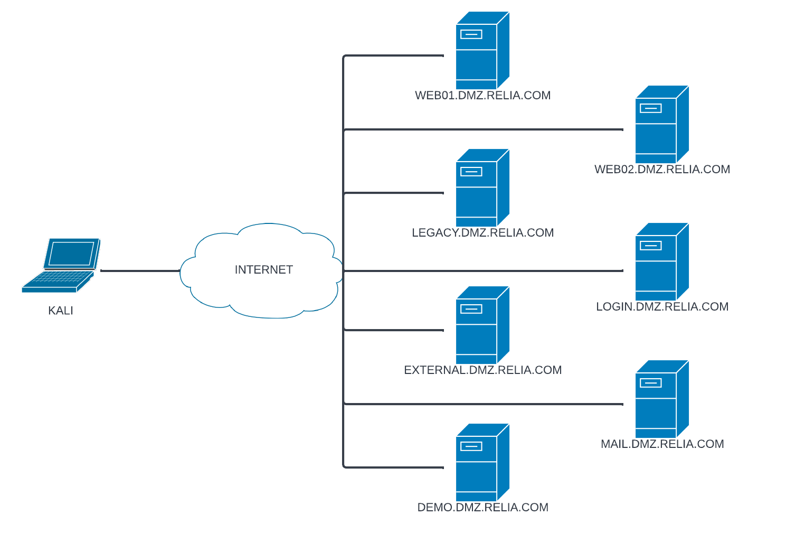
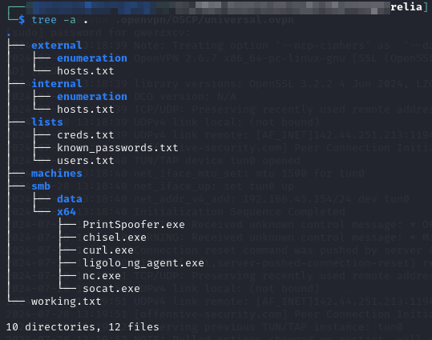

---
layout:
  title:
    visible: true
  description:
    visible: false
  tableOfContents:
    visible: true
  outline:
    visible: true
  pagination:
    visible: true
---

# Lab 2: Relia

## Scenario

The scenario given is that Relia corp has a network set up like this:

<figure><figcaption>
Relia network setup
</figcaption></figure>

The DMZ machines all have IPs in the `192.168.xxx.0/24` range. The internal ones are in the `172.16.xxx.0/24` range.

Initial directory setup for project:

<figure><figcaption>
Directory setup
</figcaption></figure>
